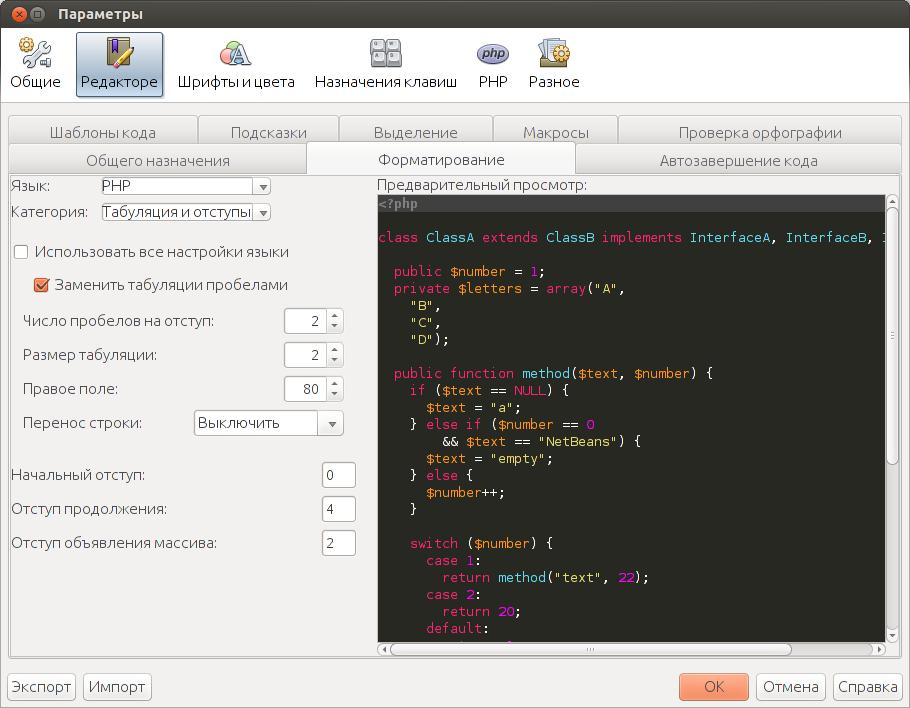
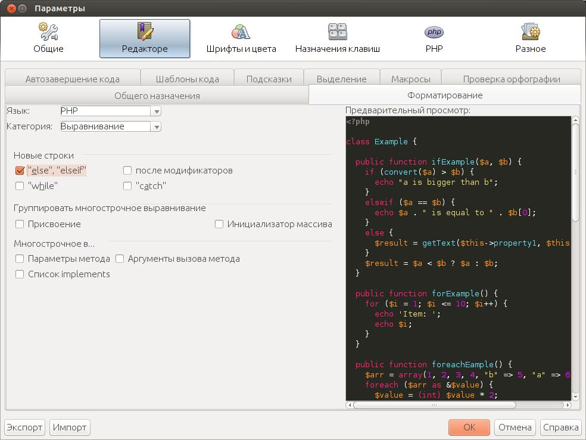
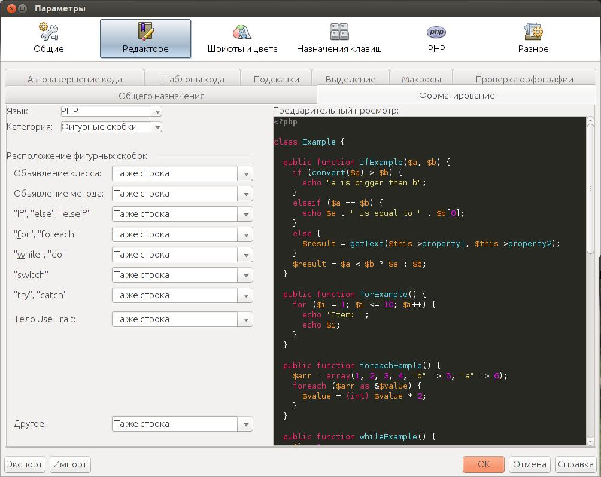
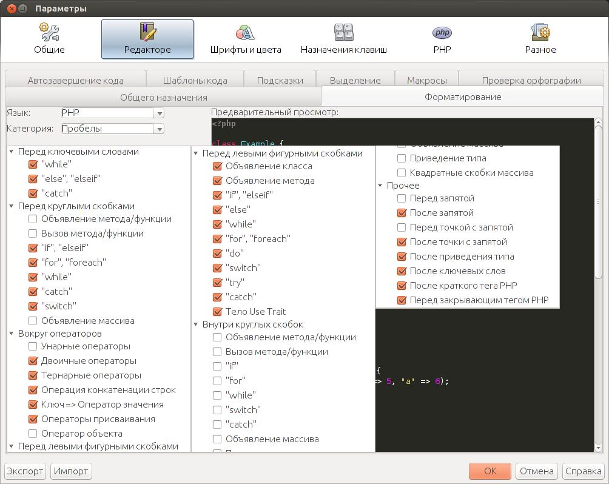

При разработке я использую NetBeans, но как оказалась, код написанный в нем, не
проходит проверку на соответствие стандартам кодирования Drupal. Все эти
проблемы решаются достаточно быстро, простой настройкой среды и быстрой
пробежкой по файлам. Для начала перейдем в нужное окно настройки Сервис >
Параметры > Редактор > Форматирование. Затем выбираем язык PHP и приступаем к
настройке.

### Табуляция и отступы

Первой категорией у нас станет «Табуляция и отступы». Это самая важная вкладка,
только благодаря ей можно убить 90% ошибок. Нам понадобится снять галочку
«Использовать все настройки языки» (что вроде как кривой перевод, скорее всего
эта опция отвечает за использования опций установленных для всех языков). Затем
устанавливаем следующие параметры:

- Число пробелов на отступ: 2
- Размер табуляции: 2
- Правое поле: 80
- Перенос строки: выключить
- Начальный отступ: 0
- Отступ продолжения: 4
- Отступ объявления массива: 2

### Выравнивание

В категории «Выравнивание» включаем опцию переноса на новые строки else и
elseif.

### Фигурные скобки

В категории «Фигурные скобки» все значения должны быть «Та же строка».

### Пустые строки

В данной категории нужно установить значение 1 для свойств «Перед функцией» и
«После функции».

### Пробелы

Последней категорией мы настроим пробелы. Настраиваем в соответствии со
скриншотом.

Вот и все. Настройка закончена. Теперь можно пробежаться по файлам с кодом и
нажать ALT+SHIFT+F (автоформатирование кода).
