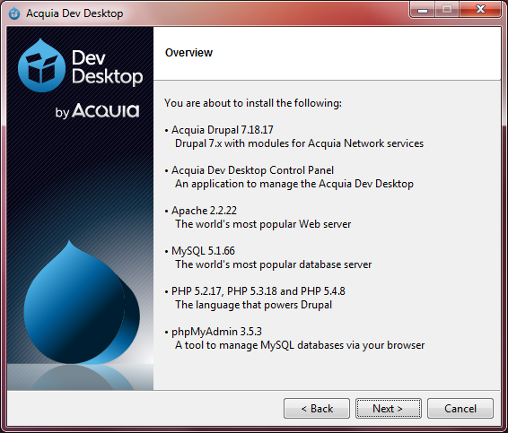
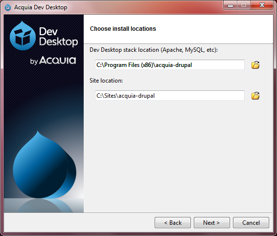
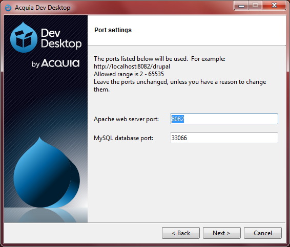
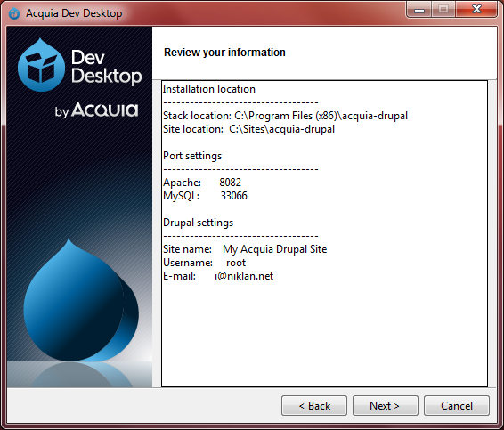
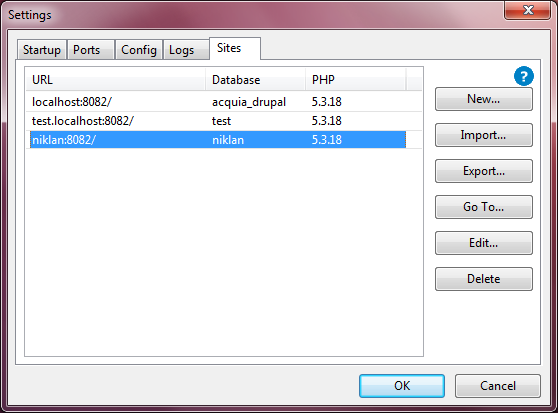

Те, кто начинает работать с Drupal впервые, ставят систему на Denver и ему
подобные сервера. А затем возникают такие вопросы: «Почему Drupal лагает, жумла
же не лагала?» - и подобный бред. Как правило, проблема в 99% случаев решается
настройкой локального сервера, но лень и прочие факторы не позволяют этого
сделать, поэтому Acquia позаботилась за нас. Acquia сделала отличный продукт –
Acquia Dev Desktop. Данная софтина разворачивает локальный сервер для Drupal
сайтов (исключительно), который уже настроен, так как необходимо. Но она
подходит не только новичкам, а вообще всем Drupal-разработчикам. Я нашел, что
для меня это более удобное средство, нежели Denwer или XAMMP. В данной записи я
распишу, как его установить, а также импортировать старый сайт, либо развернуть
новый.

### Загрузка необходимых файлов

Для начала нам нужно скачать установщик сервера. Он находится в разделе загрузок
компании Acquia (https://www.acquia.com/downloads/). Перейдя по ссылке, нам
нужно обратить внимание на блок с информацией «Dev Desktop». В нем находятся
ссылки на загрузку. Качаем самую последнюю версию для нужной системы и версии
Drupal. В статье будет рассмотрено для ОС Windows 7 и Drupal 7.

После начала загрузки, если вы не авторизованный пользователь вылезет pop-up
окно, внизу жмем «No thanks, give me my download.». После чего у вас должна
начаться загрузка файла.

### Установка Acquia Dev Desktop

После успешной загрузки установщика, нам необходимо запустить его с правами
Администратора. Первым конфигурируемым параметром станет выбор компонентов, в
котором можно лишь включить и отключить «XMail server». Он отвечает за отправку
почты (SMTP). В случае выключения данной опции, почта уходить с сайта не будет,
соответственно у вас не будет возможности проверить работоспособность таких
модулей как WebForm.

Далее нам показывают что и каких версий будет установлено:

Далее у Вас будет окно лицензионного соглашения, тут уж решайте сами, согласны
вы или нет. Если же вы согласились со всем, то продолжаем, и на очереди у нас
настройка, куда и чего устанавливать.

Внимательно подойдите к данному шагу. Подводный камень прячется во втором пути:
«Site location». Это адрес установки стандартного сайта, без которого не
обойтись. Я сразу для себя решил, что будущие сайты будут располагаться по
адресу C:\\Sites\\site-name, поэтому указал соответствующий адрес, вы же
указывайте свой. Также стоит учесть тот факт, что нельзя удалять стандартный
сайт от acquia-drupal. Точно не скажу что случится, ибо удалял год назад, когда
впервые пробовал, но все рассыпалось. Как сейчас не знаю, пробовать не хочу, мне
20мб не жалко. Дальнейшим шагом станет настройка портов для данного сервера. Это
нужно для того, чтобы сервер для Drupal’а не мешал работе, например XAMMP. Я
оставляю значения по умолчанию, если же вы знаете, что данные порты у вас уже
заняты, то настраивайте другие.

Затем у нас откроется настройка того самого друпал сайта (acquia-drupal), где
просят указать данные для администратора. Тут уже сугубо ваши предпочтения.

Завершающим этапом будет подтверждение всех введённых данных.

Затем подтверждаем установку и ожидаем её завершения. В процессе установки могут
появиться запросы от брандмауэра, запрашивающие разрешение на доступ к Apache и
MySQL. В таких случаях необходимо отвечать согласием. На этом установка
заканчивается, и Вы уже можете запустить локальный сервер для Drupal’a.

### Добавление нового и импорт уже существующего сайта

Добавление нового и импорт существующего отличается всего 2-3 кликами мыши,
поэтому я их опишу вместе. Для начала запустите Acquia Dev Desktop, нажмите
кнопку Start, если еще не нажата, а затем кнопку «Settings». В окне настроек
переходим на вкладку Sites. У нас будут активны две кнопки «New» и «Import»,
которые позволяют добавить новый сайт. Да-да, исходя из уточнения, понятно, что
будем делать новый сайт через Import а не New. Разница в том, что через New,
новый сайт создается как доп-сайт для acquia-drupal, что может вызвать некоторые
сложности, а также он напичкан модулями acquia, которые нам нафиг не сдались.
Чтобы понять меня, просто попробуйте и все увидите сами Итак, приступим к
«нормальной» установке нового сайта, а попутно и импорта старого. Для начала
необходимо подготовить папку для сайта. Для этого я захожу в папку C:\Sites, где
находится acquia-drupal, и создаю новую папку, например, с названием «niklan». В
будущем это поможет мне понять, какой сайт здесь хранится, потому что название
этой папки не имеет значения. В только что созданную папку мы копируем Drupal.
Можете скачать чистый с drupal.org, можете использовать свой бекап, не важно.
Должно получиться что-то вроде этого.

После данного шага переходим в Acquia Dev Desktop Control Panel в окно настроек
и вкладку «Sites» и жмем кнопку «Import». И погнали настраивать:

- Site path – адрес, где расположен сайт (друпал). Для выбора жмем «Browse..»
- Database – настройка базы данных для будущего сайта. - Если сайт новый, то
  выбираем «Create new database» и в поле «New DB name» указываем название базы.
- Если сайт уже имеет базу (как в моем случае – бэкап), то оставляем активным
  первый пункт «I have a MySQL database dump file for my site». В поле «Dump
  file» указываем базу .sql которую необходимо импортировать, а ниже название
  новой БД.
- Domain – настройка адреса сайта. Тут все должно быть ясно.

В итоге у меня получилось вот так:

Жмем кнопку «Import» и ждем завершение импорта. В итоге у нас должен появиться
сайт в списке:

Теперь мой сайт доступен по адресу http://niklan:8082/. Также можно выделить
сайт и нажать «Go To…». На этом все. Вот так просто можно развернуть среду для
Drupal на Windows, которая будет уже настроена под все требования и нюансы
системы, и однозначно работать быстрее, чем Denwer или XAMMP из коробки.
