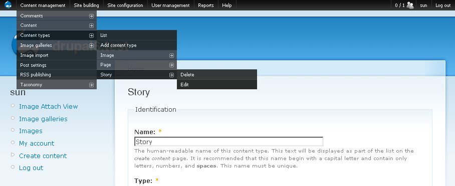
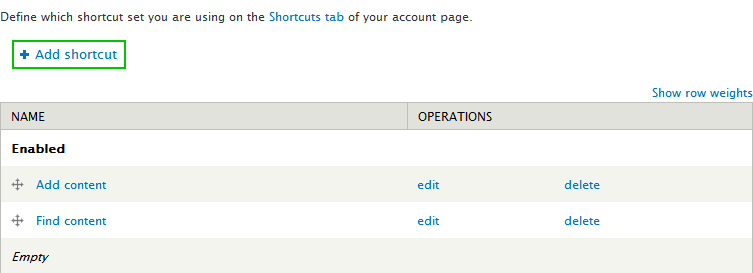

Итак, время начинать обучаться Drupal. И первый вопрос, который может назреть у
вас: «А где гайд как установить Drupal?». Во-первых, гайдов сотни, тысячи как в
текстовом, так и в видео формате, стоит только захотеть. Во-вторых, пропустив
данный шаг, который на самом деле не должен вызвать проблем у человека желающего
заняться созданием сайтов, отсеет огромное количество «профессиональных
веб-девелоперов». А как развернуть среду я уже писал
ранее: [для Ubuntu][ubuntu-12-web-server] и 
[для Windows][tvs-are-better-than-ie10]. Если Вы не отсеялись на данном этапе,
продолжаем.

Если вы пользовались другими системами, вы наверняка помните, как выглядят их
интерфейсы для администраторов, а также, зачем они нужны. У многих, кто впервые
видит Drupal, случается «шок», от вида административной части системы. Вызвано
это тем, что тут нет никаких красивых иконок, и интуитивно ничего не понятно (
хотя там и обезьяна разберется, что к чему). Тут отсеивается очень много людей,
так как после Jooml’ы и WP как бы «не торт». Ну а то, что эта админка, на самом
деле удобная (стоит лишь попробовать) и гибкая (меняйте, как вам нравится), не
знают, ну да ладно.

## Панель инструментов

Первое что вы увидите после установки системы – это черно-серый тулбар вверху
сайта. Это панель инструментов - она является «точкой отрыва» для
администратора. Позволяет быстро и с любой страницы попасть в нужный раздел
админ-панели. Более прошаренные сразу же вырубают данный модуль (toolbar) и
навешивают [admin menu](http://drupal.org/project/admin_menu). Но он, по большей
части, на любителя, хотя 280.000 активных сайтов с модулем, говорит за себя. По
гайду я буду использовать стандартный toolbar, хотя если поставите данный
модуль, то проблем возникнуть не должно.

Панель инструментов (стандартная) состоит из основной панели (черная) и
ярлыков (серая). О ярлыках чуть ниже, а сейчас о кнопках основной панели:

- Главная (Home) – её задача очень простая, вернуть на главную страницу. Может
  показать бесполезным, но это совсем не так.
- Панель инструментов (Dashboard) – ссылка на административную страницу, где вы
  можете расположить нужную для вас информацию. По дефолту содержит поиск, новых
  пользователей и последние материалы. Благодаря модулю views, с которым вы, так
  или иначе, познакомитесь, туда можно запихать, что душе угодно.
- Содержимое (Content) – управление содержимым и комментариями на сайте. Очень
  удобно, так как позволяет управлять всем содержимым сайта с одной страницы.
  Для удобства там присутствуют фильтры и массовые операции, чтобы ускорить
  работу с материалами.
- Структура (Structure) – управление меню, блоками, типами содержимого и т.д.
  Данный список дополняется установленными модулями отвечающие за структуру
  сайта. Также можно часто встретить там представления (views) и чуть реже
  панели (panels).
- Внешний вид (Appearance) – управлениями темами оформления сайта. Настройка,
  установка, отключение/включение и т.д.
- Пользователи (People) – управление пользователями, ролями и их правами.
- Модули (Modules) – список всех модулей доступных на сайте, а также управление
  их состоянием. Также позволяет установить модуль как положено через
  административный интерфейс. На данной странице также присутствуют вкладки для
  обновления модулей и удаления ненужных.
- Конфигурация (Configuration) – управление основными настройками сайта.
- Отчеты (Reports) – отчеты, журнал ошибок и прочая статистика.
- Помощь (Help) – полезная информация о модулях. Многие модули добавляют свои
  хелпы как работать с ними. Не пользуюсь вообще, но может даже помочь на
  начальном этапе, или если что-то подзабыли.

Все эти пункты редактируются (удаляются/добавляются) через меню:
Administration » Structure » Menus » Management. Но если есть такая
необходимость, то лучше обратить внимание на ярлыки.

## Ярлыки

Ярлыки – возможность создание собственных ссылок в тулбаре. Это необходимо,
например, если вы часто посещаете один и тот же раздел, но добраться до него в
пару кликов невозможно. Давайте для примера добавим свой ярлык.

Перед нами откроется настройка меню ярлыков. В нем есть два стандартных пункта
для добавления и поиска материалов. Чтобы добавить свой ярлык жмем кнопку «Add
shortcut».

После нажатия откроется страница с настройками ярлыка. Нам доступны опции
задания имени ярлыка и адреса страницы, куда будет вести ярлык. Я добавлю для
себя следующий ярлык:

Жмем «Save» и теперь ярлык доступен на панели ярлыков.

Теперь нажав на ярлык, я буду попадать на страницу со всеми разделами настроек
сайта. Без ярлыка мне бы пришлось добираться до страницы в 2 клика, а учитывая,
что к настройкам приходится обращаться частенько, то на время разработки это
очень полезный ярлык, так как не все модули доступны из стандартных страниц
настройки.

## Заключение

Тулбар – очень полезная и важная часть при работе с сайтом. Вы можете заменить
стандартный на admin menu, если он вам не понравился. Там нету ярлыков, но там
все настройки доступны прямо из тулбара и меню генерируется автоматически, что
опять же упрощает работу. 

[ubuntu-12-web-server]: ../../../../2012/12/31/ubuntu-12-web-server/index.ru.md
[tvs-are-better-than-ie10]: ../../../../2013/01/20/tvs-are-better-than-ie10/index.ru.md
