Чтобы продолжить изучение друпала, нам надо перевести его на русский язык. Так
как я буду писать гайд именно для русского интерфейса. Если у вас хорошее знание
английского, то почитайте данные гайды, а затем начинайте делать на английском.
Все же данный гайд рассчитан на разных читателей, и я не знаю какой уровень
английского у каждого, поэтому не буду рисковать и затруднять понимание.

При работе с друпалом, я использую как русский, так и английский интерфейсы. Но
в последнее время веду разработки в английском интерфейсе до конечной стадии,
так как для меня это не вызывает никаких трудностей, а также легко и быстро
искать информацию по оригинальным названиям. Ввиду того что переводит друпал
сообщество, а не Acquia, то косяки и неточности встречаются, а это в свою
очередь добавляет трудностей.

## Где и как брать переводы для Drupal и его модулей

Первое что вам понадобится, это запомнить или записать где-то следующий
сайт: <http://drupaler.ru/>. На нем находятся переводы для большинства модулей,
в том числе и для самого ядра. Также данный сайт генерирует переводы в нужных
для вас и друпала форматах, чтобы облегчить жизнь всем.

Начнем, пожалуй, с загрузки перевода для ядра Drupal 7. Для этого переходим на
вышеуказанный сайт. Затем в раздел загрузок (Download).

Из списка доступных переводов выбираем русский язык.

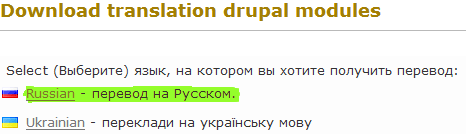

Перед нами будет поле, в которое нужно ввести название проекта. Причем должно
быть машинное имя. Например, чтобы скачать перевод для модуля «Admin menu» нужно
указать «admin_menu». Нам же нужен перевод для друпала, поэтому пишем Drupal и
жмем «Выбор проекта».

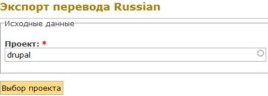

Перед нами появляется интерфейс экспорта переводов, в котором уже указан наш
проект. Далее нам нужно выбрать релиз и указать формат экспортируемого файла.
Делаем настройки в соответствии со скриншотом.

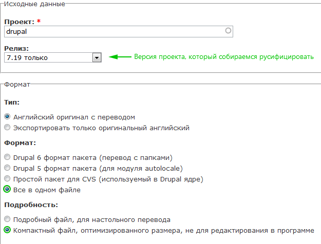

А теперь поподробнее. В зависимости от того, какой проект был выбран, будут
соответствующие версии/релизы. Выбираем в соответствии с версией установленного
модуля или ядра. В разделе формата мы не трогаем «Типы», так как нам нужен
русский, но если вам по каким-то соображениям нужно скачать лишь оригинальный
английский то меняем галочки. В «Формат» мы указываем что все должно быть в
едином файле, такой формат используется в Drupal 7. И последний пункт
«Подробность» дает нам выбор, в каком виде будет предоставлен файл. Не стоит
объяснять, в чем их разница, так как из названия все ясно. В завершении действий
жмем «Экспорт» и начинается загрузка файла.

## Импорт полученных переводов в систему

Теперь мы должны зайти на сам сайт, который собираемся переводить. Изначально в
друпале установлен английский язык, и другие языки, в том числе и сам интерфейс
перевода, отключены. Нам необходимо включить стандартный модуль под названием
«Locale», который отвечает за переводы. Для этого переходим из тулбара в
«Modules», а затем в списке находим модуль «Locale» и включаем его, и жмем «Save
configuration» внизу страницы.

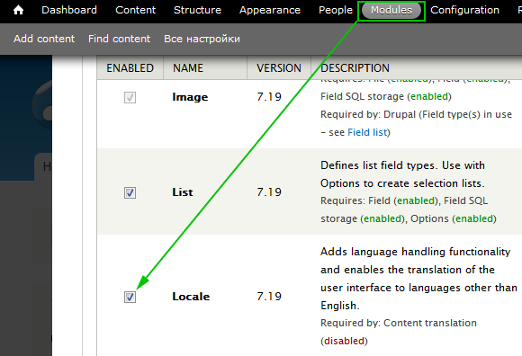

После перехода на страницу конфигурации (Configuration), вы увидите два новых
пункта меню.

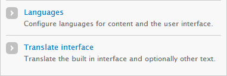

Для начала разберемся с «Языками» (Languages), поэтому переходим в данный пункт
меню. В нем будет представлен список всех языков, которые были добавлены на
сайт (не факт что еще переведены). По умолчанию там английский, поэтому
добавляем русский язык, для этого нажимаем на кнопку «Add language».

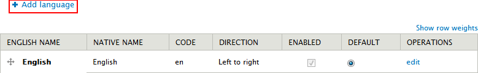

Вот мы и находимся на странице добавления языков. Тут все проще простого, либо
берем предустановленный язык, либо создаем свой собственный. Нам же не стоит
заморачиваться, так как русский имеется в данном списке, просто находим и
выбираем его, нажав на «Add Language».

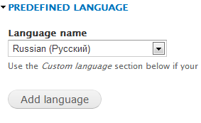

После этого мы увидим родной язык в списке. Давайте сразу сделаем его языком по
умолчанию, просто нажав на нужную радио кнопку и сохранив настройки.

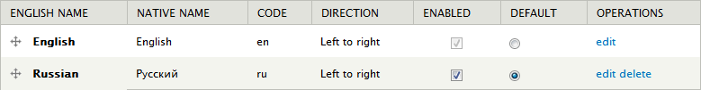

Теперь наш сайт «на русском», но так как переводов для слов еще нет в базе,
друпал использует английский язык. Поэтому нам нужно импортировать
подготовленный ранее перевод с drupaler. Переходим Configuration > Translate
interface. Вы увидите список доступных на сайте языков, а вверху будет еще 3
вкладки: «Перевод», «Импорт» и «Экспорт». Названия говорят за себя, и мы
переходим в иморт.

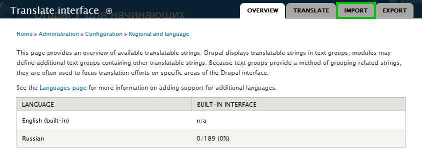

Ничего настраивать не будем, просто выбираем ранее загруженный файл переводом и
жмем «Import».

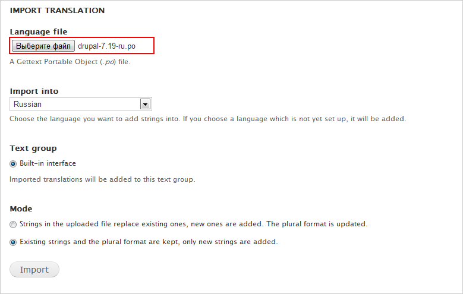

После успешного импорта наш сайт станет на русском, а также мы получим
результаты импорта.

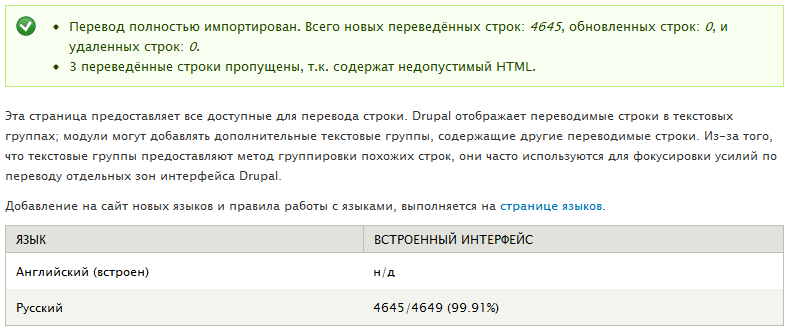

Как мы видим, интерфейс теперь переведен на 99.91%, и нам не хватает всего 4
перевода. Чтобы увидеть, что не переведено, и перевести руками, переходим на
вкладку переводы и устанавливаем следующий фильтр.

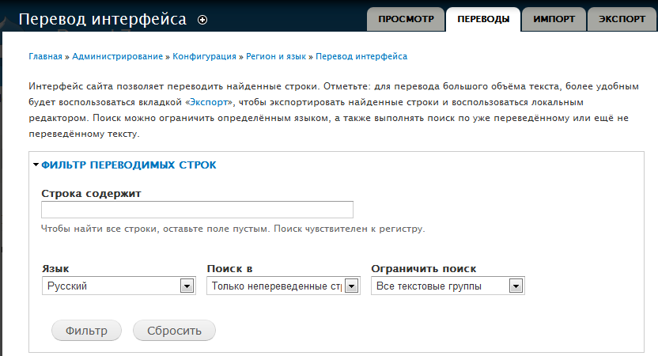

После применения фильтра, мы увидим 4 непереведенные фразы.

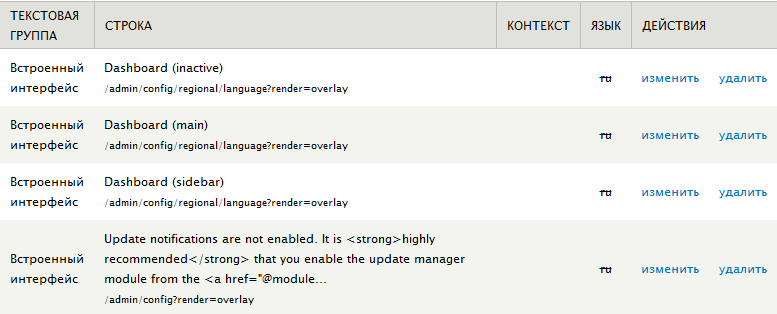

Теперь мы можем нажать на «Изменить» и на открывшейся странице добавить перевод.
А затем экспортировать и поделиться с сообществом. Но прежде чем это делать,
нужно ознакомиться с правилами перевода. Насколько мне известно, некоторые вещи
все же не переводятся.

Итак, мы закончили перевод сайта на русский. Для каждого модуля, раз уж начали
переводить, также желательно добавить перевод. Процентное количество
переведенного текста будет постепенно снижаться, но это не отразиться на вашей
работе.

## P.s.

Начиная с данной статьи, я начну прикреплять результаты выполнения описанных
действий. Поднятие уже установленного сайта описано в
статье «[Самый простой и быстрый способ начать работать с Drupal на Windows][drupal-on-windows]».

[drupal-on-windows]: ../../../../2013/01/09/drupal-7-windows-setup/index.ru.md
