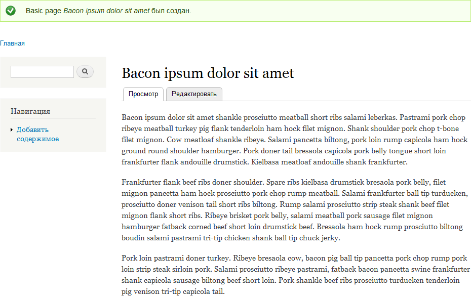
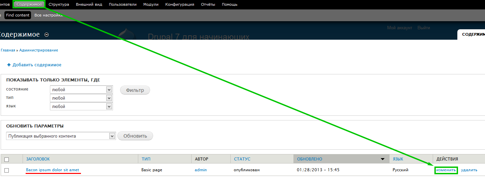
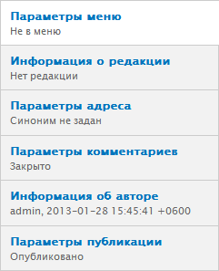
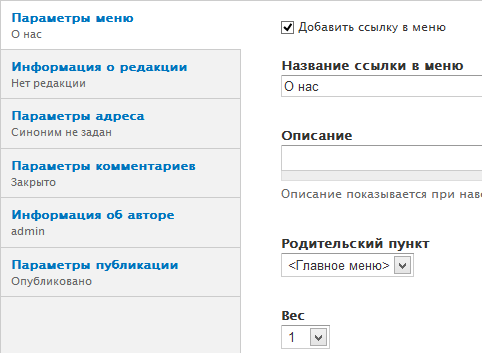
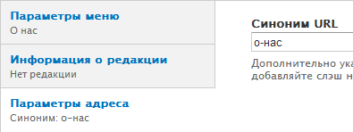
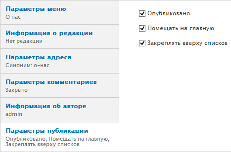
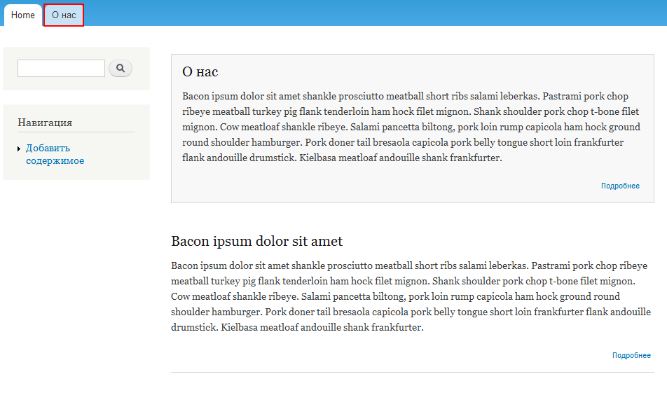

Прежде чем начать работать с материалами, нам нужен некий контент. Чем его будет
больше, тем лучше, так лучше видно то как меняется отображение сайта. Такие
тексты называют заглушками, которые многим известны по словам: «Lorem ipsum
dolor sit amet». Поэтому вооружитесь удобным для себя средством для генерации
данных текстовок. Например, можно использовать сайт <http://baconipsum.com/>,
или любой другой, коих великое множество. Если у Вас установлен Word, то можно
сгенерировать этот текст введя: =lorem(абзацев, предложений в абзаце).

Начнем с добавления страницы. Жмем на тулбаре «Добавить содержимое» и выбираем
«Basic page». Перед вами откроется страница добавления страницы на сайт. Давайте
заполним поля title(заголовок) и body(содержимое), а затем сохраним, не трогая
других настроек. В результате данных действий создастся страница с материалом.

Перейдя на главную страницу, вы не увидите данный материал. Он будет доступен
только по адресу site/node/1. Это случилось потому, что мы не настроили
отображения данного материала для главной страницы, а по умолчанию у
типа материала «Basic page» выключено отображение на главной. Что нам делать? Мы
вернемся в наш материал и настроим его как нам необходимо. Для этого в тулбаре
жмем «Содержимое», находим только что созданный материал и жмем «Изменить».

Перед вами откроется прежняя страница с настройками материала. Внизу есть
вкладки, которые называются «Настройки отображения».

Мы рассмотрим каждую из них позднее. Чтобы вывести данный материал на главную,
нам необходима вкладка «Параметры публикации». В ней необходимо поставить
галочку «Помещать на главную» и сохранить. После данных действий переходим на
главную страницу и видим наш материал.

Теперь давайте поэкспериментируем с настройками отображения. Для этого создадим
еще один материал типа «Basic page», пусть она будет страницей «О нас».
Заполняем поле «Заголовок» и «Содержимое». Первое что мы рассмотрим, это ссылка
«Редактировать анонс» над полем содержимого. Нажав на данную ссылку, откроется
дополнительное поле, в которое можно ввести текст анонса (тизера). Добавляя
материал, Drupal автоматически генерирует содержимое для анонса, им является
обрезанное начала основного текста. В данном же поле мы можем задать свой тизер.
Содержимое тизера отображается на всех страницах где используется его
отображение, например в списке материалов. Мы оставим это поле пустым, пусть
Drupal сгенерирует сам.

Далее под содержимым есть настройка текстовых форматов. Они предназначены для
форматирования текста. Различаются они тем, какие html теги в них разрешены. По
умолчанию три текстовых формата:

1. Filtered HTML (по умолчанию) – доступный всем пользователям на сайте, имеет
   умеренную фильтрацию тегов.
2. Full HTML – доступен только администраторам сайта. Можно разрешить и
   пользователям, но не очень безопасно, в том плане, что можно нарушить
   отображения сайта, тегами для заголовка, а также небезопасно.
3. Plain text – обычный текст, в котором использование HTML тегов запрещено
   вообще. Также доступно пользователям, иногда пригождается.

Также в модулях можно включить дополнительный фильтр – PHP filter. Очень опасно
для сайта, поэтому и выключен по умолчанию, и не рекомендуется для
использования. Также можно создавать свои типы фильтров перейдя по адресу:
admin/config/content/formats. Настройки интуитивно понятны и их мало, поэтому
описывать их не буду.

Теперь переходим к основным настройкам отображения (вкладкам внизу).

- Параметры меню – позволяет добавить ссылку на страницу в меню на сайте.
- Информация о редакции – позволяет добавить новую редакцию и пометку для неё.
  Редакции используются по принципу Wikipedia. Т.е. сохраняются старые версии
  материала, на которые всегда можно откатиться. Полезно для определенных типов
  сайтов.
- Параметры адреса – позволят задать синоним для страницы. Так называемые ЧПУ,
  где адрес вводишь руками. Как правило не особо используется, так как
  навешиваются модули pathauto и token, которые генерируют ЧПУ автоматически. В
  дальнейшем мы это тоже затронем.
- Параметры комментариев – настройка отображения поля для ввода комментариев.
  Если закрыто, то никто не сможет добавить комментарий, при этом старые будут
  отображаться.
- Информация об авторе – настройка автора и даты публикации материала. Можно
  указать одного из пользователей, либо отправить от имени гостя. Настройка
  времени позволяет лишь сместить материал среди других выше или ниже по дате
  публикации. Если нужно чтобы материалы публиковались в определенную дату и
  время, для этого есть спец. модули.
- Параметры публикации – настройка отображения материала. Позволяет снять с
  публикации, тогда материал будет виден только администраторам, разместить на
  главной, или закрепить вверху.

Давайте теперь для добавляемой нами страницы «О нас», зададим некоторые из
данных настроек. Пойдем по порядку и настроем ссылку в меню.

Теперь зададим синоним странице, чтобы она была доступна по адресу site/о-нас

И укажем что материал будет отображаться на главной в самом верху (закреплено).

Теперь сохраняем наш материал и смотрим результат. Наша страница «О нас»
появилась в меню, а также закреплена вверху на главной странице. Также перейдя в
статью вы увидите что она имеет адрес site/о-нас.

Так происходит добавление материалов на сайт. Как правило, все материалы
различаются лишь набором полей для них, а также назначением материалов.
