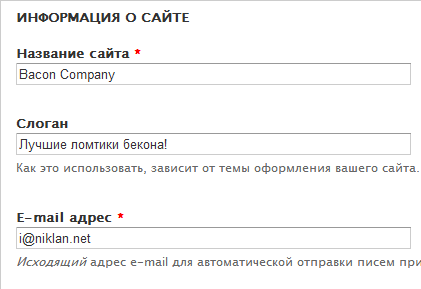
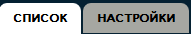
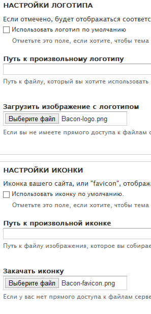
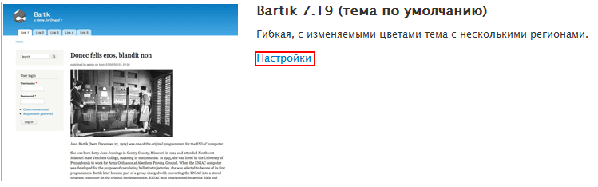
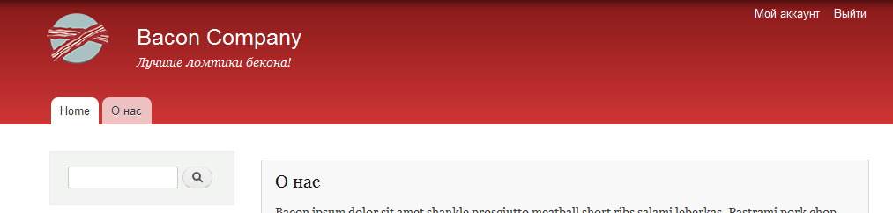

Мы уже познакомились с панелью инструментов, с добавлением материалов и даже
добавили парочку, но мы так и не настроили информацию о сайте. Время сделать
это.

Для того чтобы все дальнейшие гайды шли на одной «волне», надо придумать
тематику от которой и будем отталкиваться. Допустим я буду делать сайт про
компанию, производящую бекон. Вы же можете придумать свою собственную.

Начнем с изменения названия сайта и слогана. Для этого переходим из тулбара в
«Конфигурация», далее «О сайте», и мы попадаем на страницу настройки информации
о сайте. В разделе «Информация о сайте» можно задать название и заголовок сайта,
а также основной E-Mail адрес, куда будут уходить все письма с оповещениями.

В разделе «Главная страница» настраивается какая страница будет открыта при
заходе на основной адрес сайта. Если это node, то для него работает настройка
выше, которая настраивает сколько материалов будет отображаться на главной
странице. Как правило, все это затем становится неактуально, ввиду использования
views. Поэтому мы это пропускаем.

Последний раздел это «Страницы ошибок». Вы можете указать адреса страниц,
которые должны открываться в случае возникновения данной ошибки. Это также мы
пропускаем и сохраняем настройки. Переходим на главную, и видим результат.

## Логотип и иконка

Мы также можем поменять логотип и иконку (favicon) для сайта. Данные настройки
находятся в разделе «Внешний вид». Здесь вы можете настроить логотип и favicon
по умолчанию для всех тем, либо для каждой по отдельности. Давайте зададим для
всех по умолчанию, для этого вверху жмем на вкладку «Настройки». У вас же этих
вкладок может быть три (еще Обновление). У меня её нету потому что я отключил
проверку обновлений.

В разделе «Настройка логотипа» снимаем галочку «Использовать логотип по
умолчанию». Если стоит данная галочка, то будет использован файл логотипа из
папки темы. Мы можем задать либо адрес до картинки, либо загрузить нужную нам
картинку. То же самое проделываем и с иконкой и сохраняем.

Теперь давайте настроим непосредственно саму тему оформления. Для этого в
тулбаре жмем «Внешний вид», затем у Bartik жмем «Настройки».

У нас должна открыться страница с настройками данной темы. Bartik является, так
сказать, «цветовой» темой, это значит что мы можем поменять цветовую схему сайта
не трогая ни строчки CSS.

Вы можете менять цвета вручную, либо использовать предустановленные цветовые
схемы. Настройте цветовую палитру как вам нравится и сохраните настройки.
Например, я сделал цветовую схему красной, выбрав предустановленную Firehouse и
отредактировав один цвет как мне надо. Вот что у меня получилось.

Таких тем очень мало, поэтому если вы скачали тему, а там нет настроек цветов,
не значит, что что-то установилось криво, это значит, что тема просто не
предусмотрена для данных настроек. Также некоторые темы имеют свои собственные
настройки, поэтому читайте документации к темам.

На этом настройка сайта завершена. Дальше мы глубже рассмотрим работу с
материалами.
