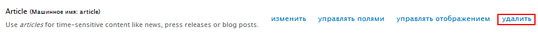
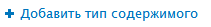
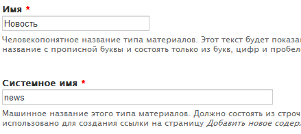
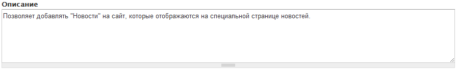
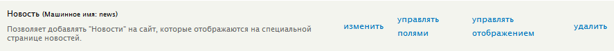
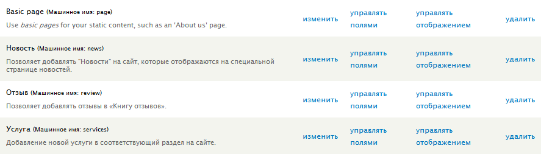

Нам уже довелось поработать с типом материала «Basic page» (страница), также
стандартно идет Article (статья). Оба они являются типами содержимого, которые
изначально предустановлены в друпале. Но они не подходят для сайтов, разве что
можно найти применение только странице (basic page), а материалы (article), как
правило, сразу же удаляют из-за ненадобности. То же самое проделаем и мы, так
как он нам тоже не понадобится.

## Удаление типа содержимого

Итак, начнем с простого и удалим стандартный тип «Article». Для этого переходим
в «Структура», затем «Типы содержимого», и перед нами появятся добавленные типы
содержимого. Мы просто напротив Article жмем «Удалить», и дело в шляпе.

## Добавление типа содержимого

Для нашего сайта компании я хочу добавить типы содержимого: новости, услуги и
отзывы.

Начнем с добавления нового типа «Новости». Для этого переходим в раздел «Типы
содержимого» и жмем на «Добавить тип содержимого».

Перед нами открывается страница с базовыми настройками материала, а также
настройками по умолчанию для всех материалов данного типа, например показывать
дату или нет, можно писать комментарии, помещать на главную и т.д.

В поле имя вводим название будущего типа содержимого, в моем случае «Новость». В
момент ввода справа от поля появится автоматически сгенерированное машинное имя
для данного типа содержимого. Так как я ввожу на русском, оно не генерируется
автоматически, поэтому его необходимо указать вручную, для чего следует нажать
кнопку [редактировать], после чего появится поле «Системное имя», где нужно
ввести машинное название типа содержимого. Поэтому вводим понятное название
«news».

Описание не обязательно заполнять, так что это лишь на ваше усмотрение. Оно
отображается лишь в списке типов содержимого и предназначено для того, чтобы
рассказать, зачем данный тип содержимого. В данном случае новость и так ясна,
для чего, но лучше всего указать, так как в дальнейшем неизвестно, кто будет
работать с сайтом (если делаете не для себя), и обычным пользователям, которые с
сайтами на «Вы», это будет невероятно полезно.

Далее нам предлагается задать настройки по умолчанию для «Настройки
отображения», о которых было рассказано ранее. Итак, приступим:

Свойства формы 1. Название поля заголовка – label для поля, которое отвечает
  за заголовок материала. Указываем «Заголовок».

- Просмотр перед размещением – указывает можно ли просматривать материал перед
   отправкой, и является ли пред просмотр обязательным.
- Пояснения или инструкции по отправке материала – все ясно из названия.
   Выводится в самом верху формы добавления материала. Например, если этот типа
   материала публичный, можно указать требования к добавлению, или памятку для
   сотрудников которые добавляют материал.

- Параметры публикации 1. Настройки по умолчанию – о них рассказывалось ранее.
  Нам нужно отметить «Опубликовано» и «Помещать на главную».

- Поддержка многоязычности. Если данная опция включена, то при добавлении
   статьи можно указать для какого языка публикуется данный материал. Также, в
   дальнейшем можно добавить переводы и на другие доступные языки. Мы оставляем
   эту опцию выключенной.

- Настройки отображения 1. Единственная опция «Отобразить автора и дату
  публикации». Оставляем включенной, чтобы пользователи могли видеть дату
  публикации новости. Многие её выключают, но это зависит от проекта.
- Параметры комментариев 1. Настройки комментариев по умолчанию для нового
  материала - Открыто – пользователи могут добавлять комментарии. (Выбираем)
- Закрыто – пользователи не могут добавлять комментарии.
- Скрытый – пользователи не могут добавлять комментарии. В отличие от «Закрыто»,
  данная опция также прячет и предыдущие комментарии, которые были добавлены
  ранее.

1. Ветвящийся список – если включено, то комментарии, которые являются ответом
   на другой комментарий, будут сдвинуты в сторону относительно него. Проще
   говоря, комментарии будут выводиться в древовидной структуре.
2. Комментариев на страницу – на ваше усмотрение.
3. Разрешить заголовок комментария. Если включено, то помимо поля самого
   комментария также будет поле для ввода его заголовка, иначе заголовок будет
   сгенерирован автоматически из первых слов комментария. (Выключаем)
4. Показывать форму ответа на той же странице, что и комментарии – на ваше
   усмотрение.
5. Просмотр комментариев перед отправкой – аналогично «Просмотр перед
   размещением».

- Параметры меню – настройка, в какие меню можно добавить материалы данного типа
  из меню настроек отображения материала. Также, как мы добавляли в меню «О
  нас». Мы пропустим этот шаг, если хотите, можете в нем потыкаться. Честно, я
  даже ни разу не пользовался данными настройками ввиду их бесполезности.

На этом все, жмем «Сохранить типа материала» и наш тип материала будет добавлен.

Также рядом была кнопка «Сохранить и добавить поля», которая точно так же
сохраняет, но после сохранения переадресовывает на страницу «Управление полями»,
которая в данный момент нам пока не нужна.

Таким же методом сейчас добавим услуги. Я просто укажу что где менял и указал.

- Имя: Услуга
- Системное имя: services
- Описание: Добавление новой услуги в соответствующий раздел на сайте.
- Свойства формы - Название поля заголовка: Название услуги
- Параметры публикации - Помещать на главную – убираем галочку.
- Настройки отображения – убираем галочку.
- Параметры комментариев – закрываем.

Сохраняем и переходим к добавлению типа содержимого «Отзыв».

- Имя: Отзыв
- Системное имя: review
- Описание: Позволяет добавлять отзывы в «Книгу отзывов».
- Свойства формы - Название поля заголовка: Заголовок
- Параметры публикации - Опубликовано – убираем галочку. Так как в дальнейшем
  пользователи смогут добавлять данный тип материала, мы убираем автоматическую
  публикацию на сайте, чтобы проверять их вручную.
- Помещать на главную – убираем галочку.
- Настройки отображения – убираем галочку.
- Параметры комментариев – закрываем.

Сохраняем. В итоге у нас должен получиться такой результат:

На данном этапе мы лишь добавили 3 типа содержимого и указали базовые настройки
отображения. Дальше мы начнем более тонко настраивать каждый из материалов, так
как на данный момент, они по сути ничем не отличаются.
