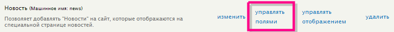
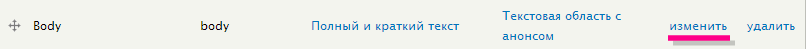
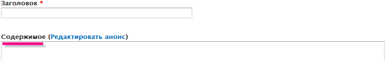
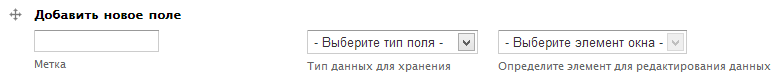
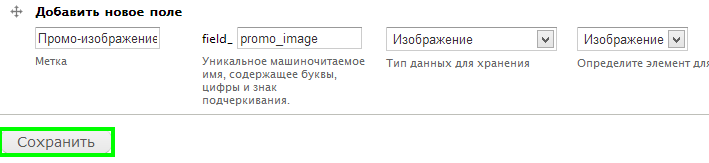
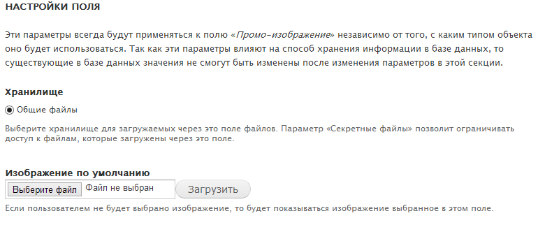
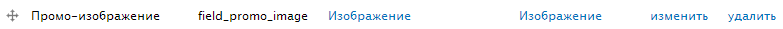
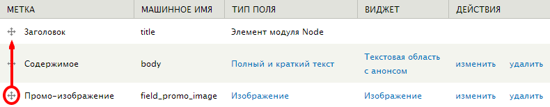
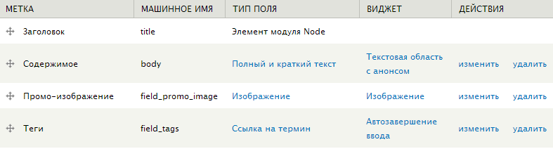
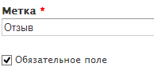

Я начинал изучать Drupal, когда была шестая версия. И добавленные типы
материалов не отличались ничем, как сейчас у нас: новости, услуги и отзывы. На
тот момент в топе модулей был CCK, который я поставил и после чего я уже
окончательно полюбил Drupal. Данный модуль позволял добавлять дополнительные
поля к типам содержимого, что и делало их отличными друг от друга. В седьмой
версии данный модуль добавили в ядро (т. е. идет вместе с Drupal’ом) и он там
называется Field. Ему и будет посвящена статья.

Итак, сейчас для каждого созданного нами типа материала мы добавим свои
собственные поля. Начнем с новостей. Для работы с полями любого типа содержимого
переходим в Структура » Типы содержимого и справа от нужного типа материала жмем
«Управлять полями».

На открывшейся странице мы увидим два добавленных поля: title и body, а также
краткую информацию о типе поля, и кнопки для редактирования. Давайте начнем с
простого и отредактируем Body, сделав ему русскую метку «Содержимое», которая
выводится при добавлении новости. Для этого жмем на «изменить», справа от поля
body:

И в окне настроек меняем Body на «Содержимое». Сохраняем. Теперь при добавлении
новости над полем содержимого будет русская метка:

## Добавление собственных полей

Теперь добавим свои собственные поля. Для этого переходим Структура » Типы
содержимого, и у нужного типа материала жмем «Управлять полями». Заметка: данная
ссылка может отсутствовать если выключен модуль Fields UI, который предназначен
для этого.

Перед нами откроется та же самая страница, в которой только что мы заменили body
на «Содержимое». В этот раз мы добавим своё поле при помощи специальной формы.

Для наших новостей, мы добавим два поля: промо-картинка и теги.

Начнем с первого. Для этого в метку вводим «Промо-изображение» - такое название
будет отображаться над полем добавления картинки. В момент ввода названия,
справа появится кнопка [Редактировать]. Как я раньше рассказывал, она необходима
для задания машинного имени, в данном случае уникального машинного имени для
поля. Это является обязательным. Вводим «promo_image». И старайтесь всегда
вводить понятные названия. В типе поля мы указываем «Изображение». Для
изображения всего один виджет, поэтому пропускаем. В результате получится
примерно так:

Затем жмем «Сохранить» и перед нами открывается страница донастройки поля. В
данном случае у нас открылась настройка для поля.

Нам предлагают настроить «Хранилище», т.е. то место, куда будут сохраняться
файлы. По умолчанию всего одно хранилище, остальные добавляются отдельно, и нам
это не нужно. Мы также можем задать «Изображение по умолчанию» (делайте на своё
усмотрение, я же пропущу). Разумеется, если мы его не зададим и при добавлении
новости мы не добавим картинку, то ничего не выведется. Для продолжения
добавления поля жмем «Сохранить настройки поля». И перед нами открывается
детальная настройка поля. Все поля имеют подробное описание, поэтому я это
пропущу это, вдобавок у каждого типа поля свои настройки. Просто читаем
внимательно для чего каждое поле.

Давайте завершим настройку поля промо-картинки. Что нужно изменить/добавить:

- Каталог файлов: news/promo_img
- Минимальное разрешение изображения: 800х600
- Показывать поля для «alt» и «title» - поставить галочки

И жмем завершающую кнопку «Сохранить настройки». После этого в списке появится
наше поле.

Мы можем также перетащить поле, например, чтобы оно было над «Содержимым», для
этого просто нужно перетащить за спец иконку:

После перемещения не нужно забывать про кнопку «Сохранить» внизу страницы. Также
не стоит забывать, что поле можно всегда отредактировать, для этого достаточно
нажать «Изменить».

Теперь добавим еще одно поле для наших «новостей».

- Метка: Теги
- Машинное имя: tags
- Тип поля: Ссылка на термин. Теги будут храниться в определенном словаре
  таксономии, который дальше мы укажем.
- Виджет: Автозавершение ввода. Можете выбрать любой другой на выбор, или
  поэкспериментировать с каждым.

Далее предлагается выбрать словарь из таксономии, в котором будут храниться
теги. По умолчанию в друпале уже есть словарь «Tags», поэтому оставляем его и
идем дальше. На последнем этапе нам необходимо указать «Количество значений»,
ставим «Не ограничен», так как у каждой новости может быть неопределенное
количество тегов. Разумеется если укажите, например, 3, то можно будет ввести до
3 тегов. И сохраняем.

Всё, на этом поля для новостей мы добавили. Должно получиться примерно
следующее:

Теперь быстренько добавим поля для «Отзыв» и «Услуга».

Начнем с «Отзыв». Для начало изменим метку поля Body на «Отзыв», а также
поставим галочку «Обязательное поле».

Затем добавляем новое поле, которое будет указывать на тип отзыва:

- Метка: Тип отзыва
- Машинное имя: review_type
- Тип поля: Список (текст)
- Виджет: Флажки/Радио-кнопки

Далее, в список допустимых значений вводим (каждое с новой строки):

1. Нейтральный
2. Положительный
3. Отрицательный

Донастраиваем поле:

- Обязательное поле – устанавливаем галочку.
- Значение по умолчанию: Нейтральный

Сохраняем. И переходим к добавлению полей для типа содержимого «Услуга».

Опять же, меняем Body, например на «Описание услуги». И добавляем собственное
поле:

- Метка: Иконка
- Машинное имя: icon
- Тип поля: Изображение
- Виджет: Изображение

Пропускаем шаг с изображением по умолчанию. На этапе детальной настройки:

- Обязательное поле – отмечаем
- Каталог файлов: service/icons
- Максимальное разрешение: 64х64
- Минимальное разрешение: 16х16

Сохраняем. Это будет поле для иконки услуги, чтобы приукрасить список.

Вот в принципе и все. Больше нам полей не понадобится, а если и понадобятся, то
добавить дело не хитрое. Рассказывать о каждом типе поля и его виджетах я не
стану, так как все ясно из названия, и никто не мешает создавать различные
комбинации тип-виджет, чтобы посмотреть, как это работает и для чего данные
типы. Также есть модули которые добавляют свои собственные типы полей. Один из
самых популярных [Date](http://drupal.org/project/date), который позволяет
добавлять поле даты.
