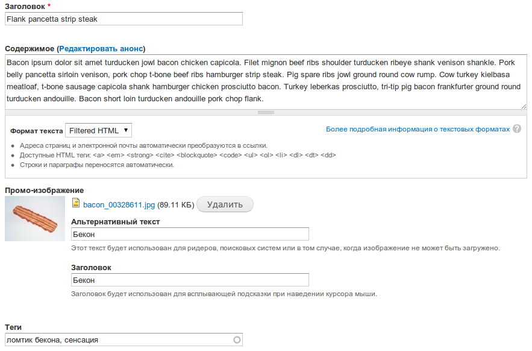

После того как мы создали собственные типы материалов и добавили для каждого из
них поля, нам необходимо настроить отображение этих самых полей. Ведь
изначально, все выводится друг за другом без каких-либо форматирований, и нам
это совершенно не подходит.

Для наглядности наших действий необходимо добавить хотя бы по одному материалу
каждого типа. Что мы и сделаем.

Первым делом мы удалим совершенно ненужные нам страницы. Ранее мы добавили
некоторые страницы, давайте удалим их чтобы осталась лишь «О нас».

Теперь добавим «Новость». Жмем «Добавить содержимое», выбираем «Новость» и
заполняем поля.

После сохранения мы видим, что не все суперски. И что же делать в таком случае?
Например, мне, намного проще залезть в тему и все руками вывести, как и где мне
нужно при помощи темизации, но это не всегда правильно, ведь многое можно
редактировать из админки, поэтому мы будем делать все оттуда.

## Работа с картинками

У нас есть картинка, которая имеет большие размеры (мой бекон 1154х864), что
растягивает сайт, да и выглядит это очень громоздко. Что же делать в данной
ситуации? Можно ограничить её размерами через html код, но это не корректно.
Вставляя картинку через поле, этот метод становится невозможным для обычных
пользователей, так как тут потребуются знания темизации друпала. Можно проделать
такую хитрость через CSS, но от этого лучше не станет. В данных двух методах
есть проблема, когда картинка чересчур большая и весит слишком много, сайт
начинает грузиться очень долго. И эта проблема встречается очень часто. Да и
вообще, это bad-practice. Избегайте их в своих работах.

Один из методов решения данной проблемы является использование графических
программ, для подготовки картинки соответствующих размеров. Но все это лишний
труд, и пустая трата времени. Так как все это реализуется программно (есть
исключения, редко, но есть) при помощи стандартного модуля Image.

Почему лучше использовать встроенный модуль? Во-первых он генерирует картинку
нужных вам размеров, при этом не теряется оригинальная картинка. Во-вторых,
когда одна и та же картинка, на разных страницах должна быть разных размеров,
это все реализуется при помощи опять же данного модуля и модуля views, но о нем
позже.

Давайте уже поработаем с этим самым модулем. Для открытия его интерфейса
переходим в Конфигурация » Виды показа изображений. Перед нами откроется
страница с предустановленными стилями.

Трогать мы их не будем, а добавим свой собственный. Для этого жмем «Добавить
стиль».

На первом этапе нам предлагают задать название для стиля. Допустим, назовем его
«news_promo_image», чтобы в дальнейшем было ясно для чего используется данный
стиль. После сохранения перед нами открывается интерфейс настройки стиля. Я уже
решил, что размер моей промо-картинки новости будет 690х200. Чтобы указать
данный размер, мне нужно добавить новый эффект. Для этого в таблице эффектов
есть специальное поле. Из списка выбираем «Масштабировать и обрезать» и жмем
«Добавить». Затем открывается страница настройки данного эффекта, указываем
нужные нам размеры, и жмем «Добавить». После он появится в списке эффектов.

На этом добавление собственного стиля изображения закончена. Вы также можете
добавить несколько эффектов сразу, чтобы добиться нужного эффекта.

## Управление отображением

Итак, мы подготовили стиль для промо-картинки, теперь нужно им воспользоваться.

Для того чтобы управлять отображениями, переходим Структура » Типы содержимого и
напротив нужного типа жмем «Управлять отображением».

Перед нами открывается интерфейс настройки отображения данного типа материала.
Давайте для начала с ним разберемся.

- Зеленый. Это переключатели отображений. Изначально там всегда два вида
  отображения, которые вы сейчас видите. По умолчанию — используется всегда,
  если не задано конкретное отображение, как «Краткое содержимое». Говоря иначе,
  так как для краткого содержимого настроено собственное отображение, оно и
  будет к нему применено, а для всех остальных (не определенных) будет
  использоваться отображение по умолчанию.
- Оранжевый. Настройки отображения полей. Какое поле, нужна ли для него метка,
  формат отображения. Также можно скрывать поля перетащив их в спец. раздел.
- Синий. Раскрыв данное поле, в нем можно выбрать форматы отображения, для
  которых нужен собственный формат вывода, как для краткого содержания. Там же
  его можно и отключить.

Теперь перейдем непосредственно к делу. Для начала давайте настроем «Краткое
содержание» (то что выводится на главной и в других списках). Переходим на
соответствующую вкладку из зеленого поля (см. картинку выше) и видим следующее.

Итак, мы видим что в кратком содержании выводится только «Содержимое», все
остальные поля скрыты.

Также можете заметить что для содержимого стоят стандартные параметры.

- Метка — скрыто. Это значит что над текстом не будет метки «Содержимое».
- Формат — как будет выводиться текст. Разумеется для каждого типа поля свои
  форматы. Также для формата присутствует дополнительная настройка. «Урезать
  длину» - количество символов, которые будут взяты для отображения в кратком
  содержимом.

Давайте в краткое содержимое добавим нашу картинку. Для этого перетаскиваем поле
«Промо изображение» из раздела «Скрытый». Мы разместим его непосредственно над
содержимым.

Для поля автоматически поставятся значения. Нам необходимо их изменить. Метка —
установим значение «скрыто».

Формат выбран нужный, что и не удивительно. Но вот использоваться будет
оригинальная картинка. Нам это не нужно, поэтому справа от «Оригинальное
изображение» жмем на кнопку с шестеренкой. Перед нами открываются опции для
изображения. В «Стиль изображения» выбираем то, какой стиль будет использован
для вывода данной картинки. В нашем случае мы выбираем заранее созданный стиль
«news_promo_image», а в опции «Изображение как ссылка на» укажем «Содержимое»,
чтобы при нажатии на картинку переадресовывало на полную новость. Жмем
«Обновить» а затем сохраняем отображение. Заходим на главную и видим результат.

То же самое проделайте с настройками по умолчанию.

Вот так просто можно получать нужного размера картинки и редактировать
отображение материалов. Экспериментируйте, чтобы добиться нужного результата.
