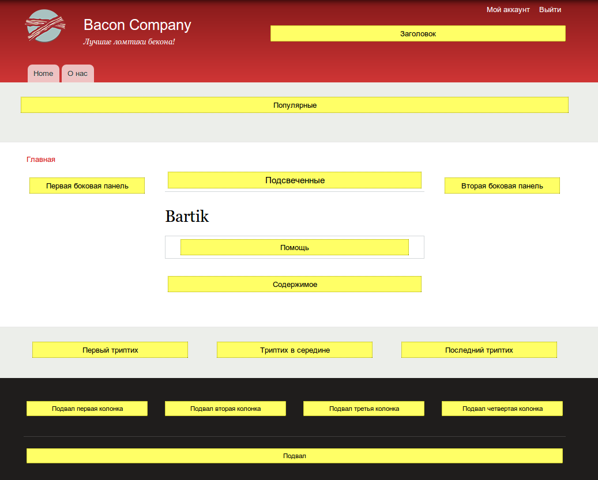
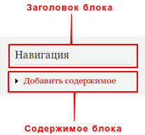
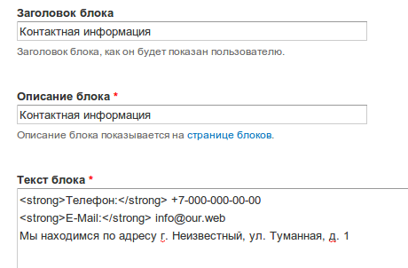
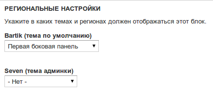
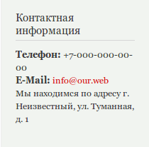
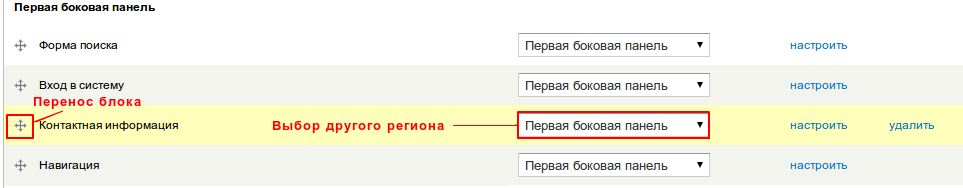

Блоки — это одна из возможностей отображения информации на сайте. Данная
функциональность добавляется стандартным модулем block. Существует несколько
видов блоков:

1. Стандартные — которые идут в комплекте с друпалом. Их отличительная
   особенность — они не удаляются. Например, блок авторизации, блок
   пользовательского меню, переключения языка (для мультиязычных сайтов) и т.д.
2. Собственные — которые созданы самостоятельно при помощи встроенной
   возможности добавления блоков.
3. Блоки модулей — блоки которые добавлены/добавляются при помощи подключения
   сторонних модулей. Самый яркий пример — блоки Views.

Блоки размещаются в регионах. Регионы — это контейнеры в которые могут быть
помещены блоки. Каждая тема оформления имеет собственное количество, название и
размещение регионов. Для просмотра регионов текущей темы, давайте перейдем в
Структура » Блоки и нажмем на кнопку «Просмотр регионов: Bartik».

После нажатия на которую вы увидите страницу с подсвеченными регионами,
присутствующими в теме.

Все желтые контейнеры — регионы, внутри которых написано название региона. Если
мы нажмем на кнопку «Выход из режима просмотра регионов», то опять окажемся на
странице управления блоками. На данной странице мы можем добавить блок, а также
воспользоваться уже заготовленными просто перетаскивая их в раздел,
соответствующий названию нужного региона.

Для наглядности добавим свой блок. Для этого жмем соответствующую кнопку. После
чего у нас откроется страница для добавления собственного блока. Нам
предлагается заполнить заголовок, описание и текст блока. Два параметра отвечают
за непосредственное отображения блока на страницах.

Также при добавлении присутствует поле «Описание блока». Оно отвечает за то,
какое название будет отображаться в списке блоков, на странице редактирования.
Это необходимо для понимая что это за блок.

Давайте заполним поля, например контактной информацией.

Также сразу сделаем так, чтобы наш блок был в регионе «Первая боковая панель»,
для этого в селекте нужной нам темы (в данном случае тема по умолчанию), мы
выбираем данный регион.

Также присутствуют настройки видимости, которые мы трогать не будем. Коротко о
них:

- Страницы — список страниц на которых будет отображаться или не отображаться
  данный блок.
- Типы содержимого — блок будет отображаться только на страницах указанных типов
  материалов.
- Роли — какие роли смогут видеть блок.
- Пользователи — смогут ли авторизованные пользователи сами настраивать
  видимость этого блока (для себя лично).

А затем жмем «Сохранить блок».

После этого вы сможете увидеть добавленный блок в соответвующем регионе темы.

Как вы видите, не все выглядит хорошо. Поэтому мы всегда можем поправить
настройки блока, чтобы он выглядел как надо.

Добавлять блоки научились, но что если он больше не нужен? Для этого переходим
на страницу управления блоками (Структура » Блоки) и находим нужный нам блок.

Мы можем удалить, поменять настройки, регион, а также его расположение в текущем
регионе. Например, разместить над блоком поиска, или под блоком навигации.

Если по каким-то причинам вам стал ненужен блок вы можете его удалить, но, также
можно его просто переместить в системный регион «Отключено». В котором хранятся
неиспользуемые блоки, которые активируется простым переносом в любой из регионов
выше. Также в «Отключено» как правило появляются блоки, предоставляемые
модулями.

Стоит также отметить, что это не единственный способ размещения блока на сайте.
Поэтому, если вы где-то взяли тему, скачали установочный профиль или довелось
работать с сайтом где блок есть, а в списке блоков он находит в совершенно
другом регионе либо вовсе отключен, то данный блок скорее всего выводится
программными средствами друпала, поэтому не стоит думать что все сломалось.
