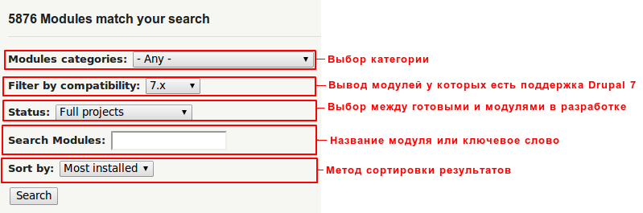
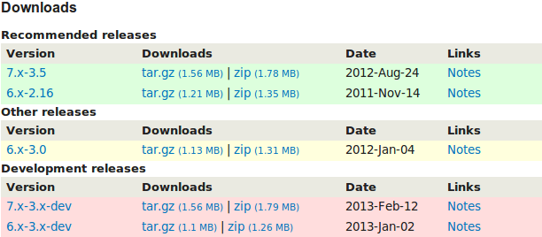
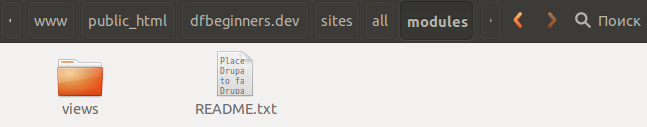
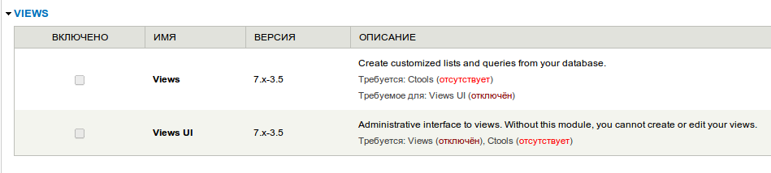
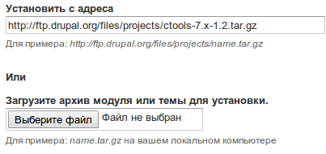
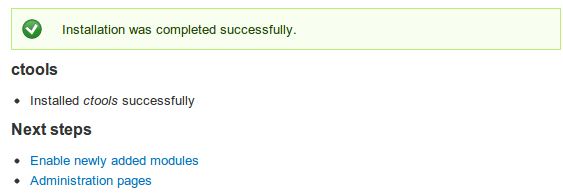
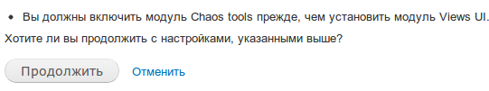

В ядре друпала по умолчанию идет набор модулей, которые пригодны для начальных
этапов сайтов, затем, всем приходится расширять уже существующий функционал
дополнительными модулями. Кто-то пишет их сам, а многие просто качают уже
готовые, что мы и сделаем.

## Качаем модули

Подавляющее большинство модулей расположено по
адресу: <http://drupal.org/project/modules>. Настоятельно рекомендую качать
модули именно оттуда, это позволяет стандартному модулю update (если включен)
проверять модули на наличие новых версий и проводить обновление за вас.

Для того чтобы скачать модуль, его необходимо найти. Чтобы сузить круг модулей,
можно воспользоваться фильтрами. Давайте установим их в такое положение:

В данном случае я поменял лишь для каких версий выводить модули. По сути, данный
поиск особо не поможет, разве что глянуть на популярные модули. Как правило все
модули под нужды гуглятся гораздо быстрее, нежели искать их через стандартные
фильтры.

В процессе работы с друпалом, вы уже выучите все необходимые вам модули. Как
правило в большинстве случаев хватает Views, а далее под ситуацию.

## Установка модулей

Допустим нам нужен модуль Views, поэтому мы его и будем искать. Переходим
на: <http://drupal.org/project/modules> и видем что он в самом верху. Это не
удивительно, так как это самый популярный модуль. Поэтому просто переходим на
страницу модуля.

На странице модуля, как правило, есть описание, иногда скриншоты, а также другая
дополнительная информация. В самом низу всегда распологаются ссылки на загрузку
модуля, а также статистика по модулю.

На скриншоте выше раздел загрузки модуля:

1. Зеленый — это стабильные версии модулей, которые, как правило, без причины не
   сбойнут и будут вести себя максимально адекватно.
2. Желтый — тестовые версии, могут быть ошибки. Данная версия может не стать
   стабильной (зеленой). Так что они не для продакшена.
3. Красный — версии которые на данный момент в разработке. Даже из скриншота
   выше видно, что разница между последним релизом Views для Drupal 7 и
   последним релизом версии разработчика составляет пол года. Они не стабильны,
   код может внезапно поменяться, так что использовать это где-то кроме как для
   тестов или помощи разработчику(ам) не стоит. Конечно, если нет особой
   необходимости. У многих модулей данные версии достаточно стабильны.

Нам нужен последний стабильный релиз для Drupal 7, а это 7.x-3.5.

### Вариант установки №1

Для его загрузки жмем либо на tar.gz, либо на zip и начнется загрузка файлов.

После того как скачается архив с модулем нам необходимо его распокавать.
Распоковывать необходимо всю папку, которая поставляется с архивом. Данная папка
должна быть распакована по адресу: путь_установки_сайта/sites/all/modules.
Если такой папки нету, то её необходимо создать руками. Ни в коем случае не
устанавливайте модули по адресу /modules. После распаковки получится примерно
такое:

Далее, нам необходимо активировать его. Для этого на тулбаре жмем «Модули» и в
списке модулей находим «Views»

Для включения модуля, нам нужно поставить галочки в колонки «Включено» и внизу
страницы нажать кнопку «Сохранить настройки». Но у нас не получится этого
сделать, так как Views зависит от другого модуля и без него работать не сможет.
Для этого в столбце «Описание» присутствует специальный список модулей которые
ему требуются для работы, а также какие есть и каких нету. В данном случае видно
что нужен всего один модуль Ctools. Соответственно нам его необходимо скачать и
установить.

### Вариант установки №2

Во время установки ctools мы будем использовать иной метод установки модулей. Он
намного проще и быстрее предыдущего, но для начала найдем модуль
ctools: <http://drupal.org/project/ctools>.

В этот раз мы не будем качать модуль. В списке загрузок нам достаточно просто
кликнуть у нужной нам версии по ссылке tar.gz и скопировать её адрес. Затем
вернуться на страницу модулей нашего сайта и вверху страницы нажать «Установить
новый модуль». Если данной кнопки нет, надо выключить стандартный модуль Update
Manager.

Итак, мы нажали на установку нового модуля и перед нам открывается страница с
вариантами установки:

1. Первый способ предполагает установку по адресу. Т.е. в данное поле необходимо
   ввести ту ссылку на модуль, которую мы только что скопировали.
2. Второй способ подразумевает что вы скачали модуль на компьютер, для этого его
   нужно выбрать.

Мы просто укажем ссылку на загрузку:

А затем жмем кнопку «Установить». Начнется процесс установки которого стоит
дождаться. После успешного завершения установки вы увидите страницу:

Жмем на «Enable newly added modules» и попадаем на страницу модулей. Опять
находим Views и включаем Views и Views UI (для графического использования
модуля), после чего жмем «Сохранить настройки» для активации модулей.

Перед вами должна открываться страница, что Views необходима активация модуля
ctools (Chaos Tools) для работоспособности. И на выбор дают два варианта
«Продолжить» и «Отменить».

Если нажать «Продолжить», то модуль Ctools автоматически будет включен и
активирован, если же отменить, то актвация всех модулей отменится, что не
удивительно.

Мы жмем «Продолжить» и все наши модули начнут работу.

Дальше нужно лишь их использовать. Для крупных модулей всегда есть readme файл,
в котором пошагово написана работа с модулем, либо на странице модулей есть
целые статьи по первым шагам в модуле.

Также не забывайте русифицировать модули, чтобы потом не думать почему часть на
английском. Как это делать я писал [тут][drupal-7-for-beginners-translating-drupal]. Вам нужно скачать
перевод для views и ctools.

[drupal-7-for-beginners-translating-drupal]: ../../../../2013/01/24/drupal-7-for-beginners-translating-drupal/index.ru.md
