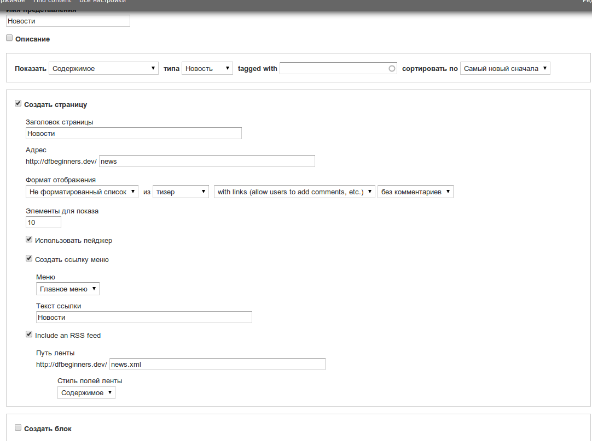

Прежде чем приступить к прочтению данной статьи, добавьте еще парочку новостей,
а также заполните произвольными данными пару услуг и отзывов. Ну и попутно
настройте необходимое им отображение.

После того как вы это сделаете, у вас либо все новые материалы появятся на
главной, либо они не появятся нигде. Это зависит от настроек типа содержимого,
но это не особо и важно, так как суть одна — они не сгруппированы.

Большинство новичков спотыкаются именно на данном этапе развития сайта, когда
материалы необходимо логически сгруппировать. Например, создать страницу
новостей, где будут отображаться только новости, страницу для услуг и отзывов.

В большинстве других систем это реализуется на категориях, в друпале это тоже
выход, но самый лучший способ — использовать Views. Впрочем, задав подобный
вопрос, которых уже тысячи на одном лишь drupal.ru, вам так или иначе ответят
Views. Дело остается за малым, как же им создать все это? Об этом я и напишу.

Ранее мы установили и включили Views, надеюсь вы также не поленились
русифицировать модули (views, ctools), так как я буду показывать все на русской
версии.

Для перехода в настройки Views жмем на тулбаре «Структура», а затем выбираем
«Представления» (рус. название Views). Перед вам откроется страница
представлений (вьюх) которые идут в комплекте с модулем, в качестве примеров. То
что они подсвечены серым означает что они в данный момент выключены. Если
интересно потыкайтесь, но мы будем делать свои собственные вьюхи.

Первым делом создадим вьюху для новостей. Для создания новой вьюхи жмем
«Добавить новое представление» и попадаем на стартовую точку создания нового
представления. Приступаем к заполнению:

- Имя представления. Указываем «Новости», также не забываем про машинное имя
  «news»
- Описание используется только в списке всех вьюх, для понимания что тут
  находится.
- Затем идет первоначальная установка отображения (того что будет отображаться).
  То что помечено меткой «Показать», где по умолчанию стоит «Содержимое»,
  невозможно поменять после создания.

- Показать: содержимое
- Типа: «Новость» (название нашего типа содержимого)
- Tagged with и сортировку оставляем как есть.
- Далее можно настроить страницу для данного представления. Это та страница, где
  будет результат. Оставляем галочку включенной и заполняем:

- Заголовок страницы: Новости
- Адрес: «news» (Т.е. Страница будет доступна по адресу site/news)
- Формат отображения оставляем как есть.
- Элементы для показа оставляем как есть.
- Использовать пейджер оставляем как есть. Под словом пейджер имеется ввиду
  переключение страниц. Если материалов, допустим, 20 штук, а элементов для
  показа 10, то будет 2 страницы. Если же данная опция отключена, то будут
  показаны лишь 10 последних материалов (из указанной сортировки выше).
- Создать ссылку в меню — включаем. Меню: Главное меню. Текст ссылки: Новости.
- Include an RSS feed — включаем. Это добавит RSS ленту. В адрес пишем news.xml,
  а в стиле выбираем «содержимое».

Затем жмем «Сохранить и выйти». Теперь если перейти по адресу site/news, вы
увидите только новости.

Тоже самое сделайте и для услуг, но в этот раз жмите не «Сохранить и выйти», а
«Продолжить и редактировать». Вы увидите полноценную панель настройки
отображений. Мы же в разделе «Формат» жмем на «не форматированный список»,
выбираем новый формат вывода «Сетка», жмем применить и не забываем сохранить
настройки.

В результате данных действий получим примерно такой результат:

Такого результата я добился благодаря созданию нового вида показа изображения
для иконки (128х128), а также настройкой отображения типа содержимого «Услуга:
краткое содержание».

Последним на очереди остались только отзывы. Заново создаем как предыдущие два,
и жмем «Продолжить и редактировать». На полной странице настройки представления
в этот раз будет интересовать сразу три раздела.

Первый — формат. В нем нужно указать что отображать будем поля, а не сами
материалы.

Второй — поля. В нем по умолчанию появится «Содержимое: заголовок». Т.е. у
каждого отзыва будет выводиться заголовок. Сделаем так, чтобы это не было
ссылкой. Жмем на данное поле и снимаем галочку «Link this field to the original
piece of content.», а также ставим галочку «Исключить из вывода». Затем жмем на
кнопку «Добавить» в в этом же разделе. Перед вами откроется список всех
доступных полей для вывода.

Для начала выведем тип отзыва. Для этого в строке поиска достаточно ввести «тип»
и в списке появится наше поле «Содержимое: Тип отзыва». Ставим галочку и жмем
применить. На следующем этапе ставим галочку «Исключить из вывода» и применяем.

Добавляем последние поле «Содержимое: Содержимое». У него убираем галочку
«Создать метку». Затем раскрываем раздел «Rewrite results» и ставим галочку
«Заменить выводимое полем значение». Это позволяет нам написать непосредственно
что и как будет выводиться используя переменные от добавленных полей.

В разделе «текст» указываем то, как будет отображаться отзыв. Переменные берутся
из «Постановочные шаблоны». А сами шаблоны берутся из добавленных полей.

Подтверждаем и переходим к последней настройке.

Третьим мы сделаем фильтрацию этих самых отзывов. Для этого есть раздел
«Критерии фильтрации». В нем жмем кнопку «Добавить» и в списке выбираем
«Содержимое: Тип отзыва (field_review_type)». Это означает что мы будем
проводить фильтрацию по значению из данного поля. После того как вы его выбрали
и перешли на вторую страницу, нам необходимо установить следующие настройки.

Это сделает доступным данную фильтрацию для пользователей. Они сами смогут
выбирать, какого типа отзывы им показывать. После того как вы сохраните данное
представление, вы можете посмотреть на результат.

Теперь при заходе на страницу отзывов, пользователи будут видеть все отзывы, но
они также смогут сортировать только по определенному типу.

Последним штрихом перейдем в Конфигурация » О сайте и для «Главная страница по
умолчанию» зададим «news». Это означает, что при заходе на основной домен,
пользователи будут видеть последние новости.

На этом мы и остановимся. Если вы прочитали статью полностью, вы не только
узнали про то как группировать, но и про другие возможности Views. Это всего
лишь мизерная доля того что может данный модуль. Я не собираюсь его
рассматривать подробно, так как это займет очень много времени. Для этого я
рекомендую посмотреть различные видеоролики, или почитать гайды, которых просто
тысячи, как на русском, так и на английском языка. Например, можно посмотреть
Learning Views for Drupal Series от drupalize.me. Сам не смотрел, но я даже не
сомневаюсь что там качественные видеогайды. Также можете попробовать методом
тыка, а также
