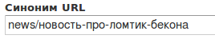
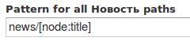
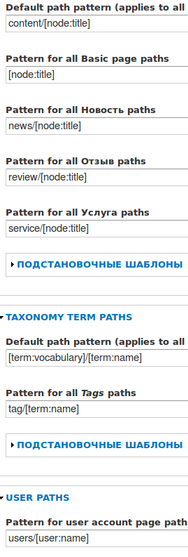
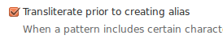
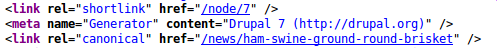

Базовый функционал для сайта сделан, все приведено к более-менее подобающему
виду. Но осталась одна нерешенная проблема — адреса страниц.

Все адреса в drupal по дефолту имеют вид node/[NID]. Многие оставляют это как
есть, но не будет лишним сделать Человеко Понятные Урл.

## Стандартный модуль path

Разработчики друпала прекрасно понимают что ЧПУ — необходимость подавляющего
большинства сайтов, и не включить подобный функционал в систему, было бы глупо.
Поэтому в базовой поставке системы идет модуль path, который как раз таки и
добавляет возможность создания ЧПУ.

Чтобы понять как он работает, зайдите в любой материал, будь то новости или
услуги, а затем перейдите в окно редактирования.

В самом низу окна редактирования есть вкладки, отвечающие за отображение
материала. В этом списке нам нужна вкладка «Параметры адреса».

Справа вы увидите поле для настройки синонима. В нем как раз и можно задать то
как будет выглядеть ссылка. Например, укажем в поле
«news/новость-про-ломтик-бекона»

И жмем «Сохранить». После чего наш материал становится доступным по адресу:
site/news/новость-про-ломтик-бекона

Небольшое пояснение. Я сделал news по англ. потому что ранее мы создали
представление (вьюху), при помощи которой мы реализовали страницу news со всеми
новостями. И логичнее всего чтобы новости имели имели такой вид. Допустим можно
просто в адресе удалить «новость-про-ломтик-бекона» и мы попадем на все новости.
Также, при грамотно созданных хлебных крошках (breadcrumbs) это положительно
повлияет на отображение сайта в гугле (не позиции а его отображение). Да и
вообще, так правильно.

А после news я написал по-русски. Тем самым я показал что адреса могут содержать
и русские буквы. Но данный пример не правильный, потому что нужно делать все в
едином стиле, хотя это скорее всего мои убеждения. Если уж назвали news, то
пусть название новости будет транслитом, или news будет по-русски. Как вам
лучше, решайте сами, о том как это сделать речь пойдет дальше.

## Автогенерация ЧПУ

Мы создали чпу только для одной новости. Конечно, учитывая что у нас не очень
много страничек, можно пробежаться и сделать каждому материалу ЧПУ вручную. Но
что делать если материалов больше 100? Это уже вызывает сложности, а что будет
при 1000+? Как правило у них у всех один и тот же ЧПУ, а различаются он лишь
заголовком. Поэтому нам необходимо автоматизировать данную работу. Для этого нам
понадобится установить модуль [pathauto](http://drupal.org/project/pathauto) (он
зависит от модуля [token](http://drupal.org/project/token) — его тоже нужно
установить).

После успешной установки и активации модуля, переходим в его настройки (
/admin/config/search/path/patterns). В настройках все разделено на три
категории: контент, таксономия и пользователи.

Рассмотрим раздел контента. Здесь мы можем настроить шаблоны ЧПУ для наших типов
содержимых. Например, настроим для новости. Напишем «news/» а после этого
поставим токен (некая переменная) из «постановочные шаблоны». Нам необходим
токен `[node:title]`, который выдает заголовок материала. В итоге получаем:

Теперь для всех новостей будет автоматически генерироваться ЧПУ формата
news/название-материала.

Задайте для остальных типов содержимого форматы ЧПУ на свое усмотрение. Я сделал
так:

Затем жмем «Сохранить настройки».

Вверху также есть дополнительные вкладки:

- Настройки — настройка генерируемых ЧПУ. Какие слова будут удаляться из ЧПУ,
  максимальная длина, символ замены пробела, регистр и т. д.
- Bulk update — обновление ЧПУ для всех указанных типов материалов, у которых
  нету ЧПУ.
- Delete alises — массовое удаление ЧПУ для всех материалов. Например. Если
  изменился формат ЧПУ, сначала удаляем, а потом генерируем новые.

Мы воспользуемся Bulk update, так как у нас задано всего лишь для одной новости.
Для этого, разумеется, переходим на вкладку Bulk update и ставим все галочки,
затем жмем «Обновить».

Все наши материалы теперь имеют ЧПУ и при добавлении новых материалов будут
автоматически генерировать для себя синоним.

## Транслитерация ЧПУ

Если вы делаете заголовок материала на русском, то и в ЧПУ будут русские слова.
Что делать если необходимо чтобы в ЧПУ были только английские символы?
Транслетировать при помощи
модуля [transliteration](http://drupal.org/project/transliteration).

После установки и активации переходим на страницу настройки pathauto (
/admin/config/search/path/settings) и устанавливаем галочку «Transliterate prior
to creating alias».

Сохраняем настройки, удаляем текущие синонимы и генерируем новые.

## P.s.

Возможно возник вопрос, почему в друпале ЧПУ называется синонимами? Если не
возник, все равно прочитайте. При создании ЧПУ, старый адрес не пропадает и
остается доступным.

Например, раньше одна из новостей имела адрес site/node/7, сейчас имеет адрес
news/ham-swine-ground-round-brisket, но я также могу попасть на запись по
старому адресу. Если Вас не устраивает такой расклад событий, можно установить
модуль [global redirect](http://drupal.org/project/globalredirect), который
автоматически будет переадресовывать (!) на ЧПУ. Системный адрес вы никак не
удалите, он никуда не денется.

Не стоит бояться и думать что это навредит SEO, ибо многие этим обеспокоены.
Поисковые системы понимают что это коротки адрес статьи, а оригинальный тот что
с ЧПУ. Это хорошо видно в исходном коде страницы.

