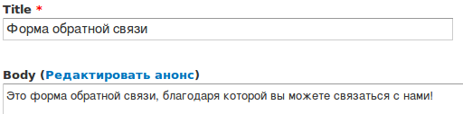
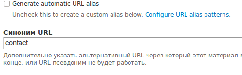
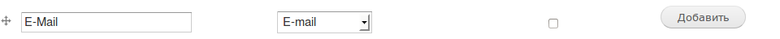
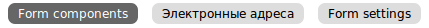
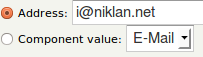
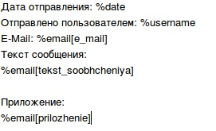
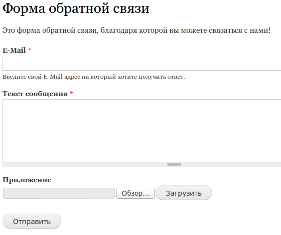
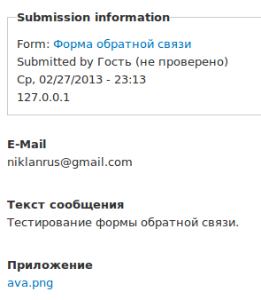

На тестовом сайте мы сделали почти весь запланированный фукнционал, и затронули
все основные возможности Drupal'a, и даже чутка сверху.

У нас осталось одна очень важная для сайтов деталь — форма обратной связи (
контакты). По сути, это можно сделать включив модуль contact из стандартнйо
поставки Drupal, но он очень слабенький. Там всего несколько полей и по сути
ничего сделать нельзя.

Для этого лучше использовать
модуль [webform](http://drupal.org/project/webform). Он очень распространен, и
это не безосновательно. Как я уже написал, стандартная контактная форма почти
никуда не годиться, поэтому все используют данный модуль, который позволяет
делать неограниченное количество различных форм (не только для контактов),
которые могут иметь нужные вам поля (по принципу создания своего типа
содержимого), делать рассылку на разные почтовые адреса и генерировать
отсылаемый результат, также позволяет хранить результаты формы на сайте и
ограничивать доступ к определенным формам.

Итак, установите данный модуль, и было бы неплохо его русифицировать. После
установки у вас должен появится новый тип материала Webform (node/add). Поэтому
жмем «Добавить содержимое» и создаем новый Webform.

У вас откроется страница добавления webform на которой предложено ввести
заголовок и содержимое (оно будет над формой). Давай введем следующие данные:

Прокручиваем страницу до настроек отображения и ставим собственный алиск (ЧПУ /
параметры адреса).

Как вы видите, я выключил автоматическую генерацию, чтобы при сохранении он не
создал синоним на основе макетов из pathauto, и если вы делаете какое-то
обновление в форме, не стоит забывать отключать галочку, так как она
автоматически включается каждый раз.

Также я указал синоним contact — будьте внимательны, он является системным
синонимом для формы контактов от одноименного модуля (о котором говорится в
начале статьи). Поэтому убедитесь что модуль contact выключен. После чего смело
жмем кнопку «Сохранить».

Перед вами откроется страница создания формы контактов. Тут необходимо добавлять
поля, которые будут присутствовать в форме, тоесть те, которые вам надо.

Я буду описывать как я делаю свою почтовую форму, вы же можете по анологии
делать свою.

Для начала добавим поле где опльзователь сможет указать свой E-Mail адрес. Для
этого вводим следующие данные:

- Метка: E-Mail
- Тип: E-mail // Данный тип поля добавлен непосредственно данным модулем. Он
  автоматически проводит проверку на валидность email адреса.

И жмем «Добавить».

Как и с полями для типа содержимого, у нас открывается второй этап настройки
поля. Разумеется, у каждого поля настройки свои. Но есть те, которые присущи
каждому полю и только в пределах webform:

- Основные
- Метка — она выводится в форме над полем. Хоть это и стандартно, я написал
  чтобы вы не путали её с машинным именем.
- Field Key — это ключевое имя, необходимое для идентификации поля и подстановки
  его как переменной в шаблон письма. Данное машинное имя действует в пределах
  формы. Тоесть, если вы решили создать еще одну форму, там тоже может быть поле
  с таким ключем.
- Validation

- Mandatory — делает поле обязательным для заполнения
- Unique - в пределах формы это должно быть уникальным значением. Некая защита
  когда во все поля вводят одно и тоже.
- Показать (также могуть быть и другие значения)

- Ширина — ширина поля.
- Label display — где будет и будет ли отображаться метка поля.
- Отключено — данное поле выключено.
- Private — делает данное поле видимым только тем пользователям, у которых есть
  права на просмотр результатов.

Нам необходимо заполнить описание (на свое усмотрение), установить галочку
Mandotary, Unique и сохранить. Наше поле добавиться автоматически. Таким же
способом добавьте нужные вам поля. (я добавил приложение типа файл и текст
сообщения типа textarea)

После того как вы добавили нужные вам поля, нам необходимо донастроить форму.
Для этого вверху есть 3 вкладки.

Переходим на вкладку «Электронные адреса». Вы увдите страницу с настройками
электронных адресов. В них указывается куда и какая информация будет отсылаться
после отправки формы.

Для начала добавим свой почтовый ящик, тем самым убрав необходимость постоянно
заходить на сайт и проверять наличие писем. Для этого в поле Addess вводите свой
E-Mail адрес и жмете «Добавить». Вы можете указать несколько адресов, разделяя
их запятой.

После добавления вы попадете на настройку писем.

- E-Mail header tetails. Базовая информация о письме.
- E-Mail sibject — заголовок письма.
- E-Mail from address — адрес почты с которого (якобы) отправлено письмо. Вы
  можете подставить адрес указанный пользователем, чтобы при нажатии на ответ
  письмо было адресовано ему. Также вы можете указать произвольную почту, чтобы
  фильтровать письма по данному адресу.
- E-Mail from name — от чьего имени письмо.

E-Mail template позволяет настроить содержимое письма. Вы можете использовать
TOKEN VALUES — различная информация с сайта, либо INCLUDED E_MAIL VALUES, в
которых содержатся значения из формы.

Я его заполнил так:

Для подстановки используеются подстановочные шаблоны: %email[field_key].
Используйте их для вставки данных отдельно. Если нужно вставить все без особой
нужды в оформлении то используется %email_values.

Теперь переходим в третью вкладку Form settings. В ней можно настроить данную
форму еще точнее.

- Confirmation message — сообщение на странице, которое увидет пользователь
  после отправки формы.
- Redirection location — куда будет перенаправлен пользователь после отправки
  формы.
- Total submissions limit — ограничение на количество писем вообще, в день,
  месяц и т. д. Тоесть при достижении этого количества, форма будет
  блокироваться.
- Per user submission limit — как и выше, но только для конкретного
  пользователя.
- Status of this form — доступна форма или нет.
- Submission access — у кого есть доступ к почте.
- Расширенные настройки — более детальная настройка формы.
- Available as block — форма будет доступна также в списке блоков,
  соответственно вы сможете размещать её на нужных вам страницах.
- Show complete form in teaser — если вы где-то показываете все формы, то в
  кратком содержании будет отображаться форма, иначе только на основной
  странице.
- Show «Save draft» button — добавляет кнопку сохранения текущих параметров. Это
  значит что пользователь может сохранить, закрыть сайт, а потом вернуться и
  продолжить заполнять.
- Automatically save as draft between pages — принудительно сохраняет значения.
- Show the notification about previous submissions — показывает то что
  пользователь уже отсылал письма.
- Название кнопки для добавления информации — что будет на кнопке которая служит
  для отправки почты. Напишите «Отправить», иначе будет на англ. Языке.

Сохраняйте и смотрите что получилось, для этого переходим по адресу
site/contact (или тот алиас который вы указали).

Самое время проверить форму. Для этого заполните нужные поля и нажмитке кнопку
«Отправить». После чего письмо будет доставлено на ту почту(ы), которую вы
указали на вкладке «Электронные адреса». Вы также можете посмотреть результаты
на сайте. Достаточно зайти на страницу формы и нажать «Результаты».

