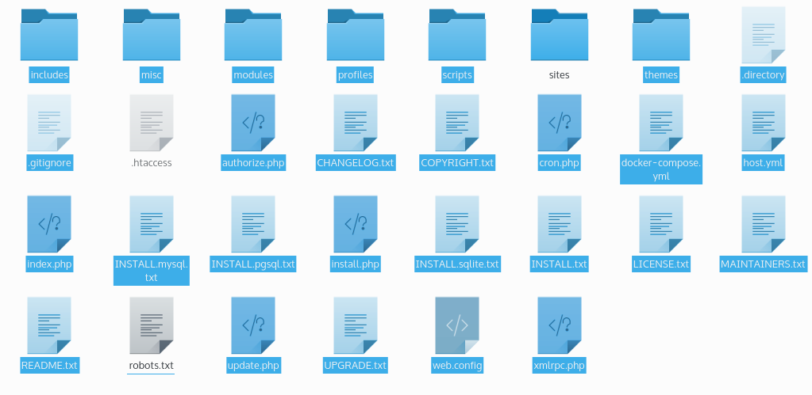

За то время пока я писал гайды, ядро Drupal было обновлено.

Было бы глупо не добавить ко всем гайдам еще и информацию по обновлению ядра
системы. Поэтому если появилась необходимость обновить ядро, а вы не знаете как
это делать, то этот гайд для вас.

Итак, появилось новое ядро. Модули обновляются автоматически при помощи
встроенных средств и под силу даже ребенку. Ядро не может обновиться
самостоятельно, это необходимо делать собственноручно. В этом нет ничего
страшного, если подходить к делу с полной серьезностью, особенно если это
продакшен.

Что же делать? Обновляться, причем чем скорее после релиза новой версии, тем
лучше. Особенно для обновлений с пометкой «Не безопасно!», как на скриншоте
выше.

Погнали. Для начала [качаем свежую версию друпала](http://drupal.org/start).
После этого делаем следующие действия:

1. Делаем ПОЛНЫЙ backup (резервную копию) вашего сайта. Это включает всю
   директорию сайта + база данных.
2. На сайте заходим «Конфигурация > Режим обслуживания». Ставим галочку
   «Перевести сайт в режим обслуживания» и сохраняем настройки.
3. Заходим в каталог сайта и удаляем все файлы и папки, **за исключением:**
   папки sites, файлов .htaccess и robots.txt  
   **ВНИМАНИЕ!** Если вы используете дистрибутив (например Drupalife Store,
   Commerce Kickstart и подобные), **папку <u>profiles</u> удалять нельзя**. В
   таком случае надо произвести просто копирование с заменой на более новые
   файлы.
   
4. Извлекаем из архива (новая версия скачанная с офф сайта) **все кроме** папки
   sites, а также файлов .htaccess и robots.txt
5. Заходим по адресу site/**update.php **и жмем continue на всех шагах.
6. Когда появится сообщение, что все обновлено. Можете заходить на главную сайта
   и проверять его. Если все работает корректно, включите сайт обратно (пункт
   2).

Теперь ядро будет самой последней версии.

Вот такими простыми шестью шагами можно обновить версию друпала.

## На заметку

1. Удалите и всегда удаляйте файлы из корня сайта: CHANGELOG.txt, COPYRIGHT.txt,
   INSTALL.txt, LICENSE.txt, MAINTAINERS.txt, README.txt — это самая первая дыра
   в безопасности сайта. На основе данных файлов можно определить версию
   системы, соответственно зная версию и её дыры, будет очень легко взломать
   сайт.
2. Всегда обновляйте ядро. Да, лень, муторно, но безопасность превыше всего.
3. Ничего не храните в ядре. Именно поэтому мы удалили все кроме папки sites и
   двух файлов. Те два файла могут быть у каждого свои, они не меняются из
   версии в версию, а у сайтов они подвергаются изменениям. Случайно заменив их,
   может всплыть проблема. Папку sites мы не трогали, так как в ней также не
   происходит абсолютно никаких изменений. Эта папка — хранилище файлов системы,
   ничего важного для обновления там нет. Все остальные папки и файлы могут быть
   подвержены обновлению. Я уже писал — ни в коем случае не трогайте файл и
   папки ядра. Все что надо храните в sites. И не редактируйте код ядра, для
   этого есть Drupal API.
4. Если вы выключили по каким-то причинам модуль updates, то вы не узнаете о том
   что вышла новая версия ядра на своем сайте. В таком случае проверяйте наличие
   обновлений вручную.
5. И самый банальный совет — не делайте апдейт без бэкапов.
