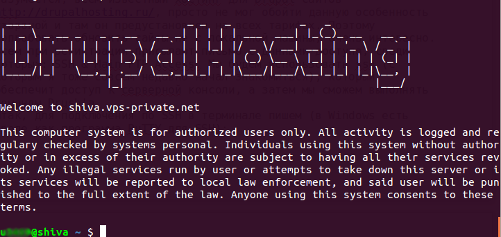
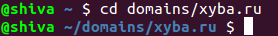

Drush — системная утилита позволяющая управлять Drupal сайтом из терминала. По
сути она позволяет выполнять все те же действия, что и административный
интерфейс, но внутри консоли.

Я совсем новый пользователь линукса и больше всего при переходе меня пугала
консоль. Как оказалось, это мало того что не страшно, это даже очень круто, ведь
это удобно и быстро. Более менее привыкнув к консоли ubuntu, подучив пару
команд, я решил попробовать консоль и для Drupal'a. Стоить отметить, что эта
утилита очень популярна среди англоязычного сообщества Drupal, и даже на
Drupal.ru я иногда попадаюсь на сообщения в которых упоминается Drush с лучшей
стороны.

Для начала качаем библиотеку pear: `sudo apt-get install php-pear`

Устанавливаем
Drush: `sudo pear channel-discover pear.drush.org sudo pear install drush/drush`

Проверяем установку: `sudo drush status`

Обновляем ядро Drupal с помощью
Drush: `drush -r /var/www/public_html/niklan.dev up`

где /var/www/public_html/niklan.dev — путь до корневой папки сайта.

Например можно изначально перейти в папку сайта, чтобы потом не писать постоянно
путь: `cd /var/www/public_html/niklan.dev sudo drush up`

В отличии от ручного обновления, данная команда сама сделает все необходимые
операции:

1. Сделает бэкап
2. Удалит старое ядро
3. Поставит новое ядро

## Использование Drush на Drupalhosting.ru (it-patrol)

Для того чтобы использовать данную возможность на удаленном сайте/сервере,
необходимо чтобы на том сервере был установлен Drush и SSH, иначе ничего не
получится.

Разумеется, всем известный хостинг для Drupal сайтов <http://drupalhosting.ru/>,
просто не мог обойти данную особенность стороной и там он предустановлен на всех
тарифах.

Всем при регистрации присылают письмо с данными доступа, среди которых: SSH &
Main FTP Access. Мы будем использовать ssh (с которым я тоже совсем недавно
начал знакомиться), который обеспечит доступ к серверной консоли, а затем мы
сможем выполнять команды Drush'a.

Итак, для подключения по SSH в терминале пишем (в Windows есть вроде как
программа PuTTY для SSH): `ssh ЛОГИН@СЕРВЕР.vps-private.net`

У меня DH Elastic, поэтому я использовал следующие
данные: `ssh u9999@shiva.vps-private.net`

После чего вводим свой пароль от SSH&FTP и получаем доступ:



```bash {"header":"Далее переходим в корневую директорию сайта"}
cd domains/domain.name
```



Пишем команду обновления (так как мы уже в корне сайта, нам не надо указывать
путь):

`drush up`

И сайт обновится ;) Мой сайт без проблем обновился с версии 7.12, до версии
7.20, почти моментально. Делая все руками я потратил бы минут 10. В данном
случае я потратил минуты 2-3, на то чтобы зайти на почту, найти логин и пароль,
проверить название своего сервера, подключить и выполнить обновление. Поэтому,
зная свой логин и пас, можно обновлять менее чем за минуту.

Чтобы завершить работу с ssh пишем:

`exit`

Список всех доступных команды с описанием можно найти на офф
сайте <http://drush.ws/> или ввести drush help

## Некоторые полезные команды
**drush up** — обновление ядра и модулей Drupal.

**drush cc all** — очистка всего кеша сайта.

**drush pm-list** — список всех модулей и тем установленных на сайте, а также их
версии и статус активности.

**drush dl module** — загружает модуль или тему. Несколько значений пишится
через пробел.

**drush en module** — включает указанный модуль или тему.

**drush dis module** — выключает указанный модуль или тему.

**drush ard** — создание бэкапа сайта. Делает бэкап как самого сайта, так и базы
данных, все это сохраняется в tar.gz архиве. Невероятно удобная вещь.

**drush arr path** — восстановление бекапа созданного командой drush ard.
Заместо path нужно указать путь до архива, включая его название и расширение.

## Вывод

Утилита просто супер. Один бекап и восстановление чего стоит. Сокращает время на
раз два, в добавок ей можно пользоваться хоть с телефона, особо не заботясь о
трафике, ибо он просто минимален.

### На заметку

Для работы обновления через Drush, необходимо чтобы был включен модуль Update
Manager.
