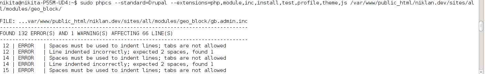

Если вы хотите чтобы код, который вы пишите в модулях или темах соответствовал
всем стандартам Drupal, то самый простой способ - использовать сниффер для
проверки. Он выведет нам в каком файле и какие ошибки были допущены, что
значительно облегчит путь до правильного Drupal-кода.

При публикации своего первого модуля на проверку, мне, как и всем скинули ссылку
на некий сайт: http://ventral.org/pareview/. На нем проводится првоерка кода на
соответствие стандартам из git репозитория песочницы. В принципе, да удобно, но
после каждой правки делать коммит и пушить изменения, чтобы проверить
исправления - не удобно. Поэтому я копил их пачками и все равно оставались
проблемы или всплывали новые и поэтому пришлось это дело перенести на локалку.

Итак, как проверять код у себя на компьютере:

Для начала нам надо установить php-pear и обновить "каналы".

```bash
sudo apt-get install php-pear
sudo pear update-channels
```

Далее нам нужен PHP Code Sniffer: `sudo pear install PHP_CodeSniffer`

Теперь качаем (_именно качаем, а не устанавливаем в
Drupal_) [Coder](http://drupal.org/project/coder) ветки 7.x-2.x

Распаковываем в любое удобное для хранения место. Например, я распаковал в
домашнюю папку, затем переименовал coder в .coder, чтобы папка была скрытой.

Делаем ссылку(ярлык) на папку со стандартами (coder) в PHP CodeSniffer, чтобы он
мог с ними работать. (_не забудьте указать свой адрес до coder_)

`sudo ln -sv /home/username/.coder/coder_sniffer/Drupal $(pear config-get php_dir)/PHP/CodeSniffer/Standards/Drupal`

Все, теперь можно использовать используя
команду: `phpcs --standard=Drupal --extensions=php,module,inc,install,test,profile,theme,css,js path`

Где:

- extensions - список расширений через запятую на проверку стандартам.
- path - путь до файла или папки, которую необходимо проверить на стандарты. (
  Если указать папку, то проверяет все файлы, включая вложенные папки.)

А использовать можно например во встроенном терминале ваше IDE.



## P.s.

Как правило, он находит огромное количество ошибок. 90% из них исправляются
правильной [настройкой IDE под стандарты Drupal][drupal-7-for-beginners-translating-drupal].

[drupal-7-for-beginners-translating-drupal]: ../../../../2013/01/24/drupal-7-for-beginners-translating-drupal/index.ru.md
