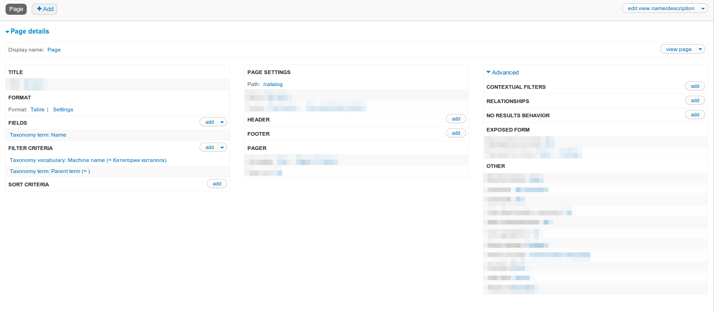
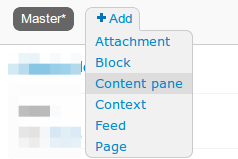
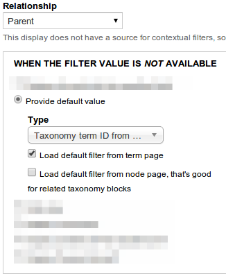
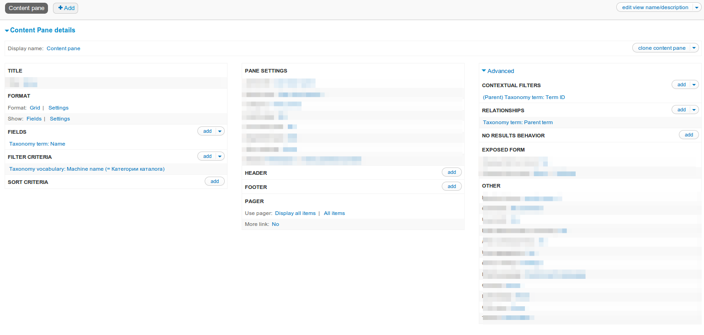
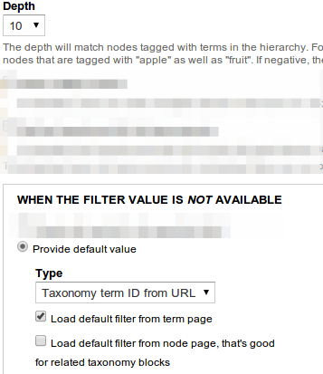
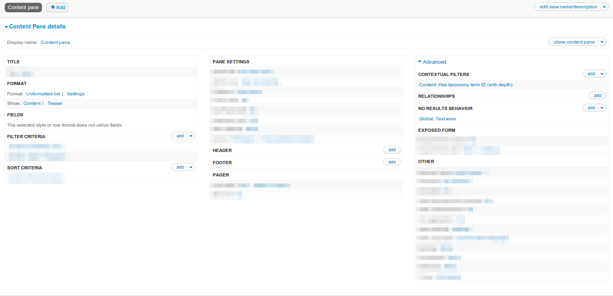
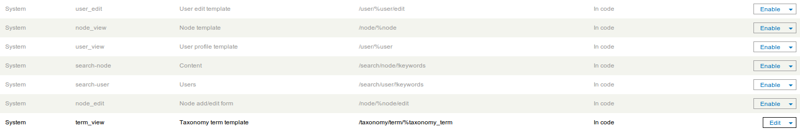
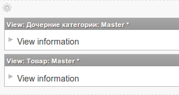
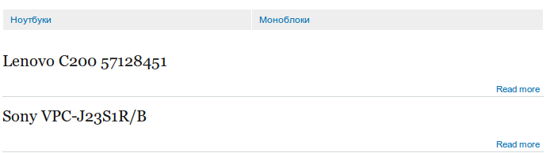

Всем привет. Решил реализовать каталог на Drupal 7. Целью было создать его без
модулей Ubercart и Commerce. Конечно, я понимаю что из них тоже можно сделать
каталог, но зачем за собой тянуть столько левого функционала, я не понимаю.

Конечно я полез в гугл и нарыл инфу. Как оказалось, на англоязычных сайтах все
решения которые были предложены, так или иначе использовали Ubercart и Commerce.
Среди русскоязычных попался всего лишь один
достойный: «[Продвинутый каталог на Drupal 7](http://druit.ru/blogs/views/384)».
Я его попробовал, мне понравилось, но у него есть недостатки:

1. Самый главный — невозможность задания алиасов для адресов. Т.е. Разделы
   каталога имеют жесткий адрес catalog/%TID.
2. Необходимость включения фильтра PHP. Я стараюсь избегать включения данного
   модуля, ведь если сайтом будут управлять криворукие — то этот фильтр просто
   яма в безопасности.
3. Плодятся типы материалов (для фильтров). Не пробовал, точно о проблеме
   сказать не могу. Мне хватило первых двух, чтобы отказаться от него.

Перепробовал уйму вариантов на одном лишь Views. Были даже рабочие, но их
гибкость вызывала сомнения. В итоге решением всех проблем стала связка Views &
Panels. Именно об этом я и расскажу.

P.s. То что замазано на скринах — настройки по умолчанию (не менялись).

## Подготовка

Не удивительно, но для создания каталога
понадобится [Views](http://drupal.org/project/views), [Panels](http://drupal.org/project/panels)
и конечно же [Ctools](http://drupal.org/project/ctools). Включаем:

- Chaos tools
- Page manager
- Views content panes
- Panels
- Views & Views UI

Для начала создайте словарь таксономии с названием «Категории каталога» (или же
как вам нравится). Добавьте необходимые категории.

Теперь создайте новый тип материала (например «товар») который будет добавляться
в каталог, и добавьте ему поле «Term reference» которое ссылается на ваш словарь
«Категории каталога». Также добавьте парочку товаров, чтобы видеть результаты.

## Создание представлений (Views)

### Создание главной каталога

Тут проще простого.

- Жмем «Add new view»
- Указываем название «Каталог»
- Show: **Taxonomy terms** of type **«Категории каталога»**
- Ставим галочку «Create a page» и заполняем.
- Page title: Каталог
- Path: catalog
- Жмем кнопку «Continue & edit»
- Делаем необходимый Format. Например «Table».
- В разделе Filter criteria жмем «add».
- Выбираем «Taxonomy term: Parent term» и жмем «Apply», затем сного «Apply». Тем
  самым мы сделали чтобы выводились только родительские категории.
- Сохраняем вьюху.

Этими действиями мы создали страницу по адресу site/catalog на которой будут
отображаться только родительские термины.

### Вывод дочерних категорий

Создаем новое представление:

- View name: «Дочерние категории».
- Show **Taxonomy terms** of type **«Категории каталога»**.
- Снимаем галочку create a page.
- Жмем «Continue & edit».
- Добавляем новый тип представления Content pane

- Если надо, меняем Format.
- В Relationships выбираем Taxonomy term: Parent term.
- В Contextual filters выбираем Taxonomy term: Term ID. Указываем Relationship —
  Parent (если не меняли в предыдущем пункте). В разделе значение по умолчанию
  выбираем Provide default value, type: Taxonomy term ID from URL и жмем Apply.

- Сохраняем представление.

Этими действиями мы создали представление, которое будет выводить список
дочерних терминов, относительно текущего.

### Вывод продукции в категории

Создаем очередное представление:

- View name: Товар
- Show Content of type «Продукт» (название вашего типа содержимого под
  продукцию)
- Снимаем галочку Create a page.
- Жмем Continue & edit.
- Добавляем Content pane.
- Добавляем Contextual filters — Content: Has taxonomy term ID (with depth). В
  Depth указыем: 0 — если хотите чтобы отображался товар текущей категории, 10 —
  если хотите чтобы отображались товары из текущей категории, а также товары из
  его подкатегорий.
- Ставим галочку Provide default value и выбираем Taxonomy term ID from URL.

- Жмем Apply.
- В разделе No results behavior добавляем Global: Text area и пишем что-то типа
  «В данной категории еще нет товара». Думаю не стоит объяснять когда оно будет
  вылезать.
- Сохраняем представление.

Данное представление будет выводить весь товар, у которого выбрана данная
категория. Соответственно вы можете выводить какие угодно типы материалов.

## Настройка Panels

Теперь настроим отображение всего и вся. Для начала переходим на страницу
стандартных панелей: admin/structure/pages. Нам нужно включить term_view.

Затем жмем «Edit» и добавляем новый вариант: «Add a new variant»:

- Title: Каталог.
- Variant type: Panel.
- Optional features: ставим галочку Selection rules.
- Жмем Create variant.

Перед нами открывается следующий этап настройки. В нем указывается то, когда
сработает данный вариант. Нам надо чтобы он срабатывал на термины из словаря
«Категории каталога». Для этого:

- Из списка выбираем Taxonomy: vocabulary и жмем Add.
- В pop-up окне выбираем наш словарь и жмем Save.
- Затем жмем кнопку Continue.

Шаг разметки пропускаем, поэтому жмем Continue. Следующий шаг пропускаем, ибо он
нам не нужен. В итоге мы окажемся на этапе Panel content.

Здесь нам надо указать что и где будет отображаться. Для начала сделаем чтобы
заголовок страницы был как и у категории, для этого в поле title пишем %term:
name.

Теперь все просто, жмем на шестеренку слева от региона center и выбираем Add
content. Слева выбираем категорию Views и добавляем «Дочерние категории». Тоже
самое проделайте и с представлением «Товар». Все шаги и настройки после выбора
представления просто игнорируйте, они нам не нужны.

После того как вы это сделали, получится примерно следующее.

Завершающим действием будет нажатие кнопки Create variant.

На этом все. Теперь перейдя по адресу site/catalog вы увидите категории. Перейдя
в категорию, вы увидите товар, а также подкатегории.

## Заключение

Плюсы:

- Гибкость благодаря Views & Panels.
- Используются системные алиасы.
- Нет фильтра php.
- Cтраницы taxonomy/term/ID из словаря «Категории каталога» будут более
  информативными.
