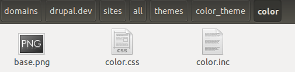
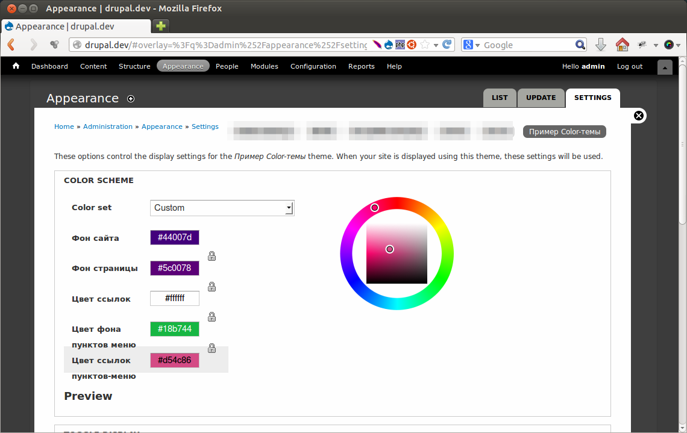
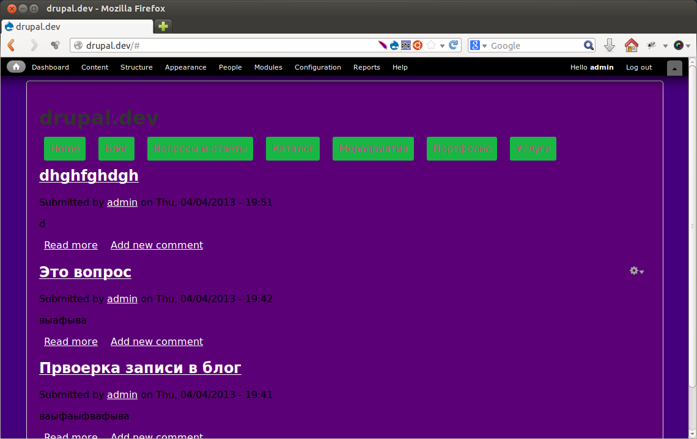

Все видели модуль Color в действии. Заходя вперед скажу, что если ваша тема
слишком сложная, то этот модуль сразу пролетает, ибо его текущий функционал
слишком скудный. Элементарно, невозможно добавить альфа-канал цвету, а это уже
вызывает некоторые трудности (мне пришлось слегка менять верстку).

> Модуль Color является стандартным, его не нужно качать, а достаточно включить
> в списке модулей если он выключен.

Почему называется «Работа с цветами»? Данный модуль поддерживает также нарезку
png файлов, создание на них градиентов, а также возможность создания превью того
что делается, я лишь рассмотрю базовую работу со сменой цветов.

## Подготовка

Итак, от вступления к делу. Для данного гайда нам понадобиться модуль Color (из
ядра) а также какая-нибудь тема оформления. Я подготовил очень простенькую тему,
вы можете делать используя её, либо свою, разницы как таковой не будет.

## Создаем базовые файлы

**Шаг 1** — в папке темы создаем папку с именем «color». Если используете тему
из гайда то получится так: sites/all/themes/color_theme/color.

**Шаг 2** — создайте, в только что созданной папке color, пустой файл с
названием «color.inc».

**Шаг 3** — в ту же папку (color) добавляем файл с названием «base.png». Не
важно что это будет, просто файл с таким именем обязателен, и обязательно
картинка.

**Шаг 4** — создаем, все в той же папке, файл стилей с названием «color.css».

В итоге должно получиться следующее.



## Интегрируем с темой

Время добавлять функционал в тему. Начнем с настройки «color.inc».

**Шаг 1** - для начала добавляем базовые настройки модуля. В них содержатся все
переменны для цветов, которые можно будет менять. Файл начинается с <?php, но не
закрывается!

```php
// Массив со всеми настройками.
$info = array();

// Оъявляем все переменные-цвета.
// Каждая переменная - поле для выбора цвета.
// Имеют вид: 'ключ' => 'метка'.
// Можно использовать функцию t().
$info['fields'] = array(
  'bg' => 'Фон сайта',
  'page_bg' => 'Фон страницы',
  'link_color' => 'Цвет ссылок',
  'menu_bg_color' => 'Цвет фона пунктов меню',
  'menu_link_color' => 'Цвет ссылок пунктов-меню',
);
```

```php {"header":"Шаг 2 — создаем базовые цветовые схемы."}
// Объявляем базовые цветовые схемы (предустановленные).
$info['schemes'] = array(
  // Объявляем обязательную схему, которая будет использовать по-умолчанию, и 
  // от которой будет отталкиваться модуль Color.
  'default' => array(
    // Название цветовой схемы. Будет отображаться в списке всех схем.
    'title' => 'Цветовая схема по-умолчанию',
    // Задаем цвета для каждого ключа ($info['fields']).
    // Все стандартные значения я беру из CSS.
    // Цвет должен быть в HEX формате, начинаться с решетки и быть в нижнем
    // регистре.
    'colors' => array(
      'bg' => '#f1f1f1',
      'page_bg' => '#ffffff',
      'link_color' => '#2158ce',
      'menu_bg_color' => '#ececec',
      'menu_link_color' => '#000000',
    ),
  ),
  // Добавляем еще одну цветовую схему, но уже с нужными нам цветами.
  'example' => array(
    'title' => 'Пример дополнительной схемы',
    // Делаем её полностью белой.
    'colors' => array(
      'bg' => '#ffffff',
      'page_bg' => '#ffffff',
      'link_color' => '#ffffff',
      'menu_bg_color' => '#ffffff',
      'menu_link_color' => '#ffffff',
    ),
  ),
);
```

**Шаг 3** — подключаем color.css.

Для начала укажем что данный файл будет использоваться модулем Color. Для этого
все в том же файле color.inc добавляем следующее:

```php
// Путь указывается относительно корня темы.
$info['css'] = array('color/color.css');
```

Далее нам необходимо подключить color.css к теме, чтобы он загружался со
страницей. Для этого в файле color_theme.info добавляем строку с подключением
стиля.

```php
; Стили
stylesheets[all][] = css/style.css
stylesheets[all][] = color/color.css
```

Важно чтобы color.css подключался где-нибудь в конце. Так как если мы подключим
его перед style, то ничего работать не будет. Кто не понимает в чем подвох,
гуглите приоритетность CSS.

**Шаг 4** — нам необходимо добавить все элементы, классы, идентификаторы в
color.css, которые будут меняться. Значения должны быть как в «default». Принцип
работы прост. Он берет первый цвет из default — это #f1f1f1, далее октрывает
файл color.css, ищет его там и заменяет на то, что указанно в данном поле
сейчас (цвет). Т.е. Если у вас есть совпадающие цвета, но они должны быть
впоследствии разными, то придется немного менять цвет, например на #f1f1ff2.

```css
 /* bg */
body {
  background: #f1f1f1;
}

/* link_color */
a {
  color: #2158ce;
}

/* page_bg */
#page-wrapper {
  background: #ffffff;
}

/* menu_bg_color && menu_link_color */
#navigation ul.menu li a {
  background: #ececec;
  color: #000000;
}
```

```php {"header":"Шаг 5 — добавляем настройки в нашу тему. Код добавляется в template.php темы"}
/**
 * Использум template_preprocess_html().
 */
function color_theme_process_html(&$variables) {
 if (module_exists('color')) {
 _color_html_alter($variables);
 }
}

/**
 * Используем template_process_page().
 */
function color_theme_process_page(&$variables, $hook) {
 if (module_exists('color')) {
 _color_page_alter($variables);
 }
}
```

**Шаг 6** — чтобы не было кучи ошибок, необходимо указать значения по умолчанию
для возможностей которые мы не используем. Для этого возвращаемся в color.inc и
добавляем следующие строки:

```php
/**
 * Настройки ниже - пустышки. Они нужны модулю color, даже если мы их не
 * используем в своей теме.
 */

// Путь указывается относительно корня темы.
$info['css'] = array('color/color.css');

// Файлы для копирования. (color.css - копируется автоматически)
$info['copy'] = array();
 
// Файлы которые будут использоваться в превью.
$info['preview_css'] = 'color/preview.css';
$info['preview_js'] = 'color/preview.js';
$info['preview_html'] = 'color/preview.html';
 
// Объявление градиентов.
$info['gradients'] = array();
 
// Координаты для заливки.
$info['fill'] = array();
 
// Координаты для нарезки изображения.
$info['slices'] = array();
 
// Базовая картинка.
$info['base_image'] = 'color/base.png';
```

На этом все. Теперь сбрасываем кэш сайта, а затем заходим в настройки темы. Вы
увидите раздел настройки цветов.



Если вы хотите задать цвета сами, то не забудьте выбрать в Color set: Custom.

Затем сохраняйте настройки и смотрите результат.



P.s. Если вышибает ерроры о preview.html или preview.js, просто создайте файлы с
такими именами в папке color.
