Хотели сделать службу тех поддержки на Drupal-сайте, но не знали с чего начать?
Этот гайд будет вам в помощь. В ходе данного гайда мы создам обычную службу
технической поддержки на сайте.

Данное руководство я пишу, прежде всего, для drupal-пользователей средней руки.
А это значит, вы должны понимать что такое Views, Rules и прочие популярные
модули, или догадаться в ходе действий, так как рассказывать особо я о них не
буду. Говоря еще понятнее, если вы только вчера поставили друпал — даже не
пробуйте. Также буду рассказывать по английской версии системы, ибо:

1. Просто-напросто лень переводить ядро и модули;
2. Я всегда делаю на англ. языке, ибо проще во всем, хоть я и не владею свободно
   английским;
3. Смотрю на созданные мною сайты, но с русской админкой, меня это сбивает с
   толку, ибо перевод местами просто «хер поймешь».

## Подготовка

Еще не потеряли уверенность? Тогда запасаемся модулями: Views (ctools), Rules(
Entity), Token, также по желанию можете поставить Admin Menu. Все это дело
включаем и поехали.

Я набросал небольшую схему, на основе которой мы будем все создавать.

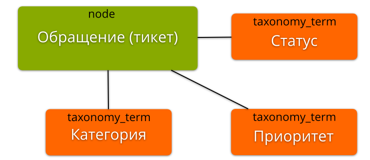

Как вы можете увидеть из графика, сам тикет будет типом содержимого, у тикета
будет три параметра: статус, категория и приоритет. Все параметры мы выносим в
отдельные словари, где будут необходимые нам термины.

Возможно у кого-то назреет вопрос, а почему бы это все не выносить в отдельные
словари, а тупо создать поле-выборку и туда вбить значения, все будет в одном
месте. Такой подход имеет место, но что если, допустим, вам надо будет
поменять все категории, или часть из них? Вот тут и всплывут грабли данного
метода. Управлять всем этим на уровне словарей намного проще, и как по мне,
намного логичнее.

## Создаем словари

Я выделил три словаря: категория, статус и приоритет. Поэтому заходим в
таксономию и создаем их, попутно забиваем некоторыми терминами. Также дадим им
более адекватные названия:

- **Тикет: Категории (ticket_category):** «Техническая поддержка», «Отдел
  продаж».
- **Тикет: Приоритеты (ticket_priority):** «Обычный», «Высокий», «Критический».
- **Тикет: Статусы (ticket_status):** «Открыт», «Закрыт».

Тут никаких сложностей в принципе быть не должно.

## Создаем ноду — тикет

Заходим в типы содержимого, и нажимаем создать новый. Указываем имя «Тикет» (
ticket — машинное), снимаем галочку «Promoted to front page», в разделе
комментариев снимаем галочку «Allow comment title», жмем «Save and Add fields» и
приступаем к добавлению полей:

**Статус (ticket_status)** типа «Term reference» - «Select list». Связываем со
словарем «Тикет: статусы». Устанавливаем галочку «Required field». По умолчанию:
«Открыт».

**Категория (ticket_category) **типа «Term reference» - «Select list».
Связываем со словарем «Тикет: категории». Устанавливаем галочку «Required
field». По умолчанию: «Техническая поддержка».

**Приоритет (ticket_priority)** типа «Term reference» - «Select list».
Связываем со словарем «Тикет: приоритеты». Устанавливаем галочку «Required
field». По умолчанию: «Обычный».

Получаем примерное следующее:

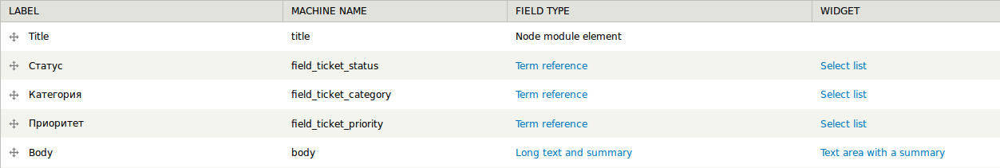

На этом настройка ноды закончена, идем дальше.

## Создаем формы для ответов (переписки)

На тикеты надо будет отвечать, и совершенно очевидно что у тикета также должна
быть возможность менять статус, категорию и приоритет в ходе переписки. Как же
мы это все прикрутим? Все достаточно просто, мы для этого будем использовать
стандартные комментарии ноды.

Для начала перейдем на вкладку полей комментариев ноды «Тикет».

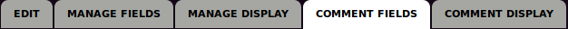

У нас на данный момент всего одно поле «Comment», которое является текстовым
полем самого комментария. Давайте заменим слово Comment на «Ответ», чтобы было
логичнее и пойдем дальше.

А дальше нам необходимо дать возможность смены статуса, приоритета и категории
тикета. Для этого мы не будем опять создавать поля, мы их создали в ноде,
поэтому их же и будем использовать.

Поэтому добавляем копии полей, которые мы создавали на предыдущем этапе. Только
в этот раз мы **не ставим** «Required field», **не заполняем** «Default value»,
а просто сохраняем добавленную копию поля. Если не ясно, то это убирает
проблему, когда каждый раз при ответе приходилось бы указывать данные параметры.
Теперь они меняются только по необходимости.

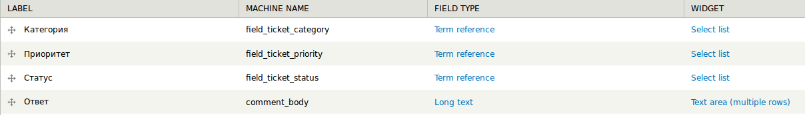

На этом фундамент тех. поддержки заложен, но ни о какой функциональности и речи
быть не может.

## Создаем Rules'ы

Сейчас мы добавим обработчики, которые помогут нам менять статус тикета, при
смене его во время ответа (при комментариовании), так как сейчас это ни на что
не влияет, ну и прочие мелочи. И тут-то начинаются финты ушами, ибо сходу такие
рулсы не запилить.

Итак, первое что нам нужно, это убрать лишнее поле - «Заголовок/title». Его
нельзя удалить у ноды, а его необходимость в тикете очень сомнительна, и это
нужно как-то решать. У данного поля нет никаких настроек, мы даже не можем его
сделать необязательным и это как раз вызывает потребность в его отключении. Мы
поступим проще, мы будем после создания тикета в него закидывать номер тикета,
который будет равняться NID, а само поле мы тупо через CSS уберем, присвоив ему
display: none.

### Автоматическое присваивание заголовка тикету при создании

**Шаг 1.** Создаем новое правило (Rule) и называем его «Тикет: Смена заголовка
тикета (ticket_change_title)».

**Шаг 2.** Все также при создании, в поле выбора на что среагирует правило,
выбираем «After saving new content» и жмем «Save».

**Шаг 3.** Добавляем новый «Condition» - «Content is of type» и в разделе
«Content types» выбираем «Тикет», сохраняем.

**Шаг 4.** Добавляем Action «Set a data value» и в «Data slector» указываем
«node:title». Жмем продолжить и на следующем этапе в поле «Value»
вводим «#[node:nid]» и сохраняем.

**Шаг 5.** Жмем «Save changes» и наше правило готово.

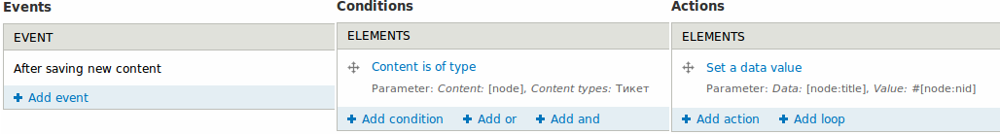

Тем самым, после создания тикета, ему автоматически присвоится название #NID.

### Смена статуса/приоритета/категории

Это самое интересное в данном разделе, так как все мозги вскипели пока смог
провернуть данный финт. Я расскажу на примере «Смена статуса», а остальные два
сделаете точно также, только с очевидными для них изменениями.

**Шаг 1.** Создаем правило и называем его «Тикет: Смена статуса (
ticket_change_status)». Устанавливаем реакцию на событие «After saving a new
comment».

**Шаг 2.** Добавляем новый «Condition» - «Content is of type» и выбираем
«Тикет».

**Шаг 3.** Добавляем еще один «Condition» - «Entity has field». В поле
«Data selector» указываем «comment», а в «Field» выбираем
«field_ticket_status» (или то, в зависимости что добавляете, например
проритет).

**Шаг 4.** Добавляем последний «Condition» - «Data value is empty». В
«Data selector» указываем «comment:field-ticket-status», а также устанавливаем
галочку «Negate» и сохраняем.

**Шаг 5.** Добавляем «Action» - «Set a data value». В «Data selector» указываем
«comment:node:field-ticket-status» и жмем продолжить. На следующем этапе в «Data
selector» должно стоять «comment:field-ticket-status» само по себе, но если не
стоит то добавьте. И сохраняем.

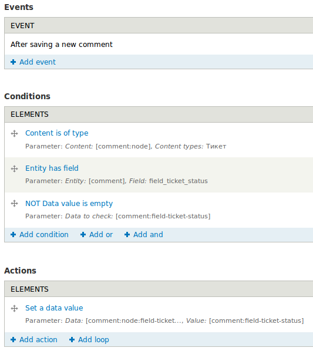

Теперь то же самое проделайте с приоритетами и категориями. Разница будет лишь в
выборе полей.

После того как сделали для остальных двух, у вас должно получиться 4 правила. Вы
также можете добавить по принципу и подобию оповещение о новых ответах на почту
и т. д. В общем Rules в ваших руках. ;)

## Исправление ошибок

После всех этих настроек лучше не станет. Вы по-прежнему не сможете создавать
тикеты не заполнив «Title» для тикета. Также никуда не отваливается проблема в
публичности тикетов, ведь их может смотреть кто угодно, а это уже не хорошо.
Поэтому сейчас мы будем устранять данные проблемы.

### Закрываем тикеты от сторонних глаз

Итак, что мы будем делать? Ситуация достаточно нестандартная для встроенных
прав, хотя она достаточно актуальная. Почему такие права не ввели в ядро, да кто
его знает. Но проблема есть и решений ей куча с горкой, есть модули, есть
кастомные решения. Я пробовал модуль «Content access» - забудьте сразу. Ужасный
модуль, вываливает кучу ероров и чтобы их устранить нужно ставить dev-ветку,
которая хоть и не еррорит, зато ломает Views и прочие модули на ctools. В общем
какой-то мутный модуль, и достаточно громоздкий для нашего решения. Если у вас
есть свой модуль на примете — используйте его, я же буду делать кастомное
решение.

Для создания кастомного решения нам придется вызвать hook_node_access().
Данный хук нужно вызывать из модуля, который нам придется сделать (это не
страшно). Я не собираюсь учить делать модули в данной статье, кто знает, берем и
используем код:

```php {"header":"hook_node_access()"}
/**
 *  Применяем hook_node_access().
 *
 *  Блокирует доступ к ноде 'ticket' всем пользователям, кроме автора и админа.
*/
function hook_node_access($node, $op, $account) {
  if (is_object($node)) {
    if (($node->type == 'ticket')  && (($op == 'view') || ($op == 'update'))) {
      if ($account->uid == $node->uid) {
        return NODE_ACCESS_ALLOW;
      }
      else {
        return NODE_ACCESS_DENY;
      }
    }
  }

  return NODE_ACCESS_IGNORE;
}
```

Кто не
знает, [качайте заготовку](/sites/default/files/blog/28/attachments/ticket_access.zip)>
и не забываем включить.

### Устраняем проблему с заголовком тикета

Тут все также просто, мы укажем пустое значение по умолчанию, которое позволит
пропустить заполнение данного поля, а затем Rules подхватит и сменит на нужный
нам заголовок. Для этого используем код:

```php {"header":"hook_form_FORM_ID_alter()"}
/**
 *  Применяем hook_form_ID_alter().
 *
 *  Ставим полю title ноды типа 'ticket' пустое значение.
 *  Также устанавливаем полю title новый class - 'hidden'.
 */
function hook_form_ticket_node_form_alter(&$form, &$form_state, $form_id) {
  $form['title'] = array(
    '#type' => 'textfield',
    '#maxlength' => 255,
    '#weight' => -5,
    '#required' => FALSE,
    '#default_value' => '',
    '#attributes' => array(
      'class' => array(
        'hidden',
      ),
    ),
  );
}
```

Если вы уже скачали модуль, там это есть, и этот шаг (с кодом) пропускайте.
Итак, осталось только в стилях вашей теме создать описание класса который будет
скрывать поле заголовка тикета с формы.

```css
.hidden {
  display: none;
}
```

## Проверка

Вы уже можете зайти и проверить как работают тикеты.

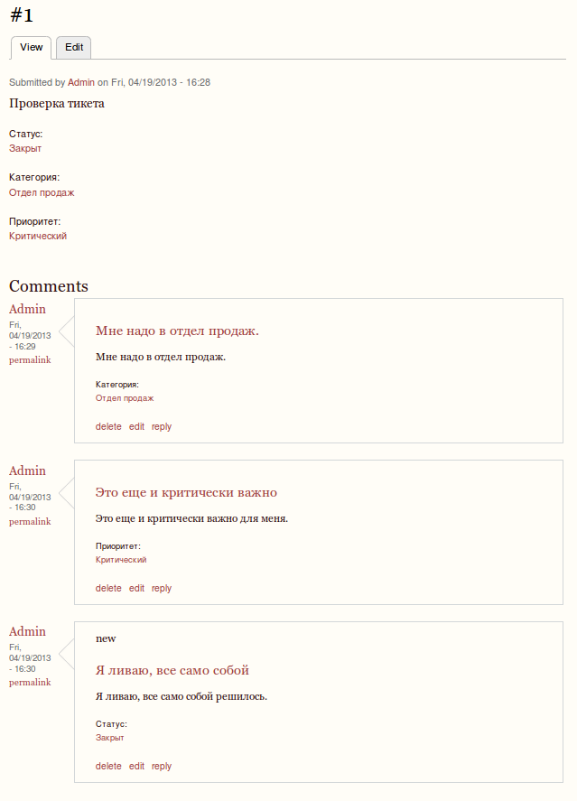

Это выглядит убого, но это работает. Дело осталось за малым, все это
темизировать, чтобы было ясно что к чему, а также создать представления для
отслеживания данных тикетов.

В принципе, вы уже можете дальше и не делать, так как ничего важного дальше не
будет. Вся дальнейшая работа сведется к организации тикетов на сайте в понятном
виде, а также темизации тикетов. Поэтому, если уверены в своих силах, можете
завершать самостоятельно.

## Создание вьюх с тикетами

Начнем с банальной доработки — мы структурируем все тикеты. Тут выходит на
помощь — views. Если еще не включили/установили — самое время начать.

Итак, создаем новую вьюху и называем её «Техническая поддержка (
technical_support)», снимаем галочку «Create a page» и жмем «Continue & edit».

Теперь будем все делать пошагово.

### Все тикеты пользователя

**Шаг 1.** Жмем «Add» и выбираем «Page».

**Шаг 2.** В «Display name» и «Title» пишем «Техническая поддержка».
Можете «Список тикетов» или как душе угодно.

**Шаг 3.** «Format» выбираем «Table».

**Шаг 4.** Полю «Content: Title» ставим галочку «Create a label» и пишем в
поле «Label» - «ID».

**Шаг 5.** Добавляем новое поле «Field: Категория», в типе форматирования
выбираем «Plain text», сохраняем.

**Шаг 6.** Добавляем новое поле «Field: Приоритет», в типе форматирования
выбираем «Plain text», сохраняем.

**Шаг 7.** Добавляем новое поле «Field: Статус», в типе форматирования
выбираем «Plain text», сохраняем.

**Шаг 8.** Добавляем новое поле «Content: New comments», ставим галочку
«Exclude from display», в префикс пишем «(новых », а в суффикс «)»,
сохраняем.

**Шаг 9.** Добавляем новое поле «Content: Comment count», в «Label» пишем
«Ответов». Затем открываем «Rewrite results» и ставим галочку «Rewrite the
output of this field». Далее в текстовое поле
вставляем «`[comment_count] [new_comments]`» и сохраняем.

**Шаг 10.** В «Filter criteria» добавляем правило «Content: Type»,
выбираем «Тикет», сохраняем.

**Шаг 11.** В «Page settings → Path» пишем «support».

**Шаг 12.** В «Header» добавляем «Global: Text area» и пишем

```html
<a href="/node/add/ticket">Создать новый Тикет</a>

<h2>Ваши обращения:</h2>
```

**Шаг 13.** В «Pager» выбираем «Display all items».

**Шаг 14.** В «Contextual filters» добавляем фильтрацию по «Content: Author
uid», указываем «Provide default value» и в поле тип выбираем «User ID from
logged in user», сохраняем.

**Шаг 15.** В «No results behavior» добавляем «Global: Text area» и пишем:

```html
<h2>Вы не создавали ни одного обращения в службу технической поддержки. Вы можете создать новый тикет нажав на кнопку ниже.</h2>

<a href="/node/add/ticket">Создать новый Тикет</a>
```

**Шаг 16.** Сохраняем представление.

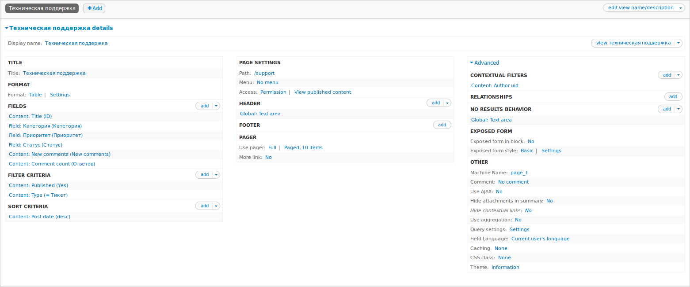

### Создание административной вьюхи

Теперь создадим представление через которое можно управлять
тикетами. **Не забывайте** везде ставить в поле «For» (самое
верхнее) значение «This page (override)».

**Шаг 1.** Жмем «Add» и выбираем «Page».

**Шаг 2.** «Display name» и «Title» присваиваем значение «Техническая
подддержка (Администрирование)», или как вам надо, и не забываем указать что
значение только для данной страницы.

**Шаг 3.** В «Filter criteria» добавляем «Field: Категория», затем
выбираем «Dropdown», далее ставим галочку «Expose this filter ...», «Label»
правим на просто «Категория» и сохраняем.

**Шаг 4.** В «Filter criteria» добавляем «Field: Приоритет», затем
выбираем «Dropdown», далее ставим галочку «Expose this filter ...», «Label»
правим на просто «Приоритет» и сохраняем.

**Шаг 5.** В «Filter criteria» добавляем «Field: Статус», затем выбираем
«Dropdown», далее ставим галочку «Expose this filter ...», «Label» правим на
просто «Статус» и сохраняем.

**Шаг 6.** В «Page settings → Path» указываем «support/admin».

**Шаг 7.** В «Access» указываем «Role → Administrator».

**Шаг 8.** Удаляем «Contextual filter», также не забыва предварительно его
перезаписать для данной страницы.

**Шаг 9.** Сохраняем представление.

Если вы не проспали где-то с перезаписью, то все получится.

Разрешите в правах пользователям создавать тикеты, а затем создайте обычного
юзера и проверьте как все работает.

Примерно получится так для юзера:

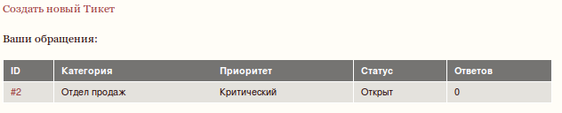

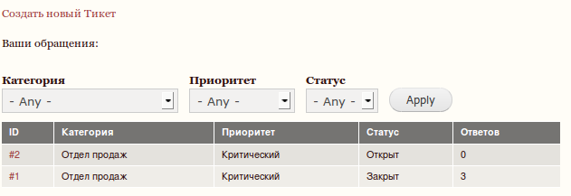

Теперь если администратор ответит на тикет пользователя (#2), в его списке это
будет отражено.

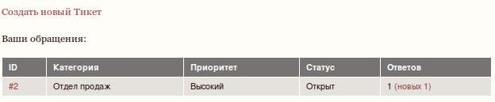

Вот так можно создать несложную техническую поддержку на сайте.

Дело осталось за малым, все это добро темизировать. Но учить я вас, разумеется,
этому не стану. Я просто создам пример, а вы уже сами ковыраяйте ;)

Включив тему Corolla и немного поговнокодив, я привел сообщения к такому виду:

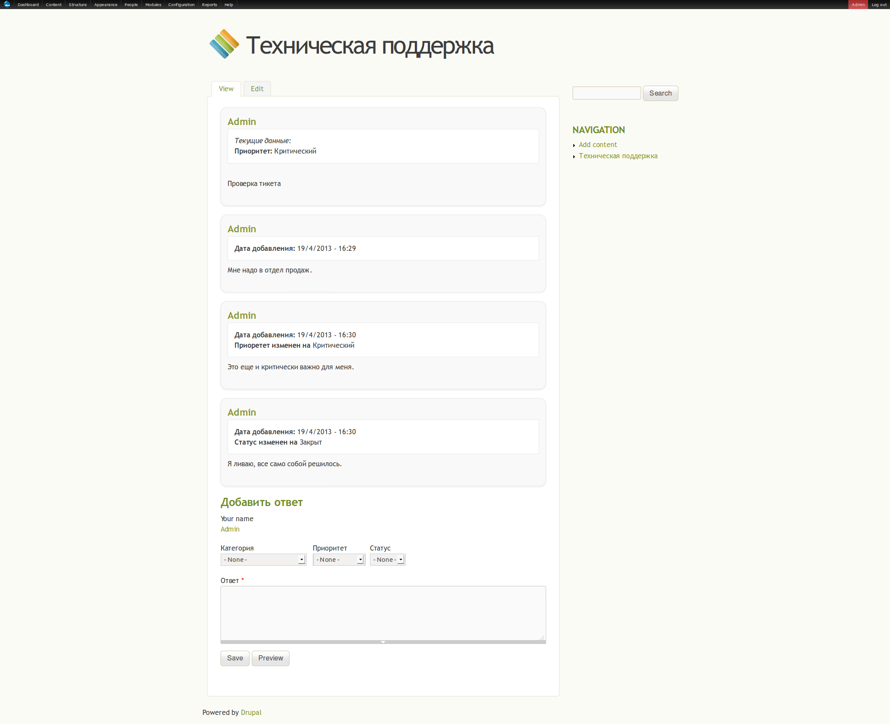
