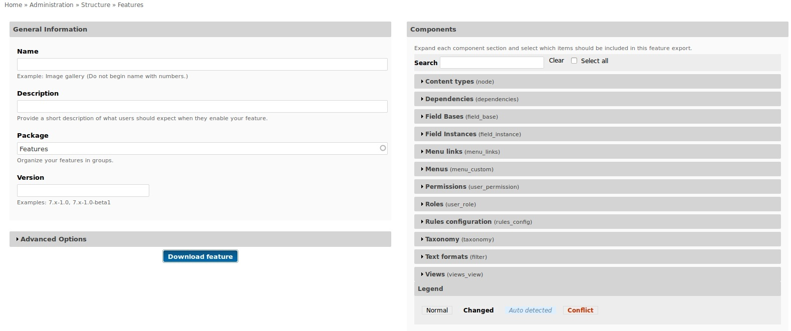
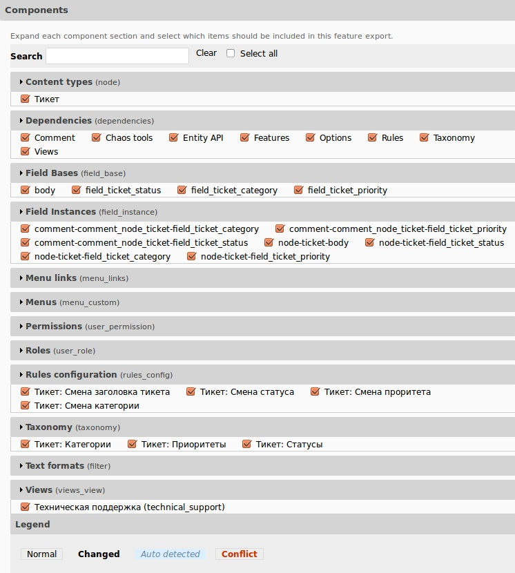
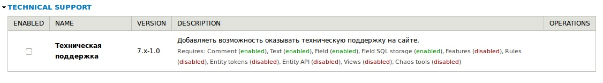
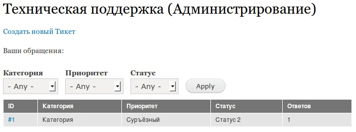

Сразу оговорюсь, что с Features я знаком поверхностно. Доводилось пару раз
побаловаться им. Решил раз уж буду делать Feature по технической поддержке, то и
напишу как делал это.

Feature (он же: фича, фьюча, возможность — кто на что горазд) — модуль, который
позволяет создавать наборы из текущего состояния сайта, а затем их использовать.

Пример: вы сделали тип содержимого каталог, view для его отображения, а также
добавили некоторые поля которые там используются. Создавая очередной сайт, вы
вдруг понимаете что уже делали точно такой же каталог, зачем все делать
по-новому? Это драгоценное время, которое можно потратить на другие занятия,
особенно если такой каталог воссоздавать от нескольких часов. И тут приходит на
помощь Feature. Данный модуль поможет «запаковать» ваш готовый каталог в новую
«возможность», которая по факту является модулем, а затем использовать её где
нужно. В нашем случае, эту «возможность» мы кидаем на новый сайт, включаем и
вуаля, каталог готов.

Ценность данного модуля бесспорна, но у меня руки не доходят его изучить глубже,
а именно, для создания сборок. Его также не пропустили мимо рук и разработчики
Drupal, в 8 версии, в ядре появится «Менеджер конфигураций» с которым будет
интегрироваться Features, но об этом я уже ничего точно сказать не могу. Но в
ядро бесполезное вряд ли бы добавили.

Разумеется данный модуль и может намного больше и используется с разными целями,
мы же рассмотрим лишь базовую работу с ним.

## Подготовка

Так как я буду показывать на примере «Технической поддержки», то вы
можете [скачать бэкап сайта](http://niklan.net/sites/default/files/blog/28/attachments/drupaldev.20130419_044448.tar.gz) [из гайда](http://niklan.net/blog/28).
Также нам понадобится модуль [Features](http://drupal.org/project/features).

От вступления к делу.

## Знакомство с интерфейсом модуля

Перед тем как перейти к созданию, забегу вперед и расскажу про интерфейс
создания «возможностей».

General Information — позволяет задать основные параметры возможности. В нем
можно задать:

- Имя — название будущей возможности.
- Описание — описание для возможности чтобы было проще сориентироваться.
- Группа — то, к какой группе будет относиться возможность. Позволяет
  разграничить возможности по группам. В том числе, будущая возможность будет
  именно с данной группой в списке модулей.
- Версия — версия возможности, которая задается по типу модулей.
  Версия.друпала-версия.модуля.

Advanced Options — дополнительные настройки возможности. Состоят из:

- Путь до файла обновления — это позволяет сообщить всем сайтам, на которых
  используется возможность, о том, что вышла новая версия и они могли обновиться
  по принципу обычных модулей. (необязательное поле)
- Путь для генерации модуля-возможности — путь где создаться модуль с данной
  возможностью. Оставив пустым, возможность будет генерироваться в стандартную
  папку sites/all/modules/name_of_feature. Я повидал мало «возможностей», но все
  они, как правило, располагались в папке
  sites/all/modules/features/name_of_feature. Объяснять почему, я думаю не
  стоит.
- Генераци возможности — генерация возможности в модуль. Используется когда все
  настройки уже сделаны.
- Автоматическое добавление зависимостей — позволяет автоматически отслеживать и
  помечать модули/поля и т. д. на добавления в возможность. Например вы пометили
  созданную вами view, то автоматически добавится зависимость к модулю views.
- Допустить конфликты — позволяет добавлять в возможность то, что будет
  конфликтовать между собой. Я, честно, с таким не сталкивался и даже
  представления не имею что может конфликтовать.

Components — раздел со всеми сущностями, полями и т. д. созданными на вашем
сайте, и которые должны быть добавлены в возможность. Выделенные компоненты
имеют следующие статусы:

- Нормальный (серый) — вы выбрали данный компонент.
- Измененый (серый с жирным текстом) — выбранный ранее компонент, но был изменен
  с момента генерации возможности.
- Автоматически обнаруженный (голубой) — этот элемент необходим для какого-то из
  тех, что вы выбрали сами. (как в случае с views выше).
- Конфликт — значит что-то конфликтует. :)

Ну и кнопка скачать возможность, объяснять зачем, думаю не стоит.

## Создаем новую «возможность»

Прежде чем что-либо «упаковывать», нам необходимо создать ту самую «упаковку».
Для начала перейдите в административный раздел Features и приступим.

**Шаг 1.** Создаем новую «возможность»

**Шаг 2.** Даем название «Техническая поддержка» (technical_support)

**Шаг 3.** В группу пишем Technical support. Если что-то еще будите добавлять к
службе поддержки, а затем выносить в feature, то будет проще ориентировать.

**Шаг 4.** Указываем версию 7.x-1.0

**Шаг 5. **Переходим в раздел «Components». И начинаем помечать что нам
необходимо для корректно работы feature:

- Content types: Тикет. У вас автоматически отметятся все поля которые там
  используются, словари таксономии и модули.
- Rules configuration: помечаем все наши rules'ы с приставкой «Тикет».
- Views: помечаем наше представление «Техническая поддержка».

**Шаг 6**. Жмем «Generate feature».

Наша возможность будет доступна по адресу sites/all/modules/technical_support, а
также в разделе модулей и features.

В разделе features, вы сможете следить за текущим состояним возможности, которое
позволит отслеживать все изменения и генерировать новую, более свежию версию,
которая будет применяться на других сайтах (если есть обновление или делаете
руками).

Для того чтобы протестировать его, разумеется, логичнее всего поставить чистую
сборку друпала, тогда все косяки всплывут сразу.

## Проверяем

После чистой установки сразу же включаем нашу возможность, которая будет
отображаться в списке модулей.

Как вы можете увидеть все зависимости прописаны, и нам достаточно включить
возможность, как все остальные модули сами включаться и опять же, это сэкономит
нам время.

После включения, у нас появится функционал «Технической поддержки».

## Что делать после

Не думайте что включили и проблема решена. Взять все тот же наш пример. Словари
категорий, статусов и приоритетов тикетов создались, но они пустые. Надо либо
добавлять, либо импортировать (Feeds) их.

Также все на этом примере. Например сейчас надо заполнять поле «Title» для
тикета, а в статье мы избавились от этого методом добавления кода в
template.php, который, feature перенести не может.

Такие ньюансы нужно учитывать и прежде чем цеплять feature на продакшен, два-три
раза протестируйте на чистых сборках.
