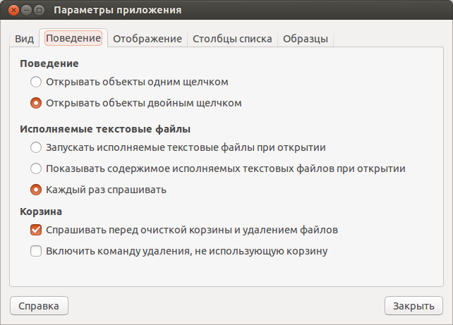

Я достаточно редко пользуюсь bash скриптами, но я их всегда использую для
генерации локального окружения для нового сайта. Прописка в хост, создание папок
и т. д., но не важно даже.

Проблема в том, что в Ubuntu 13.04 данные скрипты стали открываться через gedit.
Запуск через консоль выдает ошибку на любой скрипт, и соответственно делает
невозможным запуск скриптов.

Решение проблемы таилось в обновленном Nautilus'e, в котором, даже с
выставленной галочкой «Разрешить исполнение», скрипт открывался в блокноте.

Для устранения проблемы открываем наутилус, затем заходим в параметры. Затем на
вкладке «Поведение» в разделе «Исполняемые текстовые файлы» нужно выставить
«Каждый раз спрашивать», и все станет как прежде.

Единственная проблема, это выставляется для каждой папки отдельно.
