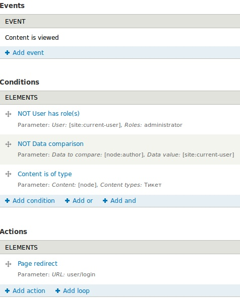

В статье про создание технической поддержки я блокировал доступ модулем, а как оказалось, решение было намного проще и решить её можно было все тем же Rules, который там активно использовался.

Итак, приступим.

**Шаг 1.** Создаем новое правило (Rule).

**Шаг 2.** Назовем его «Тикет: Блокировка от просмотра» (ticket\_block\_view). Также укажем реакцию на событие «Content is viewed».

**Шаг 3.** В «Conditions» добавляем новый «User has role». В «Data selector» указываем «site:current-user», в списке ролей выбираем «Administrator» (и еще те, которые будут иметь доступ ко всем тикетам, например сотрудники), а в самом низу указываем «Negate». Тем самым мы говорим правилу, что оно сработает когда текущий пользователь **не имеет** роли «Administrator».

**Шаг 4.** Добавляем еще один «Conditions» «Data comparsion». В «Data selector» выбираем «node:author» и жмем продолжить. На следующем этапе в «Data selector» выбираем «site:current-user» и снова ставим галочку «Negate». Сохраняем.

**Шаг 5.** Добавляем «Condition» «Content is of type» и в «Content types» выбираем «Тикет».

**Шаг 6.** Последним мы добавим «Action» «Page redirect» и в «Value» укажем «user/login».

А теперь обо всем по порядку, чтобы разъяснить что происходит.

Когда кто-либо заходит на страницу, которая является типом содержимого «Тикет», мы проверяем пользователя на право доступа к нему. В нашем случае мы указали, что если пользователь не администратор, а также не автор данного содержимого (тикета), то он будет перенаправлен по адресу «user/login».

По такому принципу вы можете блокировать ноды, а перенаправлять, например, на специальную страницу с описанием тех поддержки или ошибки.
