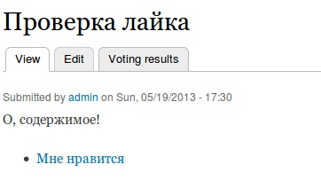
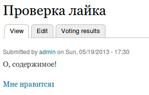
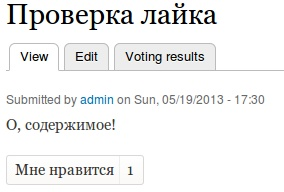

Кнопка «Мне нравится», встречается почти на каждом сайте, и в этой статье я
расскажу как её создать на Drupal сайте при помощи модуля Rate.

Модуль Rate предназначен для создания различных видов оценок, будь то просто
лайки, дислайки или оценка по шкале. Это достаточно гибкий инструмент и поможет
создать несложные системы и меры оценки статей.

Итак, качаем и устанавливаем [Voting API](http://drupal.org/project/votingapi‎)
и [Rate](http://drupal.org/project/rate).

```php
drush dl votingapi rate
drush en votingapi rate
```

В комплекте уже идут базовые примеры как просто лайк, лайк с дизлайком, эмоции,
да/нет. Мы же создадим свой собственный. Для этого заходим в админке:
Administration → Structure → Rate widgets

**Шаг 1.** В «Widget type» выбираем «Custom» и жмем «Next».  
**Шаг 2.** Называем наш виджет, например «Мне нравится», машинное имя и tag
делаем «like».  
**Шаг 3.** В «Value type» мы выбираем «Points», потому что наш лайк будет
считать количество лайков.  
**Шаг 4.** В «Option» добавляем нашу кнопку, написав в «Value» → «1» (должно
быть целочисленным), а в «label» → «Мне нравится».  
**Шаг 5.** В «Node types» необходимо выбрать, в каких типах содержимого будет
использоваться данный виджет. Также там можно выбрать комментарии, это значит
что комментарии к нодам данного типа можно будет также лайкать. Нас это не особо
интересует и мы выберем тип содержимого на ваше усмотрение, например
стандартный «Article».  
**Шаг 6.** Все остальные настройки делайте на свое усмотрение и сохраняем.

Я добавил лайк к «Article» и у меня он выглядит так:



Выглядит ущербно, не так ли? Но этот модуль не был бы популярным, как и данный
материал был бы не очень полезным, если бы не его кастомизация, которую мы
сейчас заденем.

Если вы делаете собственную тему, вам с вероятностью 99% придется переопределять
темплайты для нод, в том числе где и будет лайк. А если вы уж делаете тему, то
наверняка все поля выводите как нужно, но судя по гуглу, многих момент вывода
рейтинга сбивает с калии. Для вывода кнопки нужно всего лишь воспользоваться
функцией rate_embed:

```php
<?php print rate_embed($node, 'like', RATE_FULL); ??>
```

Непосредственно для темизации используются шаблоны вида:
rate-widget--MACHINENAME.tpl.php. В нашем случае он будет называться так:
rate-widget--like.tpl.php. За его основу берется rate-widget.tpl.php из папки
модуля «Rate».

Например, создадим наш темплайт и изменим вывод:

```php
<?php print theme('rate_button', array(
    'text' =?> $links[0]['text'],
    'href' => $links[0]['href'],
    'class' => "extra-class")
);
print "<span>" . $results['count'] . "</span>";
?>
```



```css {"header":"Добавим немного CSS"}
    .rate-widget-1 {
  background: linear-gradient(to bottom, #FFFFFF 0%, #FBFAF9 100%) repeat scroll 0 0 transparent;
  border: 1px solid #D9D8D6;
  border-radius: 3px 3px 3px 3px;
  color: #343434;
  width: 130px;
  padding: 3px;
}

.rate-widget-1 a {
  color: #343434;
  border: none;
  border-right: 1px solid #EEEEEC;
  padding: 5px;
}

.rate-widget-1 span {
  padding: 7px;
}
```


