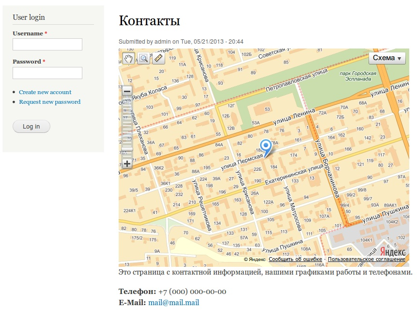
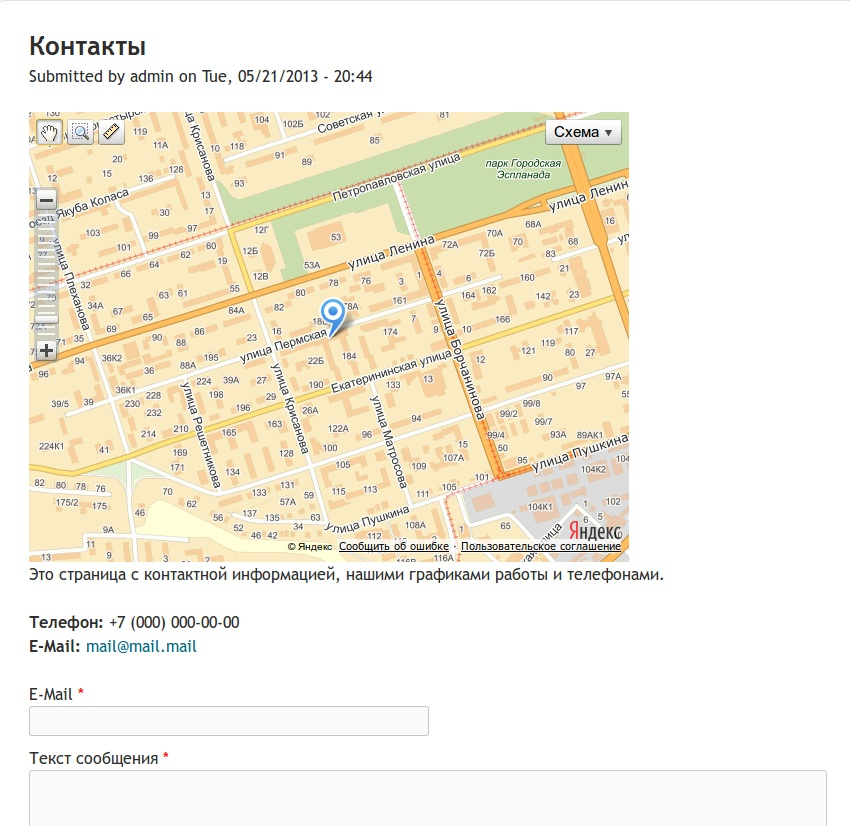
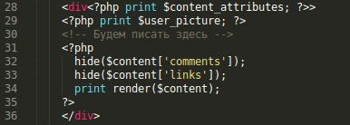
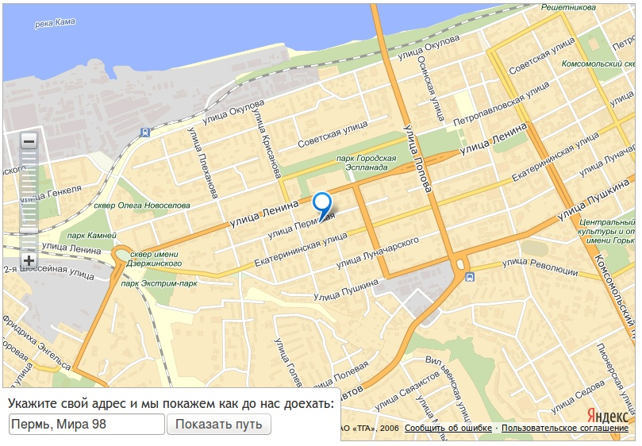
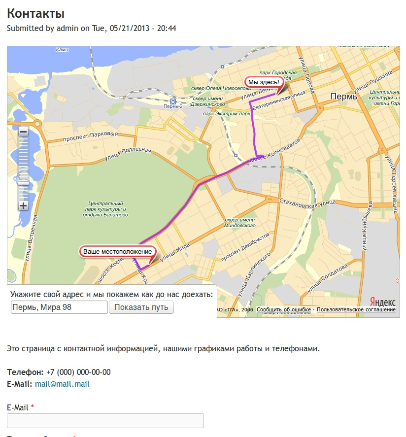

Давно хотел написать статью о том как сделать информативную страницу для
контактов, но никак не мог придумать писать все раздельно, либо одной статьей.
Решил все же написать все в одном, так как половина статьи у меня уже была
написана ранее.

Итак, в данной статье я хочу рассказать о создании контактной страницы и формы
средствами webform и карт яндекса.

Я уже писал [как сделать контактную форму][d7fb-contact], поэтому, если не
знаете или не читали, то сделайте сначала её, а затем приступайте читать эту
статью дальше.

Допустим у вас уже есть страница с контактной формой и информацией.


Теперь время добавить карту яндекса. Вы можете перейти
в [конструктор карт](http://api.yandex.ru/maps/tools/constructor/) и создать
свою карту. В 90% случаев делают подобное:



Я же предлагаю сделать её более интерактивной и полезной. Так как нам придется
выполнять код как php, так и js, то будет логичнее данную ноду оформить
отдельным tpl файлом. Чтобы не показывать плохой пример, я скачаю
тему [Corolla](http://drupal.org/project/corolla) и буду продолжать рассказывать
на ней. И для полного понимания вот как выглядит все та же контактная страница
но уже в королле.



Теперь займемся темизацией. Для начала переходим в
sites/all/themes/corolla/templates и делаем копию node.tpl.php и называем её
node--NID.tpl.php (где NID — номер ноды контактов.) У меня контактная форма
расположена по адресу node/2 поэтому я создаю node--2.tpl.php

Для начала уберите сгенерированную карту из ноды и затем приступайте к
дальнейшим инструкциям. Это не вызовет путаницы.

Как правило, я вообще все шаблоны пишу сам и не рендерю весь контент целиком,
так как с каждым полем работаю отдельно. В данном случае мы просто обойдемся
добавлением своего собственного кода, который будем писать где показано на
картинке.



Как вы уже понимаете, нам не поможет код карты, который вы сгенерировали ранее.
Да, его можно вставить сюда, но тогда смысла нету в данной затее никакого и
данный код никак не кастомизируется. Мы же будем делать его сами.

Итак, начнем с php.

```php
<?php // Присваиваем нужный адрес. Например адрес оффиса.
      // Постарайтесь указать адрес как можно точнее чтобы небыло сбоя.
      $office_address = 'г. Пермь, ул. Пермская 200';
      // Используя Yandex.Maps API мы получаем широту и долготу данного адреса.
      // Получаем в формате json а заместо curl используем drupal_http_request();
      $json = drupal_http_request('http://geocode-maps.yandex.ru/1.x/?format=json&geocode=' . $office_address . '&result=1');
      // Данные из результат записываем в отдельную переменную.
      $result = json_decode($json->data);
      // Получаем широту и долготу из ответа.
      $coordinates = $result->response->GeoObjectCollection->featureMember[0]->GeoObject->Point->pos;
      // Разбиваем строку чтобы получить массив.
      $coordinates_array = explode(" ", $coordinates);
      // Соденияем широту и долготу в нужном порядке (сначала 1, потом 0), а также разделяем запятой а не пробелом.
      // Дальше с этими координатами мы будем работать.
      $coordinates_ready = $coordinates_array['1'] . "," . $coordinates_array['0'];
      // Передаем наши координаты в JS.
      drupal_add_js(array('coordinates' => $coordinates_ready), 'setting');
      // Подключаем Yandex.Maps API.
      drupal_add_js('http://api-maps.yandex.ru/2.0/?load=package.full&lang=ru-RU');
      // Подключаем JS с которой будем работать далее.
      drupal_add_js(drupal_get_path('theme', 'corolla') . '/js/script.js');
?>
```

Данный код получает координаты и приводит их в подобающий вид. Странно что
координаты отдаются в одном порядке, а принимаются в другом. Не забываем что
вставить данный код нужно в node--NID.tpl.php, в то место которое указано на
скриншоте выше.

Теперь нам необходимо создать файл с именем «script.js» по адресу
sites/all/themes/corolla/js. В этом JS мы будем работать с Yandex API, и
соответственно с самой картой. Как вы можете заметить из PHP кода, мы ему
передаем все необходимые параметры, а именно координаты, а затем подключаем
данный файл. Все остальные действия пойдут именно из него. Но для начала после
PHP кода, сразу вставляем HTML код:

```html

<div id="map"></div>
<div id="map-route">
    Укажите свой адрес и мы покажем как до нас доехать:<br></br><input
        id="map-route-address" type="text" value="Пермь, "></input>
    <input id="map-start-route" type="button" value="Показать путь"></input>
</div>
```

Данный код добавит текстовое поле для ввода адреса и кнопку, которые будут
частью нашей карты, которые в последствии, покажут путь до нашего офиса. Теперь
переходим непосредственно к заполнению нашего script.js.

```js {"header":"script.js"}
    (function ($, Drupal) {
  $(document).ready(function () {
    // Забиваем координаты офиса в переменную. Координаты передаются друпалом.
    var coordinates = Drupal.settings.coordinates.split(',');
    // Создаем пустую глобальную переменную для маршрутов.
    var router;

    // Инициализируем Yandex карты.
    ymaps.ready(init);

    function init() {
      // Создаем карту
      var myMap = new ymaps.Map("map", {
            center: coordinates, // Координаты центра карты, в нашем случае офиса.
            zoom: 14
          }),

          // Добавляем на карту метку, опять же на координаты офиса.
          myPlacemark = new ymaps.Placemark(coordinates);
      myMap.geoObjects
          .add(myPlacemark);

      // Добавляем элементы управления картой. В нашем случае зум со смещением.
      myMap.controls
          .add('zoomControl', {left: 20, top: 160});

      // Обрабатываем нажатие на показ маршрута от указанного пути.     
      $("#map-start-route").click(function () {
        // Присваевыем текущее значение поле адреса.
        var route_address = $("#map-route-address").val();

        // Генерируем маршрут.
        ymaps.route([
          route_address, // Адрес откуда отправляемся.
          coordinates    // Адрес куда отправляемся (наш офис).
        ], {
          mapStateAutoApply: true // Автозум под дистанцию.
        }).then(function (route) {
          // Если уже ранее был проложен маршрут, мы его удаляем чтобы небыло
          // наложения маршрутов и путанницы.
          if (router) myMap.geoObjects.remove(router);
          // В нашу переменную присваиваем маршрут переданный яндексом.
          router = route;
          // Прорисовываем маршрут на карте.
          myMap.geoObjects.add(router);
          // Получаем точки маршрута.
          var points = route.getWayPoints();
          // Указываем что бабл будет красного цвета.
          points.options.set('preset', 'twirl#redStretchyIcon');
          // Устанавливаем иконку и текст в ней для стартового маршрута.
          points.get(0).properties.set('iconContent', 'Ваше местоположение');
          // Устанавливаем иконку на наше местоназначение.
          points.get(1).properties.set('iconContent', 'Мы здесь!');
        }, function (error) {
          // Выводим ошибку, если такая возникла. Например если путь хотят
          // проложить через океан.
          alert("Возникла ошибка: " + error.message);
        });
      });
    }
  })
})(jQuery, Drupal);
```

Теперь чутка добавим CSS. Для этого в sites/all/themes/corolla/css/page.css
добавим:

```css
    #map {
  height: 550px;
  position: relative;
  margin-bottom: 50px;
  border: 1px solid #B0B0B0;
}

#map-route {
  position: absolute;
  bottom: -1px;
  left: -1px;
  background: white;
  padding: 7px;
  z-index: 501;
  border-top-right-radius: 6px;
  border: 1px solid #B0B0B0;
  border-bottom: none;
  border-left: none;
}
```



А если укажем адрес и нажмем «Показать путь» то наша страница будет такой:



Как по мне, от такой карты проку больше чем от простой пометки. На этом все.

## P.s.

Подумал, может такой модуль запилить. В реализации не сложный, а по сути
полезный.

[d7fb-contact]: ../../../../2013/02/27/d7fb-contact/index.ru.md
