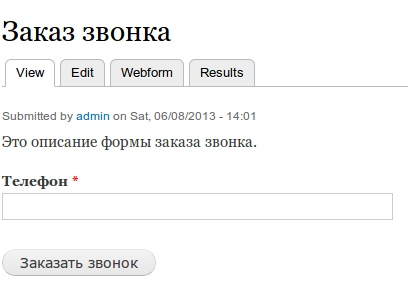

Очень часто народ спрашивает на drupal.ru, как же сделать кнопку с формой заказа
обратного звона для посетителей. Делается это совсем не сложно, я даже засек,
абсолютно с голой идеи для статьи до момента завершения я потратил 3 минуты (
включая время на раздумье как делать).

В общем делается это ну вообще нисколько не сложно, всего-то надо модуль Webform
и руки. Начнем пожалуй с простого, во что я вникать не буду. Создаем новую форму
для обратного звонка. В неё добавляйте какие нужно поля, я думаю это не составит
особого труда, а если вы не работали с вебформами, то рекомендую почитать гайд,
а потом приступать. Я сделал такую форму:



После того как ваша форма готова, подключите новый js файл к вашей теме, или
используйте уже готовый для вставки нужного кода. И вставляем копипастом туда,
то что я накатал:

```js
 (function ($) {
  $(document).ready(function () {
    // Укажите NID с формой.
    var nodeId = 2;
    // Селектор формы.
    var formSelector = ".node > .content";

    // Обрабатываем клик по кнопке "Заказать звонок".
    // Если хотите использовать on вместо live, ставьте модуль jQueryUpdate.
    $("#call-me").live("click", function (event) {
      // Добавлям только один раз.
      if ($("#call-me-form").length == 0) {
        $("body").append('<div id="call-me-form"></div>');
      }

      // Добавляем закрытие окна.
      $('#call-me-form').load('/node/' + nodeId + ' ' + formSelector, function () {
        $("#call-me-form").append('<a href="#" id="call-me-close">Закрыть</a>');
      });
    });

    // Обработчик закрытия окна.
    $("#call-me-close").live("click", function (event) {
      $("#call-me-form").remove();
    });
  });
})(jQuery);

```

Не забудьте поменять NID на соответствующий форме заказа звонка. У меня стоит 2,
так как форма находится по адресу: node/2. А также изменить селектор контента
где находится форма. По умолчанию стоит для бартика, у вас же будет свой
селектор под ту тему которую вы используете.

Далее создайте новый блок или просто где это необходимо, в котором разместим
кнопку для вызова нашей формы:

```html
<a href="#" id="call-me" class="button">Заказать звонок</a>
```


Теперь при нажатии на кнопку будет грузиться наша форма, но она будет появляться
в самом низу страницы. Для этого просто накатаем пару строчек CSS чтобы он был
вверху и в более-менее подобающем виде:

```css
    #call-me-form {
  position: fixed;
  left: 40%;
  top: 200px;
  width: 390px;
  padding: 15px;
  background: rgb(250, 250, 250);
  border: 3px solid rgb(202, 202, 202);
  border-radius: 3px;
  box-shadow: 0 8px 30px 0 rgb(213, 213, 213);
}

#call-me-close {
  position: absolute;
  top: 5px;
  right: 10px;
  color: rgb(75, 75, 75);
  font-weight: bold;
}
```

Вот и все, после нажатия на кнопку заказа звонка будет появляться такая
формочка, которая легко редактируется через webform, а также позволяет
отслеживать заявки и прочие прелести модуля.


