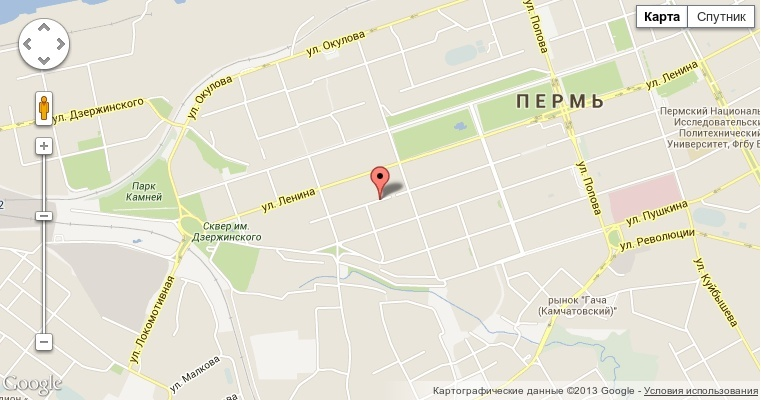
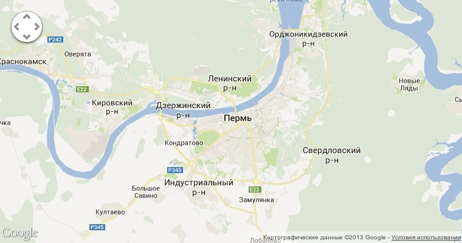
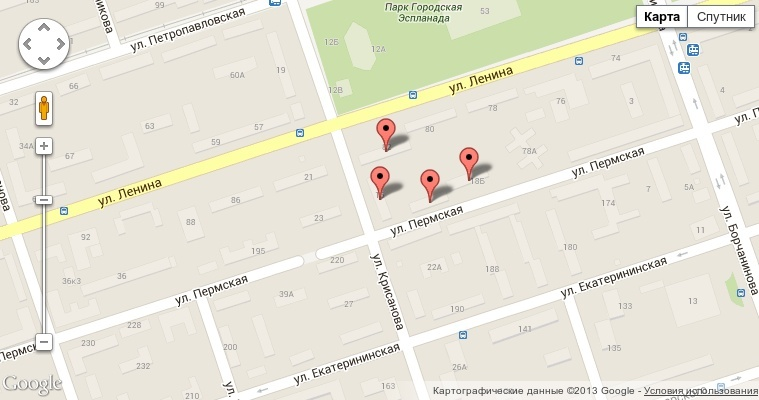
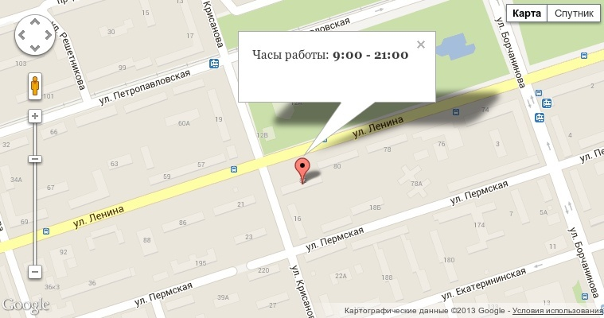
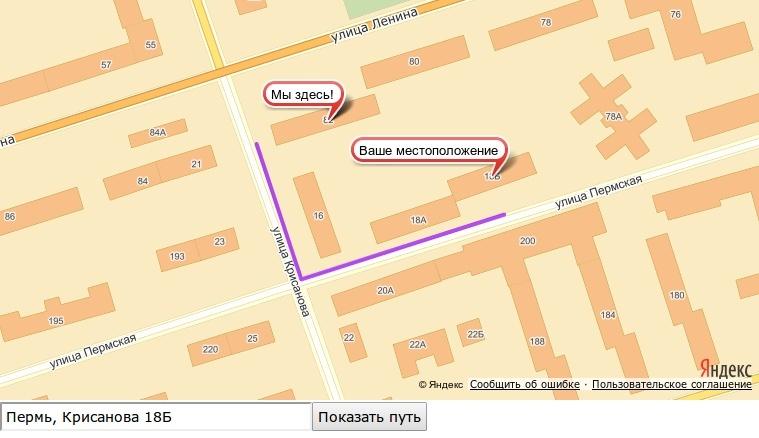

Было дело, я писал статью
про [создание продвинутой контактной страницы][drupal-7-advanced-contact-page]. Там
была вставка карты, которая не только показывает место, но и может проложить
к нему маршрут. В момент написания, у меня появилась идея написать модуль для
простой вставки карт на сайт, ну и я его создал. Представляю вам модуль
[Mappy](https://drupal.org/project/Mappy).

Mappy — по сути, просто небольшой JS файл, который подгружает все необходимые
библиотеки карт на страницах, где собственно и требуется карта. При этом он
позволяет вставлять карты на сайты средствами обычного HTML и атрибутов к нему.
Что в свою очередь облегчает процесс вставки карт на сайт для неопытных
пользователей.

Вставка карты осуществляется при помощи html-тега

```html
<mappy:сервис></mappy>
```

Где вместо сервиса мы подставляем названием карт, google или yandex, а вместо
атрибутов, параметры для карты.

Я постарался сделать параметры (атрибуты) максимально универсальными между
картами. Это необходимо, если вы настроили карту для гугла, но затем решили
сменить на яндекс, надо будет всего лишь изменить название сервиса. Но все же,
стоит обращать внимание при большом количестве параметров, так как например зум
у яндекса принимает координаты, а у гугла булевое значение.

Каждый из сервисов имеет 4 обязательных параметра:

- **address** — город, улица или здание где будет центрироваться карта;
- **zoom** — насколько будет изначально приближена или отдалена карта;
- **width** — ширина карты в px;
- **height** — высотка карты в px.

Со всеми возможными атрибутами, назначением и прочими информативными справками я
предлагаю обратиться к документации модуля на GitHub:

- [Google.Maps](https://github.com/Niklan/Mappy/wiki/ru_Google.Maps)
- [Yandex.Maps](https://github.com/Niklan/Mappy/wiki/ru_Yandex.Maps)

В принципе рассказывать то и нечего больше, поэтому приведу некоторые примеры.

```html {"header":"Пример 1"}
<google address="г. Пермь, ул. Пермская 200" height="400" width="760"
        zoom="14"></google>
```



```html {"header":"Пример 2"}
<google address="г. Пермь, ул. Пермская 200" addressplacemark="false"
        height="400" maptypecontrol="false" streetviewcontrol="false"
        width="760" zoom="10" zoomcontrol="false"></google>
```



```html {"header":"Пример 3"}
<google address="г. Пермь, ул. Крисанова 16; г. Пермь, ул Крисанова 18; г. Пермь, Ленина 82; г. Пермь, ул Крисанова 18Б"
        height="400" width="760" zoom="16"></google>
```



```html {"header":"Пример 4"}
<google address="г. Пермь, Ленина 82"
        ballooncontent="Часы работы: <b>9:00 — 21:00</b>" height="400"
        width="760" zoom="16"></google>
```



```html {"header":"Пример 5"}
<yandex address="г. Пермь, ул. Ленина 82" height="400"
        route="create-route,route-start" width="760" zoom="16"></yandex><input
        id="route-start" type="text" value="Пермь, "></input><input
        id="create-route" type="button" value="Показать путь"></input>
```



Также примеры можно найти на GitHub, и еще немного в комментариях к записи
на [drupal.ru](http://www.drupal.ru/node/100306).

Скачать можно по адресу: <http://drupal.org/project/mappy>

Приятного использования. Отзывы, предложения и пожелания можете писать как в
комментариях к этой записи, так и к записи на drupal.ru.

[drupal-7-advanced-contact-page]: ../../../../2013/05/21/drupal-7-advanced-contact-page/article.ru.md
