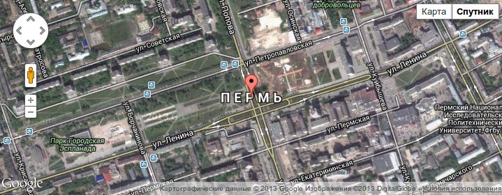
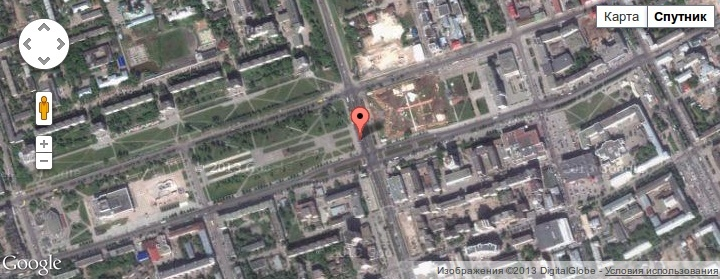
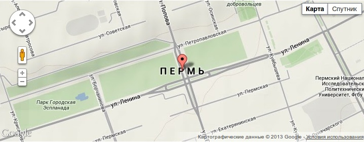

Наконец-то дошли руки что-то сделать этим летом. И решил немного поправить
Mappy. Поэтому сегодня я зарелизил версию 7.x-1.2.

Список изменений следующий:

- Добавлена возможность выбирать тип покрытия карты (спутник, гибрид, карта).
  Спасибо [xandeadx](http://xandeadx.ru/).
- Добавлена возможность блокировать зум карты мышкой. Очень удобно когда карта
  занимает значительную область на сайте и мешает скролить сайт.
- Исправлена ошибка, когда вместо mappy:google (или mappy:yandex) в tpl файлах
  шаблона нужно было писать google или yandex. Теперь работают оба способа.

Ввиду данных изменений появились два новых атрибута для тега mappy:

- **type** — принимает значения ROADMAP (по-умолчанию, это просто карта),
  HYBRID (спутник, с наложением дорог), SATELLITE (спутник), TERRAIN (ландшаф —
  карта высот).
- **scrollwheel** — принимает true или false. При false — карту нельзя будет
  приближать/отдалять при помощи ролика мышки.

## Примеры

```html {"header":"Пример 1"}
<google address="г. Пермь" height="280" type="HYBRID" width="720"
        zoom="17"></google>
```



```html {"header":"Пример 2"}
<google address="г. Пермь" height="280" type="SATELLITE" width="720"
        zoom="15"></google>
```



```html {"header":"Пример 3"}
<google address="г. Пермь" height="280" type="TERRAIN" width="720"
        zoom="15"></google>
```



## Скачать

1. [Скачать с Drupal.org](https://drupal.org/project/mappy)
2. [Скачать с Github](https://github.com/Niklan/mappy/releases)
