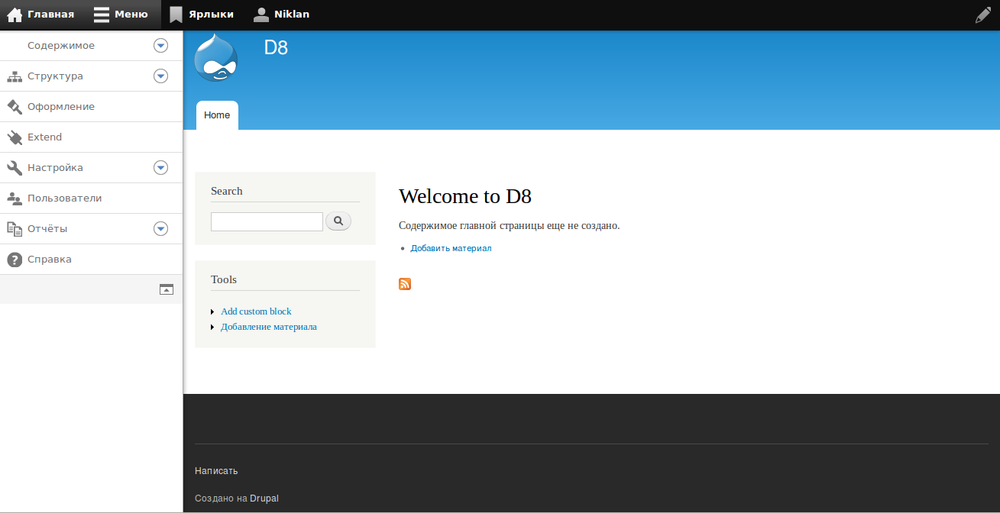
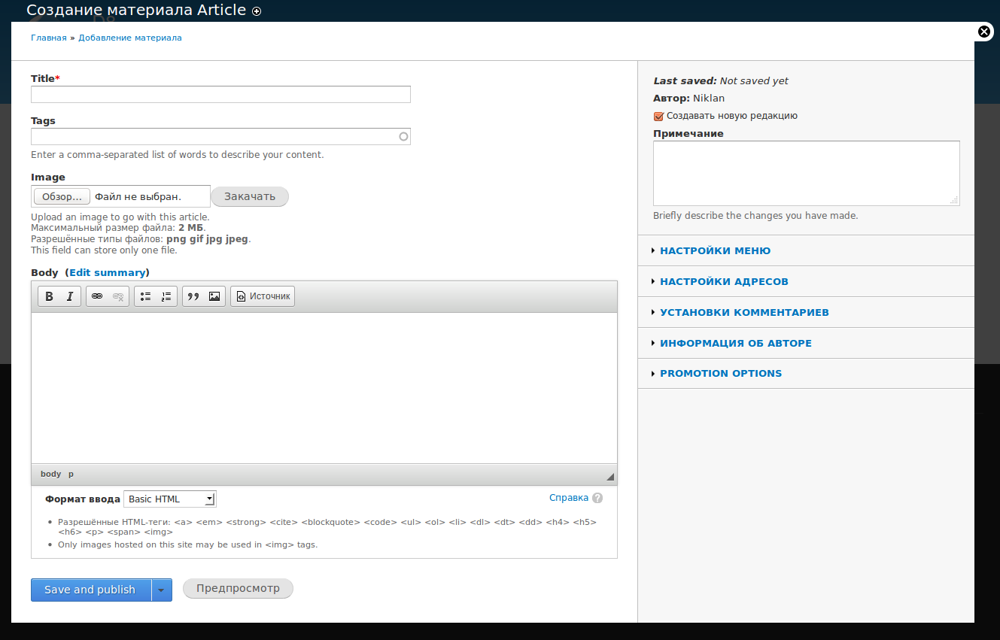
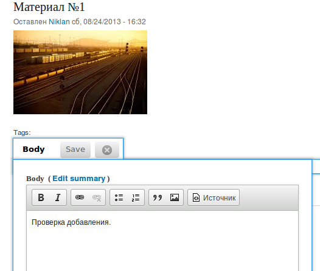

Наконец-то я начал отходить от долгого лета и потихоньку возвращаться в строй. В
связи с тем что Drupal 8 уже на носу, я решил поглядеть, что же там получилось.
До этого я его видел на скринах, да и только.

Дата релиза Drupal 8 не известна, кто-то говорит в сентябре 2013, но это
маловероятно, где-то мелькает информация, что в первом квартале 2014. Никто не
знает точной информации, но это должно случиться в ближайшие пол года.

На данный момент разработка Drupal 8 завершена. Сейчас все силы направлены на
исправление багов, безопасность, оптимизацию, документацию и изменение API (в
документации). Как только все это устаканится, мы увидим RC1, а затем и релиз.

К чему все это? А к тому, что фактически, уже ничего не изменится, то что сейчас
есть в alpha-релизах, то же будет и в релизе, только без багов и отшлифованное.
RC1 уже будет звонком для всех, что скоро будет релиз.

Для знакомства я скачал последнюю стабильную версию на данный момент: Drupal
8.0 - alpha 2.

## Структура файлов

Изменения, как говорится, не отходя от кассы. Сразу заметно что структура файлов
Drupal 8 подверглась изменениям:

- core - ядро, и все что с ним поставляется. Стандартные модули, темы и т.д.
- modules - папка для хранения контриб модулей. Аналог в Drupal 7:
  sites/all/modules;
- themes - папка для хранения контриб тем. Аналог в Drupal 7: sites/all/themes;
- profiles, sites - имеют прежнее назначение что и раньше, впрочем как и
  расположение.

Мне показалось, что новая структура намного продуманее. Ядро имеет конкретную
папку, что даст большее понимание новичкам что трогать нельзя. Также очень
удобным шагом является вынесение папок modules и themes в корень сайта. Хотя
что-то мне подсказывает, их с таким же успехом можно продолжать хранить по
прежним адресам (для мультисайтинга).

## Установка

Установка тоже не осталась не затронутой и сразу же видно одно, хоть и
банальное, но логичное и правильное изменение.

Как вы можете увидеть, нам сразу предлагается выбрать язык установки. Да, кто
устанавливал друпал раньше, скажут что такое было. Но это совершенно иное, ведь
раньше нам предлагали выбрать язык, который имеет файлы перевода в ядре, сейчас
же там доступны на выбор все языки, на которые переведен друпал, а по умолчанию
выбирается язык системы.

Я решил глянуть все на русском и нажал “продолжить”. Сразу же всплыла ошибка:

Для этого всего-лишь нужно создать указанную папку, и обновить страницу. (Если
сообщение все еще висит, нужно дать серверу права на запись в эту папку)

Далее нам предлагают выбрать профиль установки. В данном случае нам на выбор
дают Minimal и Standart, как и было раньше.

После выбора типа профиля идет конфигурация базы данных. И тут сразу бросается в
глаза что инпуты были изменены. Появился плавный эффект тени (transition +
box-shadow) при фокусе поля. Вроде мелочь, а заметно и приятно. Сама же форма
настройки подключения к базе осталась прежней.

Дождавшись завершения установки начинает применяться перевод на тот язык,
который был выбран в самом начале. Если был выбран отличный от английского, то
он будет скачан с официальных репозитариев. Если же нет интернета, а выбран не
английский, то действуем по старинке, кидаем заранее .po файл перевода.  
После завершения перевода перед нами открывается все таже самая форма настройки
сайта. Но и тут сразу в глаза бросился переоформленный мессендж.

Также я обратил внимание, что часовой пояс для сайта выбран в соответствии с
моим местоположением. В Drupal 7 часовой пояс приходилось выбирать ручками. А
вот страна уже не выбралась автоматичски, более того, почти все страны в списке
на русском языке, а Россия в списке числится как Russian Federation (по
старинке).

После базовой настройки сайта, в очередной раз запускается перевод интерфейса. В
этот раз видимо переводит окончательно. Честно говоря, я не особо понимаю зачем
это делается в два этапа.

И в конце мы видим победную запись что сайт установлен и мы можем приступить к
работе с ним.

## Внешний вид

Конечно же не заметить новый тулбар невозможно. Он просто шикарен, как по виду,
так и по удобству. Обычные пользователи, которым доводится работать с друпалом,
будут в восторге от такого ре-дизайна административной части. А стандартный
дизайн, между тем, стал адаптивным, что не может не радовать любителей дефолтных
тем. Хотя админка до сих пор не адаптивна, но это и не проблема.

Сама же админка осталась без каких либо кардинальных изменений. Только внешне
подретушировали, и это хорошо, не нужно привыкать, уже все привычно.

Также была переработана форма добавления материала.

Сразу видно что теперь в систему предустановлен CKEditor, доп. настройки ноды
перебрались в правую часть и выглядят намного приятнее.

Кнопка добавления теперь двойная, она позволяет добавить в опубликованном или
неопубликованном виде. Теперь не нужно искать чекбокс во вкладках.

Также при просмотре материала, теперь его можно изменить не переходя на страницу
редактирования

А также множество мелких изменений оформления.

## Заключение

Описать все изменения нереально, да и не нужно. Каждый может скачать и
посмотреть на то что появилось, изменилось и пропало. В целом, потыкавшись в
системе я остался доволен. В большинстве ничего не изменилось, просто все стало
более удобно и выглядит привлекательно. Все это оценят обычные пользователи
друпала.

Но есть и другие нюансы, на которые я обратил внимание:

- Абсолютно новый подход к созданию модулей. Там остались хуки, как и были, но
  сам принцип достаточно сильно изменился. Теперь все крутится вокруг ООП и
  строится на принципах MVC, кто с этим не знаком (как я, очень туманно) и
  собирается заниматься разработкой под друпал, стоит начинать уже учить. А тем
  кто только хочет влзеть в тему друпала как прогер, советую подождать релиза 8
  версии, ибо сейчас учиться 7 не вижу смысла, изменения с технической стороны
  очень серьезные.
- Количество файлов, по сравнению с 7 версией, увеличилось примерно в 8 раз, а
  размер вырос примерно в 3 раза. На вид, работает быстро, а на деле узнаем
  когда кто-нибудь проведет замеры.

Обычным пользователям пока не стоит заморачиваться по поводу 8, выйдет и выйдет,
а вот тем кто пилит модули и активно кодит, уже пора бы присмотреться к
изменениям. Документация по портированию модулей пока вызывает только слезы,
придется выуживать инфу из интернета и собирать по кусочкам в единое целое. Так
как было при переходе с 6 на 7, что каждая функция была расписано что и на что
менять, сейчас видимо не будет.

Ps. Этот апдейт явно приманит ОЧЕНЬ много школоты, ввиду своего внешнего вида и
базового функционала (Views, легкий аналог panels и т.д.). Это очень большой
недостаток. Зато быдлокодеры, которые хакают ядро, пишут свои модули на инклудах
и прочей херне не используя API, отсеятся с молниеносной скоростью. Вы скажите
да, они останутся на 7, но у неё тоже будет закат, как сейчас у 6.
