Буквально на неделе вышел новый PhpStorm 7.0. Я последнее время использую его
для разработки по множеству причин, объяснять не стоит, стоит попробовать самим.
Мне, как правило, везет на цифру 7 и 17, и тут подфортило, в этой версии ввели
поддержку Drupal.

Раньше он поддерживал Drupal coding standarts, смутно очень, но поддерживал.
Теперь он понимает API, что облегчает разработку в OVER9000 раз. Я специально не
стал писать об этом сразу, а решил на себе попробовать изменения, как раз модуль
Mappy начал пылиться и ждал некоторых фиксов.

Интеграция очень простая, вы открываете папку с модулем/темой от Drupal и он
показывает окошечко, что это возможно “Drupal модуль”, не хотите интегрировать?

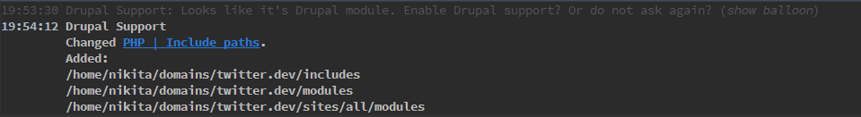

При нажатии на “enable” он откроет окошечко, где можно указать корень друпала
для текущего проекта, а также его версию API. На данный момент поддерживаются 6
и 7 версия друпала, надеюсь к релизу 8 они подведут и его поддержку.

Также можно добавить поддержку ручками, мало ли он не задетектит. Для этого жмем
File -> Settings и в поиске вбиваем Drupal.

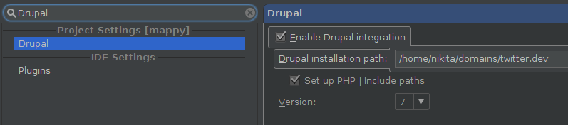

## Что же это дает

Самое интересное, что это дает нам как разработчикам. Во-первых, увеличивается
скорость разработки, если вы частенько гуляете по Drupal API. Улучшение
производительности будет заметно у новичков. Например я в своё время, когда
только начинал использовать Drupal API знал что мне нужна за функция, но путал
слова местами: create_file_url и create_url_file. Также иногда забываются
параметры, которые нужно передать, или их тип, а ведь функция то в голове, и для
этого приходится открыавть drupal.org и смотреть. В общем не совсем удобное
занятие.

## Подсказки... везде и всюду

Теперь когда пишем функцию, она в подсказке, что и логично. Также все параметры
и их типы данных.

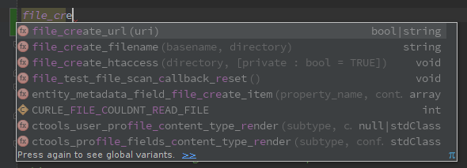

Слева от хуков появился значок, нажав на который мы увидем где объявлен хук и
его оригинальное название.

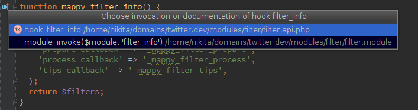

Также мы можем перейти на сам хук, где будет пример его использования. Например,
я нажал на свою функцию mappy_page_build().

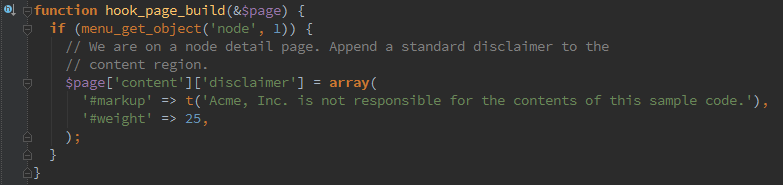

Тут можно заметить такую же метку как и у функции которая использует данный хук.
Нажав на неё мы получаем список функций, а также расположение файлов, где он
используется.

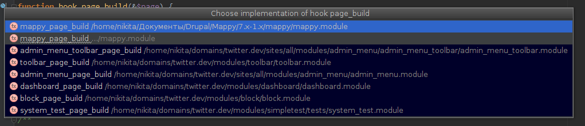

Нажав на функцию в коде через ctrl+click, мы также попадаем на его исходник.
Например, если ткнуть на drupal_add_js(), то получим следующее.

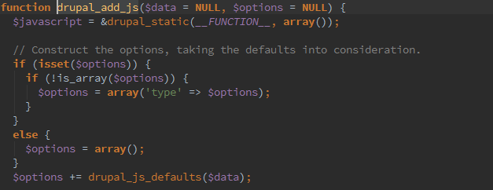

Очень удобно, если например хочется понять как отрабатывает функция и вообще,
оптимальна ли она для данной ситуации.

Также можно выделить название функции, а затем нажать правой кнопкой мышки, и мы
увидим крутой пункт “Search in Drupal API”.

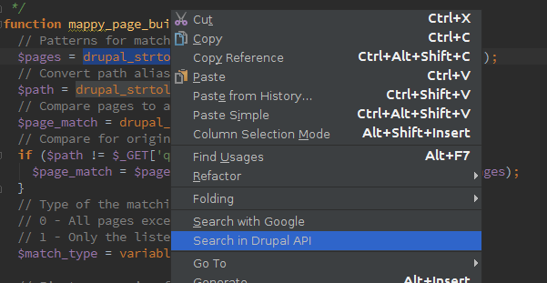

При этом он кидает не на поиск функции, как можно подумать, а на страницу данной
функции. Удобнота!

Также можно выделить функцию и нажать Ctrl+Q. Это выведет небольшое pop-up
окошко со всей необходимой информацией о функции: описание, параметры, зачем
они, что в них передается, похожие хуки/функции, где описана функция.

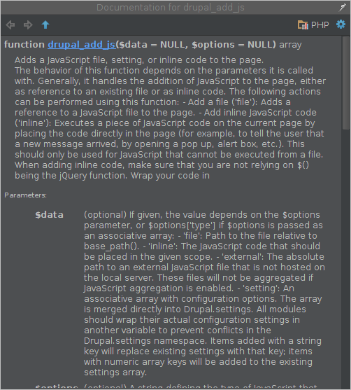

## Создание новых проектов

Теперь при создании нового проекта, можно выбрать Drupal модуль.

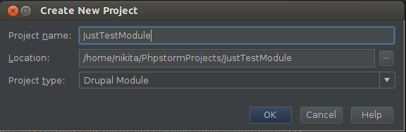

Он также попросит указать папку ядра друпала, а также версию.

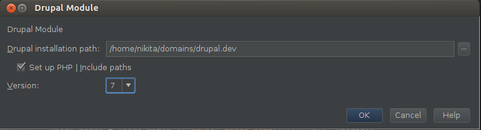

В итоге мы получаем заготовку в виде .module и .info файла с базовыми
параметрами.

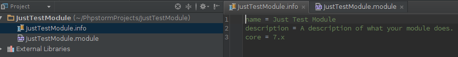

## Интеграция с Drush

Drush настолько популярная утилита для Drupal, что её невозможно обойти
стороной, и в phpStorm 7.0 он получит интеграцию с IDE.

Его нужно включать отдельно, но не проблема. Для включения Drush в phpStorm
открываем настройки IDE, там сразе вверху будет раздел “Command Line Tool
Support”. Жмем на неё, а затем справа на зеленый плюсик. В открывшемся окне
выбираем драш и устанавливаем конфиг либо для проекта, либо глобально.

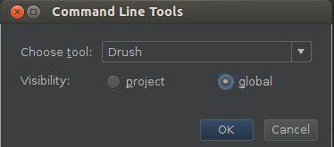

Затем указываем путь до установки Drush (должно быть заполнено значением
по-умолчанию). Примерно так:

- Windows: C:\\ProgramData\Drush\drush.bat
- Linux/Mac: /usr/bin/drush

После чего он импортирует команды. Для использования драша жмем CTRL+SHIFT+X и в
консоли пишем его команды, а он будет автоматически дополнять их.

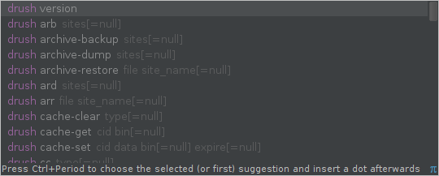

## Проверка на стандарты кодирования

Для этого нам понадобится Coder + PHP Code Sniffer. Как их связать
я [описывал ранее][ubuntu-drupal-cs]. Это необходимо выполнить для дальнейшей
настройки, если уже выполнено, идем дальше.

Открываем настройки IDE, в разделе PHP переходим в подраздел Code Sniffer и
указываем путь до phpcs.

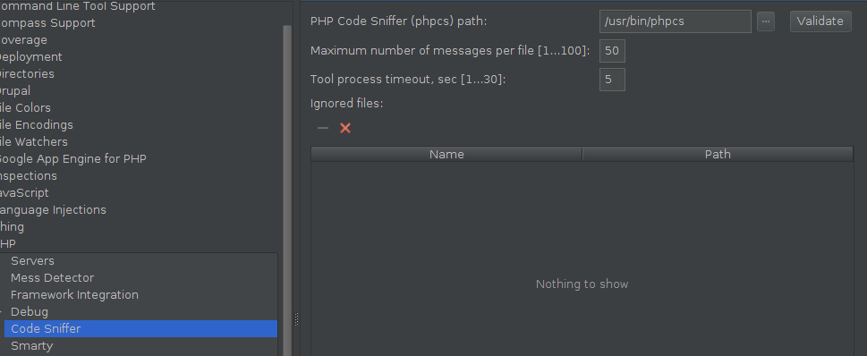

Далее в настройках переходим в раздел Inspections, включаем PHP Code Sniffer
validation, а затем выбираем Drupal.

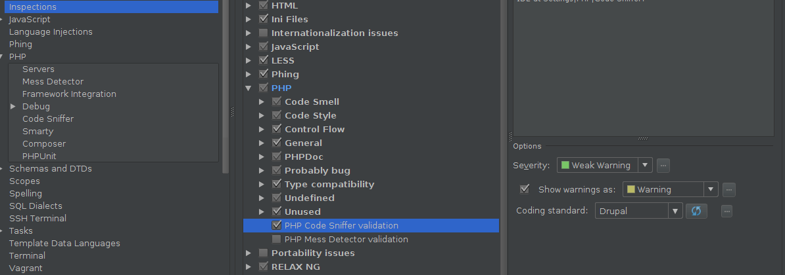

На этом все, заходим в файл, и если там что-то не соответствует
Drupal-стандартам, вы увидите сразу. Например, я поставил лишний пробел для
комментария.

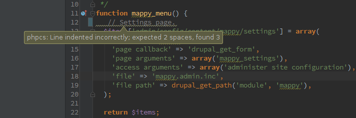

Если вы активно участвуете в разработках, то можно подключиться к Issue Tracker.

Для подключения к Issue Tracker заходим в настройки IDE -> Tasks -> Servers и
добавляем Generic сервер. Устанавливаем следующие настройки:

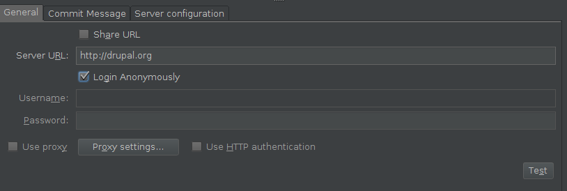

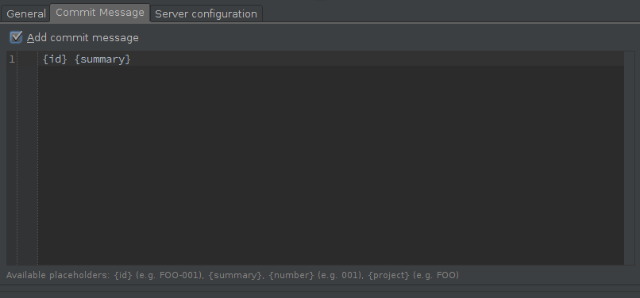

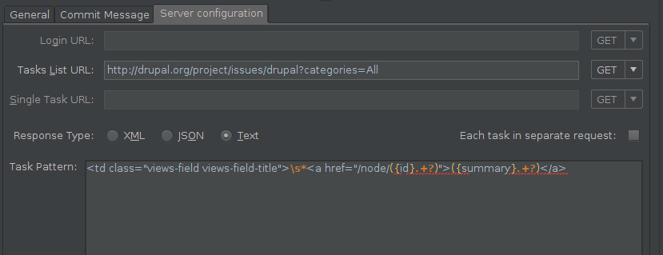

```php {"header":"Интеграция с Drupal.org Issues"}
Task List:  http://drupal.org/project/issues/drupal?categories=All   
Pattern:     <td class="views-field views-field-title">\s*<a href="/node/({id}.+?)">({summary}.+?)</a>
```

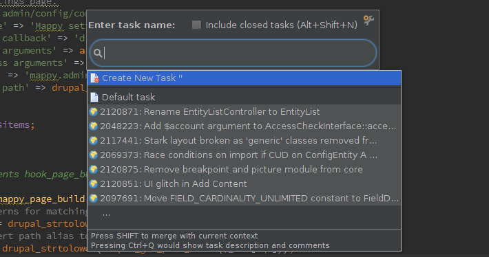

На этом все, но и этого достаточно за глаза. JetBrains сделали все очень круто,
а Drupal получил офигенную IDE для разработки.

Вообще это очень круто они обратили внимание на Drupal, раньше такой поддержкой
обладали лишь чистые фреймворки.

[ubuntu-drupal-cs]: ../../../../2013/03/09/drupal-7-code-style-check-ubuntu/index.ru.md
