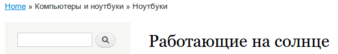
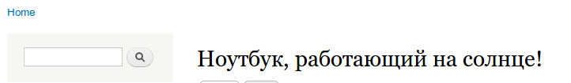
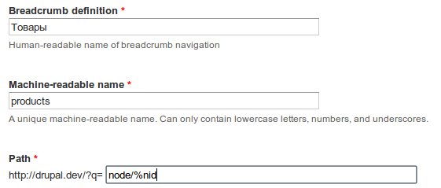
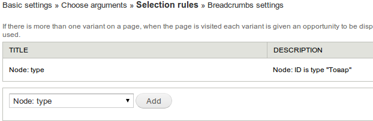
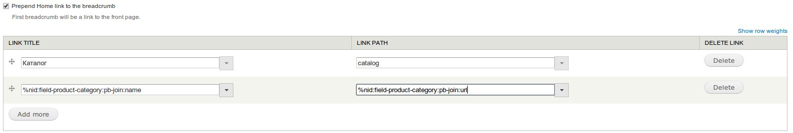
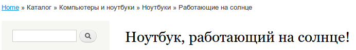

Как-то я написал гайд как
сделать [каталог товаров на Views + Panels + Taxonomy][drupal-7-creating-catalog-with-taxonomy-views-and-panels].
Эта статья сейчас является самой обсуждаемой и читаемой в блоге. И я заметил что
многие испытывают проблемы именно с настройкой URL’ов для категорий и товаров.
Поэтому данная статья посвящена именно настройка грамотных URL с иерархией, ну и
попутно я расскажу как сделать для них же хлебные крошки, ведь
они играют немаловажную роль на странице.

Для начала запасаемся модулями и их зависимостями:

- [Path Breadcrumbs](https://drupal.org/project/path_breadcrumbs) - позволит
  строить нам хлебные крошки как угодное и где
  угодно. - [Chaos Tools](http://drupal.org/project/ctools)
- [Entity API](http://drupal.org/project/entity)
- [Pathauto](https://drupal.org/project/pathauto) - многим уже известен, ведь
  позволяет генерировать URL’ы. - [Token](https://drupal.org/project/token)

Для пользователей Drush все намного проще:

```bash
drush dl entity path_breadcrumbs token pathauto && drush en path_breadcrumbs_ui pathauto -y
```

## Подготовка

Для начала я опишу свою рабочее окружение, где будут проводиться демонстрации. Я
не собираюсь воссоздавать каталог, ведь разницы вообще никакой, уверяю вас, если
поймете суть, то все получится даже с Drupal Commere, не говоря уже о каталоге
на обычных нодах.

Итак, имеется:

- Словарь таксономии (taxonomy vocabulary): Категории каталога.
- Тип содержимого (node): Товар. - Заголовок (стандартное)
- Содержимое (стандартное)
- Категория (term reference на словарь “Категории каталога”).

Все просто как пить дать! Осталось добавить парочку бутафорских товаров и в
путь.

## Создание иерархических путей

Для создания путей для товара мы должны зайти в настройки модуля Pathauto,
которые находятся по пути: Конфиграция -> Синонимы и переходим во вкладку
Шаблоны.

Суть такая, мы делаем адреса для категорий, а затем делаем финт ушами и товару
делаем урл: URL-категории + название товара.

Задаем следующие паттерны:

- Категория каталога (термин): `catalog/[term:parents:join-path]/[term:name]`
- Содержимое
  Товар: `catalog/[node:field-product-category:parents:join-path]/[node:field-product-category:name]/[node:title]`

Получается например так:

- catalog/computer
- catalog/computers/computer-1
- catalog/computers/asus/asus-123

Но у такого метода есть ограничения. Например мы размещаем товар в категории со
следующей иерархией: Компьютеры и ноутбуки -> Компьютеры -> Собранные -> Асус

Ожидаемый URL:

- catalog/computery-i-noutbuki/computery/sobrannye/asus/nazvanie

Реальный URL:

- catalog/computery-i-noutbuki/computery/sobrannye/nazvanie

Как вы уже догадались, вложенность не такая уж и бесконечная. Если отбросить
приставку каталога, которой скорее всего будет являться вьюха со всем товаром,
то вложенность категорий может достигать 4, при этом урл будет генерироваться
нормально. С вьюхой уже получается 3.

С другой стороны, куда такие вложенности и длинные url’ы? Тут попахивает
неправильной организацией каталога, да и url имеют ограничение в 255 символов.

## Создание хлебных крошек с иерархией

Если вы реализовывали категории на таксономии, то хлебные крошки строятся вполне
сносно.

Например, у меня есть категории следующей вложенности: Компьютеры и ноутбуки »
Ноутбуки » Работающие на солнце. Они имеют следующий вид:



Отлично, не так ли? Но если мы заходим в товар, который находится в данной
категории, что мы видим:



Правильно, мы видим разочарование, но решение очень простое. Заходим в:
Структура » Path Breadcrumbs и создаем новое правило для хлебных крошек.

Задаем следующие параметры:



Не обращайте внимание на ?q= - у меня просто выключены чисты ссылки. Мы просто
жмем “Далее”.

На второй странице указываем что `%nid` - это Node: ID (Материал: ID), и жмем
далее.

На странице выборки указываем фильтр по типу содержимого, где указываем тип
содержимого который отвечает за товар. Ведь нам не нужно чтобы те же самые
крошки генерировались, допустим, для новостей.



Вот мы и на странице настроек хлебных крошек. Тут все просто.

- Заголовок ссылки: `%nid:field-product-category:pb-join:name`
- Адрес ссылки: `%nid:field-product-category:pb-join:url`

Также можно добавить путь корня каталога, допустим если это вьюха. Я например,
сделал так:



В итоге теперь товары имеют следующие хлебные крошки:



Кстати, то же самое можно проделать и для терминов словаря “Категории каталога”,
чтобы добавить туда ссылку на “Каталог”. Все действия те же самые, только
вместо `node/%node`, указывайте `taxonomy/term/%tid`, где tid - ID Термина.

Вот и все. Если у кого есть опыт с адресами огромной вложенности, поделитесь
своим опытом.

[drupal-7-creating-catalog-with-taxonomy-views-and-panels]: ../../../../2013/03/24/drupal-7-creating-catalog-with-taxonomy-views-and-panels/article.ru.md
