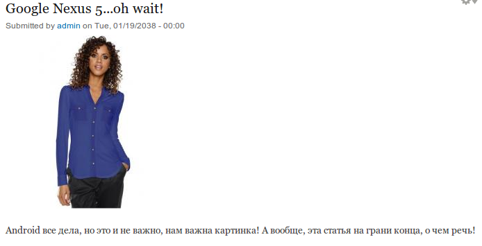

Итак, давно хотел, но сейчас решился. Часто замечаю у многих на сайте что ресайз
картинок ну вообще никуда не годиться. Особенно такая ошибка заметна на
магазинах, и им она как-раз таки не простительна. Речь пойдет о ресайзе
картинок.

Итак, допустим мы добавили к ноде товара поле изображения, загрузили его и
получили такой вид:

Вроде ничего, нормально, но ведь картинки бывают разные, широкие, высокие и
просто большие, поэтому мы применяем на них “Стили изображений”. Допустим мы
хотим чтобы наши картинки имели жесткий размер 250х250. Это понадобиться для
оформления, чтобы ничего не прыгало и не скакало. Мы создаем подобный стиль с
приминением на него “Масштабировать и обрезать”, ведь тогда не получится
соотношения 1:1.

Мы его создаем и применяем, получаем следующее:

Вроде бы ничего, покатит, но уже заметно как отрубило верх и низ у телефона. А
если это будет юбка… или нет, плитка, обычная керамическая плитка. Они тоненькие
и длинненькие, и если так обрезать то получается каша, а не плитка. В итоге
разглядеть невозможно и понять что там изображено, поэтому для примера я просто
заменю телефон фоткой человека.

Что и слеодовало доказать, низ и верх срубает, а если картинка длинная, то
срубает бока. А теперь время чинить это чудо. Для этого нам понадобиться модуль
под
названием - [ImageCache Actions](https://drupal.org/project/imagecache_actions).
Данный модуль добавляет туеву хучу настроек для работы с изображениями, одна из
которых поможет решить нашу проблему.

Поэтому качаем его с офф сайта или драшем: `drush dl imagecache_actions‎`

И включаем необходимые нам модули:

- Imagecache Actions - основной модуль;
- Imagecache Canvas Actions - работа с холстом. Позволяет нам делать холсты -
  это и есть решение;

Далее переходим в наш стиль 250х250 и видим что появились новые обработчики. Для
начала мы создам два новых стиля, да-да, тут финт ушами, но что поделать.

Создаем первый, и называем его, например, 250x250 (horizontal). И делаем ему
эффект “Scale (Масштабирование)” и задаем ширину 250 (ведь у нас должна быть
250х250), а поле высоты оставляем пустым.

Создаем второй такойже, а называем 250x250 (vertical). Догадались какие ему
сделать настройки? Все также, масштабируем, только в этот раз уже по высоте,
также указываем 250.

А теперь вернемся к оригинальному стилю 250х250, удаляем все обработки что
сейчас там есть и для начала добавляем “Aspect switcher (Выбор перспективы)”. Ну
и соответственно задаем параметры, где горизонтальное - 250х250 (horizontal), а
где вертикальное то - 250х250 (vertical), оставляем единицу, а затем жмем
“Добавить эффект”.

Теперь добавим еще один - “Define canvas (объявить холст)”. Задаем ему фоновый
цвет, в нашем случае это белый, чтобы картинка казалась цельной, в разделе
“Exact size” пишем нашу ширину и высоту и жмем “Добавить эффект”.

Самое время зайти и проверить во что превратилась наша девушка:

Для наглядности, вот имейдж с дев тулом:

Вот и все. Просто, быстро и главное результат уже годиться для оформления
магазинов и каталогов, чтобы все было ровно и на обрезано где не попадя. Таким
нехитрым способом можно ресайзить какие угодно, хоть 100х300, просто
соответствующие в нужных местах цифры, и все будет также на своих местах без
обрубков.
