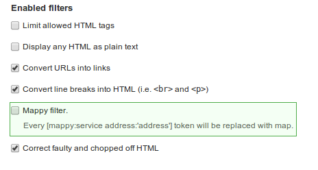

Кто пользуется модулем Mappy, возможно заметили, что на неделе вышло обновление
в виде релиза новой версии 7.x-1.3. Сейчас я поведаю, что же я там натворил за
такой промежуток времени.

Итак, что же принес данный релиз. Вот короткий список изменений:

- Добавлена кластеризация для Google.Maps. Вызывается она атрибутом
  clusters=”true”.
- Теперь можно использовать (теоретически) неограниченно количество карт на
  одной странице. Например можно влепить 3 гуглокарты, если такое потребуется.
  Допустим у вас карта в футере и на странице контактов, раньше бы они
  конфликтовали, сейчас отработают обе карты, каждая со своими параметрами.
  Также, у Яндекс.Карт есть прокладка маршрута, она также работает с несколькими
  картами.
- Добавлен новый метод вставки карт на сайт через фильтры (токен). Об этом я
  напишу ниже в статье.
- Zoom, with и height получили значения по умолчанию, теперь вставка карты стала
  проще как никогда, достаточно указать один адрес и готово!
- Собственно чтобы многие из этих возможностей достичь, я переписал все JS
  файлы, поэтому теперь код стал лучше и гибче.
- Google JS API теперь не грузится на каждой странице, он грузится при
  обнаружении гуглокарт.
- Добавлена административная панель: - Возможность выбора где будет загружаться
  основной Mappy.js файл. Реализовано по типу вывода блоков.
- Возможность указывать для Google и Яндекс карт значения по-умолчанию для
  ширины и высоты. В случае если карта вставляется без данных параметров, только
  по адресу, будут использоваться ширина и высота из настроек.
- Атрибуты больше не чувствительны к регистру. Решает проблему, когда пишем
  zoomControl, потом его браузер/фильтр сводит к нижнему регистру и JS файл его
  не видит.

Новый метод вставки - фильтры
-----------------------------

Данный метод вставки выполняется при добавлении материала, или откуда угодно,
где есть текстовое поле с фильтром.

Для вставки карты используется токен вида: `[mappy:service address:'']` - его
аналог на html - `<mappy:service address=””></mappy:service>`.

Добавление атрибутов делается также как и в теге, единственно отличие токена от
тега, это нет необходимости закрывать его, начинается и закрывается [], вместо
равно указывается двоеточие, а вместо двойных кавычек - одинарные.

```html {"header":"html"}

<google address="г. Пермь" height="300" width="600" zoom="17"></google>
```

```html {"header":"token"}
[mappy:google address:'г. Пермь' zoom:17 width:600 height:300]
```

Как вы могли заметить, одинарные кавычки не обязательны, используйте их при
указании длинных значений, которые содержат символы пробела и пунктуации. Это
позволит предотвратить ошибки парсинга. Для большей стабильности можно
оборачивать все значения в одинарные кавычки, результат будет тот же.

Ну и разумеется чтобы вместо него появилась карта, в нужном фильтре надо
включить опцию Mappy:



**Важное замечание.** Если вы используете фильтр “Ограничить допустимые HTML
теги”, то в список разрешенных также необходимо добавить <yandex> и <google>,
или только тот, карты которого будут вставляться.

На этом все. В текущем состоянии модуль справляется с поставленными задачами
очень хорошо. Новый функционал пока что не предвидится, я его просто не могу
придумать. Возможно следующим шагом будет добавление сервиса для других карт, на
примете OpenStreet. Мне они очень нравятся и очень информативны.
