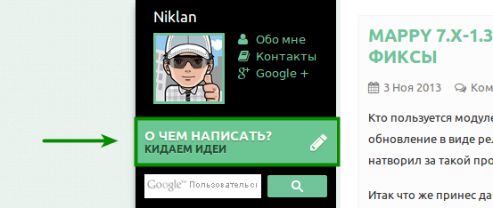
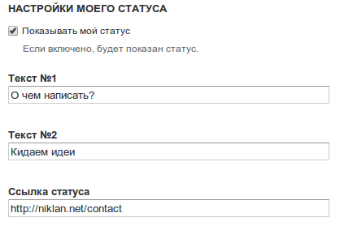
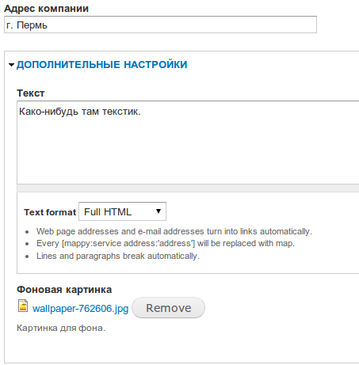

Надеюсь, многие из моих читателей испытали уже на своей шкуре верстку под Drupal
и эта статья будет хоть кому-то полезна. Но она не об обучении верстке, а об
использовании возможностей кастомизации тем.

Наверное случались ситуации, да чего уж там, сейчас, наверное, каждый второй
проект сталкивается с тем, что банально, клиент спрашивает: “А как поменять мне
ссылку на группу в ВК?” или “Как поменять телефон/адрес”. Эти вопросы зачастую
возникают когда тема сайта достаточно проработана и для телефона/адреса или соц.
кнопок есть собственное оформление которое не редактируется иначе как правкой
темы. Что же делать в таком случае? Создавать собственные настройки для темы!

Банальный пример собственных настроек темы на моём блоге.



Изначально они были намертво вбиты в тему, но когда я решил их изменить, я
столкнулся с тем, что мне надо лезть на ftp, править тему. А что если у меня
page--\*.tpl.php больше 2 (page.tpl.php и page--front-tpl.php)? Получается
полнейший садизм и трата времени напрасно, поэтому я просто сделал себе
соответствующие настройки в тему.



## Подготовка

Для реализации нам нужна тема, в которую мы будем добавлять собственные
настройки, руки и поверхностное
знание [Form API](https://api.drupal.org/api/drupal/developer%21topics%21forms_api_reference.html/7),
ну или хотя бы умение быстро разбираться не в сложных вещах :)

## А теперь к делу

Вся основная работа производится в файле theme-settings.php. Если он у вас
отсутствует, то создайте и добавьте туда хук формы:

```php
function THEMENAME_form_system_theme_settings_alter(&$form, &$form_state, $form_id = NULL)  {
  // Work-around for a core bug affecting admin themes. See issue #943212.
  if (isset($form_id)) {
    return;
  }
  // Тут будет наш код.
}
```

И всё! Теперь осталось всего-лишь добавить наши необходимые поля. Для начала
давайте добавим поле для адреса.

Для этого, используя Form API мы добавляем текстовое поле (textfield). Оно
вполне подходит для ввода строкового адреса.

```php
$form['company_address'] = array(
  '#type' => 'textfield',
  '#title' => 'Адрес компании',
  '#default_value' => theme_get_setting('company_address'),
  '#size' => 60,
  '#maxlength' => 128,
  '#required' => FALSE,
);
```

Получать значения из этого поля мы можем в наших шаблонах где угодно, просто
воспользовавшись функцией theme_get_setting(). В качестве параметра ей
передается название нашего поля, а также при необходимости можно указать тему из
которой брать значение, ведь по-умолчанию оно берется из используемой.

Например, чтобы получить значение поля с адресом компании, нам необходимо
воспользоваться функцией вот
так: `print theme_get_settings(‘company_address’);`.

Как показал опыт, лучше всего эти вызовы оборачивать в условие

```php
if (theme_get_setting(‘company_address’)) {
	print theme_get_setting(‘company_address’);
}
```

Это позволит избежать множества ошибок, которые, как правило, всплывают если
принтить значение а его попросту нету или при переносе сайта. Банально на
локалке всё в тихаря пашет, а на drupalhosting без такой обертки выбьет белый
экран смерти.

По сути это и есть весь процесс. Это дает возможность оперировать данными на
сайте из настроек темы, что в свою очередь ускоряет процесс замены на крупных
сайтах, а если делается клиенту, то он не будет дергать вас по пустякам.

## Парочка примеров напоследок

Добавление раздела для наших полей, чтобы их делить на логически связанные
настройки для юзера.

```php
$form['other'] = array(
  '#type' => 'fieldset',
  '#title' => 'Дополнительные настройки',
  '#weight' => 5,
  '#collapsible' => TRUE,
  '#collapsed' => FALSE,
);
```

Добавление текстовой области с форматированием в этот самый раздел, а также если
подключены редакторы, то например и подтянется CKEditor.

```php
$form['other']['text_with_format'] = array(
  '#type' => 'text_format',
  '#title' => 'Текст',
  '#default_value' => theme_get_setting('text_with_format')['value'],
  '#format' =>  theme_get_setting('text_with_format')['format'],
  '#weight' => 0,
);
```

И самое интересное - добавление файла. Немного теории. После загрузки файла
через друпал форму, файл загружается, но на время (~6 часов), т.е. на нем весит
статус “Временный” и если не присвоить другой, он попросту спустя 6 часов по
первому же крону удалится.

Решение в общем-то очевидное, нужно файлу дать статус постоянного и прогнать
через file_save(). Но вот незадача, в теме нельзя (!) хукнуть субмит формы. И
тут либо надо писать кастомный модуль, что в общем то дико, для того чтобы
добавить поле в настройки, либо поставить какой-никакой, зато надежный костыль.
Итак приступим.

```php
$form['other']['background_image'] = array(
  '#title' => "Фоновая картинка",
  '#type' => 'managed_file',
  '#required' => FALSE,
  '#description' => "Картинка для фона.",
  '#default_value' => theme_get_setting('background_image'),
  '#upload_location' => 'public://',
  '#upload_validators' => array(
    'file_validate_extensions' => array('gif png jpg jpeg'),
  ),
);
```

Этим кодом мы добавили поле для аплоада картинки, которая будет загружаться в
публичное файлохранилище. Все будет работать! Но как я и писал, спустя 6 часов
первый же крон удалит вашу картинку. Для этого мы ставим вот такой вот костыль:

```php
// Сохраняем картинку, если ей присвоен статус "временно".
$image_custom_index = theme_get_setting('background_image');
if ($image_custom_index) {
  // Берем файл ID.
  $fid = theme_get_setting('background_image');
  // Грузим наш файлик.
  $file = file_load($fid);
  // Если статус действительно "Временно", то...
  if ($file->status == 0) {
    // Устанавливаем нормальный статус.
    $file->status = FILE_STATUS_PERMANENT;
    // Сохраняем наш файл.
    file_save($file);
  }
}
```

Вот такие пироги) О проблеме знают, существует множество issue, есть патчи,
которые даже работают, когда будет в ядре 7 неизвестно.

Вот что в итоге получили.



```php {"header":"Полный, завершенный код theme-settings.php с этими настройками."}
function THEMENAME_form_system_theme_settings_alter(&$form, &$form_state, $form_id = NULL)  {
  // Work-around for a core bug affecting admin themes. See issue #943212.
  if (isset($form_id)) {
    return;
  }

  // Данные из поля получаются через theme_get_setting('comapny_address').
  $form['company_address'] = array(
    '#type' =?> 'textfield',
    '#title' => 'Адрес компании',
    '#default_value' => theme_get_setting('company_address'),
    '#size' => 60,
    '#maxlength' => 128,
    '#required' => FALSE,
  );

  $form['other'] = array(
    '#type' => 'fieldset',
    '#title' => 'Дополнительные настройки',
    '#weight' => 5,
    '#collapsible' => TRUE,
    '#collapsed' => FALSE,
  );

  // Данные из поля получаются через theme_get_setting('text_with_format').
  $form['other']['text_with_format'] = array(
    '#type' => 'text_format',
    '#title' => 'Текст',
    '#default_value' => theme_get_setting('text_with_format')['value'],
    '#format' =>  theme_get_setting('text_with_format')['format'],
    '#weight' => 0,
  );

  // Данные из поля получаются через theme_get_setting('text_with_format')['value'].
  $form['other']['text_with_format'] = array(
    '#type' => 'text_format',
    '#title' => 'Текст',
    '#default_value' => theme_get_setting('text_with_format')['value'],
    '#format' =>  theme_get_setting('text_with_format')['format'],
    '#weight' => 0,
  );

  // Чтобы получить картинку, мы делаем следующее:
  // $image = theme_get_setting('background_image');
  // $image_url = file_create_url('background_image', file_load($image)->uri);
  // В $image_url будет привычная всем ссылка на картинку.
  $form['other']['background_image'] = array(
    '#title' => "Фоновая картинка",
    '#type' => 'managed_file',
    '#required' => FALSE,
    '#description' => "Картинка для фона.",
    '#default_value' => theme_get_setting('background_image'),
    '#upload_location' => 'public://',
    '#upload_validators' => array(
      'file_validate_extensions' => array('gif png jpg jpeg'),
    ),
  );

  // Сохраняем картинку, если ей присвоен статус "временно".
  $image_custom_index = theme_get_setting('background_image');
  if ($image_custom_index) {
    // Берем файл ID.
    $fid = theme_get_setting('background_image');
    // Грузим наш файлик.
    $file = file_load($fid);
    // Если статус действительно "Временно", то...
    if ($file->status == 0) {
      // Устанавливаем нормальный статус.
      $file->status = FILE_STATUS_PERMANENT;
      // Сохраняем наш файл.
      file_save($file);
    }
  }
}
```
