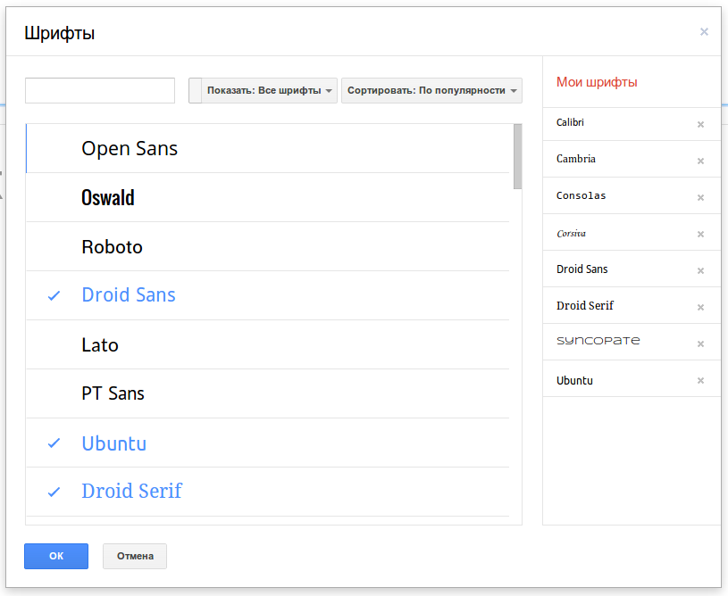
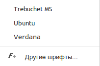

Последнее время я подсел на Google Docs (Диск Google), так как понял, что мне
удобно в нем делать презентации, работать с текстовыми документами и прочие
возможности. В частности даже статьи для блога, включая и эту, я пишу в гугл
докс. Очень удобно.

Но вот я решил делать презентацию и стандартные шрифты, которые предоставляет
гугл мне не подошли. Мне нужны были совсем другие. Как оказалось, свои шрифты
устанавливать нельзя, но можно подключать шрифты из библиотеки бесплатных
шрифтов от Google.

Добавляются они очень просто:

- Жмем на название шрифта;
- Внизу есть кнопка “Другие шрифты”, жмем на неё;
- И выбираем какие шрифты использовать.

Предвижу вопросы: “Где он, чёрт возьми, нашел эту кнопку “Другие шрифты”? У меня
её нету!” - не паникуем, всё под контролем. Для того чтобы эта кнопка появилась,
нужно изменить язык документа на английский. Делается это так: Файл → Язык →
English (United States). Теперь появится данная кнопка.

## Памятки

- Шрифт можно добавлять только когда установлен язык документа Английский. После
  переключения на Русский, будут старые шрифты.
- Из английского документа шрифты прекрасно работают и с русским текстом, но
  нужно помнить что не все шрифты поддерживают кириллицу. Чтобы заранее
  подобрать подходящие шрифты,
  посетите [Google Fonts](http://www.google.com/fonts) и слева в фильтре
  “Script” выберите кириллицу. Подберите подходящий и добавляйте!
