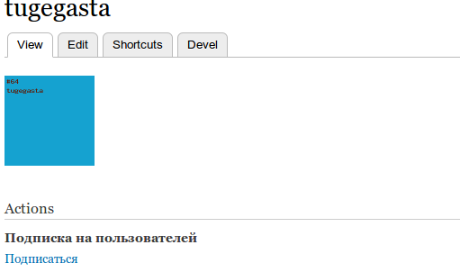
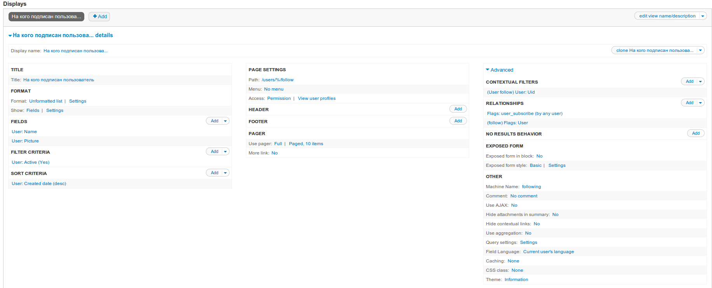
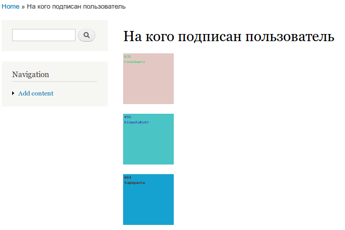
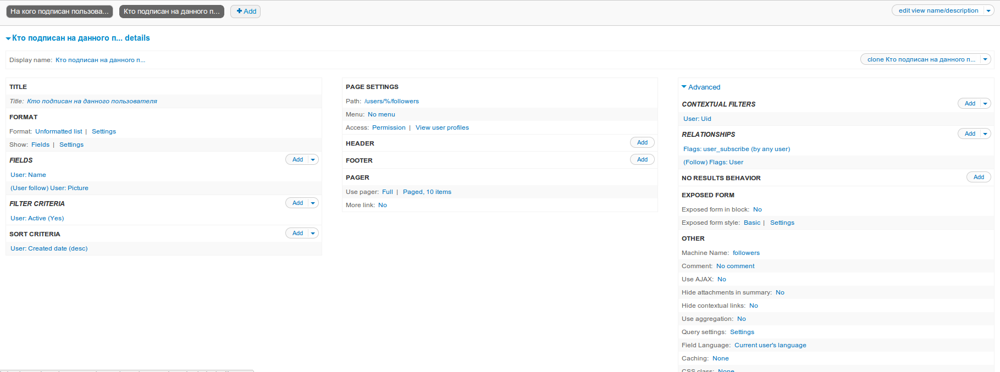
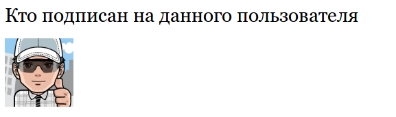
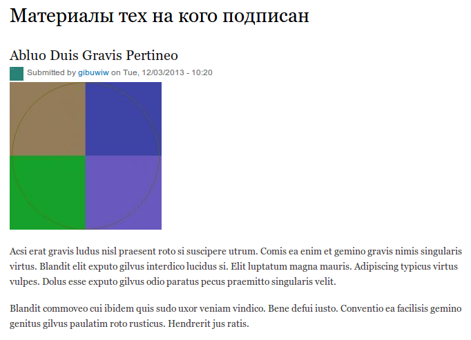
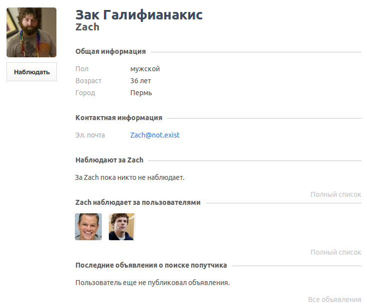

Flag — маленький, простой модуль, но он открывает новые горизонты для разработки
сайтов на Drupal, при этом позволяет реализовывать множество различного
функционала в связке с Views.

В этой статье я расскажу как с помощью данного модуля сделать подписки на
пользователей. Аналог этого всем известные follow/unfollow как в твиттере и
везде.

Для начала запасаемся модулем [Flag](https://drupal.org/project/flag), а также
модуль-помощник во всем — [Views](https://drupal.org/project/views).

Немного отойду в сторону и вернусь к рассказу о модуле Flag. Он предназначен,
чтобы ставить “флаги” при определенных действиях (зачастую клик), а затем
использовать помеченные “флагом” сущности. А теперь перейдем к делу.

## Создание “флага” подписаться/отписаться

Для начала нам просто нужно включить модуль Flag.

Затем переходим в настройки модуля флаг (admin/structure/flags) и создаем свой
новый флаг.

На этапе выбора, к чему будет привязан флаг, нам необходимо указать “Users”,
ведь наш флаг позволяет подписываться/отписываться на юзеров, соответственно и
привязка должна быть именно к пользователям.

Дальше заполняем настройки для нашего флага:

1. Название: Подписка на пользователей, машинное имя: user_subscribe;
2. Flag link text: “Подписаться” — это текст, который будет показан когда флаг
   не установлен.
3. Unflag link text: “Отписаться” — тоже что выше, ток наоборот :)
4. Roles that may use this flag: выбираем роли, которые смогут подписывать и
   отписываться. В гостях смысла нету, потому-что их в таком случае не
   отследить, а вот авторизованные и выше смело получают от нас по 2 галочки (
   подписываться и отписываться).
5. Users may flag themselves — эту галочку мы убираем, ведь нам не нужно чтобы
   люди могли следить сами за собой? Это же абсурд!
6. Этих настроек достаточно, поэтому сохраняем наш флаг.

Теперь если зайти на страницу пользователя, мы увидим поле для подписки на него:

Вы не поверите, но это всё! Да, так просто.

## Усложняем задачу

Окей, это конечно все хорошо, но толку от этого мало, поэтому начнем с того, что
создадим два представления: кто подписан и на кого подписан.

### На кого подписан пользователь

1. Создаем новое представление: Подписки пользователей, маш. user_subscribe;
2. Выбираем что показывать нужно Users;
3. Убираем галочку “create new page” и жмем: “Сохранить и редактировать”.

Сейчас мы сами создадим страницу со всем необходимым.

1. На странице настройки представления жмем “Добавить страницу”;
2. Указываем заголовок “На кого подписан пользователь”;
3. Выбираем что показывать будем, допустим поля, и добавим для вывода поле
   “Изображения профиля” (аватарка);
4. Указываем путь страницы: users/%/follow;
5. Добавляем отношение: Flags: User flag. В его настройках выбираем наш флаг, а
   также ставим галочку “Любой пользователь” и указываем ему название, например
   “Follow”. Не оставляйте стандартное название, вы потом вообще запутаетесь
   окончательно, будет 100500 полей с одним названием;
6. Добавляем второе отношение Flags: User, где выбираем связь с нашим предыдущим
   отношением. В качестве идентификатора укажите, например “User follow”;
7. Добавляем контекстуальный фильтр User: Uid, и в связи выбираем наш “User
   follow”;
8. В разделе “Когда значение не в URL” мы указываем “Предоставить значение
   по-умолчанию”, а в типе выбираем “ID пользователя из URL”;
9. Сохраняем наше представление.

Теперь если мы подпишемся админом на парочку пользователей, а затем зайдем по
адресу users/1/follow, то мы увидим на кого мы подписаны.

### Кто подписан на пользователя

А теперь давайте сделаем обратное представление.

1. Всё в том же представлении добавляем новую страницу;
2. Даём ей название “Кто подписан на данного пользователя”;
3. В контекстуальном фильтре убираем связь с “User follow”;
4. И к полю “Изображение” (или тому как выводим на странице пользователей)
   добавляем связь на “User follow”;

Теперь можно зайти на страничку пользователя, которую вы подписались и
посмотреть, работает или нет.

## Вывод содержимого тех на кого подписан

Еще в качестве примера создадим представление, которое выводит только то
содержимое, авторами которых являются те люди, на которых подписались вы.

В моём случае я с помощью devel generate создал туеву хучу материалов типа
“Article”. Поэтому, для начала, я создаю страницу (/follow_article) на которой
будут показаны все материалы типа Article. Это самое обычное представление по
выводу содержимого.

А теперь время его поднастроить под нас:

1. Для начала добавляем отношение Content: Author;
2. Создаем еще одно отношение: Flags: User flag, в нем указываем отношение на
   автора (то что выше), затем выбираем наш флаг и указываем “Любой
   пользователь”;
3. Добавляем третье отношение: Flags: User у которого отношение будет с
   предыдущим;
4. Затем создаем контекстуальный фильтр User: Uid где связью указываем название
   отношения из пункта 3 (у меня не измененный Flag user). Также в фильтре
   указываем что предоставлять значение по-умолчанию, а в качестве
   предоставляемого значения выбираем: “User ID from logged in user” (
   авторизовавшегося).

Сохраняем, заходим по адресу example.com/follow_article и видим только те
статьи, чьи авторы ваши подписчики.

## Заключение

Только на одном флаге “Подписка” можно добавить не хилую гибкость своему сайту.
Это только одно из применений флагов, в дальнейшем, скорее всего, я расскажу
другие варианты применения.

Данный метод (1 в 1), только оттемезированный я уже использую на одном сайте,
так что вы можете посмотреть в живую как я это релизовал на
сайте [FollowPath](http://followpath.ru/user/Jesse).

Вот пример из под юзера, чтобы не регаться:

