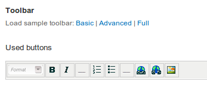
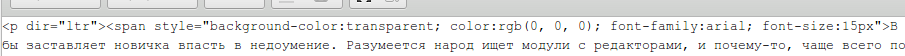
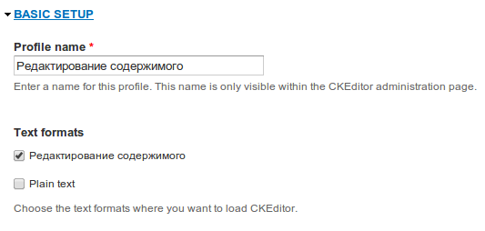
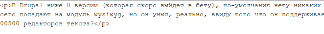

В Drupal ниже 8 версии (которая скоро выйдет в бету), по-умолчанию нету никаких
WYSIWYG редакторов, что как бы заставляет новичка впасть в недоумение.
Разумеется, народ ищет модули с редакторами, и почему-то, чаще всего попадают на
модуль wysiwyg, но он уныл, реально, ввиду того что он поддерживает 100500
редакторов, он работает черт пойми как. Сколько я его пробовал, никак не могу с
ним ничего толкового сделать. Да и куда вам 100500 редакторов текста?

В итоге я для себя уже давненько решил, что для задачи нужен один конкретный
редактор который бы покрывал все мои необходимости. После долгих переборок я
остановился на CKEditor. Он самый приятный на вид, хорошо кастомизируемый, а
теперь еще в ядре Drupal 8.

## Установка CKEditor

1. Заходим на сайт [CKEditor](http://ckeditor.com/download) выбираем “Full
   version” и качаем архив.
2. На ftp сайта заходим в /sites/all/libraries (если последней нету, просто
   создайте) и скидываем туда нашу папку ckeditor из архива.
3. Скачиваем, устанавливаем и
   включаем [модуль CKEditor](https://drupal.org/project/ckeditor).

## Настраиваем CKEditor для Filtered HTML

1. В админке заходим: admin/config/content/ckeditor и жмем “Edit” у Advanced.
2. В “Basic setup” должен быть выбран “Filtered HTML” или иной, который
   используется у вас для ввода с ограничением по тегам.
3. Переходим в “Editor Appearance” и в разделе toolbar жмем “basic”. Это
   поставит нам базовый набор элементов.

4. Сохраняем.

Для фула я не буду писать, по сути тоже самое, только очевидные изменения будут
в пункте №3.

Там куча, уйма настроек: цвет редактора, оформление (замена css) и многое-многое
другое. Я же остановлюсь на очень любопытной опции про HTML.

## Настройка CKEditor для контент-менеджера

Контент — неотъемлемая составляющая сайта. Им можно сделать из сайта конфетку,
даже если сам сайт не очень, и наоборот, если сайт конфетка, сделан профи, то
его легко можно превратить в говно одним лишь контентом, что обычно и делают
владельцы сайтов или нанятые ими контент-менеджеры.

Контент-менеджер — головная боль для разработчиков, и “вирус” для сайта.

В общем ад начинается когда неопытные контент-менеджеры начинают копировать
текст из документа и в тупую вставлять в редактор, а затем сейв, они то думают
так: “Вроде как и в ворде”.

А то что там идет целый букет таких вот вещей:

Инлайн стили, классы, обертки, шрифты намертво прописаны. А гнать то будут на
разработчиков, как обычно… Типа что у нас шрифты во всех статьях разные, а что
эти шрифты у меня работают, а у друга нет (когда в ворде заюзали нестандартный
для систем шрифт) и т.д., я думаю многие это ощутили на себе.

И объяснить им что это ваш тупой контент-менеджер, который нихера не умеет и не
может, наполняющий для галочки, чтобы срубить бабло, бесполезно. Ведь порой это
их знакомые или родственники, а они всегда профи, а как иначе.

В общем я считаю что нормальный контент-менеджер должен эту грязь вычищать
самолично и руками, отлично знать HTML и тогда всё будет в порядке, но такие —
настоящая находка, поэтому я сейчас расскажу как рубил руки идиотам.

Для подобных неучей я создаю отдельный формат ввода, поэтому давайте и мы его
создадим:

1. Переходим на страницу создания нового формата:
   admin/config/content/formats/add
2. Называем, например: Редактирование содержимого (content_editing)
3. Даём права кому нужно. У меня, как правило, контент-менеджер это целая роль с
   запретами на всё что их руки зачешутся сломать.
4. По сути они часто юзают вставку картинок и прочего, поэтому рубить им html
   нельзя. Единственные фильтры что я включаю: 1. Convert line breaks into
   HTML (i.e. ` ` and `
`)
2. Convert URLs into links
3. Correct faulty and chopped off HTML

Всё, дальше бремя мы скинем на CKEditor.

1. Заходим в настройки CKEditor: admin/config/content/ckeditor
2. Создаем новый профиль.
3. В “Basic setup” даём ему соответствующее название и выбираем созданный нами
   формат ввода.

4. Переходим во вкладку “Editor Appereacne” и загружаем “Basic” (им опасно
   давать что-то больше этого).
5. В разделе “Cleanup and output” надо подправить “Font formats” — это те теги,
   что они смогут выбирать в качестве стиля, я делаю так: p;h2;h3;h4;h5;h6 —
   т.е. убираем div, address, pre и h1. Иначе они и ими нагадят. Я считаю что
   больше для текста ничего им давать не нужно. Основные заголовки и параграф —
   всё.

В результате копипаста взамен того что было уже получаем чистенький код.

Я и сам пользуюсь таким редактором, ведь это удобно. Просто для себя я еще
выношу кнопочку “Источник” чтобы я мог напрямую править html, по необходимости.

### Для особо одаренных

Бывают такие что и в таком варианте умудряются запоганить, поэтому в настройках
CKEditor в разделе “Advanced options” включим “Force pasting as plain text” —
т.е. что бы вы не вставляли в данный редактор, он его перегонит в обычный текст.
Весь CSS, теги, вообще всё вырубается на корню. Пусть контент-менеджер
поработает и поправит руками, зато код будет чистый. А там править то смехота.
