[Indexisto](http://indexisto.com/) — это поисковый сервис по типу Google CSE и
Yandex поиск для сайта, с одним лишь отличием, вы можете сами регулировать
индекс. Т.е. данный сервис идексирует ваш сайт в трёх вариациях:

1. Обычный поисковый паук, которые заглядывает на сайт и парсит всевозможную
   инфу, как это делают Yandex и Google. Если его самому не создать то никто
   заходить и парсить не будет.
2. Управление индексом собственноручно средствами Indexisto API. Т.е. мы сами
   отсылаем данные в индекс, а также сами же их оттуда и удаляем.
3. Работа с базой. Там задается разметка и то ли они парсят, то ли мы им сливаем
   данные, не суть важно, просто работа с базой ;) Просто она нас не интересует.

Мы остановимся на втором пункте, именно для него был создан соответствующий
модуль, о котором мы и поговорим.

Модуль Indexisto — это “мост” между друпалом и Indexisto API. Он сам отсылает
нужные нам данные и удаляет их при необходимости. По-сути, всё просто, но есть
трудности с настройкой на стороне Indexisto.

## Первоначальная настройка

Изначально мы устанавливаем
модуль [Indexisto](https://drupal.org/project/indexisto_search)
и [Token](https://drupal.org/project/token) на наш друпал-сайт, а затем
активируем их.

Заходим в настройки модуля и видим перед собой первоначальную форму.

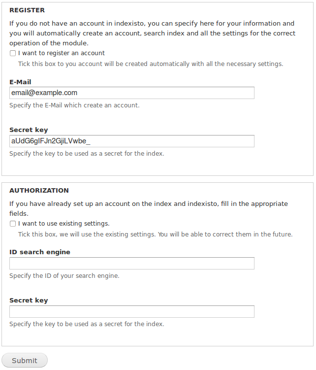

Как вы можете заметить тут два раздела: Регистрация и авторизация на indexisto.

### Регистрация

Если у вас нету аккаунта в сервисе indexisto, то настоятельно рекомендуется
воспользоваться данным методом. В нем достаточно указать ваш email, на который
зарегистрируется аккаунт, а также секретный ключ для API. Ключ чем надежнее, тем
лучше, он будет использоваться для передачи данных, чтобы никто не смог влезть в
ваш индекс. Это поле по-умолчанию уже содержит данные — они случайно
сгенерированы, вы можете обновить страницу чтобы получить новый ключ.

После того как вы заполните почту и ключ, а также поставите галчку что хотите
зарегистрироваться, для вас будет создан аккаунт, индекс, а также все базовые
настройки для его работы, и посещать сайт indexisto даже не понадобиться.  
Затем у вас откроются все настройки модуля, как ими пользоваться написано после
авторизации.

### Авторизация

Вариант для тех, кто уже имеет аккаунт на Indexisto. В таком случае необходимо
проделать операции, чтобы поиск заработал.

Самый простой, если вы ранее уже производили настройку для API, то указать
секрет и id поискового индекса, а если не делали, то следуйте инструкциям чтобы
получить два этих параметра.

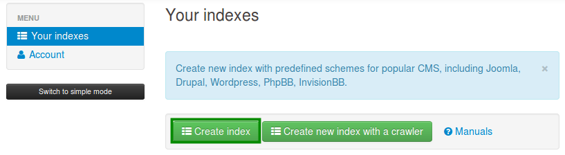

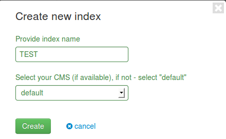

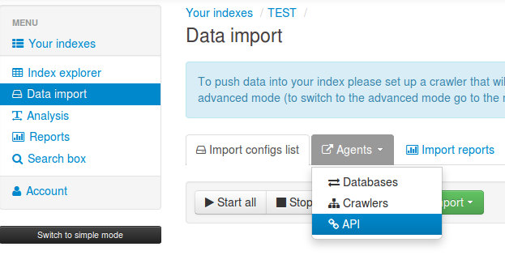

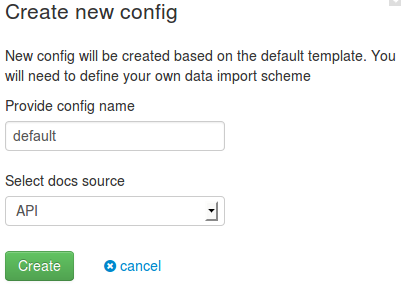

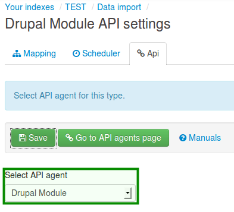

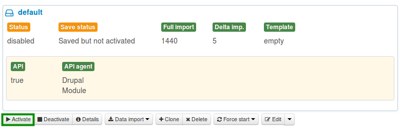

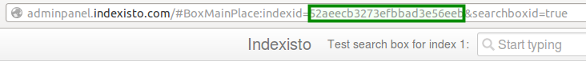

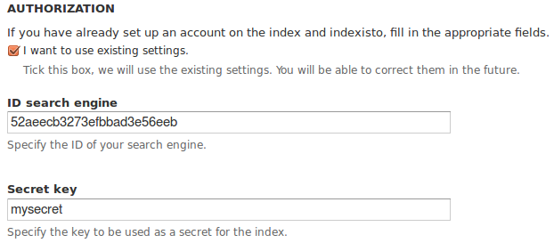

12. Всё, жмем подтвердить и авторизация готова.

Если у вас уже есть индекс то вам достаточно проделать пункт 11.

## Настройка модуля

После того как вы зарегистрировались или авторизовались перед вам откроются
настройки модуля.

### Настройки индекса

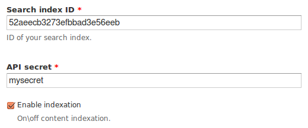

В первой вкладке вы можете заменить свой секрет и index id, а также отключить
индексацию сайта.  
Если вы выключите индексацию, то ничего не попадёт в индекс, не важно что
настроите дальше, это глобальный запрет/разрешение на отсылку данных.

### Настройки контента

Данная вкладка отвечает за то, какие типы содержимого можно индексировать, а
также что именно от них попадёт в индекс.

Настройки очень просты. Для каждого типа содержимого на сайте вы можете задать
используя токены следующие значения:

- Блокировка на индексацию. Если поставить галочку то материалы данного типа
  содержимого не попадут в индекс, никак, вообще. Старые, что попали до
  блокировки, останутся в индексе неизменными, но не будут обновляться.
- Заголовок содержимого — тут я думаю всё ясно.
- Содержимое (body) — тут нужно указать токен с основным содержанием ноды, т.е.
  с текстовой частью.
- Общее содержимое (summary content) — это совокупность всех конентентных данных
  ноды. Сюда вы должны добавить непосредственно само тело (body), а также доп
  поля, например: цена, теги и т.д. Но, например, картинки и файлы добавлять не
  стоит, они же не контент.
- Изображение — тут нужно указать поле с изображением. Если его нету можно
  оставить токен по-умолчанию, либо просто оставить поле пустым. В таком случае
  в момент отправки данных модуль попробует найти картинку в body.
- Теги — тут теги для материала, вроде тоже всё ясно.

Подобные настройки есть для каждого типа содержимого. При необходимости вы
можете изменить их.

### Стиль поиска

В этой вкладке можно настроить текст, который будет отображаться в поле поиска
по-умолчанию, пока пользователь не начнет вводить свой запрос.

Также можно настроить стиль отображения самого поля. Это просто inline-css, но
он обязателен, и пустым быть не должен.

### Массовые операции

Последняя вкладка позволяет проделывать массовые операции с материалами,
добавление/обновление или удаление их из индекса.

Тут я тоже задерживаться не буду, всё предельно понятно.

## Что делать после настройки модуля

После того как вы всё настроите, после добавления/обновления и удаления
содержимого на сайте, будут отсылаться соответствующие запросы (если они не
запрещены во вкладке содержимого).

Если у вас есть уже содержимое, просто массово добавьте материалы в индекс и
посмотрите что получиться. Если всё сделали верно, то в админке indexisto в
разделе *Index Explorer* должны появиться данные.

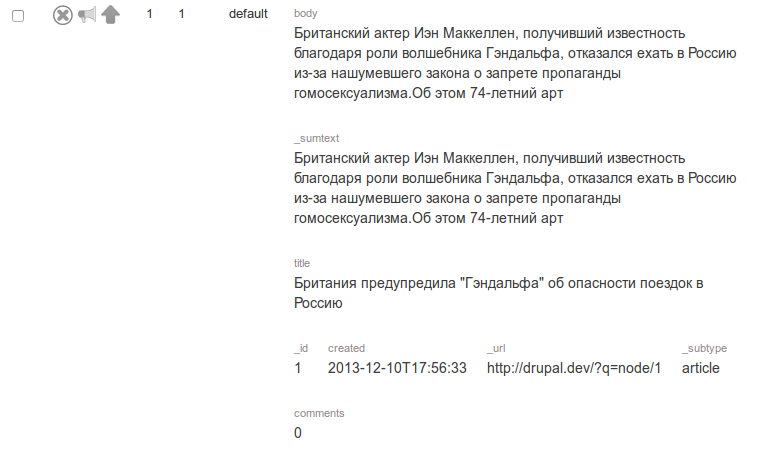

Теперь добавьте блок Indexisto на страничку и проверьте, у вас должно искать по
проиндексированным материалам. На этом всё.

## Что можно сделать после настройки

Ну во-первых вы можете на официальном сайте настроить оформление поиска и прочие
примочки, например дележку по типам содержимого.

### Делим в выдаче контент по типу содержимого.

Изначально в выдаче у вас будут все материалы идти скопом в одном разделе, но
indexisto позволяет нам поделить их на разделы. Вся работа уже сделано на уровне
модуля, вам лишь нужно:

1. Зайти в настройки indexisto -> Search Box -> Widgets.
2. Нажимаем Add new widget.
3. Указываем название (на англ.), справа жмём на глубос, в поле RU пишем русское
   название, а в разделе: Select types for the query вы выбираете тип
   содержимого который будет находиться в этой группе.

Вот как у меня сделан раздел “Блог”:

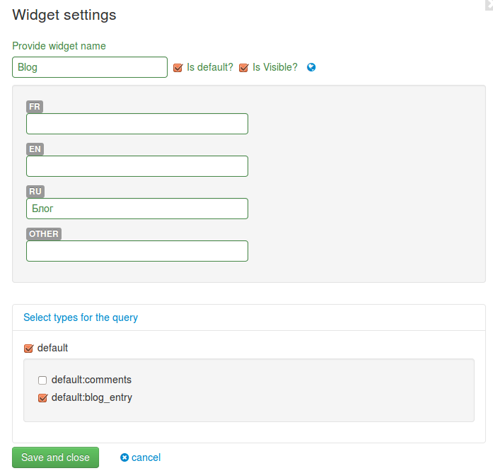

То же самое я проделал с комментариями, в резлуьтате чего теперь у меня они
логически разделены в выдаче.

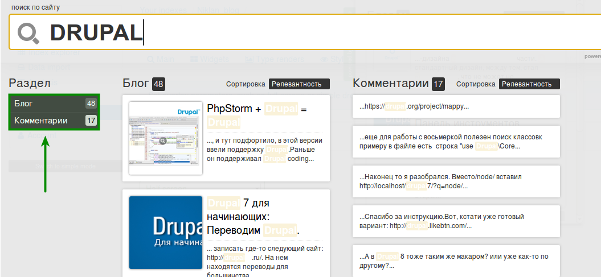

## P.s.

Модуль находится в разработке, стабильная версия появится не раньше января 2014
года.

От этого поста мы хотим услышать предложения/пожелания к модулю, а также самому
сервису indexisto, сообщайте обо всех найденных ошибках и путях их
воспроизведения. Буду фиксить по мере возможности.
