Всем привет, давненько я не писал. Было лень, да и ничего в голову не приходило,
но я не забил на блог. После такого простоя вернусь с записи-анонса, ведь без
дела я тоже не сидел.

После месяца, а то и двух, я все же решился анонсировать вам свою сборку
интернет-магазина на базе Drupal Commerce. Работу над ней начал примерно под
конец января, и не спеша делал и вот уже сейчас есть версия, которая безупречно
устанавливается, разворачивает весь функционал и реально работает. Т.е. даже
годится для продакшена.

## Почему я сделал сборку и какие ставил цели

Вообще, о собственной сборке чего-либо на друпале я задумывался уже очень давно.
Еще со времен когда начал обучаться друпалу, думал, когда-нибудь и я сделаю свою
сборку для народа, и вот этот момент наступил.

Разумеется, первоочередными целями были получение нового опыта с Drupal и
постараться сделать что-то реально полезное для русского сообщества Drupal. По
поводу опыта, я, конечно же, могу заверить, получил я его в достаточном
количестве. Делать сборки действительно интересно и увлекательно. Создавая
сборку я изучил друпал намного глубже чем я его знал ранее, примерно раза в
полтора, а то и все два. Чтобы сделать сборку пришлось изучать базу друпала,
руками просматривать что да как строится и хранится, а раньше я с базой не особо
то и работал ибо боялся там что-то нарушить. Сейчас же страха уже не осталось. А
по поводу полезности сборки, это уже решит само сообщество и те люди кому это
интересно. Если это хотя бы кому-то окажется полезным решением и поможет в
чем-либо, я буду очень рад.

После, скажем так, не очень легкого решения делать сборку, ведь информации о
разработке дистра очень мало (приходилось разбирать другие сборки и
анализировать), я начал думать, что мне делать. Востребованность на
интернет-магазины очевидна, но ведь уже есть Commerce Kickstart, Commerce Box и
т.д. Получается делать, то, что уже сделано как-то глупо и я начал анализировать
этих двух товарищей.

С первым я знаком с момента выхода самого drupal commerce, ведь он был его
первой демкой и первым дистрибутивом, при всем при этом он еще и официальный. Но
как-то у меня с ним не срослось, сколько я не пробовал, никогда (я не вру) он не
устанавливался до конца без ошибок. Постоянно прерывался на какой-либо операции
и все шло в тартарары. Мне это, разумеется, не понравилось и я пошел к другому
собрату — Commerce Box.

Commerce Box делают наши друзья из Украинского сообщества. Скажу честно, я её не
устанавливал, я читал отзывы о ней и смотрел 2, а то и 3 доклада от самих же
разработчиков. Они сами говорят что там сейчас полнейшая Ж, устанавливается
порядка 300 модулей (!), хотя по демо-сайту я не особо понял, для чего там такое
количество модулей. Я приверженец делать сайт с минимум модулей. Так вот, такое
количество модулей, плюс то что сейчас они его координатно перепиливают и
неизвестно когда допилят, и допилят ли вообще тоже как-то скинуло его из моего
видения и я начал гнуть свою палку.

Изучив опыт и ошибки данных сборок, я начал делать свою. Прежде всего я старался
сделать легковесную сборку, очень легкую в установке и понимании, при этом
сохранив всю гибкость для разработчиков, чтобы они могли спокойно перерабатывать
её под свои нужды и использовать в качестве фундамента. Именно поэтому все
настройки и глобальные возможности настраиваются в момент установки
дистрибутива, а затем с ними можно делать что угодно. Но это уже по большей
части техническая часть, а о ней не особо и хочется тут рассказывать, иначе тут
целую книгу напишу. Скорее всего я затем напишу отдельным техническом постом как
делать дистры на основе этого и как я решал проблемы и т.д.

Также я старался сохранить дух стандартного друпала. После установки, он не
особо отличается от обычного стандартного друпала, разве что основной темой и
настроенным коммерцем. Поэтому опять же, сохраняется гибкость для разработчиков,
а также не требует серьезных изучений для тех кто уже знаком с друпалом.

При этом я старался сделать весь процесс от установки до использования
максимально простым и быстрым. По факту получается так, вы устанавливаете
сборку, наполняете магазин, и в продакшен зарабатывать денежки.

Одной из основных целей было то, что я пытался сделать именно фундамент, чтобы
сократить время разработчикам на создание магазина. Ведь порой на настройку
коммерца может уйти до целых суток, а настройки, как правило, у всех одинаковые.

А вообще, каждый выделит себе свои плюсы и минусы. И будет очень приятно если вы
о них скажите в комментариях, а я буду развивать дальше, учитывая ваши отзывы.

## Установка

Установка абсолютно ничем не отличается от стандартной. Вы качаете дистрибутив,
и в момент установки просто появляется новый пункт.

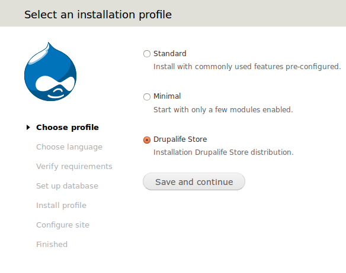

После выбора дистрибутива у вас появятся новые этапы установки и выбор языка.
Так как в первую очередь сборка на Россию и страны СНГ, то я залил полный файл
переводов на Русский язык всего функционала магазина и его интерфейса.

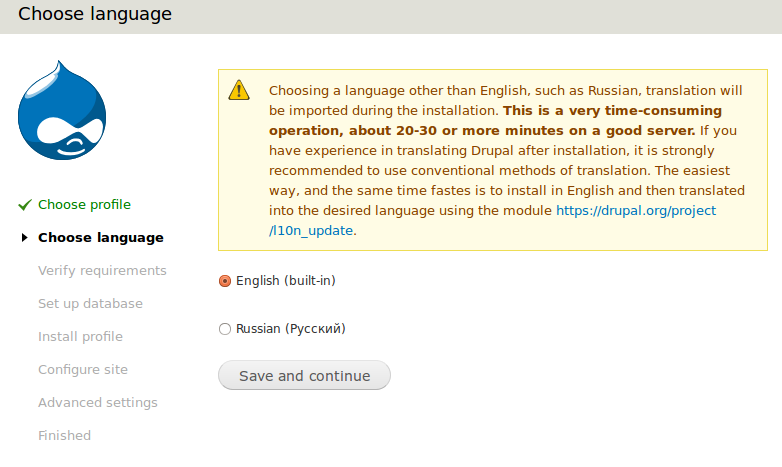

Как вы можете заметить я вывел здесь предупреждение, и оно тут не спроста. В
момент установки профиля, друпал просит единый файл переводов, в скупе с
переводами для комерца и прочих модулей, выходит файлик размером в 53 000 строк
переводов. Как вы могли уже догадаться, это очень прилично, и операция по
импорту такого количества переводов в один поток занимает 20-30 минут на
достаточно уверенном компьютере. Поэтому, если вдруг вы выбрали русский и импорт
языка стоит на 0%, не пугайтесь, он импортирует и потом сразу станет 100%. Самый
простой и правильный вариант указан в этой самой подсказке. Достаточно
установить на английском, а затем при помощи модуля перевести его на русский, а
в дальнейшем этот модуль и вовсе сам будет подкачивать обновления для переводов.
Я уже серьезно задумался добавить его к сборке и подключать его функционал на
момент установки в обход стандартным языковым импортам.

После выбора языка все этапы будут совершенно вам знакомы: настройка базы,
установка, создание админка и указание базовых настроек сайта. Затем открывается
новый этап, в нем доп. возможности сборки. Сразу хочу отметить, если вы здесь
пропустите какие-то настройки, то в дальнейшем добавить их уже в автоматическом
режиме будет нельзя и придется вам их делать руками. Поэтому хорошо подумайте
что нужно, а что нет. Это, кстати, одна из тех особенностей что я писал выше.
Эти возможности не привязаны к Features и после установки их можно менять как
вам угодно и они не откатятся в первоначальное состояние при апдейте.

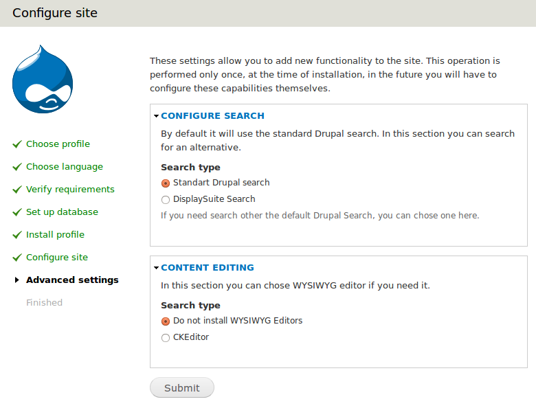

Пока что данный этап не особо напичкан возможностями, да и многого не нужно. Тут
всего два раздела:

- Настройка поиска:

- Стандартный поиск Drupal, тут и рассказывать нечего.
- DisplaySuite Search. По-сути он ничем не отличается от стандартного, разве что
  его можно темизировать. И если у вас в планах использовать стандартную тему,
  то лучше выбрать его. Результаты поиска будут оформлены более информативно.
  Например, у товаров в результате выдачи появятся цена, фотография и кнопка
  добавить в корзину, а не просто заголовок и краткое описание как если бы
  использовали стандартный поиск.
- Насртойка текстового редактора:

- Также, по умолчанию выбран стандартный для друпала вариант — никаких
  редакторов.
- CKEditor — известный почти всем и каждому редактор. Пока что я добавил только
  его. Выбор тут просто очевиден, мне нравится, у меня есть статьи про его
  настройку, он в ядре Drupal 8. С другими редакторами не знаком, но возможно
  погляжу в сторону BUEditor и TinyMCE как вариантов выбора.

После этого перед вам будет установленный сайт.

## Дизайн и оформление

Как я уже писал, я сделал тему для дистрибутива, поэтому вас встретит не бартик,
а соответствующая тема.

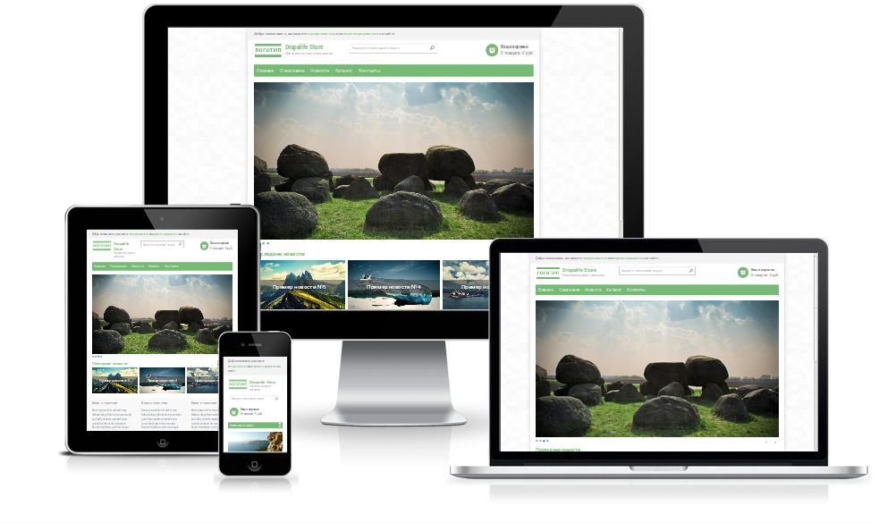

Тема адаптивная, заточена под компьютеры, планшеты и мобильные устройства из
коробки. Поэтому это может многих порадовать.

Очень много внимания уделено различным частям темы. Например, табы, пейджеры,
бутоны и элементы форм, все темизировано, вплоть до результатов выдачи от
поиска (при выборе DisplaySuite Search). Вот например тот самый поиск.

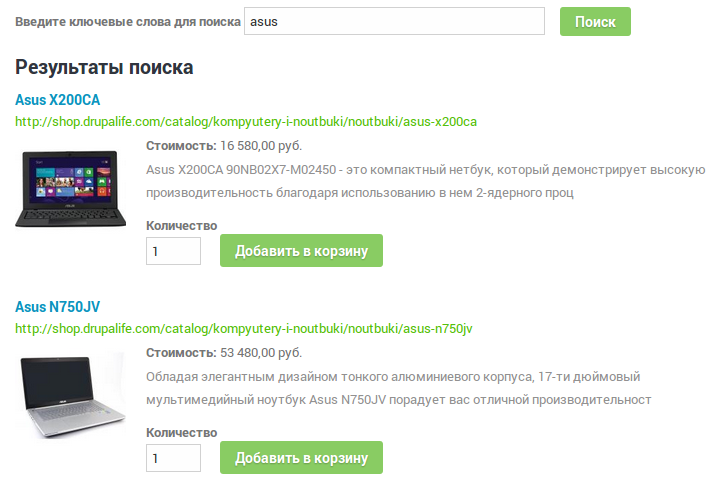

Всё это оттемизированно при помощи сабтемы zen и модуля Display Suite. Поэтому
кто имеет опыт в верстке, легко сможет заменить оформления любой части сайта на
свою.

## Что уже есть

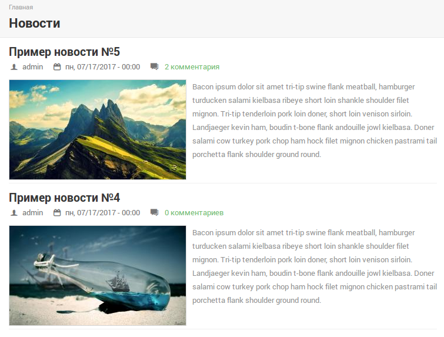

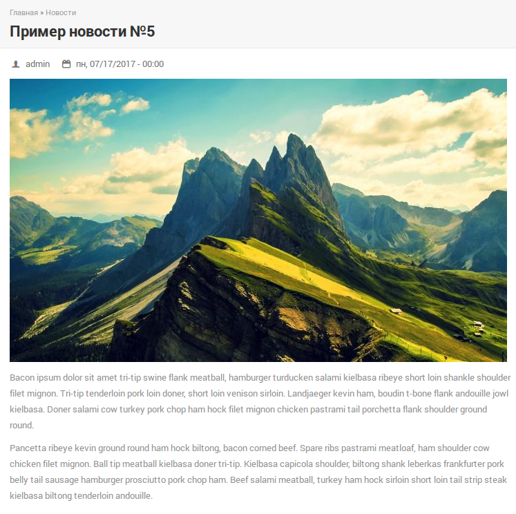

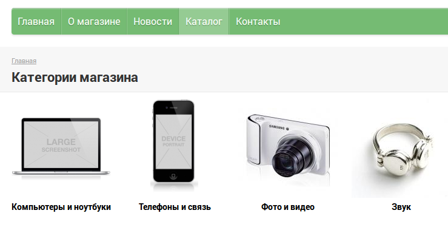

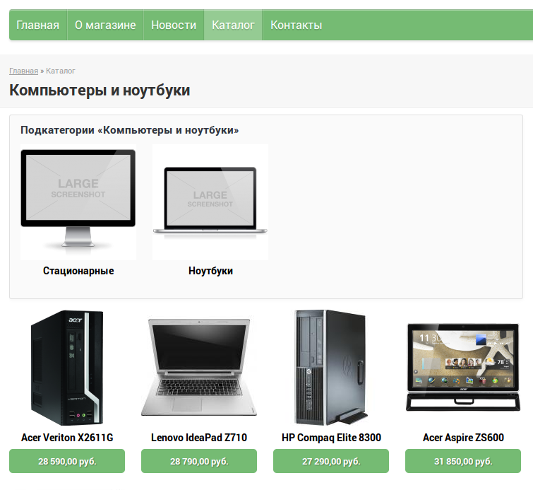

Так как это все сделано на Views, вы легко сможете откорректировать до нужного
вам вида, добавить фильтры и т.д.

Внутри товара никаких излишеств, только необходимая информация.

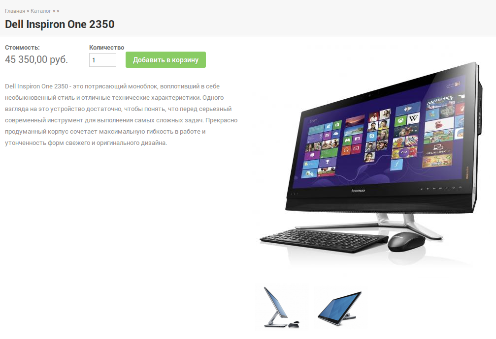

Данная страница, вероятнее всего в последующих версиях получит новые
информационные блоки, например, “вы недавно смотрели” или “смотрите также”.

Страница контактов выполнена в очень простом виде.

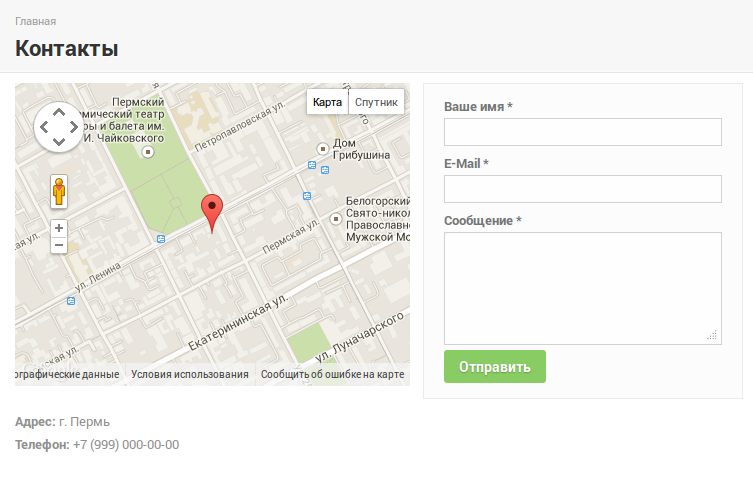

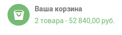

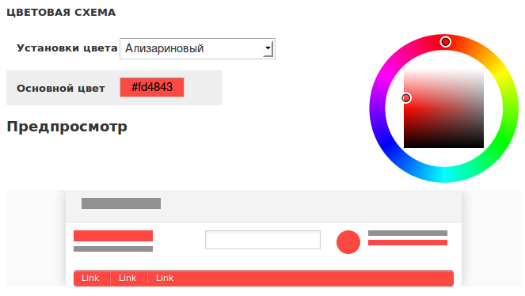

Вы сможете выбрать цвет из заданных заранее, либо выбрать любой какой нужно
именно вашему магазину, а превью покажет примерно как это будет выглядеть на
сайте. А после сохранения цвет применится к сайту.

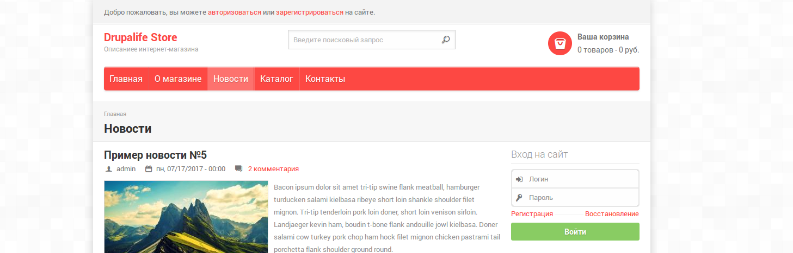

В дальнейшем, планирую сюда добавить возможность загрузки фонового изображения
для сайта, возможно более тонкую настройку цветов а не одну общую и настройку
соц. сетей.

## SEO

Я не фанат сео, скорее даже хейтер. Но сайты я всегда делаю по уму.
Микроразметка, адекватные чпу, хлебные крошки, мета-данные, улучшенные заголовки
идут из коробки. Большего я никогда не делаю и считаю мазахизмом.

Так что если на ваш сайт кидают ссылку в соц. сетях, они автоматически подцепят
нужные данные, ведь уже все настроено!

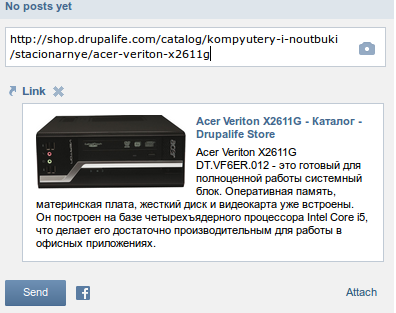

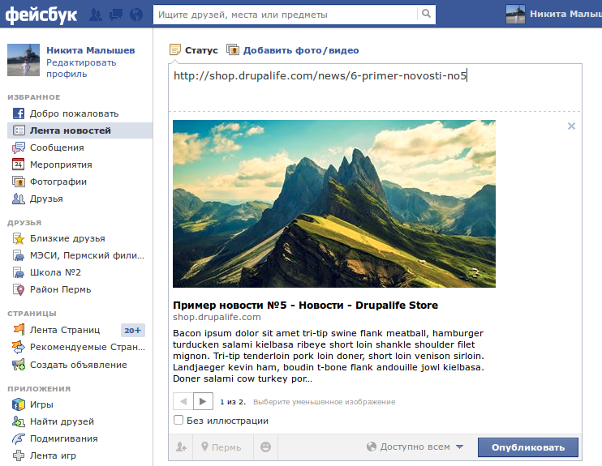

URL вы уже могли увидеть из скриншотов выше, а вот так генерируются хлебные
крошки.

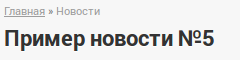

И по этой навигационной цепочке юзеры могут спокойно перемещаться в предыдущие
разделы или же категории каталога.

## Подводя итоги

На данный момент последняя версия Alpha 3. То что альфа не пугайтесь, по сути
все ок и пашет, просто еще в планах много чего добавить из основных фич. Может
частично фичи будут вынесены в варианты выбора после установки единоразово,
чтобы было проще всем.

Буду рад услышать пожелания, замечания и отзывы. Надеюсь кому-то эта сборка
будет очень полезна и поможет сделать не один интернет-магазин, а кому-то
поможет в изучении друпала, чтобы взглянуть на то, как и что делается. Можно
порыться в настройках, а если что-то сломаете, ведь можно быстро переустановить.

**Демо и загрузка:
** [Drupalife Store](http://drupalife.com/lab/store "Создание интернет магазина")
