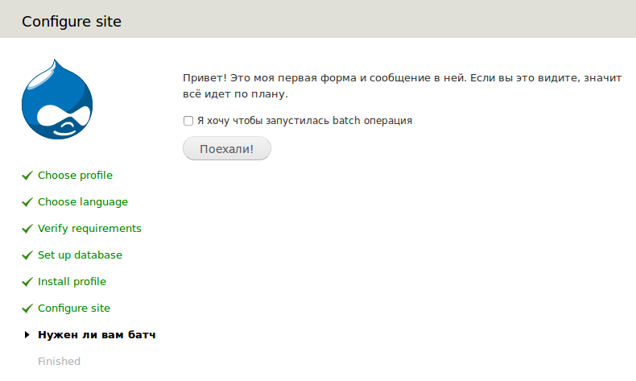
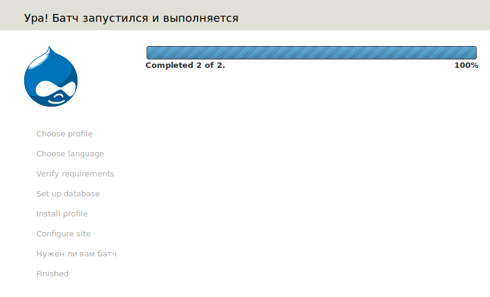
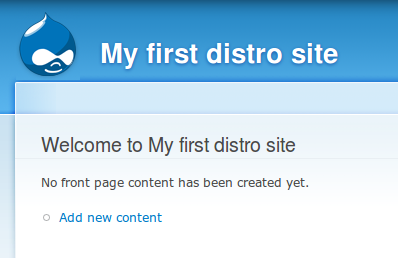

После того как я анонсировал сборку интернет-магазина, самое время рассказать
как же делаются данные сборки.

## Какие нужны инструменты

Для создания сборки нужен опыт написания модулей, к сожалению, моя статья не
научит писать модули, а научит как знания из написания модулей применять в
создании сборок. Впрочем, это не звонок: “Все, пипец, закрываю”, ибо есть
начальный уровень который дастся очень легко.

Проблема в том, что тут нет никаких стандартов (по сборкам), кроме стандартов
кодирования. Каждый делает как умеет и как может, ибо почти весь функционал
используемый в модулях доступен в момент установки друпала. Т.е. всё Drupal API
доступно с первого пункта, так как ядро полностью бутстрапается.

Гайдов очень мало, они не однозначные. Официальный покрывает лишь очеь
поверхностные знания. По сути объясняется что где пишется и какие особенности.
Например, вместо t() надо использовать st().

Если вы разработчик, то наверняка слышали о Lullabot, и скорее всего вы
наткнетесь на их гайд по созданию сборок если начнете гуглить. Ни в коем случае
не соблазняйтесь. Там расписано очень просто, сделать также, реально просто, но
это не правильно и это близко не сборка. Суть в том, что там делается бекап базы
уже рабочего сайта, а в инсталяционном профиле этот файл просто импортится в
базу. В общем вариант очень неудачный, комментарии к тому гайду говорят об этом
то же что и я. Хотя, честно, мне это по началу показалось очень простым и легким
решением сделать сборку. Есть сборки на drupal.org которые реально его
используют, но это все также не правильно.

Для создания сборок может сильно помочь модуль Features. Предварительно
запаковав свои особенности в эти самые фичи, мы с легкостью можем развернуть
нужный нам функционал, просто включив сгенерированный модуль. Например,
запаковать тип содержимого, вьюхи и прочее. Реально удобно и просто, но не
обольщайтесь что типа: “Да ща я тут весь сайт в фичи запакую и в путь”. В момент
создания инсталяционного профиля и фич для него, вы узнаете о модуле Features
намного глубже, и поймете, что он переносит далеко не все. В моей сборке,
например, помимо фич, еще порядка 200-300 строк кода настроек поверх того что
сделали фичи.

## Level 1: Подготовка и базовый профиль

Подготовка как всегда простая. Нам придется подготовить файлы и понять базовую
структуру. Для того чтобы начать делать сборку, нужно создать папку с названием
будущей сборки в папке profiles, которая находится в ядре друпала. Давайте
создадим папку и назовем наш будущий дистр: my_first_distro.

Далее нам необходимо создать 3 файла:

1. my_first_distro.info
2. my_first_distro.profile
3. my_first_distro.install

Все модули, темы и необходимые для дистрибутива файлы помещаются в эту же папку.
При этом, желательно сохранять структуру. Например так:

- profiles - my_first_distro - my_first_distro.info
- my_first_distro.profile
- my_first_distro.install
- modules - views
- …
- themes - bartik
- …
- libraries - fancyBox
- ...
- translation - ru.po

### my_first_distro.info

В данном файле задается базовая информация о нашем будущем дистрибутиве.
Название, версия ядра и какие модули необходимы для его успешной установки.

Я не буду особо углубляться в подробности, все же статья подразумевает что вы
умете делать модули и вам почти все должно быть знакомо, я просто сделаю в коде
небольшие комментарии.

```info
; Название нашего дистрибутива. Будет отображено в момент выбора дистрибутива.
name = "My first distribution"
; Описание нашего дистрибутива. Будет показано под названием.
description = "Устанавливает мой первый дистрибутив"
; Версия ядра Drupal.
core = "7.x"
; Эта строка не обязательна, но если вы её напишите со значением 1, то сборка
; будет "эксклюзивной". То есть момент выбора профиля для установки будет
; пропущен и начнется принудительная установка данного профиля.
;exclusive = "1"

; Далее, в качестве зависимостей указываем необходимые модули. Во-первых, это те
; модули которые будут включены автоматически в момент установки. Во-вторых это
; список проверки. Если хотябы один из этого списка модулей не найдется, то
; установка перейдет на страницу с ошибкой и ожиданием её исрпавления.
; Для примера, установим парочку базовых модулей. По такому же принципу вы
; дописываете свои модули, views или сгенерированные Features. Зависимости вкл.
; автоматически, т.е. их указывать не нужно, но желательно.
dependencies[] = block
dependencies[] = color
dependencies[] = comment
dependencies[] = contextual
dependencies[] = field
dependencies[] = field_sql_storage
dependencies[] = field_ui
dependencies[] = file
dependencies[] = filter
dependencies[] = image
dependencies[] = list
dependencies[] = locale
dependencies[] = menu
dependencies[] = node
dependencies[] = number
dependencies[] = options
dependencies[] = path
dependencies[] = rdf
dependencies[] = search
dependencies[] = system
dependencies[] = taxonomy
dependencies[] = text
dependencies[] = toolbar
dependencies[] = update
dependencies[] = user
```

### my_first_distro.profile

Данный файл отвечает за какие-либо нужные нам настройки установочного профиля.
Особо требований к нему никаких нету, как и к файлу .install. В обоих будут
срабатывать функции. Но проанализировав сборки, каждый делает как ему удобнее. Я
пошел по пути пары сборок и храню в данном файле только пару хуков системных
форм (которые отображаются во время установки) которые меняют или устанавливают
значения по-умолчанию для форм установки.

```php
<?php 
/**
 * Используем hook_form_FORM_ID_alter().
 *
 * Альтерим форму настройки сайта. Это та, где вводится E-Mail сайта, его
 * название, страна, часовой пояс и регистрация юзера #1.
 */
function system_form_install_configure_form_alter(&$form, $form_state) {
  // Мы заполняет поле названия сайта по умолчанию названием нашего дистра.
  $form['site_information']['site_name']['#default_value'] = 'My first distro site';
}

/**
 * Используем hook_form_alter().
 *
 * Альтерим форму выбора дистрибутива. Так как мы не указали что он
 * эксклюзивен, то у пользователя будет выбор, а мы лишь сделаем чтобы наш
 * дистрибутив был выбран по-умолчанию (чтобы стояла галочка).
 */
function system_form_install_select_profile_form_alter(&$form, $form_state) {
  foreach ($form['profile'] as $key =?> $element) {
    // Указывается машинное имя сборки.
    $form['profile'][$key]['#value'] = 'my_first_distro';
  }
}
```

### my_first_distro.install

Инсталяционный файл, самый важный. В нем настраивается установка дистрибутива и
все сопутствующие операции.

```php
<?php /**
 * Используем hook_install().
 *
 * Процесс установки нашего профиля. Так как этот хук обязателен, то
 * мы можем вызывать хуки других профилей, например standrat_install(). Он
 * установит стандартный профиль с его настройками а затем мы его уже можем
 * подкорректировать. Но это для сведения.
 * (!) данный процесс выполняется после установки всех модулей, что дает нам
 * возможность использовать их функционал и API. Пример с Features будет ниже.
 */
function my_first_distro_install() {
    // Тут мы пишем все что нужно выполнить в момент установки.
    // Для примера давайте сделаем чтобы тема админки и сайта была Garland.
    // Так как данные значения хранятся в таблице variables, мы с легкостью
    // можем использовать функции variable_set, variable_get.
    // Устанавливаем основную тему для сайта Garland.
    variable_set('theme_default', 'garland');
    // Устанавливаем тему для админки - Garland.
    variable_set('admin_theme', 'garland');
    // Делаем чтобы тема админки использовалась при редактировании контента.
    variable_set('node_admin_theme', '1');
    
    // Теперь можно добавить парочку блоков в нужные нам регионы.
    // Обратите внимание что указывается тема. Если вы выбрали для админки и
    // сайта разные темы, то для каждой придется задавать блоки самостоятельно.
    $blocks = array(
    // Настраиваем блок с контентом.
    array(
      'module' =?> 'system',
      'delta' => 'main',
      'theme' => 'garland',
      'status' => 1,
      'weight' => 0,
      'region' => 'content',
      'pages' => '',
      'cache' => -1,
    ),
    // Настраиваем блок с авторизацией.
    array(
      'module' => 'user',
      'delta' => 'login',
      'theme' => 'garland',
      'status' => 1,
      'weight' => 0,
      'region' => 'sidebar_first',
      'pages' => '',
      'cache' => -1,
    ),
  );
  // Делаем запрос на удаления из таблицы block информации о блоках system и
  // user. Обратите внимание, что выше мы задали лишь массив, а сейчас удаляем
  // дефолтные значения.
  db_delete('block')->condition('module', 'system')->execute();
  db_delete('block')->condition('module', 'user')->execute();
  // А вот теперь добавляем в базу инфу о наших блоках.
  $query = db_insert('block')->fields(array('module', 'delta', 'theme', 'status', 'weight', 'region', 'pages', 'cache'));
  foreach ($blocks as $block) {
    $query->values($block);
  }
  $query->execute();
 
  // Также давайте создадим роль для пользователей "Администратор".
  $admin_role = new stdClass();
  $admin_role->name = 'administrator';
  $admin_role->weight = 10;
  user_role_save($admin_role);
  user_role_grant_permissions($admin_role->rid, array_keys(module_invoke_all('permission')));
 
  // Ну и укажем друпалу что роль у администратора такая-вот ;)
  variable_set('user_admin_role', $admin_role->rid);
 
  // Для полного набора, пользователю #1 (главном админу) также дадим эту роль.
  db_insert('users_roles')
    ->fields(array('uid' => 1, 'rid' => $admin_role->rid))
    ->execute();
    
  // Если вы также хотите использовать фичи для своего дистра, вам необходимо
  // также восстановить их до дефолтного состояния, что позволит избежать
  // ряда проблем. Лишним уж точно не будет.
  // Так как фич в примере не используется, этот код будет закомментирован как
  // пример, ибо он будет востребован.
  // Указываем список наших фич.
  /*$features = array(
    'feature_1',
    'feature_2',
  );*/
  // И при помощи Features API откатываем их в нужное состояние.
  /*features_revert($features);*/
 
  // В данном хуке выполняется львиная доля настройки дистра, можете глянуть
  // что я делаю в своем, тут уже у каждого своё продолжение.
}
```

## Level 2: Более расширенная настройка дистрибутива

Разница от предыдущего пункта не значительная. Тут я расскажу как делать свои
собственные задачи в момент установки дистрибутива. Это поможет сделать страницу
с какой-либо информацией, форму с настройками или массовую операцию.

Код который ниже, он вставляется после hook_install() который написан выше.
Чтобы не растягивать я решил просто писать новое а тот вы и так видите ;)

```php {"header":"hook_install()"}
/**
 * Используем hook_install_tasks().
 *
 * В данном хуке мы регистрируем все свои задачи для выполнения.
 */
function my_first_distro_install_tasks(&$install_state) {
  // Есть три типа задач: normal, batch и form.
  // Я расскожу про последние два, так как первый это тот же самый Form,
  // только не подразумевает submit колбэка для обработки данных.
 
  // Начнем с формы. Делается все просто, достаточно указать отображаемое
  // название задачи (отображается слева в моменту становки, где галочки)
  // отображать его в этом списке или нет, тип, и run - это условие выполнения.
  // По умолчанию и во всех случаях идет INSTALL_TASK_RUN_IF_NOT_COMPLETED.
  // Это значит что задача запустится после дефолтных. Там может быть условие
  // которое может регулировать этот параметр, он упомянится в батче.
  // Название таска - это в то же время и название вызываемой функции.
  // Т.е. когда друапл решит выполнить эту задачу, он автоматом вызовет
  // my_first_distro_form, но если вас такое не устраивает, вы можете передать
  // название вызываем функцией доп. параметрой function.
  $tasks['my_first_distro_form'] = array(
    'display_name' => 'Нужен ли вам батч',
    'display' => TRUE,
    'type' => 'form',
    'run' => INSTALL_TASK_RUN_IF_NOT_COMPLETED,
  );

  // Для простоты восприятия кода, начиная с этого комментария, рекомендуется
  // читать функцию my_first_distro_form, а потом уже вернуться сюда. Я это
  // помечу.
  // @see 147 строку. function my_first_distro_form()
 
  // Батч задается также как и форма, лишь убирается отображение (хотя вы
  // можете оставить его), и указывается соответствующий тип.
  // Но для начала мы получим значение переменной.
  $is_batch_needed = variable_get('my_first_distro_install_want_batch', FALSE);
  // Мы присваиваем значение в переменную, которая по умолчанию получит FALSE
  // если не указано TRUE. А будет TRUE, когда пользователь поставит галочку
  // в нашей форме, что ему надо выполнить батч операцию. Все просто!
  $tasks['my_first_distro_batch'] = array(
    'display' => FALSE,
    'type' => 'batch',
    // Если TRUE и стандартная установка пройдена, то запустит данная операция
    // Если FALSE, то выполнится пропуск данной операции.
    'run' => $is_batch_needed ? INSTALL_TASK_RUN_IF_NOT_COMPLETED : INSTALL_TASK_SKIP,
  );
  // А теперь время вернуться к функции батч операци.
  // @see 189 строку function my_first_distro_batch()
 
  return $tasks;
}

/**
 * Наша форма, вызываемя на 115 строке.
 */
function my_first_distro_form() {
  // Давайте просто выведем сообщение и чекбокс.
  $form['information'] = array(
    '#weight' => 0,
    '#markup' => '<p>Привет! Это моя первая форма и сообщение в ней. Если вы это видите, значит всё идет по плану.</p>',
  );
 
  // А теперь добавим чекбокс, который будет влиять на выполнение батч операции
  $form['want_batch'] = array(
    '#type' => 'checkbox',
    '#title' => 'Я хочу чтобы запустилась batch операция',
    '#weight' => 1,
  );
 
  // Так как это форма, нам необходима кнопка подтверждения с функцией, которая
  // обработает нашу форму.
  $form['submit'] = array(
    '#type' => 'submit',
    '#value' => 'Поехали!',
    '#weight' => 15,
    '#submit' => array('my_first_distro_form_submit'),
  );
 
  return $form;
}

/**
 * Обработчик формы my_first_distro_form.
 */
function my_first_distro_form_submit($form, $form_state) {
  // Получаем значение нашего чекбокса. Если он установлен, мы задаем параметр
  // который позволит там запустить батч операцию. Таким способом передаются
  // значения в момент установки.
  if ($form_state['values']['want_batch'] == 1) {
    // Дадим ему более говорящие название. Чтобы потом не запутаться самим же.
    variable_set('my_first_distro_install_want_batch', TRUE);
    // Теперь вернитесь выше к переменной: $is_batch_needed
  }
}

/**
 * Функция вызываемая батч задачей.
 *
 * Данная функция должна возвращать готовый параметр для функции batch_set().
 * https://api.drupal.org/api/drupal/includes!form.inc/function/batch_set/7
 */
function my_first_distro_batch() {
  // Тут мы задаем согласно batch_set() список функций для исполнения в batch.
  $batch = array(
    // Заголовок батч операции.
    'title' => 'Ура! Батч запустился и выполняется',
    // Список операций. Тут передается название вызываемой функции для операции
    // а в массиве можно передать данные. Если же их не нужно, то передается
    // пустой массив, иначе батч сломается.
    // После чего нам необходимо объявить данные функции.
    'operations' => array(
      array('my_first_distro_batch_operation_1', array()),
      array('my_first_distro_batch_operation_2', array($msg = 'Hello')),
    ),
  );

  return $batch;
}

/**
 * Первая функция для batch операций.
 */
function my_first_distro_batch_operation_1() {
  drupal_set_message('Первая операция была вызвана успешно', 'status');
}

/**
 * Вторая функция для batch операций.
 *
 * В неё мы уже передавали значение.
 */
function my_first_distro_batch_operation_2($msg = 'Bye') {
  drupal_set_message($msg, 'status');
}
```

## Level 3: Grand finale

В итоге мы написали простенький дистрибутив, который устанавливает базовый набор
модулей, делает новую роль, присваивает её админу, расставляет блоки и меняет
тему на Garland. А также сделали форму, в которой если пользователь поставит
галочку, то выполнится две батч операции, которые выводят в конце установки два
сообщения.

Дерзайте, создание сборок реально интересное занятие. Эту сборку-пример я
прикреплю к материалу.

И напоследок скриншоты того что вышло.








