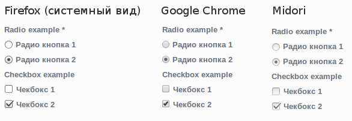
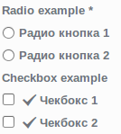
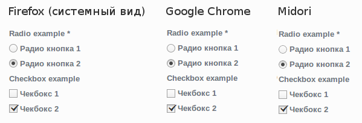
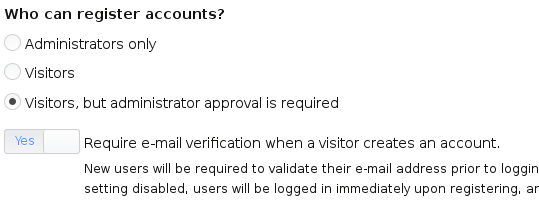

Многие из вас, кто хоть раз прикасался к вёрстке сайтов, и затрагивал оформление
элементов форм (input, textarea..), скорее всего натыкались на проблему
темизации checkbox и radio. Если инпуты очень просто темизируются, то с
чекбоксами куда хуже. Сейчас темизация данных элементов больше не вызывает
проблем, просто многие игнорируют это. Как всё это применить на Drupal сайте?
Сейчас я об этом и расскажу.

## В чём проблема и зачем это надо

Данный раздел будет полезен тем кто не уловил ещё, для чего это нужно.

Проблема заключается в том, что элементы форм очень жестко зависят от
операционной системы (в дальнейшем ОС). Допустим на Windows 7 они выглядят
по-своему, а на Windows 8, уже более квадратные и минималистично. Но ведь не
стоит забывать о пользователях Mac OS, а также Linux, у которого целый зоопарк
дистрибутивов, которые используют разные Desktop Envoirment окружения, у
которых, в свою очередь, опять же, собственное оформление всех элементов. И если
инпуты еще хоть как-то затрагиваются верстальщиками, то чекбоксы и радио
обходятся стороной, в подавляющем большинстве случаев. И на разных ОС сайт
выглядит не одинаково, но это пол беды, ведь в добавок к таким разнообразиям,
они еще и разного размера, что может вообще ломать вёрстку сайта.

Google видимо давно задумались о данной проблеме, поэтому в Google Chrome, не
зависимо от ОС все радио и чекбоксы выглядят идентично, что хоть немного
сглаживает проблему. А вот в Firefox отображаются системные. Опять же, в случае
с хромом, тут уже видение Google. Каждый вносит что хочет, и надо это приводить
к единому стилю для пользователя.

Вот пример с моей ОС (Elementary OS, у которой, к слову, тоже своё видение как
должны быть выполнены радио и чекбоксы).



Как вы видите, одна система, 3 браузера, совершенно три разных вида элементов. И
опять же, вспомним, что системы у всех разные, перемножим это всё на количетсво
браузеров, которых наплодилось за последнее время, а сверху зальём еще
различными DE (у линуксов). Счёт уже идет на тысячи различных видов и вариантов.

Поэтому мы займёмся унификацией всего этого зоопарка. Параллельно описывая как
это делается, я буду делать всё это для Drupalife Store, так что весь код вы
сможете вытащить в дальнейшем из сборки/репозитария.

## Объявляем наши темплейты для кнопок

Для начала, нам нужно переопределить вывод элементов. Необходимо сделать так,
чтобы оформление данных элементов тянулось из нужных нам шаблонов. Поэтому в
template.php вашей темы применяем хук hook_theme_registry_alter(). Если
собираетесь копировать, не забудьте заменить YOURTHEME на название вашей темы.

```php
/**
 * Используем hook_theme_registry_alter().
 */
function YOURTHEME_theme_registry_alter(&$theme_registry) {
  $theme_path = path_to_theme();

  // Checkboxes.
  if (isset($theme_registry['checkbox'])) {
    $theme_registry['checkbox']['type'] = 'theme';
    $theme_registry['checkbox']['theme path'] = $theme_path;
    $theme_registry['checkbox']['template'] = $theme_path. '/templates/fields/field--type-checkbox';
    unset($theme_registry['checkbox']['function']);
  }

  // Radios.
  if (isset($theme_registry['radio'])) {
    $theme_registry['radio']['type'] = 'theme';
    $theme_registry['radio']['theme path'] = $theme_path;
    $theme_registry['radio']['template'] = $theme_path . '/templates/fields/field--type-radio';
    unset($theme_registry['radio']['function']);
  }
}
```

Как вы уже догадались из кода. Теперь при генерации наших кнопок, друпал будет
обращаться к шаблонам field--type-checkbox.tpl.php и field--type-radio.tpl.php.

Также обратите внимание что пусть указывается относительно корня вашей темы.
Т.е. в моём примере выше, файл с шаблоном должен находиться строго по пути:
YOURTHEME/templates/fields/[file-name], в противном случае шаблон не
подключится. Это не theme suggestion и сканировать папку на наличие нашего
шаблона он не будет.

## Создаём темплейты

Как вы уже могли догадаться, теперь нам необходимо создать наши шаблоны в теме.
Где они должны быть расположены и как называться я написал выше.

### Небольшое отступление

Перед тем как читать код, я хочу немного рассказать о методике темизации радио и
чекбоксов средствами CSS+HTML, без единой строчки JS. Напрямую мы не можем
темизировать данные элементы, а вот схитрить мы можем.

Хитрость заключается в том, что мы всё также, выводим наш чекбокс/радио, как это
делается обычно, но навешиваем на него свой класс, чтобы в дальнейшем через css
скрыть его. Затем рядом, мы добавляем label, который мы связываем с нашей
кнопкой средствами for . При нажатии на лейбл, он ставит/снимает галочки - это
стандартная особенность html, от которой мы и пляшем. Суть в том, что мы как раз
и будем темизировать этот самый label, который будет менять вид в зависимости от
значения инпута и при этом, менять сами значения в инпуте к которому
принадлежит..

А вот их содержимое.

```php {"header":"field--type-checkbox.tpl.php"}
<?php
/**
 * New checkbox styles.
 */
?>
<input
  id="<?php print render($element['#id']); ?>"
  name="<?php print render($element['#name']); ?>"
  value="<?php print render($element['#default_value']); ?>"
  class="form-checkbox dls-checkbox"
  type="checkbox"
  <?php $element['#checked'] ? print " checked='checked'" : ''; ?>
  <?php isset($element['#disabled']) && $element['#disabled'] ? print " disabled" : ''; ?>>

<label class="dls-checkbox-wrapper" for="<?php print render($element['#id']); ?>">
  <i class="icon-ok"></i>
</label>
```

Обратите внимание. icon-ok - это иконка из темы, у вас её может не быть, вы
можете взять иконки на fontello.com, или любом другом сервисе, типа fontawesome.

```php {"header":"field--type-radio.tpl.php"}
<?php
/**
 * New radio styles.
 */
?>
<input
  id="<?php print render($element['#id']); ?>"
  name="<?php print render($element['#name']); ?>"
  value="<?php print render($element['#return_value']); ?>"
  class="form-radio dls-radio"
  type="radio"
  <?php $element['#return_value'] == $element['#default_value']? print " checked='checked'" : ''; ?>
  <?php isset($element['#disabled']) && $element['#disabled'] ? print " disabled" : ''; ?>>

<label class="dls-radio-wrapper" for="<?php print render($element['#id']); ?>">
  <div class="dls-radio-mark"></div>
</label>
```



Как можно заметить, разницы никакой, кроме того что у чекбокса появилась иконка.
У радио ничего не видно, потому что там пустые дивы. Точку мы сделаем всё тем же
css.

## Время подключать стили

А теперь нам всё это дело осталось просто красиво оформить при помощи CSS.

### Стили для radio-кнопки

```css {"header":"Radio"}
/* Прячем наш дефолтный инпут */
input[type="radio"].dls-radio {
  display: none;
}

/* Стилизуем нашу кнопку */
.dls-radio-wrapper {
  position: relative;
  width: 14px;
  height: 14px;
  cursor: pointer;
  display: inline-block;
  vertical-align: middle;
  border-radius: 30px;
  border: 1px solid #a0a0a0;
  box-shadow: none;
  background: rgb(252, 252, 252);
  background: url(data:image/svg+xml;base64,PD94bWwgdmVyc2lvbj0iMS4wIiA/Pgo8c3ZnIHhtbG5zPSJodHRwOi8vd3d3LnczLm9yZy8yMDAwL3N2ZyIgd2lkdGg9IjEwMCUiIGhlaWdodD0iMTAwJSIgdmlld0JveD0iMCAwIDEgMSIgcHJlc2VydmVBc3BlY3RSYXRpbz0ibm9uZSI+CiAgPGxpbmVhckdyYWRpZW50IGlkPSJncmFkLXVjZ2ctZ2VuZXJhdGVkIiBncmFkaWVudFVuaXRzPSJ1c2VyU3BhY2VPblVzZSIgeDE9IjAlIiB5MT0iMCUiIHgyPSIwJSIgeTI9IjEwMCUiPgogICAgPHN0b3Agb2Zmc2V0PSIwJSIgc3RvcC1jb2xvcj0iI2ZjZmNmYyIgc3RvcC1vcGFjaXR5PSIxIi8+CiAgICA8c3RvcCBvZmZzZXQ9IjEwMCUiIHN0b3AtY29sb3I9IiNmMGYwZjAiIHN0b3Atb3BhY2l0eT0iMSIvPgogIDwvbGluZWFyR3JhZGllbnQ+CiAgPHJlY3QgeD0iMCIgeT0iMCIgd2lkdGg9IjEiIGhlaWdodD0iMSIgZmlsbD0idXJsKCNncmFkLXVjZ2ctZ2VuZXJhdGVkKSIgLz4KPC9zdmc+);
  background: -moz-linear-gradient(top, rgba(252, 252, 252, 1) 0%, rgba(240, 240, 240, 1) 100%);
  background: -webkit-gradient(linear, left top, left bottom, color-stop(0%, rgba(252, 252, 252, 1)), color-stop(100%, rgba(240, 240, 240, 1)));
  background: -webkit-linear-gradient(top, rgba(252, 252, 252, 1) 0%, rgba(240, 240, 240, 1) 100%);
  background: -o-linear-gradient(top, rgba(252, 252, 252, 1) 0%, rgba(240, 240, 240, 1) 100%);
  background: -ms-linear-gradient(top, rgba(252, 252, 252, 1) 0%, rgba(240, 240, 240, 1) 100%);
  background: linear-gradient(to bottom, rgba(252, 252, 252, 1) 0%, rgba(240, 240, 240, 1) 100%);
  filter: progid:DXImageTransform.Microsoft.gradient(startColorstr='#fcfcfc', endColorstr='#f0f0f0', GradientType=0);
  transition: all 0.17s ease 0s;
}

.dls-radio-wrapper:hover {
  box-shadow: 0px 0px 3px 0px rgba(0, 0, 0, 0.11);
  transition: all 0.17s ease 0s;
}

.dls-radio-wrapper .dls-radio-mark {
  width: 6px;
  height: 6px;
  border-radius: 10px;
  background: none repeat scroll 0% 0% #484848;
  margin: 3px auto;
  opacity: 0;
  transition: all 0.17s ease 0s;
}

/* Стиль, когда наш инпут отмечен */
input[type="radio"].dls-radio:checked ~ .dls-radio-wrapper {
  box-shadow: 0px 2px 2px 0px rgba(0, 0, 0, 0.22) inset;
  transition: all 0.17s ease 0s;
}

input[type="radio"].dls-radio:checked ~ .dls-radio-wrapper .dls-radio-mark {
  opacity: 1;
  transition: all 0.17s ease 0s;
}

/* Стиль, когда наш инпут выключен */
input[type="radio"].dls-radio:disabled ~ .dls-radio-wrapper {
  opacity: .5
}
```

```css {"header":"Checkbox"}
input[type="checkbox"].dls-checkbox {
  display: none;
}

.dls-checkbox-wrapper {
  position: relative;
  width: 14px;
  height: 14px;
  cursor: pointer;
  display: inline-block;
  vertical-align: middle;
  border: 1px solid #a0a0a0;
  box-shadow: none;
  background: rgb(252, 252, 252);
  background: url(data:image/svg+xml;base64,PD94bWwgdmVyc2lvbj0iMS4wIiA/Pgo8c3ZnIHhtbG5zPSJodHRwOi8vd3d3LnczLm9yZy8yMDAwL3N2ZyIgd2lkdGg9IjEwMCUiIGhlaWdodD0iMTAwJSIgdmlld0JveD0iMCAwIDEgMSIgcHJlc2VydmVBc3BlY3RSYXRpbz0ibm9uZSI+CiAgPGxpbmVhckdyYWRpZW50IGlkPSJncmFkLXVjZ2ctZ2VuZXJhdGVkIiBncmFkaWVudFVuaXRzPSJ1c2VyU3BhY2VPblVzZSIgeDE9IjAlIiB5MT0iMCUiIHgyPSIwJSIgeTI9IjEwMCUiPgogICAgPHN0b3Agb2Zmc2V0PSIwJSIgc3RvcC1jb2xvcj0iI2ZjZmNmYyIgc3RvcC1vcGFjaXR5PSIxIi8+CiAgICA8c3RvcCBvZmZzZXQ9IjEwMCUiIHN0b3AtY29sb3I9IiNmMGYwZjAiIHN0b3Atb3BhY2l0eT0iMSIvPgogIDwvbGluZWFyR3JhZGllbnQ+CiAgPHJlY3QgeD0iMCIgeT0iMCIgd2lkdGg9IjEiIGhlaWdodD0iMSIgZmlsbD0idXJsKCNncmFkLXVjZ2ctZ2VuZXJhdGVkKSIgLz4KPC9zdmc+);
  background: -moz-linear-gradient(top, rgba(252, 252, 252, 1) 0%, rgba(240, 240, 240, 1) 100%);
  background: -webkit-gradient(linear, left top, left bottom, color-stop(0%, rgba(252, 252, 252, 1)), color-stop(100%, rgba(240, 240, 240, 1)));
  background: -webkit-linear-gradient(top, rgba(252, 252, 252, 1) 0%, rgba(240, 240, 240, 1) 100%);
  background: -o-linear-gradient(top, rgba(252, 252, 252, 1) 0%, rgba(240, 240, 240, 1) 100%);
  background: -ms-linear-gradient(top, rgba(252, 252, 252, 1) 0%, rgba(240, 240, 240, 1) 100%);
  background: linear-gradient(to bottom, rgba(252, 252, 252, 1) 0%, rgba(240, 240, 240, 1) 100%);
  filter: progid:DXImageTransform.Microsoft.gradient(startColorstr='#fcfcfc', endColorstr='#f0f0f0', GradientType=0);
  transition: all 0.17s ease 0s;
}

.dls-checkbox-wrapper:hover {
  box-shadow: 0px 0px 3px 0px rgba(0, 0, 0, 0.11);
  transition: all 0.17s ease 0s;
}

input[type="checkbox"].dls-checkbox:checked ~ .dls-checkbox-wrapper {
  box-shadow: 0px 2px 2px 0px rgba(0, 0, 0, 0.22) inset;
  transition: all 0.17s ease 0s;
}

.dls-checkbox-wrapper [class*="icon"] {
  position: absolute;
  font-size: 11px;
  color: #333;
  top: -7px;
  opacity: 0;
  transition: all 0.17s ease 0s;
}

input[type="checkbox"].dls-checkbox:checked ~ .dls-checkbox-wrapper [class*="icon"] {
  opacity: 1;
  transition: all 0.17s ease 0s;
}

input[type="checkbox"].dls-checkbox:disabled ~ .dls-checkbox-wrapper {
  opacity: .5
}
```

На этом всё.

## Результат

В результате мы получаем совершенно идентичные радио/чекбокс кнопки на всех
браузерах и ОС. Вот пример на моей ОС, чтобы сравнить с тем что было в начале и
что получилось.



Можно творить что угодно. Вот например как я оформил чекбоксы
в [своей базовой теме](https://github.com/Niklan/Glisseo):


