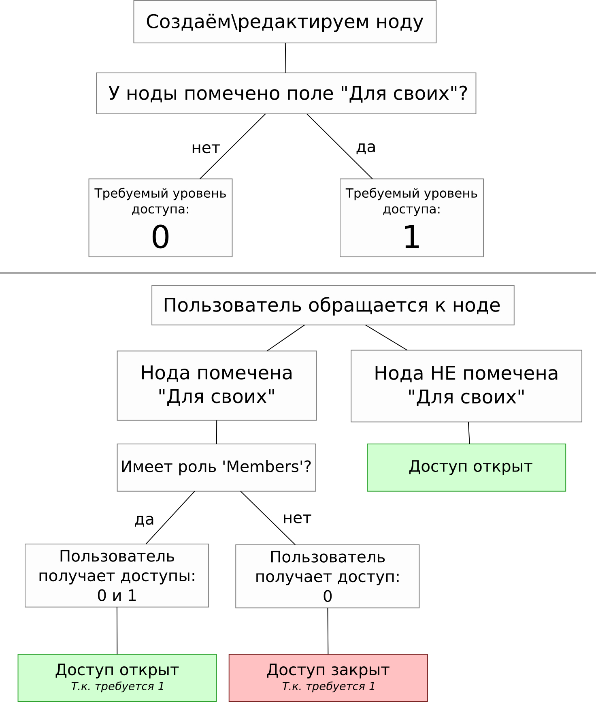

Бывают такие задачи, где есть необходимость, создать скрытый от пользователей контент. Допустим, у нас есть тип материала Article, и мы хотим сделать так, чтобы просматривать его могли только определенные роли пользователей. Ничего сложного, заходим в настойку ролей, и проставляем галочки на доступ к просмотру данного типа содержимого.

Но что если нам нужно лишь блокировать доступ определенным ролям? Допустим, мы добавили к типу содержимого Article поле “Для своих”, которое является обычным чекбоксом, а также создали роль пользователей, которые являются “своими”. А теперь нам необходимо сделать так, чтобы эту запись видели только “свои” когда у материала поставлена галочка “для своих”, а другие бы не могли обратиться к данному содержимому не имея соответствующих прав. Что делать в таком случае?

Первым на ум приходят модули с drupal.org, но я расскажу как это делается самостоятельно, написав небольшой модуль.

## Подготовка сайта

Это по сути пошаговый туториал для начинающих. Если вы хорошо разбираетесь в коде, то и воссоздавать среду для тестов не придётся.

Я не особо хочу заморачиваться с подготовкой сайта, поэтому всё очень просто:

1. Устанавливаем Drupal с профилем Standart.
2. Типу содержимого Article добавляем поле: 1. Название: “Для своих”;
2. Машинное имя: field\_**members\_only**;
3. Тип: boolean;
4. Виджет: Single on\\off checkbox.
3. Добавляем новую роль для пользователей: Members и располагаем после авторизованных пользователей.  

.png)

4. [Скачайте](/sites/default/files/blog/63/attachments/mymodule_empty.tar.gz) и расположите заготовку для модуля в /sites/all/modules/.

## Теоретическая часть

Все крутится вокруг двух хуков hook\_node\_grants() и hook\_node\_access\_records().

### hook\_node\_grants()

Данный хук отвечает за выдачу прав пользователю. При просмотре ноды, пользователь в зависимости от тех условий что мы задаем, получит определенный уровень доступа к содержимому. Т.е. в данном хуке мы определим уровни доступа.

### hook\_node\_access\_records()

Данный хук записывает в базу информацию о правах доступа к ноде. В нём, мы будем определять, какой уровень доступа должен быть у пользователя, чтобы получить доступ к данному содержимому. В нашем случае, к его просмотру.

## Практическая часть

Собственно код со всеми комментариями.

~~~php
/**
 * @file
 * Здесь мы будем писать весь код.
 */

/**
 * Для начала объявим константы для более удобного контроля доступа.
 * Так как он весь завязан на цифрах от 0 и выше, то чтобы не запутаться, проще
 * вынести их в константы. Так будет намного читабельнее и яснее что делается.
 *
 * MYMODULE_ACCESS_REALM - название нашего "реалма" внутри которого будут
 * выдаваться права. Это что-то вроде машинного имени для наших уровней доступа
 * внутри которого отрабатывают наши условия.
 *
 * А также объявляем две константы с уровнем доступа:
 *   - MYMODULE_ACCESS_PUBLIC: которая равняется нулю, что в свою очередь
 *     является уровнем доступа для просмотра публичных материалов.
 *   - MYMODULE_ACCESS_PRIVATE: равняется единице, что будет соответстовать
 *     праву на просмотр скрытого содержимого.
 *
 * Цифры могут быть любыми, задаются на усмотрение. Но для понимания мы делаем
 * их в порядке увеличения. Чем выше цифра - тем больше прав.
 */
define('MYMODULE_ACCESS_REALM', 'mymodule_access_article');
define('MYMODULE_ACCESS_PUBLIC', 0);
define('MYMODULE_ACCESS_PRIVATE', 1);

/**
 * Используем hook_node_grants().
 *
 * Данный хук срабатывает при просмотре содержимого и выдаёт пользователю
 * соответствующий уровень доступа к содержимому.
 *
 * $account - информация о пользователе, который обратился к ноде.
 * $op - операция которая выполняется (view, edit, delete).
 */
function mymodule_node_grants($account, $op) {
  // Нас интересует лишь просмотр содержимого. Поэтому права мы выдаем именно
  // в момент просмотра содержимого. Редактирование и удаление будет ограничено
  // системными правами (что в админке друпала).
  if ($op == 'view') {

    // Теперь мы проверяем, имеет ли текущий пользователь роль 'Members'.
    // Т.е. условие может быть каким угодно, но в нашем случае, мы определяем
    // будет ли иметь доступ по роли.
    if (in_array('Members', $account->roles)) {
      // Наш пользователь имеет роль 'Members' и мы выдаем ему права на
      // просмотр публичного И приватного содержимого.
      // Если указать только права на приватное содержимое, то пользователь
      // не сможет увидеть публичное.
      $grants[MYMODULE_ACCESS_REALM] = array(
        MYMODULE_ACCESS_PUBLIC,
        MYMODULE_ACCESS_PRIVATE,
      );
    }
    else {
      // Ну а если у пользователя нету роли 'Members' то мы разрешаем смотреть
      // только публичные материалы.
      $grants[MYMODULE_ACCESS_REALM] = array(
        MYMODULE_ACCESS_PUBLIC,
      );
    }

    return $grants;
  }
}

/**
 * Используем hook_node_access_records().
 *
 * В данном хуке определяется, какой уровень доступа необходим для ноды.
 * Данная запись делется при редактировании\добавлении нового материала.
 *
 * Если у вас уже есть содержимое, которому нужно "пересобрать" права, то
 * воспользуйтесь фукнцией node_access_rebuild() или в админке:
 * admin/reports/status/rebuild
 */
function mymodule_node_access_records($node) {

  // Мы задаем права доступа только для нашего типа содержимого 'Article'.
  if ($node->type == 'article') {
    // Получаем значения поля "Для своих".
    $members_only = field_get_items('node', $node, 'field_members_only');

    // Если отмечено "Для своих".
    if ($members_only[0]['value']) {
      // Указываем ноде, что смотреть её могут пользователи только с gid
      // который отвечает за просмотр приватного содержимого.
      // Также обратите внимание что у обновления и удаления у нас стоят нули
      // так как мы выдаём лишь на просмотр.
      $grants[] = array(
        'realm' => MYMODULE_ACCESS_REALM,
        'gid' => MYMODULE_ACCESS_PRIVATE,
        'grant_view' => 1,
        'grant_update' => 0,
        'grant_delete' => 0,
        'priority' => 0,
      );
    }
    else {
      // Если не отмечено "Для своих", то мы открываем материал всем желающим.
      $grants[] = array(
        'realm' => MYMODULE_ACCESS_REALM,
        'gid' => MYMODULE_ACCESS_PUBLIC,
        'grant_view' => 1,
        'grant_update' => 0,
        'grant_delete' => 0,
        'priority' => 0,
      );
    }
  }

  return $grants;
}
~~~

### Нюансы

Имейте ввиду, что главный админ сайта будет обходить все эти проверки. Так что дебажить эти хуки не получится при помощи devel. Либо создайте пользователя с доступом к девелу, либо включите специальный для этого модуль Devel node access и вынесите соответствующий блок в видный регион. Он будет красиво, в табличке показывать, кто что может, а кто нет.

.png)

Пояснения
---------

Чтобы ещё больше внести ясности, вот небольшое пошаговое объяснение.

1. Создаем\\редактируем ноду. После сохранения она смотрит наше поле field\_members\_only. Если отмечено, то для ноды устанавливается уровень доступа MYMODULE\_ACCESS\_PRIVATE (1), если же не отмечено, то MYMODULE\_ACCESS\_PUBLIC (0). Эта информация будет храниться до следующего изменения ноды, либо до пересбора всех прав доступа (admin/reports/status/rebuild).
2. Аноним\\пользователь (без роли members) открывает страницу ноды, которая помечена “Для своих” (MYMODULE\_ACCESS\_PRIVATE (1)). Происходит проверка. Так как роли Members у них нету, им выдается уровень доступа MYMODULE\_ACCESS\_PUBLIC (0). Так как нода приватная и требует уровень 1, то доступ к содержимому будет закрыт и будет показана страница 403 (access denied).
3. Пользователь с ролью Members открывает страницу с нодой, которая помечена “Для своих”. В результате проверки, он получает права 0 и 1. Так как нода требует уровень 1 и пользователь его имеет, он увидит её содержимое.

В чём плюсы
-----------

1. В отличии от [блокировки доступа средствами Rules](/blog/33), текущий вариант железный. Нету роли - нету доступа.
2. Можно гнуть как угодно. Любые условия, проверки и т.д. На что хватит фантазии.
3. В результатах Views не будут отображаться ноды, доступа к которым не имеет пользователь. Их увидят только те, кто подходит под условия.

Всё не так уж и сложно. Главное уловить идею про выдачу уровней доступа и понимание придёт. Удачи в создании закрытых разделов ;)
