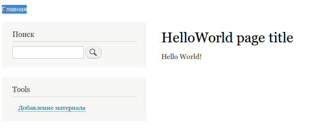

Если вы заинтересованы в разработке на Drupal с технической стороны, а также вам
нравится что будет в Drupal 8, да и вообще какой будет Drupal, то самое время
начинать учиться кодить под него. Сейчас как раз тот период, когда можно без
спешки сидеть и изучать всё новое.

В данной статье не будет ничего сверх-необычного и сложного. Мы создадим модуль,
с учётом всех структурных изменений, который будет регистрировать страничку и
отдавать по ней Hello World.

### Для тех кто знаком с Drupal 7

Раздел посвященный для тех кто уже знаком с Drupal 7. Если же вы под него не
программировали, можете смело пропускать.

Итак, вы знакомы c программированием под Drupal 7? Это очень хорошо, стартануть
будет немного проще, но всё же, грубо говоря, придется учиться заново. Слишком
сильно перелопатили ядро. Первым делом, рекомендую выучить основы ООП в php,
если вы с ними не знакомы, конечно, ибо они станут первой стеной на пути к
изучению. Могу посоветовать небольшой цикл обучающих материалов
на [Codecademy](https://www.codecademy.com/learn/learn-php/modules/classes-and-objects-in-php).
Можно за пол часа понять всю суть ООП, как его использовать в php и т.д., а опыт
придет уже непосредственно в момент применения этого всего в Drupal 8.

Что касается API, тут всё немного может оказаться для вас печальным. Подавляющее
большинство хуков убрали с концами, поэтому это может вызвать на первых этапах
непонимание. Учитывая что пока документация гуглится очень сложно, а среди
нагугленного часто попадаются
неактуальные, [я собираю список изменений][drupal-8-api-changes] среди
популярных функций и их замен, возможно окажется полезным.

В остальном же, принципы и идеология остались неизменными. Изменились лишь
средства и подходы к разработке, многое упростили, многое усложнили, а некоторое
и вовсе убрали, хотя, быть может, это кажется только мне и сейчас, а потом
окажется упрощением. Многое может вызывать когнитивный диссонанс, но это
нормально, учитывая каким измениям подвергся Drupal.

### Общие изменения

В Drupal 8 пересмотрели вообще все. Если идти по пунктикам создания модуля, то
изменения начинаются с самых первых пунктов. Теперь модули располагаются не в
/sites/all/modules, а в корневой папке /modules.

Все info файлы, а также многие функции, например, hook_menu(), заменены .yml
файлами в корне модуля.

Появился стандарт PSR-4, который влияет на структуру папок. Допустим, файлы
отвечающие за формы, должны находиться строго по адресу: 
**mymodulename/src/Form**, а также подобные мелочи, не учитывая которые, модуль
будет работать некорректно. Но к ним привыкаешь после первого же раза, слишком
уж мелкие изменения, зато, надо заметить, удобные и правильные. Теперь не будет
хаоса в модулях.

### Создаем структуру

Для начала выполняем следующие действия:

1. В корневой папке modules создаем папку для нашего модуля: **helloworld**. (
   При условии что наш модуль будет называться helloworld).
2. Создаем пустой файл **helloworld.info.yml**.

Эти шаги - набор минимум для создания модуля. Теперь пройдемся по файликам.

### helloworld.info.yml

Данный файл, как и в 7 версии, отвечает за базовую информацию о модуле, разница
лишь в том, что теперь это всё хранится в новом формате.

Давайте добавим в него следующие строки:

```yml
# INFO: Комментарии указываются в yml через хэштег.
# Название модуля (отображается в списке модулей).
name: Hello World
# Описание модуля. Пишется исключительно на английском.
description: 'HelloWorld module - is my first module!'
# Объявляем что это модуль.
type: module
# Версия ядра для которого модуль.
core: 8.x
# Версия модуля.
version: 1.0
# Пакет для модуля. По-сути, просто раздел в модулях где будет распологаться наш модуль.
package: Examples
```

Более подробно прочитать о **.info.yml** файлах и что там может быть можно
в [официальной документации](https://www.drupal.org/node/2000204).

На этом базовая подготовка закончена. Модуль должен появится в списке и его уже
можно будет включать/удалять.


### Создаем страницу с Hello World

Теперь нам необходимо зарегистрировать url нашей будущей страницы и вывести на
ней Hello World.

Для начала нам нужно создать контроллер, который будет отвечать за вывод на
страницу:

1. Создаем в корневой папке модуля новую папку: **src**.
2. Создаем в папке src новую папку: **Controller**. Папка так и должна
   называться с большой буквы.
3. Теперь создаем файлик с нашим контроллером, его имя уже не особо имеет
   значения, давайте назовём его: **HelloWorldController.php**. Название должно
   начинаться с большой буквы. (ЗАКРЫВАЮЩИЙ ?> не нужен!)

```php
<?php
 /**
  * @file
  * Contains \Drupal\helloworld\Controller\HelloWorldController.
  * ^ Пишется по следующему типу:
  *  - \Drupal - это указывает что данный файл относится к ядру Drupal, ведь
  *    теперь там еще есть Symfony.
  *  - helloworld - название модуля.
  *  - Controller - тип файла. Папка src опускается всегда.
  *  - HelloWorldController - название нашего класса.
  */

/**
 * Пространство имен нашего контроллера. Обратите внимание что оно схоже с тем
 * что описано выше, только опускается название нашего класса.
 */
namespace Drupal\helloworld\Controller;

/**
 * Используем друпальный класс ControllerBase. Мы будем от него наследоваться,
 * а он за нас сделает все обязательные вещи которые присущи всем контроллерам.
 */
use Drupal\Core\Controller\ControllerBase;

/**
 * Объявляем наш класс-контроллер.
 */
class HelloWorldController extends ControllerBase {

  /**
   * {@inheritdoc}
   *
   * В Drupal 8 очень многое строится на renderable arrays и при отдаче
   * из данной функции содержимого для страницы, мы также должны вернуть
   * массив который спокойно пройдет через drupal_render().
   */
  public function helloWorld() {
    $output = array();

    $output['#title'] = 'HelloWorld page title';

    $output['#markup'] = 'Hello World!';

    return $output;
  }

}
```

Контроллер есть, функция отвечающая за вывод тоже, осталось только
зарегистрировать страницу, при обращении на которую будет дергаться наш
контроллер. Делается все это роутингами, для этого нам понадобится в корневой
папке модуля создать новый файл: **helloworld.routing.yml**.

Данный файл описывает адреса страниц, и что по их обращению будет сделано. Для
тех кто знаком с Drupal 7, вы увидите сильное сходство с hook_menu() - ведь это
на его замену пришли роутинги и в частности, данная функция заменена этим
файлом.

Итак, мы создали файл для роутингов, теперь заполним его:

```yml
# Первым делом объявляется машинное имя роута. Оно составляетсям из:
# название_модуля.машинное_название_роута.
helloworld.hellopage:
  # Указываем путь роута, с лидирующим слешем.
  path: '/hello'
  # Значения по умолчанию
  defaults:
    # Функция контроллера отвечающая за содержимое.
    _controller: '\Drupal\helloworld\Controller\HelloWorldController::helloWorld'
  # В данном разделе указываются необходимые требования для роута.
  requirements:
    # Мы будем показывать страницу только тем, у кого есть права на просмотр
    # содержимого.
    _permission: 'view content'
```

Сохраняем. Включаем модуль и заходим по адресу: **/hello**



BINGO!

Готовый модуль прикреплен к материалу.

[drupal-8-api-changes]: ../../../../2014/10/07/drupal-8-api-changes/index.ru.md
