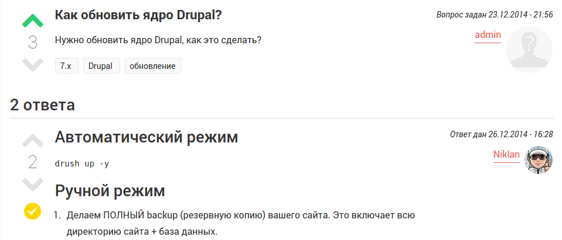

Алоха и с наступающим всех Новым Годом!

Хочу представить вам своё новое начинание, а именно — [Dru.io](http://dru.io/).
Как ясно из заголовка, это попытка хоть как-то возобновить и сконцентрировать
хоть где-то русскоговорящее сообщество Друпалеров.

Сразу скажу о судьбе проекта, да и скорее всего, почему я вообще его сделал. Им
я не претендую заменить Drupal.ru, это совершенно отдельное и самостоятельное
начинание. Скажем так, альтернативное сообщество, как каким-то пытался стать
DrupalSN, но, к сожалению, он не взлетел. Было много причин его гибели, и
большая часть заключалась в его закрытости от обычных людей, т.е. это было
сообщество для “шарящих”, а другие идут лесом. В этом был фатальный недостаток,
ибо у нас нет критической массы профи Друпалеров чтобы такой проект жил, а
делать его доступным принципиально не хотели.

## Проблема

Теперь же пару слов, наверное, на самый первый вопрос: “Зачем”? Затем, чтобы
решить проблему. Всё дело в том, что Drupal.ru совершенно, я не побоюсь
употребить данное слово, ужасное и унылое сообщество, а кто говорит иначе, лишь
обманывает себя. И это надо решать, а решать его путем совершенствования самого
Drupal.ru невозможно, ибо начинаний было много, были каждый год, и все кончалось
вы сами знаете чем — “Осенью” (дошло до того что уже даже стихи про друпал осень
пишут). Уже только на моем счету около 3-ех или 4-ех “осеней”, а он как был уг,
так и остался.

Наверное даже найдутся те, кто ткнут мне пальцем в начинание по возрождению
Drupal.ru на гитхабе, и да, я знаю, и даже был на видеоконференции посвящённой
обсуждению данной проблемы. Даже если везде будет сопутствовать успех, результат
раньше чем через год вряд ли будет, если вообще будет. Пока что успех очень и
очень сомнительный, большая вероятность что дальше ТЗ не уйдет.

Вернемся к друпал.ру. Проблема в том, что он просто устарел во всех смыслах.
Контент там скатился в сточную канаву. Чтобы что-то дельное найти, надо
потратить часы, и не факт что найдется. Банально, там каждый вопрос был задан
уже раз по 100, и в 99 из этих 100 вопросов ответ будет следующий: “Гуглите, уже
отвечали”. И это ладно когда это второй или третий такой вопрос, но когда он
сотый, то гугл уже почти всегда выдает один из этих 99 где отсылают на поиски и
человек попадает в рекурсию. Он спрашивает — посылают в гугл, он ищет в гугле,
попадает на очередные посылы в гугл.

Также друпал.ру создает негативное впечатление о друпале в целом. Человек
который нашел где-то в инете что-то крутое про друпал и загорелся идеей изучать,
или делать на нем сайт, ищет, в 99 из 100 случаев, русское сообщество и попадает
на этот чудо ресурс. Где все друг друга троллят и посылают в гугл. Да и вообще,
выглядит сайт очень стрёмно, даже сообщество джумлы намного привлекательнее.
Сайт русского сообщество совершенно не показывает возможности друпала, не
презентует друпал, вообще ничего не делает, в общем то. Это лишь вредит Друпалу,
а так как альтернатив нету, то больше ничего и не находится. И ещё туча проблем,
можно целый доклад подготовить, все кто уже с опытом, хотя бы в пол года,
понимают о чём я. За него просто стыдно, на этом я прекращаю негатив.

## Решение

А решение простое — надо обновлять, а так как обновлять просто не дают, надо
делать конкурирующие ресурсы и предлагать альтернативу. Конкуренция всегда на
пользу, и даже если моё начинание так и загнётся, но даст пинок и старт на
апдейт друпал.ру — можно считать что всё это было не зря. По крайней мере,
пытаться возрождать, строить и поднимать русскоязычной Друпал сообщество кому-то
нужно, кто-то занимается в реале, делая кемпы, кафе и прочее, а кто-то в
интернете, делая гайды или сайты, и это здорово! Ведь все эти начинания и
конкуренции можно считать локальными, которые лишь на руку Друпалу, нежели
вредит ему.

То что есть большое количество заинтересованных в друпал лиц, в основном
новичков, но им просто негде приютиться, мне еще напоминала моя почта. Наверное,
это стало ключевым пинком мне, для старта работ, ибо изначально сообщество
планировалось локальное и откладывалось пока тут появятся другие лица кроме
меня. Мне на почту приходят пачками письма с вопросами, я вижу как в
комментариях люди задают свои вопросы, но когда их более 100, что-то либо там
понять, не прочитав весь диалог, проблематично. И это тоже не есть решение.

Собрав всё это в куче и осмыслив, было решено сделать и запустить данный проект.
Поэтому, Welcome.

## О проекте

Как вы могли догадаться, все друпальные начинания у нас стабильно загибаются не
успев даже разогнуться. И это начинание может также загнуться, ведь все зависит
не от меня, а от пользователей и сообщества, которое примет это или отвергнет.
Поэтому был создан самый важный и нужный функционал для такого сообщества, по
мере популяризации ресурса я буду улучшать его и добавлять новые функции. Идей
просто море, но делать всё и сразу — это крест на проекте, не сколько из-за
проблем по времени, сколько показывает опыт других ресурсов.

На данный момент реализованы всего-лишь два функцианальных раздела: Вопросы и
Публикации.

Вопросы — предназначены для ясно для чего. Реализованы с закосом на
stackoverflow и ему подобные. Где ответы имеют рейтинг и сортируются основываясь
на нём, а также человек, который задал вопрос, имеет право выбрать лучший ответ,
который вне зависимости от рейтинга поднимается вверх. Наверное, это самый
нужный и важный раздел друпального сообщества на данный момент, ибо новички
просто не знают где спрашивать, а друпал.ру для этого уже не пригоден.

Публикации — простяцкий раздел для публикаций содержимого. Пока что нужен с
целью каких-то оповещений и мини-статей, например по обновлению ресурса.

Данного функционала я считаю хватит за глаза для новичков и старта проекта в
целом. А дальше уже буду оперировать статистикой. Если интерес будет проявлен —
проект будет жить и развиваться, улучшаться, модернизироваться, а если будет не
нужен, то в таком виде и загнется. Поэтому, для того чтобы сайт функционировал,
ему нужна “кровь”. Идей для функционала гора с вишенкой, но всё это лишь идеи,
пока нет критической массы людей, кому они пригодятся и помогут.

Так что, ещё раз с наступающим Новым Годом, всего вам наилучшего в будущем году,
и добро пожаловать на [Dru.io](http://dru.io/).

P.s. Рейтинг сейчас ни на что не влияет. Используется только в поиске, и для
фильтрации комментариев. Я помню как обсуждение рейтинга свелось к разделению на
два лагеря, при обсуждении подобного для друпал.ру. А тут он есть, но ничего не
меняет, не влияет и лишь отображает полезность чего-либо. Возможно в дальнейшем
будет задействован, пересчитать можно всегда, но вот уже как задействовать надо
будет решать тем, кто наводнит данный сайт, если такое вообще случиться. Поэтому
сайт на поддомене. Если заживет, отделим его в отдельный ресурс.
