Я уже пол года как перевел все свои проекты и разработку с drupalhosting
на [DigitalOcean](https://www.digitalocean.com/?refcode=ed9cdd594ecd). Теперь я
хочу поделиться, как я туда переезжал, и как там всё настраивал.

Причиной перехода с drupalhosting стал переход оплаты на $, а затем, всё это
стало очень невыгодно, и всё это случилось до скачка курса. Мелкие сайты,
визитки, посадочные страницы там всё же выйдет держать дешевле чем на самом
дешевом варианте в DO, но все что имеет посещаемость и какую-никакую нагрузку,
уже становится невыгодным.

Также немаловажный фактор стал что, возможно, я просто уже вырос из хостингов, и
мне хотелось большего, так сказать, простора и контроля. На digitalocean я
получил его в полном объеме, это полноценный выделенный облачный сервер, которым
ты распоряжаешься как душе угодно. Никаких проблем не составит подключить
дополнительные языки программирования, софт вроде Solr, Sphinx, Elasticsearch,
обновиться до последней версии php и множество других плюсов. Разумеется, всё
это требует настроек, поэтому я пишу данный гайд, как поднять свой сервер, не
владея большими знаниями в администрировании (как у меня).

Скажу сразу, за эти пол года, я ни разу не столкнулся с проблемой, сервера не
разу не зависли, не упали, никаких отказов и т.д. Работало всё как часы, при
этом я смело ставил на сервер различные пакеты, и всё стояло как часы.

В текущем материале я напишу, как развернуть свой мини-хостинг. Почему
мини-хостинг? Потому что на нём будет полноценная CP, с возможностью добавлять
отдельных пользователей, тарифы и эти самые тарифы присваивать пользователям, по
принципу хостинга. При этом у каждого будет своя защищенная область от других
лиц. Отличная возможность предложить услуги содержания сайтов клиентов, если они
настаивают на этом. А главный плюс в том, что у вас появляется полная свобода, и
соотношение цена\качество просто отличное, даже с учетом текущего курса (!).

А теперь по порядку.

## Преимущества DigitalOcean

* Так как мы друпалеры, то разумеется, все мои проекты там на Drupal, и они
  работают чудесно. За каких-то 10$ я содержу 15 активных сайтов, и всё это
  работает отлично, ничуть не хуже чем на drupalhosting. При этом я в эти 10$
  могу напихать еще, сколько угодно сайтов, при этом цена не изменится. На
  drupalhosting я за 6 из этих 15 сайтов, в последние месяцы платил более ~
  20-25$.
* У данного VPS-провайдера, очень офигенное сообщество. Гайды по настройке,
  администрированию и прочим тонкостям присутствуют в полном объеме, а
  некоторые, уже переведены на русский.
* Отличная поддержка, отвечают быстро и полно.
* За пол года использования ни одного глюка, зависания, падения, перезагрузки
  без моего ведома.
* За эти пол года у них была неполадка на серверах где хостится мой дроплет, за
  время решения мои проекты остались в сети и работали как прежде. Т.е. их
  проблема никак не задела меня, хотя относилась именно к этому датацентру.
  Причем, устранили её оперативно, за пару часов.
* Полностью SSD-шные диски. Сейчас модно ставить на хостинги и сервера SSD
  диски, так как они очень быстрые. Но стоят они не дешево, а в таких масштабах
  и подавно накладная покупка. У большинства русских их нет, либо частично (под
  базу данных как drupalhosting), либо полность, но стоит такое удовольствие
  ой-ой-ой, почти десятикратно превышает у аналогов за рубежом. А с текущим
  курсом закупка их либо остановится, либо русские сервера на них подорожают
  раза в два.
* Отличное соотношение цена\качество даже при текущем курсе. Всего за 5$ в
  месяц, можно получить сервер с 512мб оперативки и 20гб SSD. Такойже VPS на
  reg.ru, только с 10гб SSD, стоит 561 руб. По текущему курсу (64/$) на DO вам
  он обойтется в 320 руб., +10 гб SSD. Так что сами видите, даже при курсе в
  100руб. за 1$ будет оставаться выгодным и конкурентоспособным среду
  отечественных хостеров.

## Регистрация на DigitalOcean

Для начала нам необходимо зарегистрироваться на сайте. Для этого проходим
по [ссылке](https://www.digitalocean.com/?refcode=ed9cdd594ecd), и
регистрируемся. Сложностей вызвать не должно. Придется привязать свою кредитку,
или же заплатить 5$ с PayPal для активации (с карты ничего не снимается).

P.s. да, ссылка реферальная, можете перейти
по [обычной](https://www.digitalocean.com/), но имейте ввиду, регистрируясь по
реферальной, вы получаете 10$ на счёт в подарок сразу же. Вас не заставят их
платить, вы вообще ничего не теряете, вы просто получаете 10$ и начинаете
тратить. Отличный способ “попробовать” как гайд, так и хостинг на своих плечах
не потратив ни копейки из своих денег.

## Создание дроплета

На DigitalOcean, сервера называются дроплеты, вы можете создавать ограниченное
кол-во дроплетов на один аккаунт, но всё это расширяется обращением в службу
поддержки.

Итак, переходим на страницу создавния дроплета и для начала нам нужно дать
название нашему дроплету и выбрать необходимую мощность сервера (тариф).

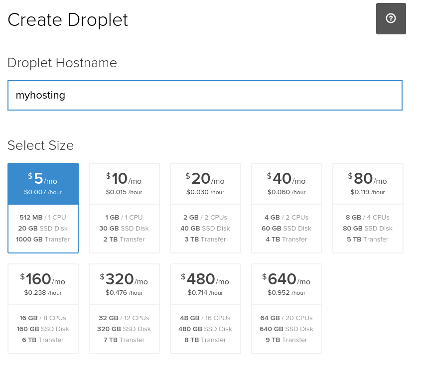

Я назвал дроплет myhosting и для демонстрации выбрал тариф за 5$.

На этапе выбора региона следует учитывать географическое расположения
датацентров. Если ваша цель Европа\Страны СНГ, то необходимо выбирать Амстердам.
В некоторых случаях прокатит и Лондон, но учтите что он дальше Нидерландов, и
пинг будет выше, причем ощутимо. Поэтому лучше не рисковать и выбирать
Амстердам. А какой номер датацентра, разницы не имеет, просто выбирайте какое
число больше нравится из доступных. Допустим, на момент написания, первый ДЦ
полностью занят и там создавать дроплеты нельзя.

Далее идут дополнительные настройки. Их включается на своё усмотрение и если
понимаете зачем они. Учтите, что услуга бэкапов идёт отдельной стоимостью. Мы же
сделаем бекапы самим сервером и будем хранить их у себя.

Далее выбор сервера\приложения и прочие возможности. Учтите, что хоть в
приложениях и есть Drupal на Ubuntu 14.04, там всего-лишь настроенный вебсервер
под один (!) сайт. Нам нужен сервер, и в текущем гайде я буду использовать
Ubuntu 14.04

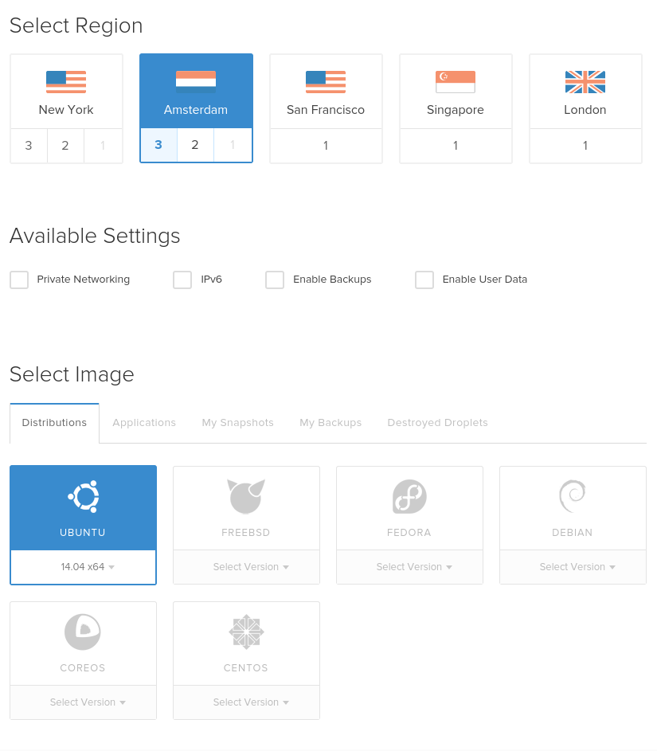

После этого жмём зеленую кнопку “Create droplet” и дожидаемся установки
дроплета.

## Панель управления дроплетом

После создания дроплета, вас перекинет на панель управления дроплетом, а также,
вышлют письмо с root доступами на сервер.

Давайте разберемся немного с панелью управления дроплетом.

### Power

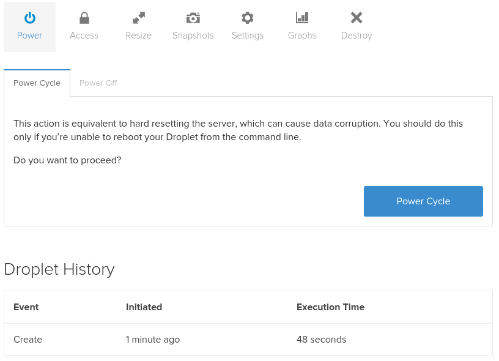

На данной странице вы можете посмотреть небольшую историю по дроплету, выключить
его, чтобы он не действовал, либо сделать hard reset (принудительная
перезагрузка).

### Access

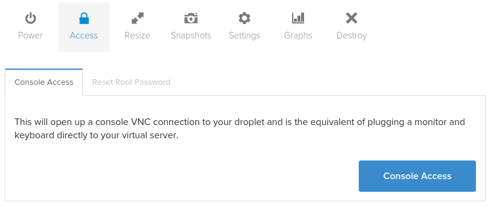

На данной вкладке вы можете получить доступ к консоли сервера прямо из браузера.
Занятие крайне извращенное и неудобное, пригодится лишь в критических ситуациях
когда доступа к нормальной консоли получить не удается. Также тут можно поменять
root пароль.

### Resize

Данный раздел окажется для вас полезным, если вы захотите усилить свой сервер.
Допустим, перейти на тариф за 10$. Это сделает переход безболезненным,
потребуется лишь перезагрузка сервера.

### Snaphots

Тут можно сделать “бэкап” всего образа сервера. Полезная опция при переносе на
другой аккаунт. Также позволяет создать дроплет, настроить его и отдать клиенту
по почте. А ему надо будет лишь принять его, при этом он получит полностью
настроенный сервер.

### Settings

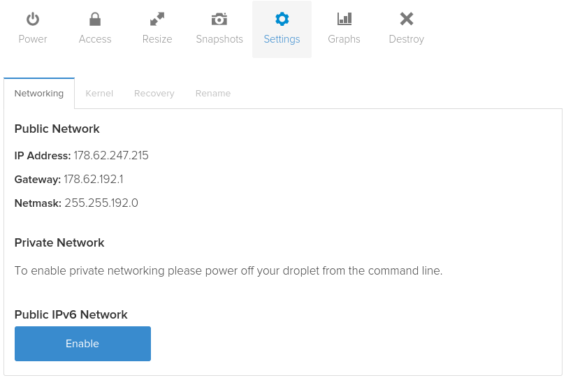

На влкадке настроек, вы можете увидеть все технические данные по дроплету.
Поменять ему ядро прямо из браузера (хотя насколько стабилен такой процесс не
знаю, его не было раньше и я не пробовал), восстановить дроплет из бэкапа (если
они включены или сделан snapshot), а также просто переименовать сервак.

### Graph

Тут вы увидете графики по нагрузке сервера и канала.

### Destroy

А перейдя сюда, вы сможете полностью удалить свой сервак.

## Делаем свой мини-хостинг

В случае успешной установки дроплета, на ваш email адрес должно было прийти
письмо с данным для входа на сервер. Сервером мы будем управлять из консоли,
следовательно, если у вас Linux\Mac OS, просто открываем терминал, если же у вас
Windows, ищем в инете спец. софт, так как стандартная командная строка не умеет
в ssh, вам необходим ssh-клиент. Единственный который я знаю и пробовал когда-то
был Putty.

Теперь нам необходимо подключиться к своему серверу. Для этого в терминале нам
необходимо написать ssh пользователь@ip_вашего_сервера. В моём случае будет так:

```bash {"header":"Подключение к серверу"}
ssh root@178.62.247.215
```

Консоль затребует у вас пароль, вы должны ввести тот что прислали вам на почту.

Если вы успешно зашли, вы должны увидеть примерно следующее:

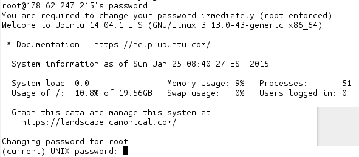

Теперь вам необходимо ввести еще раз текущий пароль, а затем дважды новый. После
чего, мы сможем смело пользоваться сервером.

Давайте поставим CP (Control Panel) для нашего сервера. В нашем случае, я буду
использовать [VestaCP](http://vestacp.com/). Она простая, легка (почти не грузит
систему), очень хороший API, множество возможностей из коробки и она сама
разворачивает вебсервер с nginx при установке.

Поэтому переходим к установке VestaCP, для этого в терминале пишем:

```bash {"header":"Установка VestaCP"}
curl -O http://vestacp.com/pub/vst-install.sh
bash vst-install.sh
```

У нас начнётся установка панели и веб-сервера. Первым делом он попросит вас
согласится, для этого пишем y жмём enter, затем вводим свой email адрес. Затем
он попросит ввести hostname, тут просто жмём enter. Потом начнётся установка.
Там написано что займёт примерно 15 минут, но это не так, заёмет это минуту-две,
даже на таком слабеньком сервере.

После успешной установки вы увидите следующее:

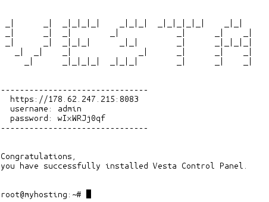

Как вы можете заметить. Там указан адрес для входа в CP, логин и пароль от
админа. Для начала нам необходимо переходить по IP, но когда вы подключите к
сервиру домен, вы сможете заходить по
адресу [https://example.com:8083](https://example.com:8083). Учтите, тут
обязательно должен быть HTTPS и порт 8083.

По сути, на этом установки и настройка сервера уже завершена (лол). Он полностью
готов к продакшену. Если вы более подкаыванный пользователей и вам интересно
потыкаться самому - можете приступать. Те кто не уверен или нуждается в
напутствии, пошли дальше.

## Разбираемся в CP

Итак, заходим по нашему адресу, вводим admin и пароль указанный в терминале.
Если всё ввели правильно, то попадете на главную страницу CP.

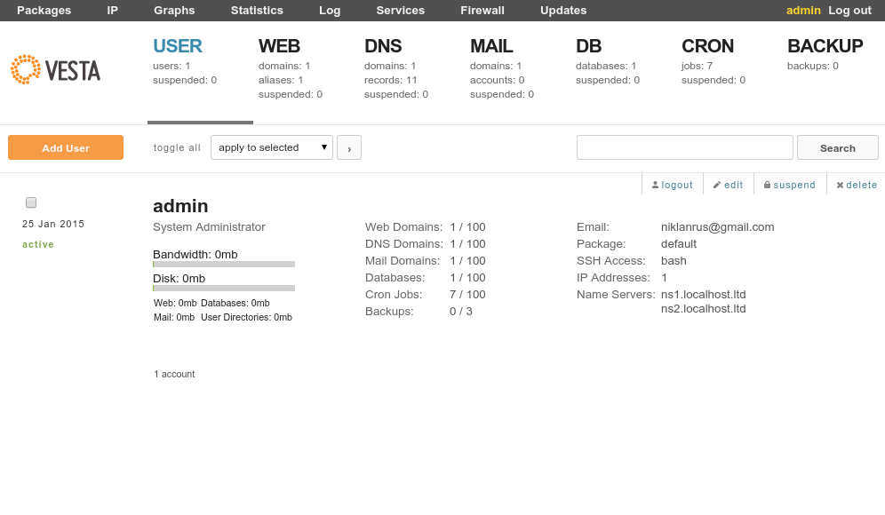

Давайте для начала сделаем его на русском языке. Справа у admin, на влкадке
user, жмём edit, в поле language выбираем ru, сохраняем, получаем всё на
русском.

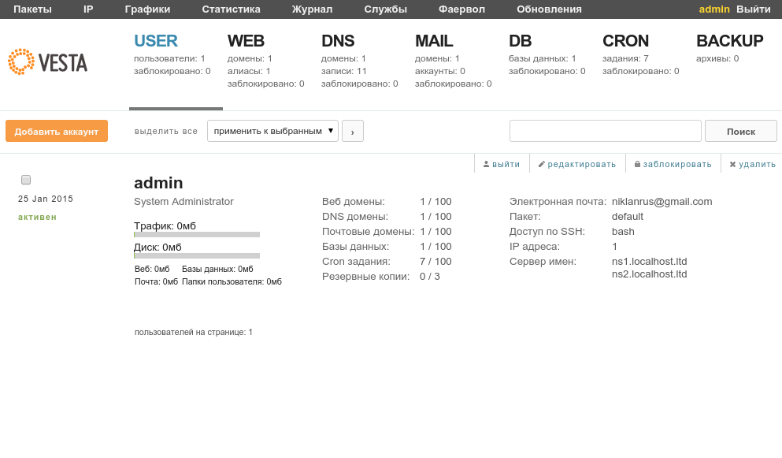

Так привычнее, не так ли? А теперь давайте в кратце расскажу о важных и нужны
вкладках.

Сначала по верхним:

* Пакеты - проще говоря тарифы хостинга. У каждого пользователя свой тариф.
  Тариф может накладывать\снимать ограничения на определенный части сервера.
  Допустим, кол-во доменов, имеет ли пользователь доступ по FTP, максимально
  место на диске и т.д. и т.п. Всё как на хостингах, только правите тут вы сами.
* Службы - тут можно увидеть все важные запущенные службы на сервер, отсюда
  можно перезагрузить как весь сервер, так и перезапустить определенные его
  части, например веб-сервер.

А теперь чуть пониже:

* USER - тут управление всеми пользователями на серве. Удаление, добавление,
  блокировка и т.д.
* WEB - управление доменами текущего пользователя.
* DNS - управление DNS записями для доменов текущего пользователя. В нашем
  случае совершенно бесполезная вкладка (в разделе привязки домена будет
  рассказано почему, если в кратце, они управляются из digitalocean а не
  сервера).
* MAIL - управление почтой. Не тестил, ибо все подключено на gmail.
* DB - управление базами данных.
* CRON - управление кроном сервера.
* BACKUP - все последние бекапы, а также возможность создать прямо здесь и
  сейчас. Также тут можно скачать любой из бэкапов (в зависимости от кол-ва
  которое будет хранится).

А теперь давайте немного полезной информации. Все доступы к серверу пользователь
имеет одинаковые связки. Т.е. всего один и тот же логин, пароль и адрес сервера.
Вместо ip адреса сервера, в дальнейшем можно будет заменять доменом который
прикреплен на данный ip.

Например, чтобы подключиться к серверу по ssh как админ, надо ввести следующее:

```bash {"header":"Подключение к серверу как пользователь admin"}
ssh admin@ip
```

А затем ввести пароль от пользователя admin. Кстати, по умолчанию, у всех
тарифов, а следовательно и пользователей, будет отключен доступ к серверу по
ssh. Вы можете его включить, зайдя в настройки конкретного пользователя и
выставив параметр “Доступ по SHH” на bash, либо зайти в пакеты, и целому тарифу
разрешить доступ по sh.

Для подключения по FTP:

* Имя сервера\хост: IP или любой домен с этого IP
* Логин: admin
* Пароль: пароль пользователя admin

## Добавление домена на сервер

Добавление домена, к сожалению, или счастью (?) делается через панель управления
DigitalOcean, чем это вызвано я не знаю. Но занятие это не сложное. Допустим у
нас есть домен example.com, чтобы его добавить, мы для начала должны зайти в
панель управления DigitalOcean на пользователя, который является владельцем
дроплета которому необходимо дать доступ к этому домену.

В панели управления DO слева есть ссылка “DNS”. Попадаем на страницу управления
доменами, для добавления нового жмём “Add domain”. Заполняем поля:

* Name: сам домен
* ip address: ip адрес дроплета который получит доступ к домену, справа можно
  выбрать дроплет и ip подставиться самостоятельно

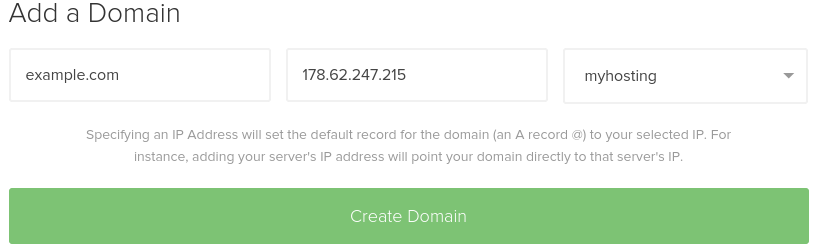

Жмём Create Domain и вы увидите примерно следующее:

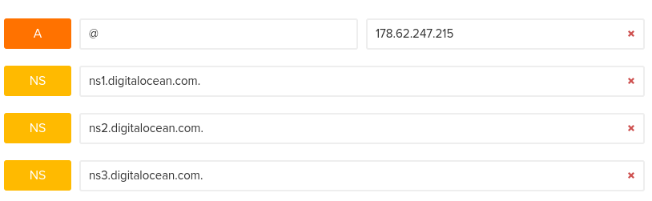

Но лучше сразу добавить все необходимые настройки. Для этого на странице есть
кнопка Add record. При помощи неё мы можем управлять DNS записями домена (
следовательно DNS раздел в CP просто ненужен).

Давайте сделаем так, чтобы помимо домена example.com мы также могли спокойно в
дальнейшем добавлять evrething.you.want.example.com (т.е. поддомены любого
уровня), в противном случае каждый поддомен придется прописывать тут руками. Для
этого жмём “Add record” выбираем “CNAME”. В поле name пишем * а в поле хост
указываем адрес сайта с точкой на конце.

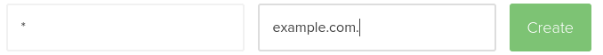

Затем жмём create. Всё, этого достаточно. Вы можете добавлять и настраивать
какие угодно записи, т.е. полностью управлять доменом. Если вы хотите
пользоваться gmail почтой для данного домена, то жмём “Add record”, затем
выбираем MX, и внизу будет кнопка для автоматического заполенный данных для
gmail, просто жмём и всё готово. Для данного домена можете забыть о настройке
надолго или навсегда :).

Теперь нам надо связать домен с сайтом. Заходим в нашу CP, переходим в раздел
WEB и жмём “Добавить домен”. В поле “Домен” пишем наш домен example.com, IP не
трогаем, снимаем галочку “Поддержка DNS” (зачем нам засрять NS записи которые не
используются?), и если не хотите разворачивать почтовый сервер, также снимите
галочку “Поддержка почты”. И жмём “Добавить”.

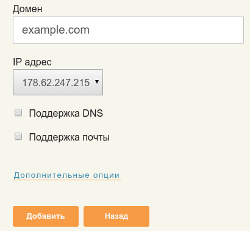

## Запускаем Drupal

Если вы всё сделали правильно, у вас уже должен работать сервер, и по адресу
example.com открываться заглушка с названием домена. Но ведь нам нужен друпал,
что делать? Для этого нам как минимум, не хватает базы данных.

Давайте создадим базу для друпала. Для этого в CP переходим на вкладку DB (там
будет стандартная БД, можете удалить, а можете пользоваться прямо ею), жмём
“Добавить БД”. Заполняем данные:

* База данных: название таблицы БД, приставки с именем пользователя будет
  добавлена автоматически.
* Пользователь: пользователь БД, приставка также будет добавлена автоматом.
* Пароль для доступа.

После того как заполнили все эти три поля жмём “Добавить”, попутно можете
удалить email адрес, если не хотите чтобы данный по БД ушли на почту.

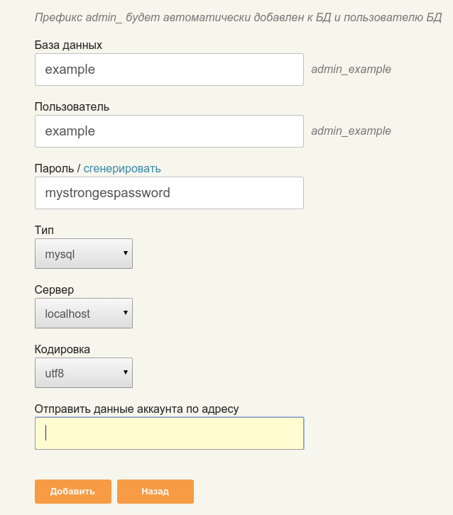

Теперь время загрузить ядро друпала на сервер. Для этого воспользуемся FTP. Как
подключаться я писал выше, подключаемся и отгружаем ядро в папку
/web/example.com/public_html.

Теперь зайдя по адресу подключенного домена у вас должна запуститься установка
друпала. Данные для базы указываем как выше. Т.е. в моём случае, база и
пользователь admin_example, а пароль mystrongestpassword. После чего всё как по
старинке, уже можно работать с друпалом.

Если нужен еще один сайт. Подключаем домен (если он новый, в случае поддомена
действий в DO не нужно), создаем домен и бд в CP, отгружаем друпал или что
угодно.

## Установка Drush

Как можно пользоваться Drupal не установив Drush? И мы займёмся его установкой,
но только кое-что замечу. Делать это всё нужно из под admin. Т.е. в терминале
подключиться по ssh admin@ip. Почему? Потому что он админ и в системе, и там
можно выполнять команды без правд root пользователя, когда под root, всё
выполняется из под него же, что выливается потом в недостаток прав у других. И
вообще, забудьте о юзере root почти навсегда, он на крайние случае
администрирования сервера.

**upd** от 22.10.15 - установку через pear уже не рекомендую, намного проще
делать через композер, легче обновлять сам драш и переключаться между версиями,
включать необходимую для конкретного проекта и т.д.

### Установка через composer

Заходим на сервак под **root** и выполняем команды (устанавливаем Drush 7):

Если ранее стояла версия от pear, лучше удалить.

```bash {"header":"Удаление pear версии Drush"}
sudo pear uninstall drush/drush
```

```bash
composer global require drush/drush:dev-master
composer global update
ln -s /root/.composer/vendor/bin/drush /usr/bin/drush
```

Если ругается что уже есть `usr/bin/drush`, то выполняем следующую команду:

```bash
rm /usr/bin/drush
```

Далее выходим с рута `logout` и заходим под админом. Чтобы заработал драш у
админа, достаточно написать:

```bash
composer global require drush/drush:dev-master
```

Всё, теперь драш будет работать у админа. Можете менять версии драша и т.д.
локально только для админа. Новым пользователям придется выполнить эту команду
для получения доступа к драшу.

Обновить drush можно командой:

```bash
composer global update
```

### Установка Drush через pear

Итак вы зашли под админом, пишем в терминале (запрошенный пароль будет от
админа):

```php
sudo pear channel-discover pear.drush.org
sudo pear install drush/drush
sudo drush version
```

Последняя команда помимо вывода текущей версии drush, также скачает и установит
все необходимые библиотеки без которых он работать не будет. Поэтому третья
команда обязательна и под sudo.

Теперь каждый пользователь сервера сможет пользоваться Drush.

Например, чтобы обновить версию Drupal у сайта example.com. Мы должны зайти под
пользователем кому он принадлежит (admin), затем перейти в папку с ядром и
обновить:

```php
cd web/example.com/public_html
drush up -y
```

Немного подробнее о Drush можете [прочитать тут](http://niklan.net/blog/22).

## Заключение

Всё, ваш сервак готов к труду и обороне. Полностью ваш, делайте с ним что
хотите. И не забывайте, заходите с root пользователя только в крайних случаях,
для всех остальных есть admin. Удачи.
