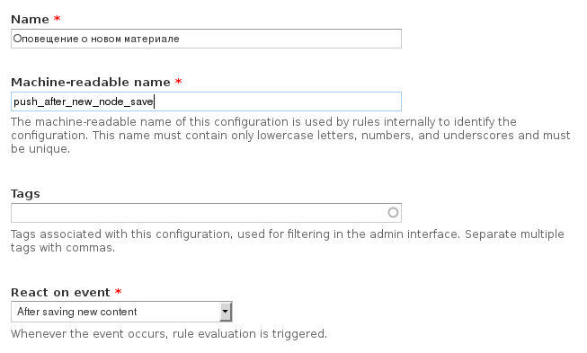

Привет, хочу представить вам небольшой новый
модулёк — [Pushbullet API](https://drupal.org/project/pushbullet). Данный модуль
предоставляет реализацию API от одноименного сервиса.

## Pushbullet — что это вообще?

[Pushbullet](https://pushbullet.com) — это такой небольшой сервис, который
позволяет отправлять пуш-уведомления на различные устройства: Android, iOS,
Windows, Mac OS, Linux и даже браузеры Firefox и Chrome (и все его аналоги).
Т.е., грубо говоря даже на холодильник можно послать оповещение, достаточно
иметь там Android.

Сервисы выступает посредником, они подготовили все программы. расширения и API,
человеку, желающему получать\отсылать уведомления достаточно зарегистрироваться
и он готов. Дальше ставится софт, куда угодно, и куда душа пожелает. А затем
отсылаем\получаем на них пуш-уведомления.

Для чего он нужен? Например поставить менеджеру пушбулет, а в магазине настроить
оповещение менеджера о поступившем заказе. Отличие от почты: пуш уведомление
появится моментально на экране, т.е. бросится в глаза, никогда не попадет в
спам, ничего не нужно обновлять, а софтинка весист пару мегабайт и не нагрузит
систему как полноценный почтовый менджер.

Пуш-уведомления отсылаются либо на все устройства пользователя, либо на
конкретный. Удобно это и тем, что прочитав пуш-уведомление на одном из
устройств, оно автоматически прячется на всех остальных.

## Pushbullet API

Созданый модуль, позволяет спокойно отсылать пуш-уведомления, без особого
гемора. Также для облегчения старта и простых операций есть интеграция с Rules,
где можно настроить пуш уведомления не написав ни строчки кода.

Как видно из названия, всё же модуль раскрывает все свои возможности только с
кодом. Если при помощи Rules вы можете отсылать уведомления, то кодом вы можете
отсылать, получать, управлять ими (помечать прочитанными, удалять, менять),
управлять устройствами (добавлять, удалять, менять), управлять подписками,
загружать файлы и т.д. и т.п.

Писать как это реализуется, скорее нету смысла, исчерпывающая демонстрация всех
возможностей API находится
в [README](https://github.com/Niklan/Pushbullet#code-examples).

## Pushbullet API + Rules

Так как интерес к модулю мог возникнуть у технически не подкованных
пользователей, то была сделана простая интеграция с Rules. Благодаря этой
интеграции можно отправлять пуш-уведомления любого типа прямо из админки.

Например, сделаем оповещение о новом материале. Для начала нам надо иметь
аккаунт на официальном сайте сервиса, затем жмём на аватарку -> Account
Settings. Там вы увидите свой Access Key. Его запишите, или оставьте вкладку
открытой. Он используется для отправки и получения сообщений.

Теперь зайдем в админку друпала и создадим новый Rule (правило). Для этого жмём
Add new rule (добавить новое правило). Называем, допустим, “Оповещение о новом
материале”, добавив реакцию на “After saving new content” (после сохранения
нового материала), после чего жмём “Сохранить”.

Теперь нам надо добавить Action (действие), которое выполнится после добавления
нового содержимого. Для этого жмём Add action (добавить действие) и у вас должен
появиться новый раздел Pushbullet, со всеми возможными типами пуш-уведомлений. В
кратце о каждом из них:

* Push note — обычная заметка, состоящая из заголовка и небольшого текста.
* Push link — тот же самый push note, с единственным отличием, он также имеет
  ссылку. Когда человек нажмет на данное пуш-уведомление, он будет переадресован
  по указанной ссылке.
* Push file — аналог push link, только вместо переадресации начнется скачивание
  файла по адресу без открытия браузера.
* Push list — аналог todo списка. Каждый элемент списка имеет чекбокс для
  отметки. На программном уровне можно получать и менять значения и состояния
  чекбоксов.
* Push address — с пуш уведомлением также отсылается адрес. При нажатии на пуш
  уведомление, местоположение показывается на карте.

Лучше всего нам подходит Push link. Нам достаточно указать что появилось новое
содержимое, небольшое описание, и при нажатии будет перекидывать на этот
материал. Так что выбираем Push link. Перед нами открывается форма настройки
действия. В зависимости от типа уведомления, у него меняется 1 дополнительное
поле для значения, пробежимся по основным:

* Access token — ключ пользователя, которому будет отослано уведомление. (Тот
  самый ключ из Account Settings) Также можно указать ключ того, с чьего
  аккаунта будет отсылаться пуш-увдеомление, в таком случае ниже придётся
  заполнить дополнительное поле.
* Push title — заголовок пуш уведомления.
* Push body — краткое описание пуш уведомления.
* Push url — уникальное поле для данного типа пуш уведомления. Тут указывается
  ссылка, которая должна открываться при нажатии на уведомление.
* Recipient — данное поле заполняется в том случае, если в Access token был
  указан токен, с аккаунта которого надо отправить уведомление. Recipient может
  принимать: email кому отправить, идентификатор конкретного устройства или тег
  канала (отправится всем кто подписан на канал).

Все данные поля могут принимать как plain text, так и токены. В общем тут всё
стандартно для Rules. Нам осталось сохранить и протестировать. Для демонстрации
я записал небольшой ролик:

Заинтересовало? [Качайте](https://drupal.org/project/pushbullet) и пользуйтесь.

P.s. спасибо Александру Дубовскому за наводку на столь интересный сервис.

:: youtube {vid=O1cPGTPJ49Y}
