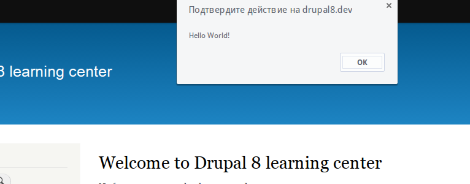
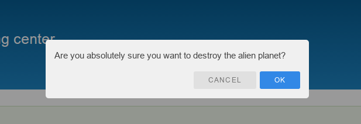

Алоха! Вот и вышел Drupal 8 rc1, самое время начинать учиться кликать, а кому-то
кодить. Постепенно буду что-то изучать и попутно писать об этом. Напоминаю что у
меня уже есть статья [Drupal 8: Изменения API][drupal-8-api-changes], где у меня
в виде сравнения показано как было и как стало. Там, кстати, данная тема также
была задета краешком глаза.

Что же мы имеем в Drupal 7? Для добавления JavaScript и CSS файлов мы имели
следующие функции: drupal_add_js() и drupal_add_css(). Также мы могли подцепить
их через **#attached**, особо смелые вставляли прямо в **\*.tpl.php**. Что же мы
имеем в Drupal 8? Функции были удалены, а вставлять в темплейт всё также можно,
но не нужно. Остался вариант с #attached, но он также подвергся небольшим
изменениям. И тут мы приходим к *Libraries API*. Кто работал с Drupal 7, скорее
всего сталкивались с его hook_libraries_info() (это был сторонний модуль), при
помощи которого мы могли объявлять свои сторонние либы и хранить их удобно в
папочке /sites/all/libraries. Теперь примерный функционал в ядре 8-ки, но очень
сильно подвергся изменениям и скомбинирован в одно единое решение, и надо
заметить, круто.

У нового подхода есть одна киллер-фича, теперь JS либы подгружаются только на
тех страницах, где их запросил какой-то модуль/плагин/элемент и т.д. Например,
если на странице ни один модуль не подал запрос на jquery, или для его библиотек
он не установлен в зависимости, то на этой странице jquery не будет загружаться
вообще, тем самым убирая загрузку бесполезных библиотек. Если jQuery, возможно,
будет грузиться везде, так как потребуется многим темам, то вот остальные js уже
не будут появляться без необходимости.

## Этапы

На самом всё очень просто:

- Объявляем библиотеку;
- Подключаем там где она требуется.

## Объявление библиотеки

Как и многие "вещи", в Drupal 8 многие конфигурации вынесли в **\*.yml** файлы,
и объявление библиотеки не исключение. Кто-то начнет плюваться, кто-то
радоваться, но это единственный способ которым можно это сделать. К слову,
многие вещи в 8-ки привели к единственному верному решению. Теперь вариативность
сводится к минимуму и не надо запоминать разные способы.

Начнем с того что файл с объявлением библиотек(и) можно создавать как в теме,
так и в своём модуле. Синтаксис и подход, как я уже сказал, везде теперь
одинаковый. Т.е. теперь даже тема может объявлять свои библиотеки, а модули их
использовать.

Файл с объявлением библиотек имеет следующее именование **\*.libraries.yml**.
Это значит, что если ваш модуль или тема (напоминаю, что теперь не важно кто
объявляет) называется *helloworld* то файл должен называться
*helloworld.libraries.yml* и находиться **в корне** темы/модуля.

Я буду показывать объявление библиотеки на примере модуля, следовательно, у вас
должен быть объявлен модуль в соответствии с новыми требованиями. Можете
объявить сами воспользовавшись моим гайдом
по [созданию hello world модуля в Drupal 8][drupal-8-hello-world], или прямо
оттуда [скачать готовый вариант](../../../../2014/10/12/drupal-8-hello-world/example/helloworld),
на котором я буду всё показывать.

### Базовый синтаксис

Для начала давайте разберемся с синтаксисом файла, для этого я приведу простой
пример и всё что нужно опишу в комментариях:

```yml
# Название библиотеки.
my-library:
  # Версия библиотеки. Надо заметить что на данный момент не ясно как
  # пользоваться данной версионностью. Данная версия используется при загрузке
  # библиотеки. Например: example.com/my-library.css?v=1.x
  # Получается это также можно использоваться для сброса "кэша" либы.
  version: 1.x
  # css - это раздел где объявляются css файлы стилей. (опционально)
  css:
    # В отличии от js, тут имеется дополнительное вложение, которое может
    # принимать следующие занчения:  base, layout, component, state and theme
    # В соответствии с SMACSS стандартом они объявляют вес стилей. Соответственно
    # стили с меньшим весом грузятся раньше, а с большим, в самом конце.
    # base CSS_BASE = -200
    # layout  CSS_LAYOUT = -100
    # component  CSS_COMPONENT = 0;
    # state CSS_STATE = 100
    # theme CSS_THEME = 200
    # Если не понимаете, лучше не рискуйте, используйте theme раздел.
    theme:
      # Непосредственно сам файл стилей относительно модуля/темы.
      css/my-library.css: { }
  # js - раздел для объявления JavaScript файлов. Тут всё проще. (опционально)
  js:
    # Подключение файла относительно модуля/темы.
    js/my-library.js: { }
  # Зависимости. В данном случае для нашей библиотеки мы указываем что надо
  # загрузить jquery на страницу. (опционально)
  dependencies:
    - core/jquery
```

Затем данная библиотека подключается средствами **#attached** в нужном месте.
Почти всё теперь сведено к Render Arrays, следовательно, цепляется примерно так:

```php
// Подключение библиотеки. Состоит из двух частей. 
// Первое - название модуля/темы, второе - название библиотеки.
$page['#attached']['library'][] = 'MODULENAME/LIBRARYNAME';
```

### Пример использования

Для начала давайте создадим JavaScript файлик в нашем модуле, который мы будем
подключать **js/script.js**, и пусть он также выводить hello world:

```js
/**
 * @file
 * Simple JavaScript hello world file.
 */

(function ($, Drupal, settings) {

  "use strict";

  Drupal.behaviors.helloworld = {
    attach: function (context) {
      alert('Hello World!');
    }
  }

})(jQuery, Drupal, drupalSettings);
```

Далее, как я уже рассказал выше, нам надо создать файл с названием
*helloworld.libraries.yml* в корневой папке нашего модуля.

```yml
helloworld:
  version: 1.x
  js:
    js/script.js: { }
  # Так как наш скрипт использует jQuery, мы устанавливаем зависимость/
  dependencies:
    - core/jquery
```

Теперь нам необходимо подцепить нашу библиотеку на нужную страницу/страницы. Тут
уже зависит от задачи. В конкретно данном случае, я покажу как подключить данный
скрипт *на всех* страницах. В *helloworld.module* пишем:

```php
<?php

/**
 * @file
 */

/**
 * Используем hook_page_attachments().
 *
 * Это новый хук Drupal 8, как раз для целей, когда надо подцепить библиотеку
 * на определенных или всех страницах, а может и для каких-то определенных
 * ролей и т.д.
 */
function helloworld_page_attachments(array &$attachments) {
  // Первый helloworld - название модуля, а второй - название либы из yml файла.
  $attachments['#attached']['library'][] = 'helloworld/helloworld';
}
```

Если всё сделали верно, то при загрузке каждой страницы вы должны видеть alert с
*Hello World!*.



#### Дополнительный пример

В данном случае у нас подключается библиотека на всех страницах, но давайте
сделаем так, чтобы данное сообщение показывалось только на странице */hello*. (
Если вы не читали материал по созданию данного модуля, то наверное заметили, что
в нём создан контроллер для страницы /hello)

Первоначально давайте удалим строку с подключением нашей библиотеки
из `helloworld_page_attachemnts()`.

Далее открываем файл контроллера для страницы */hello*:
*/src/Controller/HelloWorldController.php*. В нём нас интересует функция
*helloWorld()*, которая отвечает за вывод содержимого на данной странице. Так
как переменная `$output` является render array, то подключается всё очень
просто (привожу полный листинг функции, чтобы вы заметили изменения):

```php
public function helloWorld() {
   $output = array();

   $output['#title'] = 'HelloWorld page title';
   $output['#markup'] = 'Hello World!';
   $output['#attached']['library'][] = 'helloworld/helloworld';

   return $output;
}
```

Исходя из новой логики Drupal 8, наш *js/script.js* теперь будет загружаться
только на странице */hello*.

### Подключение библиотеки из Twig

Тут мы не будем сильно задерживаться, но может случиться такой случай, когда
библиотеку нужно подключить прямо в шаблоне. И для того чтобы не прописывать по
старинке вставку скриптов/стилей, есть специальный вариант:

```twig
{{ attach_library('MYMODULE/MYLIBRARY') }}
```

## Подключение внешних библиотек

Пока всё идёт как по маслу. Но в примерах выше, мы подключали свою простую
библиотеку. А что делать если нам нужно подключить JS/CSS находящиеся на
удаленном сервере (cdn)? Тут такой способ поставит в тупик, но и для этого есть
решение. Вот листинг подключения внешних библиотек:

```yaml
# Например подключим Angular.js
# Название библиотеки.
angularjs:
  # Ссылка на репозиторий/официальный сайт.
  remote: https://github.com/angular/angular.js
  # Версия подключаемой библиотеки. В данном случае надо указывать
  # ту версию, которую вы подключаете.
  version: 1.4.2
  # Раздел с информацией о лицензии данной библиотеки.
  license:
    # Название лицензии.
    name: MIT
    # Ссылка на файл лицензии. Если отсутствует, что вряд ли, то 
    # указываем ссылку на официальный сайт лицензии где она 
    # и прописана.
    url: https://github.com/angular/angular.js/blob/master/LICENSE
    # Нужно указать true/false. Указывает, совместима ли лицензия с 
    # GPL лицензией Drupal.
    # Узнать можно тут: http://www.gnu.org/licenses/license-list.html#GPLCompatibleLicenses
    gpl-compatible: true
  # Подключаем js.
  js:
    # Прямая ссылка на файл. В {} указываются дополнительные данные. В данном случае
    # что это внешняя библиотека и она сжатая.
    https://ajax.googleapis.com/ajax/libs/angularjs/1.4.4/angular.min.js: { type: external, minified: true }
```

А подключается она точно также:

```php
$page['#attached']['library'][] = 'helloworld/angularjs';
```

### Пример подключения внешней библиотеки

Как подключать внешнюю библиотеку мы поняли. Давайте рассмотрим это на практике.
В качестве примера будем подключать
библиотеку [VexJS](http://github.hubspot.com/vex/docs/welcome/) к нашему
*script.js* файлу. Можете попробовать это сделать сами, и догадаться как
объявляются несколько библиотек в файле, а затем сравнить с результатом ниже:

```yaml
helloworld:
  version: 1.x
  js:
    js/script.js: { }
  # Так как наш скрипт использует jQuery, мы устанавливаем зависимость/
  dependencies:
    - core/jquery

# Подключаем библиотеку VexJS.
vexjs:
  remote: https://github.com/HubSpot/vex
  version: 2.3.2
  license:
    name: MIT
    url: https://github.com/HubSpot/vex/blob/master/LICENSE
    gpl-compatible: true
  css:
    theme:
      https://cdn.rawgit.com/HubSpot/vex/master/css/vex.css: { type: external, minified: false }
      https://cdn.rawgit.com/HubSpot/vex/master/css/vex-theme-default.css: { type: external, minified: false }
  js:
    https://cdn.rawgit.com/HubSpot/vex/master/js/vex.combined.min.js: { type: external, minified: true }
  dependencies:
    - core/jquery
```

Теперь нам надо подключить данный скрипт только на странице */hello*:

```php
public function helloWorld() {
  $output = array();

  $output['#title'] = 'HelloWorld page title';
  $output['#markup'] = 'Hello World!';
  // Мы подключаем их в таком порядке, так как в helloworld/helloworld
  // библиотеке вызываются функции vexjs.
  $output['#attached']['library'][] = 'helloworld/vexjs';
  $output['#attached']['library'][] = 'helloworld/helloworld';

  return $output;
}
```

И немного поправим наш *script.js* для того чтобы он вызывал функции VexJS:

```js
/**
 * @file
 * Simple JavaScript hello world file.
 */

(function ($, Drupal, settings) {

  "use strict";

  Drupal.behaviors.helloworld = {
    attach: function (context) {
      vex.defaultOptions.className = 'vex-theme-default';
      vex.dialog.confirm({
        message: 'Are you absolutely sure you want to destroy the alien planet?',
        callback: function (value) {
          return console.log(value ? 'Successfully destroyed the planet.' : 'Chicken.');
        }
      });
    }
  }

})(jQuery, Drupal, drupalSettings);
```

Если вы всё сделали правильно, то при заходе на страницу */hello* вы увидите
следующее окно:



На этом всё. Удачи в изучении Drupal 8.

## Ссылки

- [Исходный код модуля с примером](example/helloworld)

[drupal-8-api-changes]: ../../../../2014/10/07/drupal-8-api-changes/index.ru.md
[drupal-8-hello-world]: ../../../../2014/10/12/drupal-8-hello-world/index.ru.md
