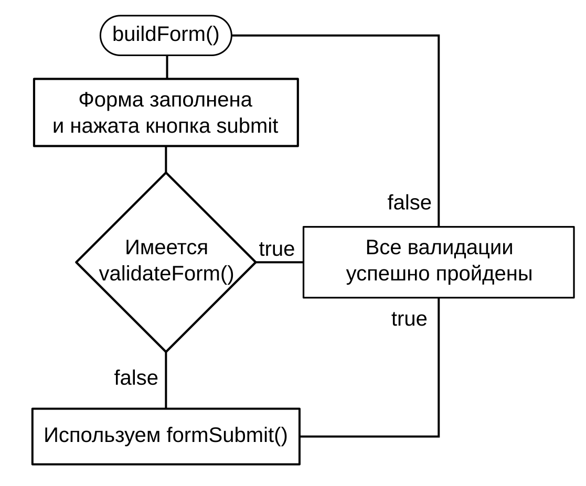

Чем больше я роюсь в документации Drupal 8, чем больше я читаю его код, тем больше мне нравится новая версия друпала, я просто в восторге от того какую работу проделали разработчики ядра, и From API отличный тому пример. Те, кто уже знает Drupal 7 и создавал свои собственные формы, думаю должны оценить, насколько удобным сделали новый подход, а может и наоборот, осудить.

В целом от Drupal 7 отличий не много. Основное отличие - ООП подход. Остальное осталось прежним, элементы формы - render array, формы имеют описание самой формы, валидацию, субмит, различные элементы для использования.

## Новые элементы

К слову об элементах, помните эту [огромную табличку](https://api.drupal.org/api/drupal/developer!topics!forms_api_reference.html/7) для Drupal 7? В Drupal 8 завезли много новых элементов, в основном HTML5. Например:

- tel - текстовое поле для номера телефона;
- number - числовое поле, со стрелочками вверх/вниз;
- email - для электронных почт, с автоматической валидацией введенного адреса на уровне браузера;
- date - выбор даты в поапе, также, на стороне браузера, без дополнительных JS библиотек;
- search - простенькое поле для поисков, на самом деле может использоваться много где. Отличительной особенностью данного поля является то, что при вводе в данное поле, справа (внутри поля) появляетяс крестик для очистки введенных данных;
- range - такой вот простенький слайдер из коробки.

Выше описанные элементы являются частью стандарта HTML5, в случае если браузер не поддерживает данные элементы, они будут работать как обычные textfield, следовательно, не стоит на них полагаться на все 100%. Например, email валидацию все же также нужно сделать на стороне сервера, иначе из IE9, или еще с какого-нибудь камня зашлют совсем не email, а потом вы будите думать что за ерунда.

Также не забыли и о новеньких элементах render arrays, чисто друпальных:

- details - аналог fieldset, с одной отличительной особенностью, fieldset - может использоваться *только* внутри форм, а details в любом месте с render array;
- language_select - заготовка (не полноценный элемент) для select элемента с выбором языков. По сути это обычный select, но он всегда, если не указано иное, в качестве значения по умолчанию принемает текущий язык. Полноценно дополнить элемент можно через [language_element_info_alter()](https://api.drupal.org/api/drupal/core%21modules%21language%21language.module/function/language_element_info_alter/8);

И многое другое. Все [Drupal 8 From API элементы](https://api.drupal.org/api/drupal/namespace/Drupal!Core!Render!Element/8) описаны на страничке в виде таблички, но уже адекватной табличке.

## Теория

Формы теперь являются классами (ООП), которые, создаются при помощи [\Drupal\Core\Form\FormBuilderInterface](https://api.drupal.org/api/drupal/core%21lib%21Drupal%21Core%21Form%21FormBuilderInterface.php/interface/FormBuilderInterface/8). Далее мы наследуем класс для своей формы, от нужного типа формы, которые теперь 3 штуки, в ядре, и думаю появятся другие из контриба, но об этом попозже. В большинстве случаев этот класс (пере)определяет всего 3 метода: buildForm, validateForm и submitForm. Кому-то хватит и двух, но по опыту, из 7-ки, эта тройка всегда вместе. В buildForm мы объявляем render array с нашей формой, всё как в 7-ке, а кто не работал с этим в 7-ке, поймут о чем речь далее, когда перейдем к практике. В validateForm мы проводим проверку данных формы, и если что-то не устраивает, то выдаем ошибку с указателем на проблемный элемент, который не прошел валидацию, или просто ошибку. Ну и очевидным поведением владеет submitForm, где мы описываем что произойдет после успешной отправки формы. Тут уже всё зависит сугубо от задачи.

Так как Form API вещь довольно таки не маленькая, статья будет раздроблена на 3 части:

- Объявление формы;
- Валидация формы;
- Отправка и обработка формы.

А затем, на практических примерах всё это будет использоваться вместе.

## Объявление формы

Как я уже писал выше, формы создаются при использовании [\Drupal\Core\Form\FormBuilderInterface](https://api.drupal.org/api/drupal/core%21lib%21Drupal%21Core%21Form%21FormBuilderInterface.php/interface/FormBuilderInterface/8). Классы форм отвечают за всю логику форм, создание, валидацию и отправку при помощи методов. В ядре Drupal 8 есть несколько различных классов форм для различных задач, от которых стоит наследоваться:

- [ConfigFormBase](https://api.drupal.org/api/drupal/core%21lib%21Drupal%21Core%21Form%21ConfigFormBase.php/class/ConfigFormBase/8) - для создания форм с настройками. В общем для форм где будут настройки чего-либо, например вашего модуля. В основном для административных форм;
- [ConfirmFormBase](https://api.drupal.org/api/drupal/core%21lib%21Drupal%21Core%21Form%21ConfirmFormBase.php/class/ConfirmFormBase/8) - Формочка для подтвеждения чего-либо. Например, подтверждение на удаление материала;
- [FormBase](https://api.drupal.org/api/drupal/core%21lib%21Drupal%21Core%21Form%21FormBase.php/class/FormBase/8) - Базовый класс для всех остальных типов форм. Если не уверены в том, какой использовать, берите этот. :)

Не имеет значение какой классы вы выберете для наследования, ваш собственный класс *всегда* имеет следующие 2 метода при объявлении формы: `getFormId()` и `buildForm()`.

### getFormId()

Данный метод возвращает (string) название формы.

~~~php
public function getFormId() {
	return 'my_custom_form';
}
~~~

### buildForm()

Данный метод отвечает за саму форму, то что в ней будет.  Как и в Drupal 7, возвращает массив с render arrays.

~~~php
public function buildForm(array $form, FormStateInterface $form_state) {
  $form['name'] = array(
    '#type' => 'textfield',
    '#title' => 'Имя',
  );
  return $form;
}
~~~

Напоминаю, эти два метода, **обязательны**.

## Валидация формы

Кто не работал с формами в Drupal 7 объясняю. Данный метод не является обязательным, но он очень полезный, когда вам необходимо проверить данные, которые ввел пользователь в форму, перед тем как она будет отправлена.

Все данные которые ввел пользователь в процессе заполнения формы, будут находиться в переменной `$form_state`.  Только получение данных в Drupal 8 изменилось в лучшую сторону, и для того чтобы получить нужные значения поля, используется следующий код:

~~~php
// field_id - название элемента формы (ключ).
$form_state->getValue('field_id');
~~~

Для получения всех значений используется следующий метод:

~~~php
// Получаем все значения формы.
$values = $form_state->getValues();
~~~

Имея значения формы, мы можем проверять их на соответствия нашим требования, и "пропускать" или "блокировать" данные, отправляя пользователю информацию с ошибкой. В данном случае вы можете использовать все что душе угодно, и если вашу проверку не проходит какое-то поле, то нужно использовать метод `setErrorByName()`:

~~~php
public function validateForm(array &$form, FormStateInterface $form_state) {
  // Допустим, у нас в форме есть textfield с названием name,
  // нам необходимо чтобы пользователь ввел минимум 5 символов
  // для того чтобы поле считалось валидным.
  if (strlen($form_state->getValue('name')) < 5) {
	// Если пользователь ввел меньше 5 символов, устанавливаем
	// ошибку на элементе формы 'name' с нужным нам текстом.
	// Если хотите переводимую ошибку, используйте $this->t('').
    $form_state->setErrorByName('name', 'Поле "Имя" не может быть короче 5 символов');
  }
}
~~~

Получается, если в ходе данного метода не было установлено ни одной ошибки, форма уходит на отправку.

## Отправка / обработка формы

После того как форма прошла все этапы, она уходит на отправку где мы уже выполням то что хотим с ней сделать. По умолчанию ничего не будет, разумеется, и нам надо что-то да описать что делать с полученными данными.

Для этого используется метод:

~~~php
public function submitForm(array &$form, FormStateInterface $form_state) {
  // Выводим имя введенное в форме.
  drupal_set_message($this->t('Your name is @name', array('@name' => $form_state->getValue('name'))));
}
~~~

Вот и всё, три простых этапа, из которых лишь два по сути являются самыми важными, реализуются очень просто. Теперь время применять знания на практике.

## Практика

Для практической части нам потребуется кастомный модуль в котором мы и объявим свою форму. Для этого вы можете сами объявить свой модуль, либо [воспользоваться пустой заготовкой](/sites/default/files/blog/73/attachments/helloworld_formapi_start.tar.gz). Далее по материалу мы подразумеваем что наш модуль имеет название `helloworld`.

### Создание формы на основе FormBase

В данном примере мы будем наследоваться от класса `FormBase`, мы сделаем обычную форму с парочкой элементов, проверим их нашим методом валидации и выведем результат на экран. 

В Drupal 8 используется PSR-4 стандарт для именования пространства имен и расположения файлов. Все классы в Drupal 8 находятся в папке `src`, которая, в свою очередь, находится в корне модуля. Далее, в папке `src` идут подпапки для различных классов, чтобы всё это не валялось как в помойке, а было разложено по полочкам. Классы форм **должны** находиться в `/src/Form`, а само название должно быть `MyFormName.php`.

Итак, делаем форму. Давайте назовем её `CollectPhone` и будем собирать в неё ФИО и телефон, при этом ФИО должно состоять минимум из 5 символов.

Первым делом создаем класс формы `/src/Form/CollectPhone.php`, а в нём объявляем форму. Дальнейшие инструкции в комментариях.

~~~php
<?php
/**
 * @file
 * Contains \Drupal\helloworld\Form\CollectPhone.
 *
 * В комментарии выше указываем, что содержится в данном файле.
 */

// Объявляем пространство имён формы. Drupal\НАЗВАНИЕ_МОДУЛЯ\Form
namespace Drupal\helloworld\Form;

// Указываем что нам потребуется FormBase, от которого мы будем наследоваться
// а также FormStateInterface который позволит работать с данными.
use Drupal\Core\Form\FormBase;
use Drupal\Core\Form\FormStateInterface;

/**
 * Объявляем нашу форму, наследуясь от FormBase.
 * Название класса строго должно соответствовать названию файла.
 */
class CollectPhone extends FormBase {

  /**
   * То что ниже - это аннотация. Аннотации пишутся в комментариях и в них
   * объявляются различные данные. В данном случае указано, что документацию
   * к данному методу надо взять из комментария к самому классу.
   *
   * А в самом методе мы возвращаем название нашей формы в виде строки.
   * Эта строка используется для альтера формы (об этом ниже в тексте).
   *
   * {@inheritdoc}.
   */
  public function getFormId() {
    return 'collect_phone';
  }

  /**
   * Создание нашей формы.
   *
   * {@inheritdoc}.
   */
  public function buildForm(array $form, FormStateInterface $form_state) {
    // Объявляем телефон.
    $form['phone_number'] = array(
      '#type' => 'tel',
      // Не забываем из Drupal 7, что t, в D8 $this->t() можно использовать
      // только с английскими словами. Иначе не используйте t() а пишите
      // просто строку.
      '#title' => $this->t('Your phone number')
    );

    $form['name'] = array(
      '#type' => 'textfield',
      '#title' => $this->t('Your name')
    );

    // Предоставляет обёртку для одного или более Action элементов.
    $form['actions']['#type'] = 'actions';
    // Добавляем нашу кнопку для отправки.
    $form['actions']['submit'] = array(
      '#type' => 'submit',
      '#value' => $this->t('Send name and phone'),
      '#button_type' => 'primary',
    );
    return $form;
  }

  /**
   * Валидация отправленых данных в форме.
   *
   * {@inheritdoc}
   */
  public function validateForm(array &$form, FormStateInterface $form_state) {
    // Если длина имени меньше 5, выводим ошибку.
    if (strlen($form_state->getValue('name')) < 5) {
      $form_state->setErrorByName('name', $this->t('Name is too short.'));
    }
  }

  /**
   * Отправка формы.
   *
   * {@inheritdoc}
   */
  public function submitForm(array &$form, FormStateInterface $form_state) {
    // Мы ничего не хотим делать с данными, просто выведем их в системном
    // сообщении.
    drupal_set_message($this->t('Thank you @name, your phone number is @number', array(
      '@name' => $form_state->getValue('name'),
      '@number' => $form_state->getValue('phone_number')
    )));
  }

}
~~~

Хорошо, форму мы объявили. Но что с ней делать? Куда она будет выводиться? Давайте создадим ей свою страницу `/collect-phone`, для этого создадим в корне модуля `helloworld.routing.yml` файл и вызовем нашу форму:

~~~yml
collect_phone.form:
  path: '/collect-phone'
  defaults:
    _title: 'Collect Phone - Form API example.'
    # Подгружаем форму по неймспейсу.
    _form: '\Drupal\helloworld\Form\CollectPhone'
  requirements:
    _permission: 'access content'
~~~

Теперь, если еще не включили модуль, то уже пора, и затем переходим на страницу `/collect-phone`:

.png)

А вот и наша форма! Попробуем ввести имя короче 5 символов:

.png)

Если всё сделали правильно, то должна вывестись ошибка что имя слишком короткое. Ну и попробуем заполнить нашу форму правильно:

.png)

В результате вы должны увидеть данные введенные в форме.

### Создание формы на основе ConfigFormBase

Создание форм на основе данного класса подразумевают что данная форма будет использоваться для редактирования каких-либо настроек. По сути они ничем не отличаются от создания форм используя `FormBase`. Давайте объявим вторую форму и назовем её `CollectPhoneSettings`, это значит, что нам надо создать файл `/src/Form/CollectPhoneSettings.php`.

~~~php
<?php

/**
 * @file
 * Contains \Drupal\helloworld\Form\CollectPhoneSettings.
 */

namespace Drupal\helloworld\Form;

use Drupal\Core\Form\ConfigFormBase;
use Drupal\Core\Form\FormStateInterface;

/**
 * Defines a form that configures forms module settings.
 */
class CollectPhoneSettings extends ConfigFormBase {

  /**
   * {@inheritdoc}
   */
  public function getFormId() {
    return 'collect_phone_settings';
  }

  /**
   * {@inheritdoc}
   */
  protected function getEditableConfigNames() {
    // Возвращает названия конфиг файла.
    // Значения будут храниться в файле:
    // helloworld.collect_phone.settings.yml
    return [
      'helloworld.collect_phone.settings',
    ];
  }

  /**
   * {@inheritdoc}
   */
  public function buildForm(array $form, FormStateInterface $form_state) {
    // Загружаем наши конфиги.
    $config = $this->config('helloworld.collect_phone.settings');
    // Добавляем поле для возможности задать телефон по умолчанию.
    // Далее мы будем использовать это значение в предыдущей форме.
    $form['default_phone_number'] = array(
      '#type' => 'textfield',
      '#title' => $this->t('Default phone number'),
      '#default_value' => $config->get('phone_number'),
    );
    // Субмит наследуем от ConfigFormBase
    return parent::buildForm($form, $form_state);
  }

  /**
   * {@inheritdoc}
   */
  public function submitForm(array &$form, FormStateInterface $form_state) {
    $values = $form_state->getValues();
    // Записываем значения в наш конфиг файл и сохраняем.
    $this->config('helloworld.collect_phone.settings')
      ->set('phone_number', $values['default_phone_number'])
      ->save();
  }
}
~~~

Опять же, наша форма нигде не вызывается, давайте установим ей адрес. В существующий `helloworld.routing.yml` давайте добавим следующие строки:

~~~yml
collect_phone.admin_settings:
  path: '/admin/config/helloworld'
  defaults:
    _form: '\Drupal\helloworld\Form\CollectPhoneSettings'
    _title: 'Settings for CollectPhone form.'
  requirements:
    _permission: 'administer site configuration'
~~~

Адрес мы зарегистрировали, но так как, с вероятностью 90% вы будите использовать данную форму для настроек своего модуля, давайте также добавим кнопку в список модулей, которая будет вести на модуль. Для этого в `helloworld.info.yml` файл добавим ссылку на страницу с настройками:

~~~yml
configure: collect_phone.admin_settings
~~~

Сбросим кэш и проверим что у нас получилось. Последнее действие должно было добавить кнопку в раздел модуля:

.png)

При нажатии на неё мы должны попасть на страницу с формой настройки.

.png)

Напишите любой номер телефона и сохраните настройки. Допустим, напишем номер `+7 (342) 2-12-34-56`. Если вы всё сделали верно, то после сохранения поле уже будет заполнено нашими настройками. Теперь вернемся к форму `CollectPhone` и установим значение из данных настроек в качестве значения для телефона по умолчанию. Вот листинг части метода `buildForm()` со строкой загрузки данных и  установкой их в `#default_value`:

~~~php
// Загружаем настройки модули из формы CollectPhoneSettings.
$config = \Drupal::config('helloworld.collect_phone.settings');
// Объявляем телефон.
$form['phone_number'] = array(
  '#type' => 'tel',
  // Не забываем из Drupal 7, что t, в D8 $this->t() можно использовать
  // только с английскими словами. Иначе не используйте t() а пишите
  // просто строку.
  '#title' => $this->t('Your phone number'),
  '#default_value' => $config->get('phone_number')
);
~~~

Опять же, если вы всё сделали правильно, то при открытии формы на странице `/collect-phone` вы увидите это значение установленное по умолчанию для телефона:

.png)

### Вызов формы из других мест

Если вы имели дело с формами в 7-ке, то помните функцию `drupal_get_form()`, которая благополучно была удалена из ядра. Теперь форму вы можете вызывать следующим способом:

~~~php
$form = \Drupal::formBuilder()->getForm('Drupal\helloworld\Form\CollectPhone');
~~~

Вы также можете передать дополнительные значения в форму:

~~~php
$form = \Drupal::formBuilder()->getForm('Drupal\helloworld\Form\CollectPhone', '+7 (800) 123-45-67');
~~~

Но и не забудьте принять данное значение чтобы использовать в методе `buildForm()`:

~~~php
public function buildForm(array $form, FormStateInterface $form_state, $phone = NULL) {
  $form['phone_number'] = array(
    '#type' => 'tel',
    '#title' => $this->t('Your phone number'),
    // Если передали телефон с вызовом, поставим его в качестве
    // значения по умолчанию.
    '#default_value' => $phone ? $phone : '',
  );
}
~~~

### Альтерим форму

Альтер, кстати, перешел к нам из Drupal 7, `hook_form_FORM_ID_alter()` по прежнему работает, поэтому кто имел с ним опыт,  ничего нового не откроет, а кто нет, вот пример использования:

~~~php
/**
 * Implements hook_form_FORM_ID_alter().
 * Form ID: collect_phone
 */
function helloworld_form_collect_phone_alter(&$form, &$form_state) {
  $form['phone_number']['#description'] = t('Start with + and your country code.');
}
~~~

Вот и всё. Так мы будем работать с формами в Drupal 8. Как по мне, так намного удобнее и приятнее работать с такими формами.

Вы можете следить за обновлениями в: [Вконтакте](https://vk.com/niklannet), [Facebook](https://www.facebook.com/Niklannet-1546633938927814/), [Twitter](https://twitter.com/NiklanRUS).
