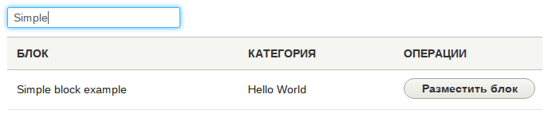
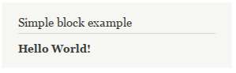
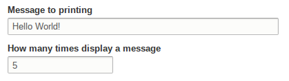
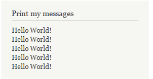

В Drupal мы можем создавать блоки через административный интерфейс, выводить их
в различных регионах, настраивать и т.д. Но иногда нам требуется объявить блок
программно, в Drupal 7 для этого было много поводов, в 8-ке несколько меньше, но
это не уменьшает потребность в программной работе с блоками.

В Drupal 8, в отличие от 7-й версии, блоки были сильно переработаны. Теперь
многие вещи можно реализовать без использования Block API. Блоки теперь имеют
свои собственные типы блоков, по принципу с типами содержимого, могут иметь поля
и прочие данные. Но в данной статье не об изменениях блоков с точки зрения
пользователя, а об изменениях с точки зрения разработчика. Про управление через
админку я напишу в дальнейшем отдельную статью.

## Обзор

В Drupal 8 есть два различных типа блоков:

- Block Plugin (API) - это как раз о чем мы будем говорить, стандартный API для
  объявления своих блоков в виде плагинов;
- Block Entity - сущность, которая хранит привязку блока в регион темы.

## Теория

В теория всё очень просто, впрочем, как и на самой практике:

- Мы объявляем свой класс для блока, наследуясь от `BlockBase` и описываем
  нужные нам методы;
- Добавляем объявленный нами блок и используем.
- ???
- PROFIT

## Методы блока

Давайте рассмотрим некоторые методы которые мы можем, должны и будем
использовать, разумеется не все, но самые интересные и востребованные. Все
методы BlockBase вы
можете [посмотреть на drupal.org](https://api.drupal.org/api/drupal/core!lib!Drupal!Core!Block!BlockBase.php/class/BlockBase/8).

### build()

Данный метод является единственным **обязательным** методом, который вы должны
определить в классе для своего блока. Он должен **всегда** возвращать render
array.

```php
public function build() {
  $block = [
    '#type' => 'markup',
    '#markup' => 'My <strong>example</strong> content.'
  ];
  return $block;
}
```

### blockAccess()

Данный метод отвечает за права доступа. Возвращает TRUE/FALSE. Если TRUE, то
блок будет доступен для просмотра, во всех остальных случаях не будет
отображаться. Здесь вы можете описать любую нужную вам логику.

```php
use Drupal\Core\Access\AccessResult;
use Drupal\Core\Session\AccountInterface;
...
protected function blockAccess(AccountInterface $account) {
  // Отображаем блок только пользователям у которых есть
  // право доступа 'administer blocks'.
  return AccessResult::allowedIfHasPermission($account, 'administer blocks');
}
```

### defaultConfiguration()

Если вы хотите добавить свой блок форму с настройками, то в данном методе вы
можете предоставить значения по умолчанию для блока.

```php
public function defaultConfiguration() {
  // Если, допустим, ваш блок выводит последних зарегистрированных
  // пользователей и вы хотите дать возможность выбирать сколько
  // показывать пользователей в блоке, то вы можете указать значение
  // по умолчанию. Например 10.
  return array(
    'users_count' => 10,
  );
}
```

### blockForm()

При помощи данного метода вы сможете объявить форму с настройками для данного
блока используя [Form API][drupal-8-form-api].

```php
use Drupal\Core\Form\FormStateInterface;
...
public function blockForm($form, FormStateInterface $form_state) {
  // Получаем оригинальную форму для блока, и добавляем
  // наши новые элементы прямо к ней.
  $form = parent::blockForm($form, $form_state);

  // Получаем конфиги для данного блока.
  $config = $this->getConfiguration();

  // Добавляем наше поле к форме.
  $form['email'] = array(
    '#type' => 'email',
    '#title' => t('E-mail address to send notification'),
    '#default_value' => isset($config['email_to_send']) ? $config['email_to_send'] : '',
  );
  return $form;
}
```

### blockValidate()

Как и в Form API, здесь вы можете провести валидацию введенных данных в форме. В
данном случае, есть форма по умолчанию, следовательно, даже не
объявляя `buildForm()` вы можете объявлять данный метод и проводить валидацию.

```php
use Drupal\Core\Form\FormStateInterface;
...
public function blockValidate($form, FormStateInterface $form_state) {
 $ages = $form_state->getValue('ages');

 if (!is_numeric($ages)) {
  $form_state->setErrorByName('ages', t('Needs to be an interger'));
 }
}
```

### blockSubmit()

В случае с данным методом, всё точно также как и с `blockValidate()`, вы можете
определять его не имея собственной формы, тем самым внедряясь в процесс отправки
данных формы с настройками для блока и внедрения собственной логики.

```php
use Drupal\Core\Form\FormStateInterface;
...
public function blockSubmit($form, FormStateInterface $form_state) {
  $this->configuration['email_to_send'] = $form_state->getValue('email_to_send');
}
```

Этих методов должно хватить на большинство потребностей.

## Пример простого блока

В данном примере я расскажу как создать самый простой блок, лишь минимум из
минимумов, который будет выводить простой текст. Для старта можете
воспользоваться [голой заготовкой модуля](example/start/helloworld).

Для создания блока, нам, первым делом, нужно создать файл для класса, через
который мы и объявим блок. Классы plugin-блоков хранятся в
папке `/src/Plugin/Block/BlockName.php`. Допустим мы хотим сделать
блок `SimpleExampleBlock`, для этого нам нужно создать файл по данному
пути `/src/Plugin/Block/SimpleBlockExample.php` относительно корня модуля в
котором мы его объявляем.

А внутри пишем:

```php
<?php

/**
 * @file
 * Contains \Drupal\helloworld\Plugin\Block\SimpleBlockExample.
 */

// Пространство имён для нашего блока.
// helloworld - это наш модуль.
namespace Drupal\helloworld\Plugin\Block;

use Drupal\Core\Block\BlockBase;

/**
 * Добавляем простой блок с текстом.
 * Ниже - аннотация, она также обязательна.
 *
 * @Block(
 *   id = "simple_block_example",
 *   admin_label = @Translation("Simple block example"),
 * )
 */
class SimpleBlockExample extends BlockBase {

  /**
   * {@inheritdoc}
   */
  public function build() {
    $block = [
      '#type' => 'markup',
      '#markup' => '<strong>Hello World!</strong>'
    ];
    return $block;
  }

}
```

Всё, после этого наш блок уже будет доступен в административном интерфейсе для
добавления.



И если мы разместим блок, то увидим следующее.



## Блок с собственной формой

В данном примере я покажу как создаются блоки с собственными формами, и как
задействовать значения из формы при генерации содержимого.

Допустим, пусть у нас в форме будет два поля. Первое - текстовое, в котором мы
будем вводить строку для содержимого нашего блока, а второе - числовое поле, в
котором мы будем писать сколько раз вывести наше сообщение из первого поля в
блоке. При этом, оба поля будут обязательными, первое будет требовать минимум 5
символов для ввода, а второе, чтобы введенное число было больше или равнялось
единице (1).

Пусть наш блок называется `PrintMyMessages`, следовательно, нам нужно создать
файл `/src/Plugin/Block/PrintMyMessages.php`. И следующего содержания:

```php
<?php

/**
 * @file
 * Contains \Drupal\helloworld\Plugin\Block\PrintMyMessages.
 */

// Пространство имён для нашего блока.
namespace Drupal\helloworld\Plugin\Block;

use Drupal\Core\Block\BlockBase;
use Drupal\Core\Form\FormStateInterface;

/**
 * @Block(
 *   id = "print_my_messages",
 *   admin_label = @Translation("Print my messages"),
 * )
 */
class PrintMyMessages extends BlockBase {

  /**
   * Добавляем наши конфиги по умолчанию.
   *
   * {@inheritdoc}
   */
  public function defaultConfiguration() {
    return array(
      'count' => 1,
      'message' => 'Hello World!',
    );
  }

  /**
   * Добавляем в стандартную форму блока свои поля.
   *
   * {@inheritdoc}
   */
  public function blockForm($form, FormStateInterface $form_state) {
    // Получаем оригинальную форму для блока.
    $form = parent::blockForm($form, $form_state);
    // Получаем конфиги для данного блока.
    $config = $this->getConfiguration();

    // Добавляем поле для ввода сообщения.
    $form['message'] = array(
      '#type' => 'textfield',
      '#title' => t('Message to printing'),
      '#default_value' => $config['message'],
    );

    // Добавляем поле для количества сообщений.
    $form['count'] = array(
      '#type' => 'number',
      '#min' => 1,
      '#title' => t('How many times display a message'),
      '#default_value' => $config['count'],
    );

    return $form;
  }

  /**
   * Валидируем значения на наши условия.
   * Количество должно быть >= 1,
   * Сообщение должно иметь минимум 5 символов.
   *
   * {@inheritdoc}
   */
  public function blockValidate($form, FormStateInterface $form_state) {
    $count = $form_state->getValue('count');
    $message = $form_state->getValue('message');

    // Проверяем введенное число.
    if (!is_numeric($count) || $count < 1) {
      $form_state->setErrorByName('count', t('Needs to be an interger and more or equal 1.'));
    }

    // Проверяем на длину строки.
    if (strlen($message) < 5) {
      $form_state->setErrorByName('message', t('Message must contain more than 5 letters'));
    }
  }

  /**
   * В субмите мы лишь сохраняем наши данные.
   *
   * {@inheritdoc}
   */
  public function blockSubmit($form, FormStateInterface $form_state) {
    $this->configuration['count'] = $form_state->getValue('count');
    $this->configuration['message'] = $form_state->getValue('message');
  }

  /**
   * Генерируем и выводим содержимое блока.
   * 
   * {@inheritdoc}
   */
  public function build() {
    $config = $this->getConfiguration();
    $message = '';

    for ($i = 1; $i <= $config['count']; $i++) {
      $message .= $config['message'] . '<br />';
    }

    $block = [
      '#type' => 'markup',
      '#markup' => $message,
    ];
    return $block;
  }

}
```

Уже при добавлении у нас появятся настройки, которые мы можем указать:



И на выходе мы получаем:



Вот и всё. Такой процесс работы с блоками в Drupal 8 на программном уровне.

## Ссылки

- [Исходный код модуля с примером](example/result/helloworld)

[drupal-8-form-api]: ../../../../2015/10/16/drupal-8-form-api/index.ru.md
