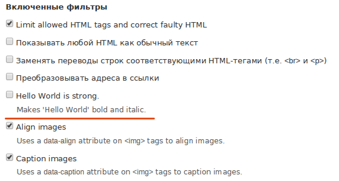
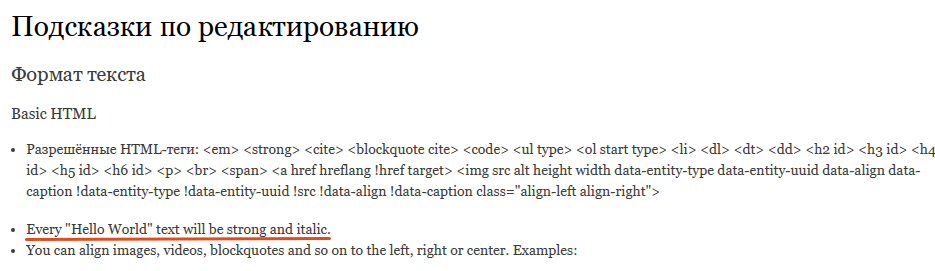
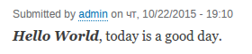
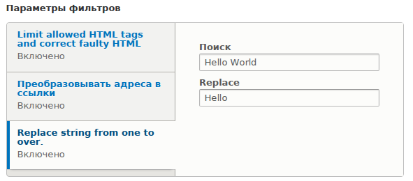
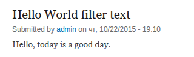

Преобразовывать или выдирать из текста для каких-то иных целей. В Drupal для
этого есть "фильтры" содержимого, благодаря которым, текст после сохранения
проходит некие обработки, после которых на выходе получается содержимое для
вывода на странице.

Если уже есть опыт работы с друпал, вы 100% их уже видели и пользовались:
filtered html, full html, plaint text - это форматы ввода, в которых включены
определенные фильтры. Например, фильтр "преобразование ссылок в url адреса",
или "разрешить только использовать допустимые теги html". Вот именно об этом я и
расскажу, как создать свой фильтр.

## Обзор

В Drupal 8 фильтры стали плагинами, соответственно и реализуются как плагины.
Реализуется это всё созданием собственного класса, в котором достаточно
реализовать 1 метод:

```php
public function process($text, $langcode) {
	// Логика фильтра.
}
```

Также есть и другие методы, которые могут оказаться полезными:

```php
// Если вам надо текст прогнать через экранирующие последовательности
// (escaping) то для этого есть отдельный шаг - prepare(), который 
// выполняется перед process и отдает в него уже экранированный текст.
// На этом задача prepare() заканчивается.
public function prepare($text, $langcode) {
  return $text;
}

// Позволяет добавить подсказу о фильтре. Она выводится под выбором формата ввода.
// В идеале должна быть очень короткой и пояснительной.
// Если требуется описать подробнее, то можете использовать переменную $long
// и возвращать разные описания в зависимости от значения данной переменной.
public function tips($long = FALSE) {
  return $this->t('This is short tip for filter.');
}

// Данный метод будет полезен если вы хотите дать менять настройки
// фильтра из других мест. Например кастомного модуля модулям.
public function getConfiguration() {
  return array(
    'id' => $this->getPluginId(),
    'provider' => $this->pluginDefinition['provider'],
    'status' => $this->status,
    'weight' => $this->weight,
    'settings' => $this->settings,
  );
}

// Данный метод позволит сохранить конфиги фильтра которые были получены через 
// getConfiguration(),
public function setConfiguration(array $configuration) {
  parent::setConfiguration($configuration);
}
```

## Практика

Так как фильтр является плагином - он должен располагаться в соответствующей
директории `/src/Plugin/Filter/MyFilter.php`. В качестве точки отрыва
используйте
уже [пустую заготовку модуля](example/start/helloworld).

### Простой пример

Давайте реализуем простой пример. Допустим нам нужен фильтр, который будет
искать в тексте словосочетание `Hello World` (с учетом регистра) и делать данный
текст _**жирным курсивом**_.

Давайте назовем этот фильтр *BoldItalicWorld*, следовательно нам надо создать
одноименный класс и файл, и положим всё это в соответствующее
место: `/src/Plugin/Filter/BoldItalicWorld.php`. А вот и сам пример с
комментариями.

```php
<?php
/**
 * @file
 * Contains Drupal\helloworld\Plugin\Filter\BoldItalicWorld.
 */

// Напоминаю что helloworld - название модуля.
namespace Drupal\helloworld\Plugin\Filter;

use Drupal\filter\Plugin\FilterBase;
use Drupal\filter\FilterProcessResult;

/**
 * Ниже аннотация. В ней обязательно надо указать id, title, type:
 * id - уникальный идентификатор фильтра (машинное имя);
 * title - лейбел (название) для нашего фильтра в административном интерфейсе;
 * type - тип фильтра. Типов всего 4:
 *  - TYPE_HTML_RESTRICTOR - используется для фильтрации html. Для того чтобы
 *    убрать неподобающие теги, атрибуты и т.д. В частности для защиты от XSS.
 *  - TYPE_MARKUP_LANGUAGE - для фильтров, которые работают не с HTML, а на
 *    выходе уже дают HTML. Какраз то что нам надо. Мы работаем с текстом, но
 *    затем мы обарачиваем его в <strong><i></i></strong>.
 *  - TYPE_TRANSFORM_IRREVERSIBLE;
 *  - TYPE_TRANSFORM_REVERSIBLE.
 *
 * По поводу последних двух я пока не понял для чего они. Примеров и упоминаний
 * о них в ядре не нашел, описания совершенно ни о чем не говорят. Как узнаю
 * дополню информацию.
 *
 * @Filter(
 *   id = "bold_italic_world",
 *   title = @Translation("Hello World is strong."),
 *   description = @Translation("Makes 'Hello World' bold and italic."),
 *   type = Drupal\filter\Plugin\FilterInterface::TYPE_MARKUP_LANGUAGE,
 * )
 */
class BoldItalicWorld extends FilterBase {

  /**
   * В данном методе мы уже выполняем саму логику фильтра.
   *
   * {@inheritdoc}
   */
  public function process($text, $langcode) {
    // Этот класс требуется для удобства работы.
    $result = new FilterProcessResult($text);

    // Для достижения нужного результата нам будет достаточно воспользоваться
    // стандартной php функцией для замены строки.
    $text = str_replace('Hello World', '<strong><i>Hello World</i></strong>', $text);

    // Сохраняем результат и возвращаем.
    $result->setProcessedText($text);
    return $result;
  }

  /**
   * В данном методе (он не обязателен) мы возвращаем подсказку для форматов
   * ввода.
   *
   * {@inheritdoc}
   */
  public function tips($long = FALSE) {
    return $this->t('Every "Hello World" text will be strong and italic.');
  }

}

```

Всё, теперь если включите модуль, и перейдете в "Текстовые форматы и редакторы"
то должны увидеть фильтр:



Также содержимое `tips()` будет доступно в подробной информации о фильтрах.



Давайте включим наш фильтр для какого-нибудь формата ввода, я буду делать для
Basic HTML. А затем добавим содержимое или отредактируем уже существующее
используя формат ввода которому вы добавили наш фильтр.

Допустим наше содержимое:

> Hello World, today is a good day.

После сохранения на странице с содержимым вы должны получить результат:



### Пример с настройками

Давайте рассмотрим более комплексный пример. Сейчас наш фильтр ищет слово Hello
World и делает его жирным курсивом. Давайте сделаем еще один фильтр, который
будет выполнять примерно тоже самое. Только на этот раз задача будет следующая.
Мы сделаем для нашего фильтра настройки из двух данных, **что** будем заменять и
**на что**. Допустим, заменять словосочетание Hello World, на просто Hello.

Назовем мы наш фильтр ReplaceTextForMe. Следовательно, мы должны создать файл по
следующему пути: `/src/Plugin/Filter/ReplaceTextForMe.php`. А содержание будет
следующим:

```php
<?php
/**
 * @file
 * Contains Drupal\helloworld\Plugin\Filter\ReplaceTextForMe.
 */

namespace Drupal\helloworld\Plugin\Filter;

use Drupal\filter\Plugin\FilterBase;
use Drupal\filter\FilterProcessResult;
use Drupal\Core\Form\FormStateInterface;

/**
 * Обратите внимание на новую аннтацию 'settings'. В неё мы передаем значения
 * по умолчанию для нашего фильтра.
 *
 * @Filter(
 *   id = "replace_text_for_me",
 *   title = @Translation("Replace string from one to over."),
 *   type = Drupal\filter\Plugin\FilterInterface::TYPE_MARKUP_LANGUAGE,
 *   settings = {
 *     "search" = "Hello World",
 *     "replace" = "Hello"
 *   }
 * )
 */
class ReplaceTextForMe extends FilterBase {

  /**
   * Форма для настройки нашего фильтра.
   * Важно! Название элементов формы должны совпадать с ключами в настройках.
   * Это позволит плагину автоматически подгружать, а также правильно сохранять
   * настройки введенные пользователями.
   *
   * {@inheritdoc}
   */
  public function settingsForm(array $form, FormStateInterface $form_state) {
    $form['search'] = [
      '#type' => 'textfield',
      '#title' => $this->t('Search'),
      '#default_value' => $this->settings['search'],
      '#maxlength' => 1024,
      '#size' => 250,
    ];

    $form['replace'] = [
      '#type' => 'textfield',
      '#title' => $this->t('Replace'),
      '#default_value' => $this->settings['replace'],
      '#maxlength' => 1024,
      '#size' => 250,
    ];

    return $form;
  }

  /**
   * Выполнение нашего фильтра.
   *
   * {@inheritdoc}
   */
  public function process($text, $langcode) {
    $result = new FilterProcessResult($text);
    // Производим замену в соотвтествии с настройками фильтра.
    $text = str_replace($this->settings['search'], $this->settings['replace'], $text);
    // Сохраняем результат и возвращаем.
    $result->setProcessedText($text);
    return $result;
  }

}
```

Теперь проверим что получилось. Первым делом нам необходимо включить наш фильтр
для какого-нибудь формата ввода. Если вы все сделали верно, то новый фильтр
должен появиться в списке, а при его выборе (установки галочки) снизу появятся
настройки с значениями по умолчанию.



И если мы введем следующий текст:

> Hello World, today is a good day

в содержимое материала с использованием формата ввода, у которого активирован
наш фильтр, то на выходе мы получим следующий результат:



Вот и всё. Так вот просто объявляется фильтр в Drupal 8, впрочем, как и в
Drupal 7. Только сделано это намного удобнее, хранится в одном файле и все
разложено по полочкам.

## Ссылки

- [Исходный код модуля с примером](example/result/helloworld)
